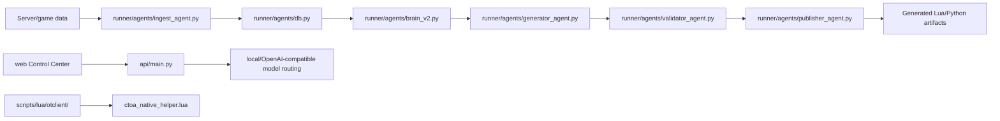

# Architecture Index

## High-Level Flow

## Main Subsystems

### API and Control Plane

- `api/main.py` is the main FastAPI app.
- It owns auth, chat routing, community endpoints, safety telemetry, release
  evidence, and OpenAI-compatible chat completion compatibility.
- Web Control Center helpers are under `web/src/lib/`.

### Agent Pipeline

- Catalog discovers candidate servers.
- Ingest stores server/game data.
- Brain plans modules.
- Generator renders modules.
- Validator checks syntax and quality.
- Publisher moves validated output to delivery surfaces.

### Local Bot Runtime

- Perception: screen/window/memory parsing.
- Action: movement, combat, loot, spell rotation.
- Safety: scheduler/session/humanizer.
- Overlay: runtime status and macro UI.

### Hybrid Bot Runtime

- Higher-level gameplay loop with vision, templates, pathfinding, command
  execution, and metrics.
- Intended to bridge manual, hybrid, and autonomous modes.

### OTClient Native Runtime

- Loader only loads the helper by default.
- Helper owns config, UI, HUD, profile save/load, runtime toggles, and manager
  registration.
- Native combat/heal/loot modules provide direct OTClient event/API examples.

## Integration Points

- `scripts/lua/otclient/` is the canonical OTClient helper source tree.
- `scripts/lua/*.lua` contains small standalone generated/runtime Lua modules.
- `prompts/mmo-lua-pack.yaml` defines prompt quality expectations for MMO Lua.
- `runner/agents/generator_agent.py` emits Lua templates.
- `runner/agents/validator_agent.py` validates generated Lua/Python output.

## Trust Boundaries

- Local secrets: `.env`, runtime auth store, JWT secret, local DB state.
- External model backends: configured through `CTOA_*MODEL*` environment
  variables.
- OTClient native API: not uniform across forks; always guard calls.
- TFS protocol: unknown until source is provided.
