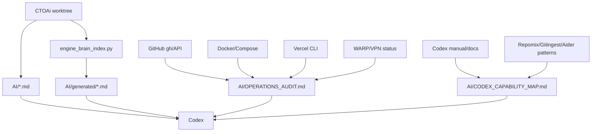

# Codex Capability Map For CTOAi Engine Brain

Snapshot date: 2026-07-06 Europe/Warsaw

This file maps current Codex and external codebase-context capabilities into a
practical CTOAi plan.

## Official Codex Surfaces To Use

The current Codex manual was refreshed locally through the official OpenAI docs
route on 2026-07-06.

### AGENTS.md

Use `AGENTS.md` for durable repository rules, setup commands, validation
commands, review expectations, and security constraints. Codex discovers
guidance from global scope and then project scope, with closer nested files
appearing later in the instruction chain.

CTOAi action:

- Keep root `AGENTS.md` concise.
- Add nested `AGENTS.md` files only for areas with real different rules:
  `scripts/lua/`, `AI/`, `web/`, `deploy/`, and future TFS source.

### Skills

Use skills for reusable workflows that Codex can invoke implicitly or explicitly.
Skills are better than deprecated custom prompts for shared, task-specific
procedures.

CTOAi skill candidates:

- `ctoai-engine-brain`: refresh indexes, run audits, update `AI/`.
- `otclient-helper`: package, validate, smoke, and deploy OTClient helper.
- `ctoa-ops-audit`: Docker/VPN/Vercel/GitHub/local gate audit.
- `tfs-indexer`: once TFS source is present, index engine classes and packets.

### MCP

Use MCP when Codex needs live data or tools instead of static prompt context.
Codex supports STDIO and streamable HTTP MCP servers, and the CLI and IDE
extension share MCP configuration.

CTOAi MCP candidates:

- GitHub MCP or existing GitHub connector for PR/issues/checks.
- Context7 for current library documentation.
- Playwright or browser MCP for Control Center and Vercel UI smoke.
- Chrome DevTools MCP for local web debugging.
- OpenAI Docs MCP for Codex/OpenAI docs.
- Future local CTOAi MCP exposing repo indexes, release evidence, and runbooks.

### Hooks

Use hooks for lifecycle checks around tool use, prompt submission, compaction,
and turn stop. Hooks can be project-local when `.codex/` is trusted.

CTOAi hook candidates:

- Pre-tool secret scanner for `.env`, Vercel env, runtime auth store, and token
  files.
- Stop hook that reminds the agent to update `AI/OPERATIONS_AUDIT.md` after
  Docker/Vercel/GitHub checks.
- PreToolUse hook for dangerous PowerShell/git/docker commands.
- PostToolUse hook that stores sanitized command evidence for Engine Brain.

### Plugins

Use plugins when a capability should bundle skills, MCP servers, hooks, assets,
and marketplace metadata.

CTOAi plugin candidate:

- `ctoai-engine-brain` plugin:
  - skill: engine brain refresh
  - MCP server: repo index/query
  - hooks: secret and evidence checks
  - scripts: symbol inventory plus Docker/VPN/Vercel/GitHub/VS Code audit

## External Context Tools Worth Tracking

### Repomix

Source: `https://github.com/yamadashy/repomix`

- Packs a repository into AI-friendly output.
- Supports MCP server mode for local or remote repo packaging.
- CTOAi fit: full context packs, with strict ignore rules for secrets and
  generated/runtime data.

### Gitingest

Source: `https://github.com/coderamp-labs/gitingest`

- Converts Git repositories into prompt-friendly text.
- Public shortcut can convert GitHub URLs into digests.
- CTOAi fit: public remote snapshots; avoid secrets-heavy branches.

### Aider Repo Map

Source: `https://aider.chat/docs/repomap.html`

- Builds a concise repo map with important classes, functions, types, and call
  signatures.
- CTOAi fit: emulate this locally with generated symbol maps instead of a single
  giant markdown dump.

### AGENTS.md Open Format

Source: `https://agents.md/`

- Predictable repository file for agent instructions.
- CTOAi fit: keep root `AGENTS.md` compatible and store richer memory in `AI/`.

## Recommended Engine Brain Architecture

## Implementation Priority

1. Keep `AI/` as the curated human-readable brain.
2. Use generated symbol/file indexes under `AI/generated/`.
3. Use `.\ctoa.ps1 brain refresh` for indexes and `.\ctoa.ps1 brain doctor` for
   local operations evidence.
4. Use `.\ctoa.ps1 brain pack` as the local secret-safe context packer.
5. Add nested `AGENTS.md` for `AI/` and `scripts/lua/`.
6. Keep Repomix as an optional external MCP/full-repo packer after reviewing its
   output rules for secrets.
7. Add a project skill or plugin after the scripts stabilize.

## Hard Boundaries

- Do not put secrets in `AI/`.
- Do not copy full `.env`, Vercel env values, runtime auth stores, logs, or local
  databases into context packs.
- Do not claim TFS packet knowledge until TFS source exists.
- Do not treat broad Docker binds as safe just because WARP is connected.
