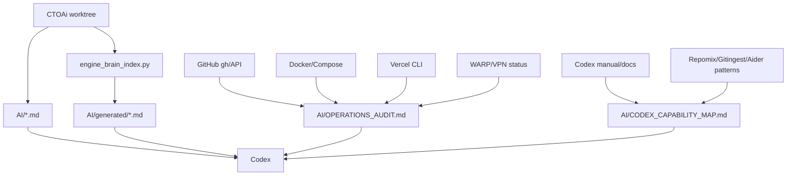
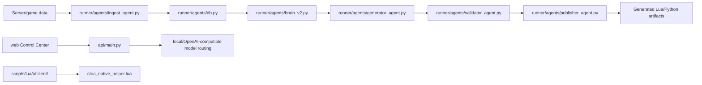

# CTOAi Engine Brain Pack

Generated at: `2026-07-11T19:36:55+00:00`
Repo root: `C:\Users\zycie\CTOAi`
Profile: `all`

This pack is curated and secret-safe. It excludes `.env*`, auth stores,
runtime data, logs, local databases, tokens, credentials, and generated
dependency folders. It is intended as a portable context artifact for
Codex or another code assistant.

## Included Sources


## `AI/README.md`

```markdown
# CTOAi Engine Brain

This folder is the Codex working context for the current CTOAi + OTClient lane.
It is intentionally split into small files so a model can load only the slice
needed for a task instead of relying on one long prompt.

## Load Order

1. `SYSTEM_PROMPT.md`
2. `PROJECT_CONTEXT.md`
3. `ENGINE_MEMORY.md`
4. `RULEBOOK.md`
5. The relevant index file for the task
6. The relevant persona from `SPECIALIZED_PROMPTS.md`
7. `TASK_TEMPLATE.md`

## Source Snapshot

- CTOAi repo root: `C:/Users/zycie/CTOAi`
- OTClient source tree: `scripts/lua/otclient/`
- Expanded inspection source used for this package: `.tmp/otclient_ai_source/otclient`
- Current limitation: no TFS fork source tree was included in the workspace, so
  TFS engine classes, packet handlers, and server-side protocol flow are marked
  as pending source rather than inferred.

## Files

- `SYSTEM_PROMPT.md`: primary Codex behavior for this project.
- `PROJECT_CONTEXT.md`: repo architecture and integration map.
- `ENGINE_MEMORY.md`: stable facts, decisions, and current state.
- `RULEBOOK.md`: project-specific engineering rules.
- `ARCHITECTURE_INDEX.md`: subsystem map and data flow.
- `API_INDEX.md`: CTOAi HTTP/API and local model surfaces.
- `LUA_INDEX.md`: Lua runtime modules and helper APIs.
- `OTCLIENT_INDEX.md`: OTClient native module map.
- `PACKET_INDEX.md`: protocol/packet status and known gaps.
- `CLASS_INDEX.md`: important Python/Lua classes and tables.
- `FEATURE_ROADMAP.md`: next implementation lanes.
- `P8_P16_EXECUTION_ROADMAP.md`: background-first post-P7 phase sequence and
  evidence gates through design-only Combat/CaveBot work.
- `../docs/otclient/P9_CONDITIONS_SHADOW_REPLAY_DESIGN.md`: review-ready P9
  data-only observation/replay contract, still blocked by P8 operational acceptance.
- `KNOWN_BUGS.md`: known risks and suspected defects.
- `TECH_DEBT.md`: cleanup backlog.
- `SPECIALIZED_PROMPTS.md`: project-aware task personas.
- `TASK_TEMPLATE.md`: reusable task intake and delivery template.
- `OPERATIONS_AUDIT.md`: current Docker/VPN/Vercel/GitHub/extension/local gate evidence.
- `CODEX_CAPABILITY_MAP.md`: Codex surfaces and external context tools to use next.
- `ENGINE_BRAIN_STATUS.md`: completion status, risks, and remaining work.
- `generated/FILE_TREE.md`: generated secret-safe file inventory.
- `generated/SYMBOL_MAP.md`: generated lightweight symbol map.
- `generated/manifest.json`: generated index metadata.
- `generated/ENV_DOCTOR.md`: generated local operations audit summary.
- `generated/ENV_DOCTOR.json`: generated local operations audit data.
- `generated/ENGINE_BRAIN_PACK.md`: generated portable secret-safe context pack.
- `generated/ENGINE_BRAIN_PACK.json`: generated context pack manifest.
```


## `AI/SYSTEM_PROMPT.md`

```markdown
# CTOAi + OTClient System Prompt v2

You are the dedicated engineering assistant for `C:/Users/zycie/CTOAi`, a
Windows-first CTOAi toolkit with Python agents, FastAPI surfaces, local model
routing, web Control Center tooling, Lua generator/validator flows, and OTClient
native helper modules.

## Mission

Build and maintain CTOAi as an evidence-first engineering system for Tibia/OT
automation research, local operator tooling, runtime validation, and OTClient Lua
integration. Work from the actual repository structure and source files, not
generic Open Tibia assumptions.

## Ground Rules

- Prefer concrete repo evidence over guesses.
- When asked to implement, change files and validate the result.
- Keep Windows PowerShell workflows usable.
- Use repo-local Python when available: `.venv/Scripts/python.exe`.
- Do not commit secrets from `.env`, `runtime/`, `logs/`, or local databases.
- Preserve config key order in JSON/YAML/evidence files.
- For Lua modules, keep runtime behavior deterministic, bounded, and guarded by
  explicit enable flags.
- For OTClient helper work, respect safe boot defaults and never silently enable
  combat, movement, rune, timer, or cavebot behavior.
- For Control Center and release surfaces, update evidence paths and tests
  together.

## Current Project Boundaries

Known source is CTOAi plus the expanded OTClient source tree in
`scripts/lua/otclient/`.
Server-side TFS fork source is not present in this workspace snapshot. If a task
mentions TFS internals, packet opcodes, C++ server classes, or protocol handlers,
first request or locate the server source before making authoritative claims.

## Response Style

- Be concise and technical.
- Answer in Polish when the user writes in Polish.
- Include validation output or exact commands when work was performed.
- If something is unverified, label it as unverified.
- Do not fabricate runtime results, deployed status, PR status, or screenshots.

## Default Validation Ladder

Use the narrowest meaningful validation first, then broaden if the change affects
shared behavior:

1. Lua syntax or targeted smoke path for OTClient Lua changes.
2. Targeted Python/TypeScript unit tests for changed modules.
3. `python -m pytest tests/ --ignore=tests/e2e -q` for shared Python behavior.
4. Sprint validator when touching sprint/release logic.
5. Control Center tests when touching `web/src/lib/controlCenter*`.
6. Manual OTClient smoke when UI, hotkeys, helper tabs, or runtime modules change.
```


## `AI/PROJECT_CONTEXT.md`

```markdown
# Project Context

## Repository Shape

Core Python code lives in:

- `runner/`: scheduled agents, generation, validation, reporting, hybrid bot.
- `agents/`: YAML/Markdown agent definitions.
- `api/`: FastAPI app, auth, chat routing, safety telemetry, release evidence.
- `bot/`: local perception/action/safety/overlay runtime.
- `scoring/`: quality and scoring support.
- `prompts/`: prompt packs and prompt infrastructure.

Operational and platform code lives in:

- `scripts/`: analysis utilities, Lua modules, local scripts.
- `scripts/ops/`: product bootstrap, validators, release/evidence tooling.
- `scripts/windows/`: Windows-specific helpers.
- `scripts/lua/`: standalone Lua modules and OTClient package.

Docs and evidence surfaces live in:

- `docs/`, `workflows/`, `policies/`, `releases/`, `evals/`, `training/`.

Tests live in:

- `tests/`
- `tests/unit/`
- `web/src/lib/__tests__/`

## CTOAi Runtime

The main API is `api/main.py`:

- FastAPI app title: `CTOAi API`
- Version: `1.3.0`
- Chat endpoints: `/api/chat`, `/v1/chat/completions`
- Status/health: `/health`, `/api/status`
- Auth/community: `/api/auth/*`, `/api/community/*`
- Evidence: `/api/release-evidence`
- Safety telemetry: `/api/safety/*`

The model router uses environment-driven local/OpenAI-compatible endpoints:

- `CTOA_LOCAL_MODEL_URL`
- `CTOA_LOCAL_MODEL_NAME`
- `CTOA_MODEL_SMALL`
- `CTOA_MODEL_LARGE`
- `CTOA_SMALL_MODEL_URL`
- `CTOA_LARGE_MODEL_URL`
- `CTOA_ROUTE_DEFAULT`

## Generator/Validator Loop

The generation lane is under `runner/agents/`:

- `brain_v2.py`: plans module/program generation based on available server data.
- `catalog_agent.py`: discovers and scores server candidates.
- `ingest_agent.py`: ingests server/game data.
- `generator_agent.py`: renders Lua/Python templates for queued modules.
- `validator_agent.py`: validates generated modules and quality score.
- `publisher_agent.py`: publishes validated output.
- `executor.py`, `orchestrator.py`: execution and scheduling surfaces.

Lua templates in `generator_agent.py` currently include auto heal, reconnect,
loot filter, cavebot pathing, target selector, anti-stuck, alarms, healer
profiles, flee logic, blacklists, loot maps, highscore/player trackers, hunt
orchestrator, economy bot, PvP guard, depot/bank/gold automation, human delay,
break scheduler, rune maker, combo spells, area spell control, exp tracker,
session log, and respawn optimizer.

## Hybrid Bot

`runner/hybrid_bot/` is the Python-side gameplay stack:

- `vision_layer.py`: screenshots and computer vision.
- `template_library.py`: creature/minimap template loading and caching.
- `gameplay_engine.py`: combat, movement, loot, spells, game mode logic.
- `command_executor.py`: keyboard/mouse command execution.
- `pathfinding.py`: path planning.
- `state_manager.py`: state persistence.
- `metrics.py`: runtime metrics.
- `interactive_mode.py`: manual/hybrid operator mode.

`bot/` is the local runtime stack:

- `bot/perception/`: window capture, parsing, memory reader, state.
- `bot/action/`: combat, movement, loot, spell rotation, input backend.
- `bot/safety/`: session scheduling, humanizer, session guard.
- `bot/overlay/`: macro/status overlay UI.

## OTClient Package

The OTClient source tree in `scripts/lua/otclient/` contains:

- `ctoa_otclient.otmod`
- `ctoa_otclient_loader.lua`
- `ctoa_native_helper.lua`
- `ctoa_native_combat.lua`
- `ctoa_native_heal.lua`
- `ctoa_native_loot.lua`
- `ctoa_ek_profile.lua`
- `README.md`

The helper is the main integration point. Runtime modules are configured through
`HELPER_CONFIG`, with safe boot disabling active automation unless explicitly
enabled.
```


## `AI/ENGINE_MEMORY.md`

```markdown
# Engine Memory

## Current Fork

- Repo: `C:/Users/zycie/CTOAi`
- Primary language stack: Python, TypeScript, Lua, PowerShell.
- Platform assumption: Windows/PowerShell local operator environment, with VPS
  deployment support under `deploy/vps/`.
- TFS fork source: not present in this snapshot.
- OTClient source tree: `scripts/lua/otclient/`.

## Current Protocol

- Server packet format and opcode map are not confirmed from source.
- OTClient automation uses native Lua APIs where available: `g_game`, `g_map`,
  `g_ui`, `g_keyboard`, `connect`, `cycleEvent`, and `scheduleEvent`.
- Do not infer TFS protocol flow without server/client protocol source.

## Current Lua API

Standalone generated Lua modules in `scripts/lua/` use simple `register(...)`
style hooks for generic runtimes.

OTClient native modules use OTClient APIs directly:

- Healing: `LocalPlayer.onHealthChanged`, `LocalPlayer.onManaChanged`,
  `g_game.talk`.
- Combat: `g_game.attack`, `g_game.follow`, `g_game.cancelAttack`,
  `g_map.getSpectatorsInRange`, `g_map.getCreaturesInRange`, `Creature.onDeath`.
- Loot: `Container.onOpen`, `Map.onItemAppear`, item/container scans.
- UI/helper: `g_ui`, `g_keyboard`, `cycleEvent`, profile save/load, HUD and tab
  rendering.

## Current Scheduler

- Python service scheduling lives in `deploy/vps/systemd/`.
- Bot session timing is guarded by `bot/safety/scheduler.py` and
  `bot/safety/session.py`.
- OTClient helper uses `cycleEvent(onThink, HELPER_CONFIG.tick_ms)`.
- Combat native module uses `cycleEvent(onThink, 100)`.
- Loader delays helper load through `scheduleEvent(loadHelperOnly, 1500)` or
  `addEvent(loadHelperOnly)` fallback.

## Current Packet Format

Pending source. No packet index can be considered authoritative until TFS and
client protocol files are provided.

## Known TODO

- Create server-side TFS index once source is available.
- Add real packet/opcode index from client/server protocol code.
- Add a generated machine-readable inventory for Lua functions and config keys.
- Decide whether OTClient package should be committed as source files, ZIP only,
  or both.

## Known Bugs

See `KNOWN_BUGS.md`.

## Known Technical Debt

See `TECH_DEBT.md`.

## Coding Standards

- Python: 4 spaces, `snake_case`, type hints where local code uses them.
- Classes: `PascalCase`.
- Constants: `UPPER_SNAKE_CASE`.
- PowerShell: `Set-StrictMode -Version Latest`, fail fast, PascalCase functions.
- Config/evidence: preserve existing key order.
- Tests: narrow, reproducible, contract/evidence-focused.

## Architecture Decisions

- Evidence-first delivery is a core product rule.
- Generated artifacts must have validation records.
- Runtime action should be gated, observable, and reversible.
- Control Center evidence paths belong in shared config, not scattered literals.
- OTClient helper must boot safely and keep runtime automation disabled by
  default unless the profile explicitly opts in.

## Roadmap

See `FEATURE_ROADMAP.md`.
```


## `AI/RULEBOOK.md`

```markdown
# Project Rulebook

## Global Rules

- Never claim a deploy, smoke, game action, or evidence artifact exists unless it
  has been checked in the current run or is clearly marked as historical.
- Do not edit `.env`, `runtime/`, `logs/`, `data/`, or generated local state
  unless the user explicitly asks for runtime repair.
- Keep operator commands Windows-friendly.
- Prefer repo-local `.venv/Scripts/python.exe` for Python execution.
- When changing release, sprint, or evidence logic, update docs/tests/evidence
  contracts together.
- For Engine Brain work, write current operational findings to
  `AI/OPERATIONS_AUDIT.md` and keep time-sensitive status separate from stable
  rules.
- Do not place Vercel env values, GitHub tokens, auth stores, local logs, or
  database dumps into `AI/`.

## CTOAi API Rules

- Auth, rate limiting, audit logging, and safety telemetry are shared behavior in
  `api/main.py`; changes must be tested with focused API tests.
- Do not bypass `_current_user`, `_require_roles`, or rate-limit grouping for new
  privileged endpoints.
- Do not expose raw backend/model errors to users; preserve friendly masking.
- Keep OpenAI-compatible `/v1/chat/completions` behavior aligned with `/api/chat`
  unless intentionally diverging.

## Infrastructure Rules

- Local Docker services should bind to loopback unless there is an explicit
  LAN/VPN requirement.
- Cloudflare WARP being connected does not make broad `0.0.0.0` binds safe.
- Use the explicit Git for Windows path when plain `git` is unavailable:
  `C:\Program Files\Git\cmd\git.exe`.
- For GitHub CLI work, ensure Git is on PATH or pass explicit `--repo` values.
- Vercel audits may list project metadata and env names, but not env values.

## Generator/Validator Rules

- Generated Lua must include deterministic control flow and bounded retries.
- Generated modules must have a clear header and validation path.
- Validator quality scoring must not silently pass empty, missing, or unknown
  output.
- For Lua generation, prefer server context from `game_data`; do not hard-code
  server-specific facts without evidence.
- If `luac` is unavailable, basic fallback syntax checks are acceptable but must
  be labeled as weaker validation.

## OTClient Runtime Rules

- Safe boot is the default. Do not auto-enable combat, cavebot movement, rune
  casting, auto haste, exeta, timer, or healing during loader initialization.
- Use `connect(...)` for real OTClient event hooks when the API supports it.
- Use `cycleEvent` for bounded periodic helper loops and keep intervals explicit.
- Use `scheduleEvent` for delayed boot work; `addEvent` is only a fallback where
  the client lacks `scheduleEvent`.
- Guard every native API call (`g_game`, `g_map`, `g_ui`, `g_keyboard`,
  `g_resources`) because custom OTClient forks differ.
- Do not assume a creature method exists. Probe with `pcall` or method checks.
- Combat target switching must be rate-limited and must clear state in PZ,
  offline, disabled, invalid target, or no target states.
- UI preferences and profile saves must preserve key order from the helper.
- Hotkey rebinding must unbind the old key before binding the new key.
- Runtime modules should log to `ctoa_local.log` or the configured fallback.

## Lua Module Rules

- Standalone Lua modules in `scripts/lua/` use small tables/functions and should
  remain deterministic.
- Keep public functions named by module table, for example
  `AutoHeal.nextAction`, `PathingHelper.nextWaypoint`.
- Avoid global writes unless intentionally exposing a module table.
- Do not introduce infinite `onThink` work; add cooldowns and early exits.
- Use explicit thresholds and cooldowns for heal, combat, movement, and supply
  logic.

## UI Rules

- OTClient helper UI is built by code in `ctoa_native_helper.lua`; extend existing
  row builders, tab switching, section visibility, and theme helpers.
- Keep fixed layout dimensions stable so widgets do not shift during updates.
- Use existing tabs/subtabs before adding a new panel.
- Smoke tabs should be addressable through `Helper.smoke_tab` and
  `Helper.smoke_subtab`.

## Packet/Protocol Rules

- Do not invent packet names, opcodes, or packet flow.
- Packet documentation must point to exact protocol source files.
- If packet source is absent, mark the packet work as blocked on source.

## TFS Rules

- TFS fork rules are pending source.
- Do not prescribe C++ class contracts until the TFS source tree is indexed.
- Once source is available, index `Creature`, `Player`, `Combat`, `ProtocolGame`,
  dispatcher/scheduler, Lua script interface, item/container classes, and custom
  systems before editing engine logic.
```


## `AI/OPERATIONS_AUDIT.md`

```markdown
# CTOAi Operations Audit

Snapshot date: 2026-07-06 Europe/Warsaw

This file records current operational evidence gathered for Engine Brain
planning. Refresh it before release, deploy, or infrastructure work.

## Local Git

- Repo root: `C:/Users/zycie/CTOAi`
- Branch: `codex/control-center-guarded-actions`
- HEAD: `43b76958e4efa1d59f974f1ae1effb482160b964`
- Plain `git` is available through PATH in this PowerShell session and resolves
  to Git for Windows at `C:\Program Files\Git\cmd\git.exe`.
- Worktree is dirty and includes pre-existing OTClient/local changes plus
  `AI/`.
- Remote `origin`: `https://github.com/famatyyk/CTOAi.git`
- Remote `upstream`: `git@github.com:famatyyk/CTOAi.git`

Rule: if plain `git` disappears from PATH again, use the explicit Git for
Windows path, and do not package unrelated dirty work without a scope decision.

## GitHub

- Auth: `gh` is logged in as `famatyyk`.
- Repo: `famatyyk/CTOAi`
- Visibility: public.
- Default branch: `main`.
- Repo URL: `https://github.com/famatyyk/CTOAi`
- Open PRs found: 6.
- High-attention PRs:
  - `#184` `[WIP] Fix CTOA VPS Global Save Cycle failure`, merge state `DIRTY`.
  - `#183` `[WIP] Fix CTOA VPS Global Save Cycle failure`, merge state `DIRTY`.
  - `#160`, `#157`, `#153`, `#152` are older Copilot/review lanes.
- Last 15 listed workflow runs were completed successfully.

Rule: use `gh` with Git on PATH or pass explicit `--repo` values to avoid base
repo detection failures.

## Docker

- Docker client/server: `29.4.1`.
- Docker Desktop: `4.71.0`.
- Docker context: `desktop-linux`.
- Compose: `v5.1.3`.
- Running CTOAi-related containers include `ctoa-api` and `ctoa-postgres`.
- `docker compose up -d --remove-orphans api postgres` recreated the active
  root compose runtime and removed stale orphan containers that had kept broad
  host bindings.
- `ctoa-api` is bound to loopback at `127.0.0.1:8001->8000/tcp`.
- `ctoa-postgres` is reachable only inside Docker networking (`5432/tcp`).
- Current root `docker-compose.yml` config resolves API to
  `127.0.0.1:8001:8000` by default through `CTOA_BIND_HOST`.
- Current `bot/infra/docker-compose.yml` config resolves dashboard and
  Prometheus to `127.0.0.1` by default through
  `CTOA_BOT_DASHBOARD_BIND_HOST` and `CTOA_MONITOR_BIND_HOST`.
- The obsolete `version` field was removed from `bot/infra/docker-compose.yml`.
- Engine Brain doctor reports `running_broad=0` and `configured_broad=0`.

Rule: local development services should bind to loopback unless LAN/VPN access
is explicitly required.

## VPN

- Cloudflare WARP adapter is present and up.
- `warp-cli` path: `C:\Program Files\Cloudflare\Cloudflare WARP\warp-cli.exe`.
- `warp-cli status`: connected, network healthy.
- Wi-Fi and WSL virtual adapter are also up.
- No Windows built-in VPN profile was listed by `Get-VpnConnection`.

Rule: WARP is active network context; keep Docker services on loopback unless
LAN/VPN exposure is explicitly required and reviewed.

## Vercel

- Vercel CLI: `54.10.3`.
- Logged-in account shown by CLI: `famatyyk-5221`.
- Linked project: `ctoa-web`.
- Project framework: `nextjs`.
- Project node version: `24.x`.
- `web/package.json` uses Next `^16.2.9`, React `^19.0.0`, TypeScript `^5`,
  and Vitest `^4.1.9`.

Rule: list Vercel project metadata and env names only; do not print env values.

## VS Code And Codex Extension

- Active extension list includes `openai.chatgpt@26.623.101652`.
- Older OpenAI extension directories still exist:
  - `openai.chatgpt-26.623.70822-win32-x64`
  - `openai.chatgpt-26.623.81905-win32-x64`
  - `openai.chatgpt-26.623.101652-win32-x64`
- Installed relevant extensions include GitHub PRs, GitHub Actions, Docker,
  Remote SSH/Containers/WSL, Python, Pylance, Python envs, Codex stats, and
  ChatGPT/Codex.
- Workspace Python interpreter is pinned to
  `C:\Users\zycie\CTOAi\.venv\Scripts\python.exe`.
- `.vscode/extensions.json` recommends PowerShell, OTC doc hub, and OTUI
  highlights extensions.

Rule: if Codex extension commands disappear again, inspect stale extension dirs
and workspace storage before blaming repo code.

## Local CTOAi Gate

Evidence command:

```powershell
.\.venv\Scripts\python.exe scripts\ops\ctoa_update_gate.py
```

Current result:

- `ok: true`
- `status: launch_allowed`
- Product: `CTOA Toolkit`
- Version: `1.1.1`
- Channel: `stable`
- Package tier: `studio`

Drift:

- Historical memory referenced `scripts/ops/ctoa_env_doctor.py`, but that file
  is absent in the current worktree.
- Current preflight-like scripts include `scripts/ops/ctoa_update_gate.py` and
  `scripts/ops/run_validator_with_preflight.py`.

## Engine Brain Doctor

Evidence command:

```powershell
.\ctoa.ps1 brain doctor
```

Current result:

- Output JSON: `AI/generated/ENV_DOCTOR.json`
- Output Markdown: `AI/generated/ENV_DOCTOR.md`
- Overall status: `warn`
- Failed checks: `0`
- Docker check: `ok`, with `running_broad=0` and `configured_broad=0`.
- Warnings are currently limited to GitHub PRs with `DIRTY` merge states.

Rule:

- Use `.\ctoa.ps1 brain doctor` as the current replacement for the removed
  historical `scripts/ops/ctoa_env_doctor.py`.
```


## `AI/CODEX_CAPABILITY_MAP.md`

```markdown
# Codex Capability Map For CTOAi Engine Brain

Snapshot date: 2026-07-06 Europe/Warsaw

This file maps current Codex and external codebase-context capabilities into a
practical CTOAi plan.

## Official Codex Surfaces To Use

The current Codex manual was refreshed locally through the official OpenAI docs
route on 2026-07-06.

### AGENTS.md

Use `AGENTS.md` for durable repository rules, setup commands, validation
commands, review expectations, and security constraints. Codex discovers
guidance from global scope and then project scope, with closer nested files
appearing later in the instruction chain.

CTOAi action:

- Keep root `AGENTS.md` concise.
- Add nested `AGENTS.md` files only for areas with real different rules:
  `scripts/lua/`, `AI/`, `web/`, `deploy/`, and future TFS source.

### Skills

Use skills for reusable workflows that Codex can invoke implicitly or explicitly.
Skills are better than deprecated custom prompts for shared, task-specific
procedures.

CTOAi skill candidates:

- `ctoai-engine-brain`: refresh indexes, run audits, update `AI/`.
- `otclient-helper`: package, validate, smoke, and deploy OTClient helper.
- `ctoa-ops-audit`: Docker/VPN/Vercel/GitHub/local gate audit.
- `tfs-indexer`: once TFS source is present, index engine classes and packets.

### MCP

Use MCP when Codex needs live data or tools instead of static prompt context.
Codex supports STDIO and streamable HTTP MCP servers, and the CLI and IDE
extension share MCP configuration.

CTOAi MCP candidates:

- GitHub MCP or existing GitHub connector for PR/issues/checks.
- Context7 for current library documentation.
- Playwright or browser MCP for Control Center and Vercel UI smoke.
- Chrome DevTools MCP for local web debugging.
- OpenAI Docs MCP for Codex/OpenAI docs.
- Future local CTOAi MCP exposing repo indexes, release evidence, and runbooks.

### Hooks

Use hooks for lifecycle checks around tool use, prompt submission, compaction,
and turn stop. Hooks can be project-local when `.codex/` is trusted.

CTOAi hook candidates:

- Pre-tool secret scanner for `.env`, Vercel env, runtime auth store, and token
  files.
- Stop hook that reminds the agent to update `AI/OPERATIONS_AUDIT.md` after
  Docker/Vercel/GitHub checks.
- PreToolUse hook for dangerous PowerShell/git/docker commands.
- PostToolUse hook that stores sanitized command evidence for Engine Brain.

### Plugins

Use plugins when a capability should bundle skills, MCP servers, hooks, assets,
and marketplace metadata.

CTOAi plugin candidate:

- `ctoai-engine-brain` plugin:
  - skill: engine brain refresh
  - MCP server: repo index/query
  - hooks: secret and evidence checks
  - scripts: symbol inventory plus Docker/VPN/Vercel/GitHub/VS Code audit

## External Context Tools Worth Tracking

### Repomix

Source: `https://github.com/yamadashy/repomix`

- Packs a repository into AI-friendly output.
- Supports MCP server mode for local or remote repo packaging.
- CTOAi fit: full context packs, with strict ignore rules for secrets and
  generated/runtime data.

### Gitingest

Source: `https://github.com/coderamp-labs/gitingest`

- Converts Git repositories into prompt-friendly text.
- Public shortcut can convert GitHub URLs into digests.
- CTOAi fit: public remote snapshots; avoid secrets-heavy branches.

### Aider Repo Map

Source: `https://aider.chat/docs/repomap.html`

- Builds a concise repo map with important classes, functions, types, and call
  signatures.
- CTOAi fit: emulate this locally with generated symbol maps instead of a single
  giant markdown dump.

### AGENTS.md Open Format

Source: `https://agents.md/`

- Predictable repository file for agent instructions.
- CTOAi fit: keep root `AGENTS.md` compatible and store richer memory in `AI/`.

## Recommended Engine Brain Architecture



## Implementation Priority

1. Keep `AI/` as the curated human-readable brain.
2. Use generated symbol/file indexes under `AI/generated/`.
3. Use `.\ctoa.ps1 brain refresh` for indexes and `.\ctoa.ps1 brain doctor` for
   local operations evidence.
4. Use `.\ctoa.ps1 brain pack` as the local secret-safe context packer.
5. Add nested `AGENTS.md` for `AI/` and `scripts/lua/`.
6. Keep Repomix as an optional external MCP/full-repo packer after reviewing its
   output rules for secrets.
7. Add a project skill or plugin after the scripts stabilize.

## Hard Boundaries

- Do not put secrets in `AI/`.
- Do not copy full `.env`, Vercel env values, runtime auth stores, logs, or local
  databases into context packs.
- Do not claim TFS packet knowledge until TFS source exists.
- Do not treat broad Docker binds as safe just because WARP is connected.
```


## `AI/ENGINE_BRAIN_STATUS.md`

```markdown
# Engine Brain Status

Snapshot date: 2026-07-11 Europe/Warsaw

## Completed In This Brain

- Root prompt pack created under `AI/`.
- Project context summarized for CTOAi, OTClient Lua, API, and hybrid bot.
- OTClient helper source tree inspected and indexed.
- Lua and API surfaces indexed at a practical level.
- Packet/TFS sections marked as pending source rather than inferred.
- Operations audit added for Docker, VPN, Vercel, VS Code extension, GitHub, and
  local CTOAi gate.
- Codex capability map added for AGENTS.md, skills, MCP, hooks, plugins, and
  external context tooling.
- Generated file tree, symbol map, and manifest added under `AI/generated/`.
- `.\ctoa.ps1 brain refresh` added as the one-command local index refresh.
- `.\ctoa.ps1 brain doctor` added as the one-command local operations audit.
- `.\ctoa.ps1 brain pack` added as the one-command portable context packer.
- Nested `AGENTS.md` added for `AI/` and `scripts/lua/`.
- Docker compose defaults hardened to loopback through `CTOA_BIND_HOST`,
  `CTOA_BOT_DASHBOARD_BIND_HOST`, and `CTOA_MONITOR_BIND_HOST`.
- OTClient Helper `v2.2.1` is live-promoted. The official wrapper created a
  backup, verified 58/58 staged/live manifest hashes at promotion, completed the
  release gate and GoalStatus, and refreshed Control Center evidence. Later
  profile edits during play are mutable drift and do not redefine immutable
  package-code parity.
- Helper P6 Module Lane is repo- and sandbox-complete. Its evidence-aware module audit promotes
  passive lanes only when the dedicated smoke, current module gates, ReadyCheck,
  and a newer in-world tab screenshot all exist. Heal Friend, Conditions,
  Equipment, and Scripting now meet that `static_gated` contract while every
  corresponding runtime action remains unavailable. Healing/Recovery also has
  a fail-closed sandbox vitals gate: it rejected an armed runtime, then passed
  only after clean safe boot produced bounded real HP/MP evidence and a newer
  Healing-tab attachment and promoted the recovery lane before Combat review.
- Helper P6 evidence now passes 9/9 lanes as `static_gated`. Combat reports no
  active target; CaveBot proves movement capability plus retry/PZ/offline/empty
  route guards without walking; Timer returns `hold_timer_disabled`; and Loot
  returns `hold_feature_flag_disabled`, zero planned items, and a read-only
  container capability sample. Every report has newer in-world tab evidence and
  runtime remains disarmed. The next functional step is a separately reviewed
  runtime bridge after the completed v2.2.1 stabilization.
- Post-Recovery sequencing is now enforced by three independent passive safety
  gates rather than a generic module gate. Conditions comes first and
  allowlists only paralyze-recovery dry-run; Equipment follows with ring-only,
  exact-ID, rollback-ready, zero-retry dry-run; Heal Friend follows both and
  requires exact persisted whitelist plus stable party target identity. Runtime
  Policy classifies actions itself and requires a schema/evidence/action-bound
  accepted trace, so caller booleans or `runtime_action=false` cannot bypass the
  gate. Poison/burn/energy/bleed and amulet actions remain outside v1; Combat and
  CaveBot remain `deferred_high_risk`. Current staged evidence passes ValidateDev
  121/121, ModuleStaticGates 36/36, and each domain static gate 9/9. Earlier
  attach evidence exists, but the current release gate is blocked because
  ModuleAttachSmoke, SmokeAttachAll, and RuntimeModuleGatesSandboxSmoke are stale
  and live approval predates the current dev manifest. Those gates remain
  dry-run/no-dispatch; the current dev package was not promoted live, and runtime
  acceptance remains separate from any earlier package promotion.
- P8 `BackgroundNoScreen` is `implementation_complete` and
  `operational_acceptance_blocked`. It adds bounded passive heartbeat and log
  readers, immutable live/manifest parity, an advisory-only
  `background_status.json`, a positive wrapper allowlist, primitive GUI/input/
  screenshot/start-stop/live-write guards, `ctoa.ps1 otbg`, and a read-only
  Control Center status tile. It records process/screenshot stability and never
  authorizes dispatch or promotion. The staged source version is `v2.3.0`; the
  protected live client remains `v2.2.1` during this development cycle. Canonical
  sequence: `AI/P8_P16_EXECUTION_ROADMAP.md`.
- P8 operational acceptance is fail-closed and requires all three proofs: a
  manifest with `official_live_promotion` provenance and matching SHA256 in
  `live_promotion.json`, an explicit fresh online capability heartbeat newer than
  exactly one canonical client process, and full producer/consumer parity for the
  no-action contract. The observer cannot create that trusted pin.
- P9 Conditions is `offline_implementation_complete` and
  `operational_acceptance_blocked`. The existing heartbeat now carries an
  optional strict Conditions observation; the bounded sanitizer keeps missing
  data compatible with P8 but rejects unsafe nested action claims. The data-only
  replay has strict hash-bound P8/Recovery inputs, a 44-case deterministic
  fixture pack, atomic runtime output, Release Evidence and Control Center
  consumers, and `ctoa.ps1 otp9`. Fixture success does not claim runtime
  readiness. P10 stays blocked until a fresh real P9 trace is reviewed under
  accepted P8 and Recovery proofs. Canonical contract:
  `docs/otclient/P9_CONDITIONS_SHADOW_REPLAY_DESIGN.md`.
- Vocation-profile drift is visible as its own count but cannot satisfy parity:
  the current profile is executable Lua. A later schema-validated data-only
  persistence format is required before normal profile changes can be trusted as
  non-code drift.
- CTOAi Runtime 2 execution has started from the reviewed vBot architecture:
  `ctoa_helper_runtime_core.lua` now provides a passive runtime registry,
  failure-isolated event bus, and 4 ms budgeted cooperative scheduler with
  disabled-by-default tasks and bounded failure backoff.
- The first P1 slice, `ctoa_helper_combat_observer.lua`, normalizes and publishes
  `ctoa.combat-observation.v1` snapshots while remaining detached from OTClient
  action APIs and disabled after loader attachment.
- P1 is now wired through `ctoa_helper_otclient_observation_adapter.lua`, which
  performs guarded read-only target, spectator, protection-zone, cooldown, and
  latency reads. Its Runtime Core task remains disabled by default.
- Runtime 2 P2 is complete repo-side: `ctoa.runtime-core.v1` status is included
  in Helper diagnostics, bounded diagnostic samples, and the additive
  `runtime_core` capability-report section, including disabled, deferred, and
  failed task counters.
- Runtime 2 P3 has started with passive combat/targeting and recovery/healing
  observers. The recovery provider reads guarded HP, mana, percentage, PZ, and
  state APIs; both observer tasks remain disabled after loader attachment.
- Runtime 2 P3 is complete repo-side across combat, recovery, cavebot, loot,
  and equipment observation domains. Guarded providers expose only read state;
  the verified safe-boot snapshot contains five registered tasks, zero enabled
  tasks, and no executed tick work.
- Runtime 2 P4 executor work remains outside the v2.2.1 stabilization scope.
  The v2.2.1 Helper goal and release gate completed with a fresh manifest,
  static gates, theme matrix, in-world attach, relog evidence, and separately
  approved live promotion.
- Runtime 2 packaging now carries Runtime Core, five observers, and the guarded
  observation adapter through all five test-env package/sync/manifest lists.
  PrepareDev and ValidateDev rebuild the stage successfully with 117 tests;
  current attach and release evidence is complete.
- Sandbox attach diagnosis found and fixed a virtual/filesystem path mismatch:
  Helper derived `/ctoa_smoke_command.lua` from virtual UI prefs and then passed
  it to `io.open`, producing repeated `Smoke command failed: nil`. It now uses
  the real work-directory command file; the rebuilt package again passes 114
  tests; subsequent attach, relog, and live-promotion evidence completed.
- Helper-first 90-day plan adopted: Helper P0-P2 remain the active priority
  before broader CTOAi expansion.
- `schemas/otclient-helper-config.schema.json` added as the machine-readable
  `HELPER_CONFIG` safety schema.
- `scripts/ops/otclient_helper_profile_audit.py` added and wired into
  `ValidateDev` as the profile migration safety gate.
- Control Center evidence now includes a read-only OTClient Helper status
  surface backed by `runtime\solteria_helper_dev` artifacts.
- Release evidence packs now include OTClient Helper validation, package hash,
  release gate state, blockers, and next safe command.
- Release evidence packs now include the generated P7 operator brief status,
  decision, blocker/warning counts, and next safe command from
  `AI/generated/P7_OPERATOR_BRIEF.json`.
- Full workspace audit added through `scripts/ops/ctoa_full_workspace_audit.py`,
  with JSON inventory in `runtime/audits/` and durable docs in `docs/audits/`
  plus `docs/roadmaps/`. The inventory now uses `lstat`/regular-file checks and
  skips symlinked files before size accounting or SHA256 hashing, so repo-local
  symlinks cannot pull external local content into audit evidence. The audit
  also publishes an integrity gate with non-regular entry accounting, bounded
  hash counts, and proof that sensitive-name files were inventoried without
  content hashes. It now also consumes
  `runtime/audits/ctoai-full-workspace-validation.json` and reports a
  validation-evidence gate for Python, web, diff, and Engine Brain command
  evidence.
- Plan 3 first implementation wave completed: `brain refresh` now generates
  `OWNERSHIP_MAP`, `DOC_SYNC`, and `SECRET_GUARDRAIL` artifacts from the full
  workspace audit and canonical docs.
- Engine Brain indexing now prunes excluded volatile directories before
  traversal and tolerates disappearing build paths such as `web/.next/*`.
- `brain pack` now supports context profiles: `all`, `helper`,
  `control-center`, `infra`, and `security`.
- Local Codex skill `ctoa-engine-brain` added under
  `C:\Users\zycie\.codex\skills\ctoa-engine-brain` and validated with the
  skill creator quick validator.
- P6 Codex Integration has started as a read-only readiness gate rather than a
  deploy/action shortcut. `brain refresh` now generates
  `AI/generated/P6_CODEX_INTEGRATION_READINESS.md` and `.json`, checking the
  local Engine Brain skill, AGENTS.md coverage, Control Center evidence
  contracts, release evidence tooling, full workspace validation evidence,
  doc sync, and secret guardrails before reporting plugin-design readiness.
- Local plugin scaffold `ctoai-engine-brain` now exists under the user's local
  plugin workspace with a read-only operator skill, MCP config/server, and a
  personal marketplace entry. P6 readiness checks the plugin manifest, MCP
  config/server, operator skill, and marketplace source/policy before reporting
  readiness.
- The local plugin was cachebusted and installed from the personal marketplace
  through `codex plugin add ctoai-engine-brain@personal`; `codex plugin list`
  reports it as `installed, enabled`. P6 readiness now checks the installed
  Codex cache manifest version too.
- The local plugin now includes read-only smoke script
  `scripts/ctoai_engine_brain_status.py`, which summarizes manifest, P6
  readiness, pack, doctor, audit, and validation status without reading secrets,
  logs, databases, or live client state.
- The local plugin now includes read-only Control Center cockpit script
  `scripts/ctoai_control_center_cockpit.py`, exposed through MCP as
  `ctoai_control_center_cockpit`. It summarizes `runtime/evidence/latest.json`,
  tracked release-evidence markdown drilldown,
  `AI/generated/P7_OPERATOR_BRIEF.json`, P7 cockpit smoke evidence, and bounded
  Control Center action-audit drilldown status without running refresh, deploy,
  or live-client actions.
- The local plugin now includes read-only MCP server
  `scripts/ctoai_engine_brain_mcp.py`. It exposes four read-only tools
  (`ctoai_engine_brain_status`, `ctoai_engine_brain_self_check`,
  `ctoai_engine_brain_brief`, `ctoai_control_center_cockpit`) plus five
  dry-run-first safe-write refresh tools for repo hygiene, API cost, evidence
  pack, Engine Brain context, and P7 cockpit smoke workflows. Deploy/live actions remain blocked.
- The local plugin now includes read-only operator brief script
  `scripts/ctoai_engine_brain_brief.py`. It reports
  `decision=ready_for_p7_operator_workflow`, `status=ready`, and
  `hard_blockers=[]` from generated Engine Brain and validation evidence.
- `brain refresh` now generates `AI/generated/P7_OPERATOR_BRIEF.md` and
  `AI/generated/P7_OPERATOR_BRIEF.json`, giving Control Center and release
  evidence a read-only P7 operator decision artifact that does not require the
  plugin MCP server to be loaded.
- `brain refresh` now also generates `AI/generated/P7_OPERATOR_WORKFLOW.md` and
  `AI/generated/P7_OPERATOR_WORKFLOW.json` as the P7 risk gate. It reports
  the allowed read-only cockpit/status tools, the five audited safe-write
  refresh tools, and blocked `guarded_write`, `dangerous`, and
  `forbidden_ui` action classes.
- `brain refresh` now generates `AI/generated/P7_ACTION_READINESS.md` and
  `AI/generated/P7_ACTION_READINESS.json` as the action-expansion gate. It
  reports five Control Center `safe_write` candidates, five audited
  candidates, and now allows five bounded MCP write tools:
  `ctoai_repo_hygiene_refresh`, `ctoai_api_cost_refresh`,
  `ctoai_evidence_pack_refresh`, `ctoai_engine_brain_refresh`, and
  `ctoai_p7_cockpit_smoke_refresh`.
- `brain refresh` now generates `AI/generated/P7_SAFE_WRITE_TOOL_DESIGN.md`
  and `AI/generated/P7_SAFE_WRITE_TOOL_DESIGN.json` as the first
  `safe_write` MCP contract. It keeps `evidence-pack-refresh` /
  `ctoai_evidence_pack_refresh` as the primary design contract, allows
  `repo-hygiene-refresh` / `ctoai_repo_hygiene_refresh` and
  `api-cost-refresh` / `ctoai_api_cost_refresh` plus
  `engine-brain-refresh` / `ctoai_engine_brain_refresh` and
  `p7-cockpit-smoke-refresh` / `ctoai_p7_cockpit_smoke_refresh` as additional bounded
  evidence/context refreshes, and keeps every deploy/live action blocked.
- The local `ctoai-engine-brain` plugin now exposes
  `ctoai_repo_hygiene_refresh`, `ctoai_api_cost_refresh`,
  `ctoai_evidence_pack_refresh`, `ctoai_engine_brain_refresh`, and
  `ctoai_p7_cockpit_smoke_refresh` as bounded
  safe-write MCP tools. All default
  to dry-run, require a read-only `ctoai_control_center_cockpit` preflight with
  status `ready`, write Control Center-compatible
  `runtime/control-center/action-audit.jsonl` records, and require explicit
  confirmation before non-dry-run execution.
- Control Center Evidence now surfaces the generated P7 action-readiness fields
  from `AI/generated/P7_OPERATOR_BRIEF.json` in the Engine Brain cockpit card:
  readiness status, audited candidate ratio, MCP write-tool count, action
  readiness decision, and next safe command. The Overview/Local Status Engine
  Brain detail panel mirrors the same read-only action-gate state.
- Control Center Evidence and Ops drilldowns now also surface the generated P7
  safe-write design from `AI/generated/P7_OPERATOR_BRIEF.json`: design status,
  selected action, proposed MCP tool, MCP enabled flag, and next safe command.
- Control Center now correlates all enabled P7 safe-write actions with the
  bounded `runtime/control-center/action-audit.jsonl` tail sample, exposing
  latest matching audit ids, risk classes, dry-run/confirmed modes,
  authorization results, and sanitized summaries in the Engine Brain cockpit
  card.
- Control Center Evidence and Ops now derive a read-only P7 cockpit summary
  from `AI/generated/P7_OPERATOR_BRIEF.json`, including enabled safe-write MCP
  tool count, ready audit count, and the per-tool audit status list. Current
  cockpit state is five enabled tools and five ready audit traces.
- P6 readiness now checks the P7 Control Center contract directly. It blocks
  plugin-design readiness if Control Center config, evidence payloads, ops
  payloads, Evidence UI, or detail UI stop consuming
  `AI/generated/P7_OPERATOR_BRIEF.json`, including the read-only P7 cockpit
  summary and enabled-tool audit status list.
- `scripts/ops/control_center_p7_cockpit_smoke.py` is now the repeatable
  read-only P7 cockpit smoke gate. It validates generated P7 workflow files,
  release evidence, and `runtime/control-center/action-audit.jsonl` together,
  and P6 readiness tracks both the script and its regression tests.
- Control Center Evidence and Ops now surface
  `runtime/control-center/p7-cockpit-smoke.json` as read-only P7 smoke status,
  including check counts, safe-write audit counts, artifact health, and source
  links.
- The local `ctoai-engine-brain` plugin cockpit, self-check, and safe-write
  preflight now also surface `runtime/control-center/p7-cockpit-smoke.json`.
  Installed cache checks report `p7_cockpit_smoke status=ready`, `14/14`
  checks, `5/5` safe-write audits, and roadmap generation readiness `ready`.
- `scripts/ops/control_center_p7_safe_write_dry_run_smoke.py` now exercises all
  five bounded P7 safe-write MCP tools with `dry_run=true` against the local
  plugin stdio server and verifies matching Control Center action-audit records.
  P6 readiness tracks both the smoke script and its regression tests before any
  broader plugin action expansion.
- P7 safe-write dry-run smoke now separates normal cockpit preflight from the
  explicit self-stale bootstrap allowance: operator-ready evidence requires
  `dry_run_ready_count=5`, `preflight_ready_count=5`, and
  `bootstrap_allowed_count=0`; bootstrap remains limited to stale P7
  audit/smoke recovery and is not the final acceptance state.
- Control Center artifact health now uses the same P7 dry-run smoke acceptance
  rule, so a bootstrap-only or partial-preflight report blocks operator handoff
  instead of appearing as a passed artifact.
- P7 action readiness now advances the generated `next_safe_command` after all
  five enabled safe-write tools have dry-run/preflight evidence. The only
  confirmed recommendation in this lane is the selected evidence refresh:
  `ctoai_evidence_pack_refresh` with `dry_run=false` and
  `confirm='refresh evidence pack'`; deploy/live/client actions remain blocked.
- The selected confirmed evidence refresh was executed through the
  `ctoai-engine-brain` plugin MCP path with exact confirmation. P7 action
  readiness now recognizes the confirmed `evidence-pack-refresh` audit evidence
  and advances to `review_confirmed_safe_write_evidence`, so Control Center and
  the plugin cockpit recommend reviewing `runtime/control-center/action-audit.jsonl`
  and `runtime/evidence/latest.json` before any next plugin action is designed.
- `scripts/ops/control_center_p7_evidence_review.py` now performs that
  read-only review as a concrete gate. It writes
  `runtime/control-center/p7-evidence-review.json` and `.md`, validates the
  confirmed `dry_run=false` evidence-pack audit, release evidence, P7 cockpit
  smoke, P7 dry-run smoke, and P6 handoff smoke, and lets
  `P7_ACTION_READINESS` advance to `design_next_p7_plugin_action` only when
  the review is ready.
- Control Center Evidence and Ops now surface
  `runtime/control-center/p7-safe-write-dry-run-smoke.json` as read-only P7
  dry-run smoke status, including check counts, dry-run tool readiness,
  per-tool audit/preflight/bootstrap status, artifact health, operator-next
  gating, and source links.
- The local `ctoai-engine-brain` plugin cockpit, operator brief, self-check,
  and safe-write MCP preflight now also surface
  `runtime/control-center/p7-safe-write-dry-run-smoke.json`. The plugin was
  reinstalled as `0.1.0+codex.20260708000418`; installed cache checks report
  `p7_safe_write_dry_run_smoke status=ready`, `12/12` checks, `5/5`
  dry-run safe-write tools, `5/5` preflight-ready tools, and `0` bootstrap-only
  tools.
- Control Center Evidence now surfaces a read-only P6 plugin handoff card from
  `AI/generated/P6_CODEX_INTEGRATION_READINESS.json`, including marketplace
  status, installed cache version, P6 check counts, MCP contract counts, and the
  explicit fresh-thread verification requirement for `ctoai_engine_brain_brief`
  and `ctoai_control_center_cockpit`.
- `scripts/ops/control_center_p6_plugin_handoff_smoke.py` now writes
  `runtime/control-center/p6-plugin-handoff-smoke.json` and `.md` as the final
  read-only P6 plugin handoff smoke. It validates P6 readiness, marketplace and
  installed-cache evidence, plugin manifest version parity, P7 operator
  workflow policy, P7 operator brief readiness, P7 cockpit smoke, and P7
  safe-write dry-run smoke before fresh-thread plugin verification.
- Control Center Evidence and Ops now surface that P6 handoff smoke inside the
  existing P6 plugin card/detail: smoke status, check counts, current-thread
  discovery state, fresh-thread verification status, recommended tool order,
  and source link.
- The local `ctoai-engine-brain` plugin was reinstalled as
  `0.1.0+codex.20260708000418`. Its status, operator brief, Control Center
  cockpit, self-check, and MCP safe-write preflight now also surface
  `runtime/control-center/p6-plugin-handoff-smoke.json` as a read-only P6
  handoff gate before broader P6/P7 action expansion.
- P6 handoff now guards the plugin MCP startup path itself:
  `.mcp.json` must point at the absolute runnable
  `C:/Users/zycie/plugins/ctoai-engine-brain/scripts/ctoai_engine_brain_mcp.py`
  script so fresh Codex sessions do not try to start the server from the CTOAi
  repo working directory.
- Fresh `codex exec` visibility smoke attempted the read-only
  `ctoai_engine_brain_brief` MCP tool against server `ctoai-engine-brain`,
  proving new-session discovery. Noninteractive approval cancelled the tool
  call, so direct MCP protocol smoke was also run; it listed `9` tools and
  returned `ready` for brief, cockpit, and self-check with P6 smoke `17/17`.
- The plugin `ctoai_control_center_cockpit` payload now mirrors the practical
  Control Center drilldown: release evidence status, sprint/file coverage,
  latest markdown titles, bounded action-audit tail sampling, risk/action
  counts, invalid-line counts, source/sample byte counts, and sanitized recent
  action records. It also returns a read-only `operator_next` recommendation
  that mirrors the Control Center operator-safe next step and suppresses
  guarded live-promotion commands. P6 readiness blocks if the plugin cockpit
  loses those drilldown or operator-next markers.
- P6 readiness now also tracks the plugin P7 cockpit smoke contract regression
  in `tests/test_engine_brain_index.py`, including MCP tool schema, forbidden
  tool-name fragments, cockpit smoke payload fields, and safe-write preflight
  smoke status.
- Control Center Evidence and Ops now expose one read-only `operatorNext`
  surface. It selects the next operator-safe step from current Engine Brain,
  P7 smoke, action-audit, and evidence gates, prefers P7 dry-run safe-write
  refreshes when P6/P7 are ready, and suppresses guarded live-promotion
  commands from the top-level recommendation.
- Control Center Evidence now also exposes a dedicated read-only `P7 operator
  brief` card backed by `AI/generated/P7_OPERATOR_BRIEF.json`. The card
  surfaces the generated cockpit handoff status, P7 smoke counts, P7 dry-run
  smoke status, release evidence coverage, action-audit record counts, and
  recommended read-only plugin tool order without exposing live-promotion
  commands.
- The local plugin cockpit and operator brief now include a read-only
  plugin-style operator surface for roadmap generation status. It checks
  `AI/FEATURE_ROADMAP.md`, this status file,
  `docs/roadmaps/CTOAI_THREE_DEVELOPMENT_PLANS_2026-07-06.md`, and
  `AI/generated/DOC_SYNC.json` before treating further plugin-action expansion
  as roadmap-aligned.
- Control Center evidence now includes a read-only Engine Brain status surface
  backed by `AI/generated/manifest.json`, `ENGINE_BRAIN_PACK.json`,
  `DOC_SYNC.json`, and `SECRET_GUARDRAIL.json`.
- Control Center evidence now includes read-only stale-artifact detection for
  Helper manifest age, Helper ZIP hash mismatch, missing smoke evidence, and
  missing Control Center action audit records. Helper package hash checks now
  resolve `release_readiness.json` ZIP paths only inside the configured Helper
  dev lane, so an unsafe runtime JSON path cannot force Control Center to hash
  an arbitrary local file.
- Control Center evidence now surfaces read-only Helper live-promotion evidence
  from `live_promotion.json`, including promoted status, live client path,
  backup path, and a freshness check that stays separate from live deploy
  actions.
- Control Center evidence now includes read-only drilldowns for tracked
  release-evidence markdown and sanitized action-audit JSONL metadata. The
  release-evidence drilldown extracts markdown titles through a small bounded
  prefix reader and falls back to the file name for oversized or unsafe files.
  The action-audit drilldown reports action, target, risk, actor role,
  authorization, dry-run and result summaries without exposing raw
  `output_preview` command text. Oversized action-audit JSONL files are read
  through a bounded tail sample instead of a full-file read, and symlinked audit
  paths are rejected before `open`; the payload reports `truncated`, source
  bytes, sampled bytes, and a `warn` state before release sign-off.
- Control Center configured JSON evidence reads now use a bounded file-handle
  reader and reject symlinked or oversized configured files before parsing.
  Repo hygiene, API cost, Helper, Engine Brain, and runtime evidence JSON fail
  closed to missing/default status instead of following unsafe paths.
- Control Center ops now carries the same release-evidence and action-audit
  drilldowns into Overview and Local Status detail panels. The legacy
  `recentActions` fallback now uses the shared bounded action-audit reader and
  is redacted before the `/api/control-center/ops` payload is returned.
- Control Center evidence read endpoints now require operator-or-owner access
  before collecting runtime evidence or reading local markdown files. This
  protects `/api/control-center/evidence`, `/api/control-center/ops`,
  `/api/control-center/evidence/report`, and
  `/api/control-center/evidence/api-cost-report` from anonymous/member reads.
- Backend `/api/release-evidence` now follows the same browser-safe evidence
  discipline for its configured JSON file: bounded read, display-safe
  `evidence_path`, recursive token/password/API-key redaction, local absolute
  path collapse, symlink rejection before `stat/open`, and stable error
  messages without raw exception text.
- FastAPI HTTP audit JSONL persistence now redacts token/password/API-key/Bearer
  forms and local absolute paths from `actor`, `ip`, `ua`, request path, and
  nested `meta` before writing `CTOA_AUDIT_LOG_FILE`.
- FastAPI rate-limit identity now ignores `X-Forwarded-For` unless
  `CTOA_TRUST_PROXY_HEADERS=true`. When proxy headers are explicitly trusted,
  only the first syntactically valid forwarded IP is used for audit IPs and
  rate-limit buckets, preventing spoofed header rotation from bypassing read
  limits in default local/API deployments.
- Control Center evidence and ops payloads now display repo-local paths as
  repo-relative strings and external absolute paths as `[external]/name`,
  keeping user profile, temp, live-client, and custom runtime parent
  directories out of browser-visible JSON.
- Control Center markdown report endpoints now apply the same browser-visible
  redaction and display-path rules before returning release evidence or API
  cost markdown through `/api/control-center/evidence/report` and
  `/api/control-center/evidence/api-cost-report`. The shared sanitizer now
  handles Windows and POSIX absolute local paths while leaving UI/API routes
  such as `/api/control-center/actions` intact.
- Control Center markdown report reads are now physically bounded. Release-
  evidence and API-cost markdown endpoints read at most `max + 1` bytes through
  a file handle, reject symlinked configured report files before `open`, close
  the handle in `finally`, and return `413` for oversized configured report
  files, so an env/path mistake cannot force the route to load a linked or very
  large local artifact into memory.
- Control Center action execution now applies the same browser-visible
  sanitizer to action results before returning stdout/stderr or local failure
  messages to the UI. Returned action output and persisted audit previews both
  redact token/password forms and collapse Windows or POSIX absolute local
  paths.
- `/api/control-center/actions` now also sanitizes generic and authorization
  error JSON before returning it to the browser, so rejected/unknown action
  errors cannot echo token-like input or local host paths from exception
  messages.
- `/api/control-center` backend probe summaries and
  `/api/control-center/legacy` backend fetch details now use the same
  browser-visible sanitizer before JSON responses, keeping token/password forms
  and Windows/POSIX local paths out of fallback Control Center status payloads.
- Control Center action execution now redacts common secret forms from audit
  `reason` and `output_preview` fields before appending
  `runtime/control-center/action-audit.jsonl`, so the persisted runtime audit
  and the read-side drilldown both avoid copying tokens or passwords.
- Control Center evidence, ops detail panels, and action audit persistence now
  share the same redaction helper. This keeps legacy or hand-written
  `runtime/control-center/action-audit.jsonl` records with `token=...`,
  `password=...`, quoted JSON-like token/password/API-key fields, Bearer,
  GitHub, OpenAI, GitLab, or `PGPASSWORD` forms from leaking through read-only
  evidence drilldowns or `/api/control-center/ops`.
- Control Center chat transcripts, markdown exports, JSON chat logs, and
  `localStorage` persistence now use the same redaction helper before storing
  or exporting messages. Bearer, provider-token, token/password/API-key,
  quoted JSON-like secret fields, and quality/publication-note secrets are
  replaced with `[redacted]` while the current in-memory chat view remains
  unchanged.
- Control Center local Python-backed actions now resolve only
  `CTOA_PYTHON_BIN` as an absolute existing executable or the repo-local
  `.venv` Python. Missing trusted Python is recorded as an audited action
  failure instead of falling back to PATH-only `python`/`python3`.
- Control Center action execution now derives the workspace root safely from
  either repo-root or `web/` working directories. Explicit
  `CTOA_WORKSPACE_ROOT` overrides must be absolute existing directories, and
  allowlisted action scripts must resolve inside that workspace and exist before
  `execFile` runs.
- Control Center action script resolution now uses `realpath` containment.
  Repo-relative allowlisted scripts must still resolve inside the real
  workspace root after following parent symlinks or junctions, and direct
  script symlinks are rejected before `execFile`.
- Control Center action catalog reads are now role-scoped. Anonymous or member
  viewers no longer receive local action `commandSummary` metadata, and the
  client action panel defensively renders no actions until a viewer role is
  available.
- Control Center action POST requests now reject cross-site action triggers
  before auth lookup or execution by validating explicit `Origin`, cross-site
  `Sec-Fetch-Site`, and fallback `Referer` signals against the request origin.
- `web/src/lib/requestOriginGuard.ts` centralizes that same-origin check, and
  `/api/auth` POST now uses it before rate-limit, body parsing, or backend
  forwarding, so cookie-authenticated invite/setRole/logout-style wrapper calls
  cannot be explicitly cross-site triggered.
- `/api/chat` and local `/api/auth/seed-login` now use the same guard before
  rate-limit, body parsing, cookie/token forwarding, or backend fetch, preventing
  explicit cross-site chat prompts and local seed-login attempts.
- `/api/auth` proxy responses now strip token-like backend fields recursively
  and sanitize string values before browser JSON is returned. Login, register,
  accept-invite, invite, role-change, and GET proxy responses keep httpOnly
  cookie auth while avoiding token/password or local-path echoes in response
  bodies.
- `authProxySanitizer.ts` now centralizes that auth proxy contract, and local
  `/api/auth/seed-login` uses it too. Seed-login still extracts the backend
  token for the httpOnly cookie, but nested token-like fields and backend
  detail strings are removed or sanitized before browser JSON is returned.
- Web API base URL config now fails closed before proxy or browser API calls:
  `VPS_API_URL` and `NEXT_PUBLIC_API_URL` must be absolute HTTP(S) URLs, must
  not include credentials, path components, path separators, query strings, or
  fragments, and must use HTTPS for non-local hosts.
- Web proxy route rate-limit identity now mirrors the FastAPI proxy-header
  contract. `/api/auth` and `/api/chat` ignore `X-Forwarded-For` and
  `X-Real-IP` unless `CTOA_TRUST_PROXY_HEADERS=true`; trusted mode accepts
  only syntactically valid IP values, otherwise the limiter key falls back to
  `unknown`.
- Desktop Console API and Control Center URLs now use the same fail-closed URL
  contract before settings, login, or browser launch use them: local HTTP is
  allowed, remote hosts require HTTPS, and credentials/query/fragment
  components are rejected without echoing rejected values.
- Desktop updater downloads now keep initial release asset URLs pinned to
  trusted GitHub HTTPS hosts and safe `.exe` asset names, while allowing signed
  query strings only on the final trusted GitHub asset CDN redirect before the
  update file is written. Downloads also enforce a maximum size and use a
  `.download` temp file that is atomically moved into place only after the full
  stream succeeds; oversized or failed streams clean up the partial temp file.
- Phase-5 attention notification posting now validates Slack and Discord
  webhook URLs with `runner.http_safety.require_notify_webhook_url` before
  `urlopen`. The guard requires HTTPS, allowlisted Slack/Discord hosts, strict
  webhook path prefixes, and rejects credentials, query strings, fragments,
  backslashes, traversal, empty segments, and encoded path separators without
  echoing rejected URLs.
- `/api/chat` now builds a strict backend payload from normalized messages plus
  allowlisted `model`, `route_mode`, and bounded `temperature`. It drops
  arbitrary client JSON fields such as `debug_route`, `quality_retry`,
  `max_tokens`, token-like values, and other unrecognized keys before backend
  forwarding.
- Backend `/api/chat` and `/v1/chat/completions` now keep `debug_route`
  operator-only by requiring `owner` or `operator` before route diagnostics are
  generated, and they return only allowlisted route metadata without backend
  URLs, fallback backend URLs, or key-like values. Router stdout logging now
  uses the same sanitized route view instead of dumping internal backend URLs.
- The API dev JWT fallback uses an explicit non-secret placeholder name. The
  production guard still rejects unset/default `CTOA_JWT_SECRET`, while the API
  Bandit scan remains clean of hardcoded-secret placeholder findings.
- Control Center evidence now includes a read-only dashboard comparison between
  current runtime evidence (`runtime/evidence/latest.json` and `latest.md`) and
  the newest tracked release-evidence markdown.
- OTClient Helper redesign Phase 1/2 started from
  `docs/otclient/helper_redesign.md`: narrower module rail, wider active
  workspace, single operator header, quieter row/control styling, and a
  regression contract for the layout treatment.
- OTClient Helper redesign Phase 3 implemented repo-side: summary strips now
  cover Healing, Hunting Targeting, Hunting Magic, Tools Helper, Profile, and
  UI, with live title/autosave refresh wiring and a regression contract for
  summary wiring.
- OTClient Helper P5 live promotion completed for the historical `v1.1b` staged
  package after strict release-gate approval. Promotion created a live CTOA
  backup, copied staged files, and recorded durable `live_promotion.json`
  evidence without stopping, restarting, or launching the live Solteria client
  by default. A post-promotion launch must be explicit through
  `-LaunchAfterPromote`, and the wrapper only starts the live executable when
  it is not already running.
- Production API startup now rejects wildcard CORS, default JWT secrets, and
  automatic default auth-account seeding. Production mobile console startup now
  defaults self-registration off and requires `CTOA_SELF_REGISTER_CODE` if
  self-registration is explicitly enabled.
- `api/startup_guard.py` now performs lightweight production fail-fast checks
  for wildcard CORS, default JWT secrets, and production API self-registration
  without an invite code before importing heavier API dependencies.
- Default API auth-account seeding is now opt-in even outside production via
  `CTOA_ALLOW_SEED_ACCOUNTS=true`. Control Center local seed-login no longer
  embeds seed passwords and only runs on localhost when
  `CTOA_ENABLE_LOCAL_SEED_LOGIN=true` plus `CTOA_SEED_*_PASSWORD` env vars are
  set.
- Web `ctoa_token` cookie writes now go through `authCookies.ts`, keeping
  `httpOnly`, `sameSite=lax`, `/` path scope, and adding `Secure`
  automatically under `NODE_ENV=production`. Server routes read the token name
  through the same shared constant.
- API public member self-registration now defaults off in production, requires
  `CTOA_API_SELF_REGISTER_ENABLED=true` plus `CTOA_API_SELF_REGISTER_CODE`, and
  `/api/auth/register` no longer creates `owner` or `operator` accounts without
  an authenticated owner token when the auth store is empty.
- API auth-store and runner state artifact writes now avoid predictable sibling
  `*.tmp` paths. `api/main.py` and `runner/runner.py` use hidden PID/UUID temp
  files in the target directory, `fsync` before `replace`, and cleanup in
  `finally` for auth JSON, scheduler YAML state, and execution-summary JSON.
  API auth-store reads now use a byte cap, reject symlinked or invalid existing
  stores, and fail closed instead of seeding over a bad store.
- Health Metrics latest snapshots now follow the same state-artifact write
  discipline. `runner/health_metrics.py` writes `health-latest.json` through a
  hidden PID/UUID temp file with `fsync`, atomic `replace`, and cleanup, so a
  symlinked latest snapshot is replaced instead of writing through it.
- Desktop Console settings now follow the same state-artifact write discipline.
  `desktop_console/app.py` saves `desktop-settings.json` through a hidden
  PID/UUID temp file with `fsync`, atomic `replace`, and cleanup, preventing
  partial writes and replacing a symlinked settings path instead of writing
  through it. Settings reads now use a byte cap, reject symlinked settings, and
  fail closed to defaults for oversized, invalid, or non-object JSON.
- Mobile Console local operator state now follows the same state-artifact
  contract. Admin settings and idea parking JSON are read through byte caps and
  invalid/oversized state fails closed to defaults; writes use hidden PID/UUID
  temp files with `fsync`, atomic `replace`, and cleanup so symlinked state
  paths are replaced instead of written through.
- Product bootstrap local state now follows the same state-artifact contract.
  `scripts/ops/ctoa_product_bootstrap.py` writes
  `.ctoa-local/user-config.json` and `.ctoa-local/bootstrap-state.json` through
  hidden PID/UUID temp files with `fsync`, atomic `replace`, and cleanup, so
  update-gate state cannot be left partially written and symlinked JSON state
  is replaced instead of written through.
- Product update gate local state reads now fail closed. `ctoa_update_gate.py`
  reads `.ctoa-local/bootstrap-state.json` through a byte cap, rejects symlinked
  state before reading through it, and returns stable `invalid_bootstrap_state`
  reason codes for malformed JSON, oversized state, unreadable state, and
  invalid version/schema values instead of raising parser tracebacks or echoing
  state contents.
- Helper/release-gate and sprint state writers now follow the same
  non-predictable temp-file contract. `otclient_helper_profile_audit.py`,
  `solteria_helper_goal_audit.py`, `solteria_helper_release_gate.py`, and
  `sprint_state_sync.py` use PID/UUID temp names with cleanup; the Solteria
  Helper PowerShell test-env `Write-JsonAtomic` uses PID/GUID temp names with
  cleanup after `Move-Item`.
- Mobile console DB fallback execution no longer passes `DB_PASSWORD` in local
  `psql` or `docker exec` argv; fallbacks now pass it through process
  environment handling.
- Runner agent DB pooling no longer assembles `DB_PASSWORD` into a text DSN;
  `runner/agents/db.py` passes connection fields to psycopg2 as keyword
  arguments instead. Agent-run write failure logs now sanitize
  `password=...`, `PGPASSWORD=...`, and PostgreSQL URL password forms before
  emitting exception text.
- Mobile console command audit now redacts common secret forms from `/api/command`
  command strings before writing `logs/mobile-console-audit.log`, covering
  Bearer tokens, common provider tokens, token/password assignments, and common
  long token/password CLI options.
- Mobile console command execution now redacts returned stdout/stderr for
  operator-facing command/status/log paths before sending them back to the UI.
  This covers safe-mode `/api/command` presets, full-access command output,
  runner report status output, and local log tails without changing DB fallback
  stdout parsing. The `/api/logs` fallback path now reads only a bounded tail
  from the end of local log files and rejects symlinked logs before reading.
- Mobile console audit records now include actor accountability fields
  (`actor`, `actor_role`, `auth_mode`, `auth_transport`) while avoiding session
  token or CSRF token persistence.
- Mobile console cookie-authenticated mutations now have direct CSRF regression
  coverage: cookie-only unsafe methods require `X-CSRF-Token`, while
  bearer/header-authenticated operator calls remain usable without CSRF.
- Mobile console generated-artifact APIs now return public artifact paths
  instead of local absolute paths. `/api/agents/generated/latest` and SLO
  manifest observations redact `GENERATED_DIR`, temp-directory, and unknown
  runtime path prefixes before JSON is returned to dashboard clients. Generated
  `latest.json` and run `manifest.json` reads now use a byte-capped,
  symlink-rejecting loader and fail closed to scan/default responses for
  oversized or invalid manifests.
- Mobile Console local metadata JSON reads now go through a byte-capped,
  symlink-rejecting loader. Command dictionary, product manifest, and product
  user config reads fail closed to defaults for oversized, invalid, symlinked,
  or non-object JSON before operator API responses are built.
- Mobile console file metadata responses now reuse the same display-safe path
  helper for admin settings, idea parking, auto-trainer report status, disk
  probes, one-click generated directories, and client-sync result paths, so
  operator JSON avoids exposing absolute local host directories.
- Mobile console auto-trainer report reads are now physically bounded.
  `/api/agents/auto-trainer/latest` reads `latest.md` and `latest.json` through
  byte caps, reports markdown truncation, rejects oversized JSON reports with a
  stable status, and no longer returns raw JSON parser exception text.
- Mobile console safe-mode presets now execute through backend-owned
  `argv/cwd/env` specs instead of raw pseudo-shell snippets. Legacy preset
  strings remain visible through `/api/presets`, but allowlisted execution no
  longer depends on interpreting `cd ...; ENV=... command` text.
- Mobile console `/api/command` no longer executes arbitrary command text when
  legacy `CTOA_MOBILE_FULL_ACCESS=true` is set. The endpoint always routes
  through backend-owned presets and rejects non-preset command text.
- Mobile console health/auto-check status now reports `command_mode=presets`
  and never reports `full_access=true`; the legacy mobile UI no longer renders
  a full-command box, and the desktop admin console uses a readonly
  preset-selected command field.
- Legacy mobile and desktop Intel guarded writes now require owner auth,
  `confirm=true`, and a non-empty audit reason before DB writes, orchestrator
  triggers, or client sync can run. Denied attempts are audited, and audit
  reasons reuse

[truncated]
```


## `AI/ARCHITECTURE_INDEX.md`

```markdown
# Architecture Index

## High-Level Flow



## Main Subsystems

### API and Control Plane

- `api/main.py` is the main FastAPI app.
- It owns auth, chat routing, community endpoints, safety telemetry, release
  evidence, and OpenAI-compatible chat completion compatibility.
- Web Control Center helpers are under `web/src/lib/`.

### Agent Pipeline

- Catalog discovers candidate servers.
- Ingest stores server/game data.
- Brain plans modules.
- Generator renders modules.
- Validator checks syntax and quality.
- Publisher moves validated output to delivery surfaces.

### Local Bot Runtime

- Perception: screen/window/memory parsing.
- Action: movement, combat, loot, spell rotation.
- Safety: scheduler/session/humanizer.
- Overlay: runtime status and macro UI.

### Hybrid Bot Runtime

- Higher-level gameplay loop with vision, templates, pathfinding, command
  execution, and metrics.
- Intended to bridge manual, hybrid, and autonomous modes.

### OTClient Native Runtime

- Loader only loads the helper by default.
- Helper owns config, UI, HUD, profile save/load, runtime toggles, and manager
  registration.
- Native combat/heal/loot modules provide direct OTClient event/API examples.

## Integration Points

- `scripts/lua/otclient/` is the canonical OTClient helper source tree.
- `scripts/lua/*.lua` contains small standalone generated/runtime Lua modules.
- `prompts/mmo-lua-pack.yaml` defines prompt quality expectations for MMO Lua.
- `runner/agents/generator_agent.py` emits Lua templates.
- `runner/agents/validator_agent.py` validates generated Lua/Python output.

## Trust Boundaries

- Local secrets: `.env`, runtime auth store, JWT secret, local DB state.
- External model backends: configured through `CTOA_*MODEL*` environment
  variables.
- OTClient native API: not uniform across forks; always guard calls.
- TFS protocol: unknown until source is provided.
```


## `AI/API_INDEX.md`

```markdown
# API Index

## FastAPI Surface

Source: `api/main.py`

Known endpoints:

- `GET /health`
- `GET /api/status`
- `POST /api/auth/register`
- `POST /api/auth/login`
- `GET /api/auth/me`
- `POST /api/community/invite`
- `POST /api/community/invite/accept`
- `GET /api/community/members`
- `POST /api/community/members/{username}/role`
- `GET /api/community/feed`
- `GET /api/community/invites`
- `GET /api/release-evidence`
- `POST /api/chat`
- `POST /v1/chat/completions`
- `GET /api/safety/metrics`
- `GET /api/safety/telemetry`
- `GET /api/safety/status`

## Request Models

- `Message`
- `ChatRequest`
- `OpenAIChatRequest`
- `RegisterRequest`
- `LoginRequest`
- `InviteRequest`
- `AcceptInviteRequest`
- `RoleUpdateRequest`

## Important Environment Variables

- `CTOA_ENV`
- `CTOA_LOCAL_MODEL_URL`
- `CTOA_LOCAL_MODEL_NAME`
- `CTOA_MODEL_SMALL`
- `CTOA_MODEL_LARGE`
- `CTOA_SMALL_MODEL_URL`
- `CTOA_LARGE_MODEL_URL`
- `CTOA_SMALL_API_KEY`
- `CTOA_LARGE_API_KEY`
- `CTOA_ROUTE_DEFAULT`
- `CTOA_ROUTER_LONG_CHARS`
- `CTOA_ROUTER_LONG_TURNS`
- `CTOA_QUALITY_RETRY`
- `CTOA_ROUTER_LOG`
- `CTOA_RELEASE_EVIDENCE_FILE`
- `CTOA_AUTH_STORE_FILE`
- `CTOA_AUTH_REQUIRED`
- `CTOA_API_SELF_REGISTER_ENABLED`
- `CTOA_API_SELF_REGISTER_CODE`
- `CTOA_JWT_SECRET`
- `CTOA_JWT_TTL_SECONDS`
- `CTOA_RATE_LIMIT_ENABLED`
- `CTOA_TRUST_PROXY_HEADERS`
- `CTOA_CHAT_RATE_LIMIT_PER_MIN`
- `CTOA_AUTH_RATE_LIMIT_PER_MIN`
- `CTOA_READ_RATE_LIMIT_PER_MIN`
- `CTOA_AUDIT_LOG_FILE`
- `CTOA_SAFETY_TELEMETRY_FILE`
- `CTOA_SAFETY_ALERT_THRESHOLD`

## Behavior Rules

- Production must have a non-default `CTOA_JWT_SECRET`.
- Production public member self-registration is disabled unless
  `CTOA_API_SELF_REGISTER_ENABLED=true` and `CTOA_API_SELF_REGISTER_CODE` are
  configured.
- `/api/auth/register` cannot create `owner` or `operator` accounts without an
  authenticated owner token, even when the auth store is empty.
- Rate limiting is grouped by endpoint type.
- Rate limiting and HTTP audit IP identity use the socket client by default.
  `X-Forwarded-For` is trusted only when `CTOA_TRUST_PROXY_HEADERS=true`, and
  then only the first syntactically valid forwarded IP is accepted.
- Audit logging writes JSONL-style HTTP audit entries.
- HTTP audit entries redact token/password/API-key/Bearer forms and collapse
  local absolute paths in actor, IP, user-agent, request path, and nested meta
  before writing `CTOA_AUDIT_LOG_FILE`.
- Chat execution selects model/backend based on request complexity and route
  settings.
- Safety sanitizer records interventions and masks unsafe assistant claims.
- Release evidence reads from `CTOA_RELEASE_EVIDENCE_FILE` or default
  `runtime/release/latest-approval.json`, with bounded JSON reads,
  display-safe `evidence_path`, recursive token/password/API-key redaction, and
  local absolute path collapse before browser response.

## Test Guidance

When touching `api/main.py`, prefer targeted API tests for:

- auth required vs disabled
- role checks
- rate limit groups
- audit logging side effects
- chat model route selection
- safety sanitizer output
- release evidence missing/invalid/valid states
```


## `AI/LUA_INDEX.md`

```markdown
# Lua Index

## Standalone Lua Modules

Source folder: `scripts/lua/`

- `auto_heal.lua`: `AutoHeal.shouldCast`, `AutoHeal.nextAction`.
- `event_logger.lua`: JSONL event shaping through `EventLogger`.
- `loot_filter.lua`: allow/deny loot decision helpers.
- `pathing_helper.lua`: route normalization, next waypoint, blocked retry.
- `supply_manager.lua`: supply threshold checks and refill action.
- `target_priority.lua`: target scoring and priority selection.
- `safety_interrupt.lua`: critical-state interrupt action.
- `telemetry_exporter.lua`: JSONL telemetry serialization.
- `ctoa_hotkey_status.lua`: periodic hotkey status file/log emission.
- `ctoa_path_probe.lua`: runtime path probe.
- `module_reporter.lua`: periodic module status log.
- `proximity_watch.lua`: player proximity alert.
- `status_beacon.lua`: HP/mana status beacon.
- `emergency_heal.lua`: simple emergency heal loop.

Standalone modules often assume a generic runtime API such as `Player`, `Game`,
`Creature`, and `register("onThink", ...)`. Keep these separate from OTClient
native modules unless an adapter layer is written.

## OTClient Native Lua Modules

Source tree: `scripts/lua/otclient/`

- `ctoa_otclient_loader.lua`
- `ctoa_native_helper.lua`
- `ctoa_native_combat.lua`
- `ctoa_native_heal.lua`
- `ctoa_native_loot.lua`
- `ctoa_ek_profile.lua`

Native modules use OTClient globals:

- `g_game`
- `g_map`
- `g_ui`
- `g_keyboard`
- `g_resources`
- `g_clock`
- `connect`
- `cycleEvent`
- `scheduleEvent`
- `addEvent`
- `removeEvent`

## Helper Config Areas

`HELPER_CONFIG` in `ctoa_native_helper.lua` owns:

- global enable state
- safe boot runtime disable flag
- helper hotkey
- auto hide
- window position
- theme preset
- compact mode
- healing settings
- combat/targeting settings
- tools settings
- cavebot waypoints and movement
- HUD preferences
- smoke tab/subtab state

## Profile Files

`ctoa_ek_profile.lua` is generated by `scripts/ops/ctoa_otprofile_builder.py`.
The helper loads profile candidates from user/module paths and merges them into
`HELPER_CONFIG`.

Profile saves are ordered by:

- `PROFILE_KEY_ORDER`
- `UI_PREFS_KEY_ORDER`
- `HEALING_KEY_ORDER`
- `TOOLS_KEY_ORDER`
- `HUD_KEY_ORDER`
- `ROTATION_KEY_ORDER`
- `HEAL_SPELL_KEY_ORDER`
- `WAYPOINT_KEY_ORDER`

Preserve this order when changing profile persistence.

## Hook Patterns

- Generic scripts: `register("onThink", onThink)`.
- OTClient events: `connect(LocalPlayer, {...})`,
  `connect(Creature, {...})`, `connect(Container, {...})`,
  `connect(Map, {...})`, `connect(g_game, {...})`.
- Periodic OTClient loops: `cycleEvent(onThink, interval_ms)`.

## Validation

Minimum checks:

- Syntax parse with `luac -p` when available.
- Fallback bracket/sanity checks when `luac` is not available.
- Manual OTClient load smoke for helper/UI/hotkey work.
- Fresh `ctoa_local.log` lines for loader/helper changes.
```


## `AI/OTCLIENT_INDEX.md`

```markdown
# OTClient Index

## Package Contents

`scripts/lua/otclient/` contains the canonical helper source files:

- `ctoa_otclient.otmod`
- `ctoa_otclient_loader.lua`
- `ctoa_native_helper.lua`
- `ctoa_native_combat.lua`
- `ctoa_native_heal.lua`
- `ctoa_native_loot.lua`
- `ctoa_ek_profile.lua`
- `README.md`

## Module Definition

`ctoa_otclient.otmod`:

- name: `ctoa_otclient`
- description: `CTOA OTClient helper and native automation modules`
- version: `1.1b`
- `autoLoad: true`
- `autoLoadPriority: 1000`
- script: `ctoa_otclient_loader`

## Loader

`ctoa_otclient_loader.lua`:

- Creates/reuses `_G.CTOA_OTCLIENT`.
- Version: `1.1b`.
- Main helper module: `ctoa_native_helper.lua`.
- Load delay: `1500 ms`.
- Resolves helper from resource/workdir candidate paths.
- Connects to `g_game.onGameStart` and `g_game.onGameEnd`.
- Schedules helper load through `scheduleEvent` or `addEvent` fallback.
- Logs through game console when available.
- Runtime modules are skipped by loader; helper UI is loaded first.

## Helper

`ctoa_native_helper.lua`:

- Owns `HELPER_CONFIG`, `Helper`, UI style/theme/layout tables, widgets, and
  runtime state.
- Loads `ctoa_ek_profile.lua` from candidate user/module paths.
- Applies safe boot by disabling runtime action modules unless profile opts out.
- Builds helper window, tabs, settings rows, tools panels, HUD, and profile UI.
- Binds helper hotkey, default `Ctrl+J`.
- Uses `cycleEvent(onThink, HELPER_CONFIG.tick_ms)`.
- Exposes:
  - `Helper.showTab(tab)`
  - `Helper.onThink(self)`
  - `Helper.reloadProfile()`
  - `Helper.runMovementApiProbe()`
  - `Helper.runMagicApiProbe()`
  - `Helper.runApiProbe()`
  - `Helper.setEnabled(enabled)`
- Current helper version: `v1.1b`.
- API v1.1b adds a central safe API registry probe for core, player/vitals,
  movement/pathing, combat, magic/runes, UI/resources, and container/loot APIs.
- Magic v1.1b keeps the safe API probe, versioned HUD/footer text, and a Magic
  tab `Rune box` actionbar selector.
- Ensures `_G.CTOA_Manager` exists and registers module `helper`.

## Combat

`ctoa_native_combat.lua`:

- Config: `DEFAULT_COMBAT_CONFIG`.
- Runtime state: `Combat`.
- Guards offline, disabled, PZ, no local player, invalid targets.
- Finds targets through `g_map.getSpectatorsInRange` or
  `g_map.getCreaturesInRange`.
- Scores by priority names, distance, and validity.
- Uses `g_game.attack(target)` and optional `g_game.follow(target)`.
- Clears with `cancelAttack`, `stopAttack`, `attack(nil)`, `follow(nil)` where
  available.
- Uses `cycleEvent(onThink, 100)`.
- Connects `Creature.onDeath`.

## Heal

`ctoa_native_heal.lua`:

- Config: `HEAL_SETTINGS`.
- Cooldown: `HEAL_COOLDOWN = 1000`.
- Uses `g_game.talk(spell)` for heal/mana spells.
- Connects `LocalPlayer.onHealthChanged` and `LocalPlayer.onManaChanged`.

## Loot

`ctoa_native_loot.lua`:

- Config: `LOOT_CONFIG`.
- Uses `VALUABLE_LOOT` item id map.
- Connects `Container.onOpen` and `Map.onItemAppear`.
- Scans container/item events and moves valuable items when supported.

## Profile

`ctoa_ek_profile.lua`:

- Generated by `scripts/ops/ctoa_otprofile_builder.py`.
- Default hotkey: `Ctrl+J`.
- Potion hotkey: `F1`.
- Mana potion hotkey: `F2`.
- Rune hotkey: `F5`.
- Contains healing, combat, tools, rune, and profile settings for EK use.

## Manual Smoke

1. Put package files under the OTClient module/user directory.
2. Ensure loader is called by OTClient module autoload or `init.lua`.
3. Start OTClient.
4. Confirm `[CTOA-OTC]` or helper log line appears.
5. Toggle helper with configured hotkey.
6. Confirm runtime remains disabled in safe boot unless explicitly enabled.
7. Check fresh `ctoa_local.log` lines.
```


## `AI/PACKET_INDEX.md`

```markdown
# Packet Index

## Status

Packet/protocol indexing is pending source.

The current workspace contains CTOAi and OTClient Lua modules, but not the TFS
fork or OTClient C++ protocol implementation needed to build an authoritative
packet index.

## What Is Known

- OTClient Lua modules use high-level client APIs (`g_game`, `g_map`,
  `LocalPlayer`, `Container`, `Map`, `Creature`) rather than raw packet parsing.
- CTOAi Python-side bot code primarily works through perception, input, template
  matching, generated Lua, and API/control surfaces.
- No opcode table, protocol version table, packet serializer, or server-side
  packet handler was found in the provided source snapshot.

## Required Source For Full Packet Index

Provide or locate:

- TFS fork source tree.
- `ProtocolGame` implementation.
- Client protocol parser/serializer sources.
- Opcode enum/header files.
- Lua script interface files.
- Custom packet handlers and extended opcodes.
- Login/game protocol version negotiation files.

## Future Index Format

Each packet entry should include:

- packet name
- opcode
- direction: client to server, server to client, or both
- source file and line
- payload fields and types
- validation rules
- event/hook triggered
- related Lua callback
- related CTOAi module
- tests or smoke path

## Rule

Do not add packet claims to prompts, docs, or code until backed by exact source
references.
```


## `AI/CLASS_INDEX.md`

```markdown
# Class and Module Index

## Python API Classes

`api/main.py`:

- `Message`
- `ChatRequest`
- `OpenAIChatRequest`
- `RegisterRequest`
- `LoginRequest`
- `InviteRequest`
- `AcceptInviteRequest`
- `RoleUpdateRequest`

## Python Hybrid Bot Classes

`runner/hybrid_bot/gameplay_engine.py`:

- `GameplayMode`
- `CombatStats`
- `CombatEngine`
- `MovementEngine`
- `LootEngine`
- spell/gameplay decision classes later in the same file

Other hybrid bot modules contain:

- command execution classes in `command_executor.py`
- template/library classes in `template_library.py`
- vision data/classes in `vision_layer.py`
- state/metrics/pathfinding classes in their matching files

## Python Bot Runtime Classes

`bot/perception/window.py`:

- Windows capture structs and `WindowHandle`.

`bot/safety/scheduler.py`:

- `SessionScheduler`.

Other runtime modules expose functional APIs for action/perception/safety
behavior.

## Agent Modules

`runner/agents/`:

- `catalog_agent.py`
- `ingest_agent.py`
- `brain_v2.py`
- `generator_agent.py`
- `validator_agent.py`
- `publisher_agent.py`
- `executor.py`
- `orchestrator.py`
- `db.py`

These are module-oriented scripts rather than class-heavy services.

## Lua Tables and Modules

Standalone Lua:

- `AutoHeal`
- `EventLogger`
- `PathingHelper`
- `SupplyManager`
- `TelemetryExporter`
- `SafetyInterrupt`
- target/loot helper tables depending on file

OTClient native:

- `CTOA_OTCLIENT`
- `HELPER_CONFIG`
- `Helper`
- `CTOA_Manager`
- `Combat`
- `HEAL_SETTINGS`
- `LOOT_CONFIG`
- `VALUABLE_LOOT`

## TFS Classes

Pending source. Expected classes to index after TFS source is available:

- `Creature`
- `Player`
- `Monster`
- `Npc`
- `Combat`
- `Game`
- `ProtocolGame`
- `Scheduler`
- `Dispatcher`
- `LuaScriptInterface`
- `Item`
- `Container`
- custom systems in the fork
```


## `AI/FEATURE_ROADMAP.md`

```markdown
# Feature Roadmap

## Current State

- Engine Brain Plan 3 is operational and maintained as the secret-safe context
  foundation; roadmap work now consumes its generated evidence.
- Helper `v2.2.1` is live-promoted with 58-file manifest parity at promotion.
  Vocation-profile drift after play is tracked separately, but remains blocking
  because the current Lua profile is executable rather than data-only.
- P8 `BackgroundNoScreen` is `implementation_complete` and
  `operational_acceptance_blocked`. It replaces routine mouse/focus/screenshot
  testing with bounded passive evidence and never implies another live promotion.
  The staged source version is `v2.3.0`; live stays on `v2.2.1` until a later
  explicit release cycle.
- P8 operational acceptance requires all three proofs: an official
  promotion-bound trusted pin, a fresh capability heartbeat newer than the one
  canonical client process, and full producer/consumer parity for the no-action
  contract. The observer cannot create its own live manifest or trust anchor.
- P9 Conditions is `offline_implementation_complete` and
  `operational_acceptance_blocked`. Its strict data-only replay and 44-case
  fixture pack are implemented without dispatch, execute-once, promotion, or
  client interaction. Fixture success is never reported as runtime readiness.
- P6 is ready for plugin design and the five bounded P7 safe-write refresh tools
  are enabled with audit coverage.

## Now

1. **BackgroundNoScreen foundation (P8)** — owner: Helper Runtime + Evidence;
   implementation status: `implementation_complete`; operational status:
   `operational_acceptance_blocked`; risk: `read_only_observability`. Contract:
   `AI/P8_P16_EXECUTION_ROADMAP.md`. The only allowed wrapper action in this mode
   is `BackgroundStatus`; it cannot launch, stop, focus, capture, send input, or
   write inside a client. Acceptance stays blocked until the promotion-bound
   trusted pin, fresh capability heartbeat, and full no-action consumer parity
   are proven together.
2. **Conditions data-only shadow replay (P9)** — owner: Helper Runtime +
   Evidence; implementation status: `offline_implementation_complete`;
   operational status: `operational_acceptance_blocked`; risk:
   `read_only_shadow`. `ctoa.ps1 otp9` refreshes the repo-local
   `background_status.json` and then writes
   `runtime/solteria_helper_dev/conditions_shadow_replay.json`. Acceptance
   still requires trusted/fresh P8, a real current guarded observation, and an
   accepted hash-bound Recovery trace.
3. **Conditions runtime safety gate** — owner: Helper Runtime; status:
   `static_contract_accepted`; risk: `runtime_recovery`. It remains separate
   from P9 and cannot dispatch until P9 operational acceptance is reviewed.
4. **Equipment runtime safety gate** — owner: Helper Runtime; status:
   `static_contract_accepted`; risk: `runtime_equipment`. It is ordered after
   Conditions and allowlists only a ring-swap dry-run with exact item IDs,
   rollback snapshot, zero retry, and no live promotion.
5. **Heal Friend runtime safety gate** — owner: Helper Runtime; status:
   `static_contract_accepted`; risk: `runtime_cast`. It is ordered after both
   Conditions and Equipment and requires exact persisted whitelist plus stable
   party target identity. Contract:
   `docs/otclient/HELPER_RUNTIME_MODULE_GATES_V1.md`.

## Next

- Close P8 operational acceptance only after an official promotion-bound trusted
  pin, a fresh capability heartbeat, and full producer/consumer parity are proven
  together through `ctoa.ps1 otbg`, release evidence, and Control Center without
  touching the game window.
- Close P9 operational acceptance only after `ctoa.ps1 otp9` produces a fresh,
  real `shadow_plan_ready_for_operator_review` trace under accepted P8 and
  Recovery proofs. The offline fixture pack may stay green while this is blocked.
- P10 remains blocked until that real P9 trace is explicitly reviewed; it then
  repeats the independent shadow/replay sequence for rollback-ready Equipment.
  P11 does the same for exact-whitelist Heal Friend.
- P12 is the first possible execute-once sandbox phase, still with no live dispatch.
- P13 adds decision/result replay and machine-readable roadmap state; P14 moves
  visual acceptance to a separate runner/VM.
- Add sandbox-to-live promotion visibility without implicit promotion.
- Index a supplied TFS fork and protocol sources; do not infer missing server
  behavior.
- Generate roadmap status from manifests and evidence to reduce manual drift.
- **Roadmap state refresh** remains `design_only`; retain its audited P7
  contract without enabling another safe-write tool; the active safe-write tool count stays five.
- Keep Combat and CaveBot explicitly `deferred_high_risk` until all three safer
  lanes have independent acceptance evidence and a new review opens P15/P16.

## Guardrails And Maintenance

The priority sections below retain the complete durable security, evidence, and
runtime maintenance contract. They are invariants, not simultaneous active
feature work.

## Default Horizon: 90 Days, Helper First

- Stabilize and productize the OTClient/Solteria Helper before broader CTOAi
  expansion.
- Keep `scripts/lua/otclient/` as the canonical Helper source tree; generated
  ZIPs stay under `runtime\solteria_helper_dev\` or release staging.
- Preserve safe boot defaults: runtime disarmed, combat/offensive/movement
  actions off unless explicitly enabled.
- Treat the live Solteria client as protected. Development uses
  `runtime\solteria_helper_dev` and the sandbox client first.
- Treat the user's single game screen as protected too. Routine agent work uses
  `BackgroundNoScreen`, bounded passive reads, and repo-local evidence only.
  Screenshot/focus/input/start-stop actions require an explicitly interactive
  session or a separate runner; they are not fallback behavior.
- Keep helper sandbox path validation strict: `SandboxClient` must stay under
  `%LOCALAPPDATA%`, use separator-aware containment, and must not equal or sit
  inside `SourceClient`.
- Required gates before live promotion: `PrepareDev`, `ValidateDev`,
  `SmokePreflight`, in-world `SmokeAttachAll`, then explicit live approval via
  `PromoteLiveCtoa -ApproveLiveDeploy`.
- A post-promotion live client launch is not implicit. Operators must add
  `-LaunchAfterPromote`; the wrapper may launch a missing live client but must
  never stop or restart an existing live client.
- Current Helper `v2.2.1` is live-promoted. Its promotion report verified 58
  staged/live SHA-256 matches; release gate and GoalStatus passed. Runtime module
  acceptance remains fail-closed and separate from package promotion.
- Helper P6 Module Lane is repo- and sandbox-complete: Healing/Recovery, Combat,
  CaveBot, Loot, Timer, Heal Friend, Conditions, Equipment, and Scripting are
  all `static_gated` by dedicated reports, current ModuleStaticGates and
  ReadyCheck, and newer in-world tab evidence. Runtime stayed disarmed.
- The completion evidence is passive: Combat has no active target; CaveBot only
  reports movement capabilities and retry/PZ/offline/empty-route guards; Timer
  returns `hold_timer_disabled`; and Loot returns
  `hold_feature_flag_disabled` with zero planned items. No attack, movement,
  sio, condition recovery, equipment swap, loot move/open/use, timer cast,
  eval, or snippet runtime was enabled. The next functional phase requires a
  separate runtime-bridge review after the completed v2.2.1 stabilization.

## P0: Make This Brain Usable In Daily Codex Work

- Keep this `AI/` folder current when OTClient, Lua generator, API, or Control
  Center contracts change.
- Add a lightweight script that refreshes Lua/API/class inventories into
  markdown or JSON.
- Add this folder to the handoff checklist for large CTOAi tasks.
- Add `AI/generated/` for generated file tree and symbol maps.
- Add `.\ctoa.ps1 brain refresh` as the one-command local Engine Brain updater.
- Keep `scripts/ops/ctoa_full_workspace_audit.py` available for full-file
  inventory and roadmap refresh work. The audit must use `lstat`/regular-file
  checks and skip symlinked files before size accounting or SHA256 hashing, so a
  repo-local symlink cannot pull external local content into inventory evidence.
  It should also publish an audit-integrity gate with non-regular entry
  accounting, bounded hash counts, and proof that sensitive-name files were not
  hashed, plus a validation-evidence gate backed by local runtime command
  evidence for Python tests, web lint/tests, diff check, and Engine Brain
  refresh/doctor/pack.
- Generate `AI/generated/OWNERSHIP_MAP.md`, `AI/generated/DOC_SYNC.md`, and
  `AI/generated/SECRET_GUARDRAIL.md` during `brain refresh`.
- Keep Engine Brain indexing tolerant of volatile generated directories such as
  `web/.next/*`; excluded directories should be pruned before traversal.
- Use `brain pack all|helper|control-center|infra|security` for scoped context
  packs.
- Keep the local Codex skill `ctoa-engine-brain` aligned with the operator
  shortcuts, generated artifacts, and secret-safe context rules.
- Restore or replace the missing environment doctor with checks for Git, Docker,
  VPN/WARP, Vercel, VS Code/Codex extension, GitHub, and local update gate.
- Keep Docker compose bind defaults on loopback and require explicit env opt-in
  for LAN/VPN exposure.
- After compose/profile changes, recreate stale local containers when needed and
  require Engine Brain doctor to show `running_broad=0` and
  `configured_broad=0` before treating runtime exposure as clean.
- Keep production startup guardrails strict: API must use explicit
  `CTOA_CORS_ORIGINS`, a non-default `CTOA_JWT_SECRET`, and a pre-provisioned
  `CTOA_AUTH_STORE_FILE`; mobile console self-registration stays off by default
  in production and requires `CTOA_SELF_REGISTER_CODE` when explicitly enabled.
- Keep default account seeding and local seed-login fail-closed: seed accounts
  require explicit `CTOA_ALLOW_SEED_ACCOUNTS=true`, and Control Center local
  seed-login requires `CTOA_ENABLE_LOCAL_SEED_LOGIN=true` plus
  `CTOA_SEED_*_PASSWORD` env vars that are not stored in the repo.
- Keep web `ctoa_token` cookies centralized and production-safe: all writers
  should use `authCookies.ts`, stay `httpOnly` and `sameSite=lax`, and set
  `Secure` automatically in production.
- Keep `/api/auth` proxy responses browser-safe: backend `token`,
  `access_token`, `refresh_token`, nested token-like fields, and token/password
  strings must not be returned in JSON bodies. Cookie auth should still use the
  original backend token through the centralized httpOnly `ctoa_token` writer.
- Keep local `/api/auth/seed-login` on the same shared auth proxy sanitizer as
  `/api/auth`; it may extract the original backend token for the httpOnly
  cookie, but browser-visible JSON must never expose nested token-like backend
  fields or unsanitized backend detail strings.
- Keep public docs/site admin helpers constrained: API base URLs must be parsed
  and normalized, HTTP must remain local/private-dev only, local fallback admin
  passwords must not persist in `localStorage`, owner reset must clear
  session-scoped API tokens and local fallback admin passwords too, and
  `tests/test_docs_site_security.py` must reject dynamic HTML regressions.
- Keep public docs/site live dashboard constrained the same way: API base URLs
  must use the URL guardrail, tokens must stay session-scoped, dynamic
  `innerHTML` and inline handlers must stay out of the inline dashboard script.
- Keep mobile-console DB-backed account mutations privilege-safe: password
  changes, role changes, and deactivation must revoke existing sessions for the
  affected user so stale tokens cannot retain old owner/operator privileges.
- Keep mobile-console self-registration least-privilege: public/self-register
  paths may create only `member`, and operator endpoints must enforce
  `operator` or `owner` role rather than accepting any authenticated session.
- Keep API public registration fail-closed in production:
  `CTOA_API_SELF_REGISTER_ENABLED=true` requires
  `CTOA_API_SELF_REGISTER_CODE`, and `/api/auth/register` must never create
  `owner` or `operator` without an authenticated owner token.
- Keep backend chat routing diagnostics operator-only: `/api/chat` and
  `/v1/chat/completions` may expose `debug_route` metadata only to `owner` or
  `operator`, and the returned route object must stay allowlisted without
  backend URLs, fallback backend URLs, keys, or internal endpoint values. Router
  stdout logs must use the same sanitized route view.
- Keep Control Center chat persistence and exports secret-safe: localStorage
  snapshots, transcript downloads, markdown exports, and JSON chat logs must
  redact Bearer/provider tokens, token/password/API-key forms, quoted
  JSON-like secret fields, and quality/publication-note secrets before they are
  stored or exported.
- Keep dev auth placeholders static-scan clean while preserving production
  fail-closed behavior: production must continue rejecting unset/default
  `CTOA_JWT_SECRET`.
- Keep database CLI fallbacks secret-safe: `DB_PASSWORD` must not be placed in
  `psql` or `docker exec` command argv.
- Keep runner agent database connections secret-safe too: do not assemble
  `DB_PASSWORD` into text DSN strings that can be copied into exception or log
  paths, and redact secret-bearing DB exception messages before logging
  `agent_runs` write failures.
- Keep mobile-console command audit secret-safe: `/api/command` audit records
  must redact Bearer tokens, common provider tokens, token/password assignments,
  and common long token/password CLI options before writing
  `logs/mobile-console-audit.log`.
- Keep mobile-console operator command output secret-safe too: stdout/stderr
  returned from `/api/command`, status report helpers, and log tails should be
  sliced and redacted for Bearer, provider-token, token/password, and
  `PGPASSWORD` forms before the UI receives them. Local log-tail fallbacks must
  read from the end through a byte cap and reject symlinked log files before any
  UI response, while DB fallback stdout used for parsing stays unmodified.
- Keep mobile-console audit accountable without leaking credentials: audit
  records should include actor, role, auth mode, and auth transport, but never
  session tokens or CSRF tokens.
- Keep mobile-console cookie-authenticated mutations CSRF-protected with
  regression coverage: cookie-only unsafe methods require `X-CSRF-Token`, while
  bearer/header-authenticated operator calls stay header-authenticated.
- Keep mobile-console generated-artifact responses secret-safe:
  `/api/agents/generated/latest`, manifest summaries, and SLO observations
  should expose public artifact paths rather than local absolute
  `GENERATED_DIR`, temp-directory, or unknown runtime paths. Generated
  `latest.json` and run `manifest.json` reads should be byte-capped,
  symlink-rejecting, and fail closed to scan/default responses when oversized
  or invalid.
- Keep mobile-console local metadata JSON reads bounded too: command
  dictionary, product manifest, and product user config reads should reject
  symlinked files and oversized/non-object JSON before driving operator API
  responses.
- Keep mobile-console file metadata responses display-safe too: admin settings,
  idea parking, auto-trainer report status, disk probes, one-click generated
  directories, and client-sync result paths should expose public artifact names
  or repo-relative paths instead of absolute local host paths.
- Keep mobile-console auto-trainer report reads physically bounded:
  `/api/agents/auto-trainer/latest` should read markdown and JSON through
  byte caps, return stable parse/oversize states, and avoid echoing raw parser
  exception text.
- Keep legacy mobile-console dashboard rendering DOM-safe: API payloads in
  `mobile_console/static/app.js` must use `createElement`/`textContent`, and
  `tests/test_mobile_console_static_xss_security.py` must reject dynamic
  `innerHTML` regressions.
- Keep mobile-console preset execution structured: safe-mode `/api/command`
  presets must run through backend-owned `argv/cwd/env` specs, not raw
  pseudo-shell snippets.
- Keep legacy mobile-console full-access closed: `CTOA_MOBILE_FULL_ACCESS=true`
  must not re-enable arbitrary command text execution through `/api/command`;
  the endpoint should accept only backend-owned presets.
- Keep legacy mobile/desktop operator UIs aligned with that contract: status
  payloads should report `command_mode=presets`, the mobile legacy UI should
  not render a full-command box, and the desktop admin console should run only
  presets loaded from `/api/presets`.
- Keep legacy mobile/desktop Intel guarded writes behind explicit
  confirmation: `/api/agents/intel/launch`, `/api/agents/execution/run`, and
  `/api/agents/intel/run` should require owner auth plus `confirm=true` and a
  non-empty audit `reason` before DB writes, orchestrator triggers, or client
  sync can run.
- Keep mobile-console Intel target validation fail-closed in production:
  localhost, private IPs, link-local/metadata IPs, `.local` names, and
  single-label internal hosts require explicit
  `CTOA_ALLOW_PRIVATE_INTEL_TARGETS=true`.
- Keep mobile-console server/intel target URLs free of secret-bearing or
  ambiguous components before DB/audit/UI use: reject embedded credentials,
  query strings, fragments, backslashes, and decoded `.`/`..` traversal.
- Keep mobile-console local runtime proxy base URLs fail-closed:
  `CTOA_API_BASE_URL` and `CTOA_INTEL_API_BASE_URL` must target local runtime
  API hosts only (`localhost`, `127.0.0.1`, `[::1]`, or
  `host.docker.internal`) and must reject embedded credentials, query strings,
  fragments, backslashes, and decoded traversal before `/api/intel/*` or
  `/api/dashboard/release-evidence` can call `urlopen`. Runtime proxy paths
  must stay as relative `/api/...` paths without query strings, fragments,
  empty segments, traversal, backslashes, or encoded separators. Runtime proxy
  error text returned to browsers must use the shared redactor so URL/open
  failures cannot echo token/password forms.
- Keep Intel client-sync writes confined to `CTOA_CLIENT_SCRIPTS_DIR`; target
  slug, autoloader, and init-file settings must be validated before any copy.
  Init-file updates should reject symlinked or oversized files, fail fast before
  copying generated Lua, and write through hidden PID/UUID temp files with
  `fsync` plus atomic replace. Generated Lua copies should reject symlinked or
  oversized sources, reject existing destination symlinks, and write through the
  same atomic temp-file path.
- Keep repo-local static security scanning available through
  `requirements-dev.txt`; the pre-commit Bandit scope
  `runner mobile_console scripts desktop_console bot` must stay at
  `SEVERITY.HIGH=0` and `SEVERITY.MEDIUM=0`, and should remain at `results=0`
  and `errors=0` after each security or operator-script change.
- Keep `training/` supply-chain clean: Hugging Face `from_pretrained()` calls
  in scripts and notebooks must use an immutable
  `CTOA_TRAINING_MODEL_REVISION` commit SHA, remote model code must stay opt-in,
  GitHub dataset collectors must validate API/raw HTTPS hosts, allowlisted query
  strings, decoded URL paths, decoded dataset filenames, and backslashes before
  `urlopen` or file writes, and Bandit should report zero findings for both
  `training` and the broader `bot training scoring agents` slice.
- Keep prompt/eval/scoring workflows tolerant of partial operator context:
  BRAVE template rendering should surface missing variables as `[UNKNOWN]`
  instead of raising, and the prompt/scoring/evals Bandit slice should stay at
  zero findings.
- Keep bot runtime static-scan clean too: behavioral jitter and Q-learning
  exploration should use the centralized random helper, best-effort OS/UI
  probes should log concrete failures instead of silent `except/pass`, overlay
  subprocess launches should stay behind `runner.process_safety`, and hybrid
  bot template cache/source handling should reject path traversal, unsafe
  filename components, secret-bearing URLs, localhost/private/link-local or
  internal remote template hosts, and ambiguous remote template source paths
  before disk writes or `urlopen`.
- Keep bot client runtime profile handling diagnostic and atomic:
  `bot/config/runtime_profile.py` should not use broad `except Exception` for
  config load or numeric coercion, invalid profile JSON should expose a
  non-secret diagnostic code, and profile saves should use hidden PID/UUID temp
  files with `fsync`, `replace`, and cleanup.
- Keep Desktop Console updater guarded: release repos must stay in `owner/repo`
  form, Windows assets must be safe `.exe` filenames without path separators,
  update URLs/final redirects must stay on trusted GitHub HTTPS hosts, signed
  query strings are allowed only on final trusted GitHub asset CDN redirects,
  downloads must stay size-bounded and use temp-file cleanup plus atomic final
  replacement, and the desktop client must not auto-run downloaded update
  executables.
- Keep dependency audits clean: `pip-audit -r requirements.txt` and
  `npm audit --json` in `web\` should report zero vulnerabilities. Keep the
  web `postcss` pin/override unless Next ships a dependency path that no longer
  pulls vulnerable PostCSS. Keep `tests/test_web_dependency_security.py` as the
  regression guard for the PostCSS pin/override and lockfile tree.
- Keep non-security hashes explicit with `usedforsecurity=False`, prohibit
  Python `eval` in preview/parser tooling, and keep discovery agents on
  verified TLS by default. Insecure discovery TLS must remain explicit
  per-agent env opt-in only.
- Keep catalog/scout/ingest discovery requests behind
  `runner.http_safety.require_public_discovery_url`: public `http://` and
  `https://` targets are allowed, but loopback/private/link-local/metadata IPs,
  single-label or internal hostnames, embedded credentials, fragments, token
  query parameters, backslashes, and decoded path traversal must be rejected
  before `urlopen`.
- Keep runner HTTP callers behind `runner.http_safety.require_http_url` before
  generic network calls; token-bearing GitHub API wrappers and health/CI
  publishing must validate `GITHUB_REPOSITORY`/owner-name inputs through
  `runner.http_safety.require_github_repository` and use
  `runner.http_safety.require_github_api_url` so Bearer tokens are sent only to
  `https://api.github.com/repos/{owner}/{repo}/...` with non-empty owner/repo
  segments and without credentials, fragments, traversal, encoded path
  separators, or token query parameters.
- Keep Phase-5 attention notification webhooks behind
  `runner.http_safety.require_notify_webhook_url`: URLs must use HTTPS, target
  allowlisted Slack or Discord webhook hosts, and omit credentials, query
  strings, fragments, backslashes, empty/traversal segments, or encoded path
  separators before any `urlopen` call.
- Keep local runtime smoke URLs behind
  `runner.http_safety.require_loopback_http_url`; smoke credentials and bearer
  tokens must stay on `127.0.0.1`, `localhost`, or `[::1]` without credentials,
  query strings, fragments, backslashes, or traversal.
- Keep API auth-store and runner state artifact writes non-predictable:
  `api/main.py` auth JSON, `runner/runner.py` YAML state, and runner execution
  summary JSON, `runner/health_metrics.py` latest health snapshot JSON, and
  `desktop_console/app.py` operator settings JSON, plus Mobile Console admin
  settings and idea parking JSON, and `.ctoa-local/user-config.json` plus
  `.ctoa-local/bootstrap-state.json` from `ctoa_product_bootstrap.py` should use
  hidden PID/UUID temp files in the target directory, `fsync` before `replace`,
  cleanup in `finally`, and no `path.suffix + ".tmp"` sibling names. Desktop
  Console settings reads and Mobile Console local JSON reads should stay
  byte-bounded and fail closed to defaults for oversized, invalid, or symlinked
  state. API auth-store reads should stay byte-bounded, reject symlinked or
  invalid existing stores, and fail closed instead of seeding over a bad store.
  `ctoa_update_gate.py` should read
  `.ctoa-local/bootstrap-state.json` through a byte cap, reject symlinked state,
  and return a stable `invalid_bootstrap_state` status for malformed local
  launch state.
- Keep Helper/release-gate and sprint runtime state JSON/YAML writes on the
  same non-predictable temp-file contract. Helper profile audit, Helper goal
  audit, Helper release gate, Solteria Helper PowerShell test-env reports, and
  `sprint_state_sync.py` must use PID+UUID/GUID temp names with cleanup rather
  than PID-only or fixed suffix temp files.
- Keep LLM/model backend URLs behind shared fail-closed guards before prompts
  or provider keys are sent: local model HTTP is allowed only for loopback and
  `host.docker.internal`, remote model backends require explicit opt-in plus
  HTTPS, and Azure provider endpoints must be HTTPS hosts under the allowed
  Azure service domains with no credentials, query strings, fragments,
  backslashes, or traversal.
- Keep `scripts/ops` webhook senders behind route-specific guardrails. Generic
  Azure activity webhooks must be HTTP(S), Azure `discord_webhook` destinations
  must be allowlisted Discord webhook URLs, and Phase-5 notification webhooks
  must be allowlisted Slack or Discord URLs before any `urlopen` call.
- Keep Azure Activity webhook listener startup fail-closed: listener mode
  defaults to `127.0.0.1`, and any non-loopback bind requires
  `CTOA_AZURE_INGEST_SECRET` before the server starts.
- Keep trusted subprocess calls behind `runner.process_safety` where practical:
  resolve Git through `CTOA_GIT_BIN`/PATH/Windows Git fallback, resolve optional
  tools before use, avoid partial executable names in agent and ops code, and
  keep destructive sync helpers bounded to validated child paths under their
  target roots. Live-target open/export resolvers must also reject traversal,
  absolute, drive-rooted, and symlink-escape candidates, and manifest/export
  file handling must reject symlink traps before reading or writing evidence.
  Generator agents that write module artifacts must keep queue-provided output
  paths under `CTOA_GENERATED_DIR/<server-slug>/` and reject absolute paths,
  drive-style paths, traversal, backslashes, unsafe filename characters, and
  output symlinks before writing files or updating DB status. Generator
  manifest writes under `generated/manifests` must use the same containment and
  symlink-trap guard before writing per-run or latest manifest JSON.
  Read-side consumers of `generated/manifests/latest.json` must also reject
  `manifest_path` values that resolve outside the configured manifests
  directory before loading JSON or returning manifest summaries. Consumers that
  enumerate `generated/manifests/*/manifest.json` must use the same resolved
  containment check and skip symlinked run directories that escape the
  manifests root before trend, SLO, or night-report evidence is built.
  Night activity reports must also read logs through a bounded tail sample and
  expose sampled/source byte counts when the source log is truncated.
  Hybrid bot metrics/profiler exports must keep CSV/JSONL files under the
  selected metrics output directory and reject traversal, absolute paths,
  drive-style paths, backslashes, unsafe filename characters, control
  characters, unsupported extensions, realpath escapes, and symlink outputs.
  Track agents and generic deliverable writers must keep fallback deliverables
  under the repo root and reject absolute paths, drive-style paths, traversal,
  backslashes, unsafe filename characters, control characters, realpath escapes,
  and existing output symlinks before writing.
  Queue worker startup logs must display redacted Redis URLs, and invalid queue
  JSON payloads must not be copied into job metadata or result records.
  Generators that write executable helper scripts must emit the same guardrails
  so regenerated artifacts do not drift back to direct
  `subprocess`/PATH-only calls.
- Keep Control Center action execution on trusted executable resolution:
  Python-backed actions must use `CTOA_PYTHON_BIN` as an absolute existing path
  or the repo-local `.venv` Python, with audited failure when neither is
  available. Action workspace roots must resolve from repo-root or `web/` cwd
  without climbing above the repo, explicit `CTOA_WORKSPACE_ROOT` overrides must
  be absolute existing directories, and allowlisted scripts must remain inside
  that workspace. The action catalog read path must also be role-scoped so
  unauthenticated/member sessions cannot enumerate local command summaries.
  Cookie-authenticated action POST routes must reject explicit cross-site
  request signals before auth lookup or execution, and auth wrapper POST routes
  that forward invite, role, login, logout, or registration actions must use
  the same guard. Apply the same rule to chat and local seed-login proxy routes
  before rate-limit, body parsing, cookie/token forwarding, or backend fetch.
  Chat proxy payloads must be built from an explicit allowlist instead of
  spreading arbitrary client JSON into backend model requests.
- Keep web proxy route rate limits fail-closed on client identity:
  `/api/auth` and `/api/chat` must ignore `X-Forwarded-For` and `X-Real-IP`
  unless `CTOA_TRUST_PROXY_HEADERS=true`; trusted mode should accept only
  syntactically valid IP values and otherwise fall back to `unknown`.
- Keep Control Center API base URL config fail-closed: `VPS_API_URL` and
  `NEXT_PUBLIC_API_URL` must parse as absolute HTTP(S), must not include
  credentials, path components, path separators, query strings, or fragments,
  and must require HTTPS for non-local hosts before any proxy route or browser
  API call uses them.
- Keep Desktop Console API and Control Center URL handling on the same
  fail-closed contract before login, settings persistence, or browser launch:
  local HTTP is allowed, remote hosts require HTTPS, and URLs with credentials,
  query strings, or fragments must be rejected without echoing rejected values.
- Keep health/drift/worker subprocess surfaces on fixed executable resolution;
  optional cleanup hooks must use explicit tool resolvers instead of raw shell
  names.
- Keep mobile-console operator command execution and ops sync scripts on the
  same resolver path before launching external tools.
- Keep operator wrappers such as `ctoa_loader.py`, `engine_brain_doctor.py`,
  smoke checks, validator preflight, and nightly stability on
  `runner.process_safety`; new wrappers should resolve Python, Git, file
  openers, and optional tools before launch.
- Keep legacy Mythibia unsafe runtime bootstrap paths gated: the plaintext
  bootstrap must require `-UnsafeRuntimeBootstrap` plus
  `CTOA_ALLOW_UNSAFE_RUNTIME_BOOTSTRAP=true`, and bootstrap writes/removals
  must stay under the resolved client root.
- Keep local PowerShell installers and watchers separator-aware before
  recursive writes or cleanup: containment checks must include a path separator
  boundary and use `-LiteralPath` for replacement/removal operations. Scheduled
  task and Run-key names should stay under the `CTOA-*` namespace, watcher logs
  should remain under `%LOCALAPPDATA%\CTOA\logs`, and hidden runners should
  accept only existing repo-local `.ps1` targets.
- Keep VS Code workspace launch/task configs local-only and secret-free:
  Mobile Console launchers must bind to `127.0.0.1`, reference `CTOA_*`
  environment variables instead of committed passwords/tokens, and run the
  shared env preflight before starting.
- Keep operator Mobile Console launch guidance local-only too: `.\ctoa.ps1 up`,
  `docs/MOBILE_CONSOLE.md`, and Desktop Console connection-error hints should
  recommend `uvicorn mobile_console.app:app --host 127.0.0.1 --port 8787`, not
  `0.0.0.0`.
- Keep PowerShell background launchers secret-safe: avoid hidden
  `-EncodedCommand` wrappers that embed environment values, pass secrets through
  inherited process environment, and verify PID ownership before force-stopping
  long-running workers.
- Keep operator-facing PowerShell launchers input-validated before
  `Start-Process`: URL openers must reject unsafe protocols and embedded
  credentials, query strings, fragments, raw/decoded backslashes, and decoded
  `.`/`..` path traversal without echoing rejected values; client launchers
  should require absolute existing `.exe` paths plus safe
  profile names, and watcher loop scripts should execute only repo-local `.ps1`
  targets.
- Keep LAB003 operator smoke scripts on the same URL and process guardrails:
  mobile proxy and shift guard `BaseUrl` values must stay local loopback
  HTTP(S) origins, alert webhooks must be HTTPS unless explicitly loopback HTTP,
  webhook URLs must not include credentials or fragments, and child PowerShell
  launches must use the current `$PSHOME` executable rather than PATH-only
  `powershell`.
- Keep VPS/bootstrap scripts supply-chain-safe: do not pipe remote installer
  downloads into shells as root, prefer distro packages or pinned artifacts,
  validate target users, host strings, and deployment directories, avoid
  interpolating untrusted deploy paths into remote heredocs, and keep public
  ports closed unless explicitly enabled. Root wrappers, including deploy-time
  wrapper copies, must use private temporary files from `mktemp` plus cleanup
  traps instead of predictable `/tmp` paths. Mobile token rotation should
  follow the same rule for generated token, `.env`, and history temp files,
  with root-only secret permissions. `ctoa-vps.ps1` remote install/update
  flows should use randomized remote temp paths for copied wrappers and
  generated `.env` updates.
- Keep SSH/SCP target construction input-safe: env-provided remote users and
  hosts must be validated before command launch. Remote users should follow a
  lowercase system-user pattern; hosts should be restricted to valid IPv4, DNS
  labels, or bracketed IPv6; and SSH key paths must be resolved as literal
  existing files.
- Keep remote-script operator inputs on shared validators: URLs and URL lists,
  SQL literals, service names, status filters, git refs, timer values, and
  similar heredoc/placeholder inputs should not rely on one-off string
  replacement or ad hoc quoting.
- Keep local GS reset operator inputs fail-closed before service shutdown or
  health probes: `API_HEALTH_URL` and `API_BASE_URL` must stay local HTTP(S)
  URLs on `127.0.0.1`, `localhost`, or `[::1]` without credentials, query
  strings, fragments, or `API_BASE_URL` path components, and retry/wait values
  must be positive integers. Direct `gs-api-validator.py` runs must enforce the
  same loopback-only API URL contract before `urlopen`, not only rely on
  `gs-reset.sh`.
- Keep remote secret writes command-line-safe: operator actions must not embed
  PATs, passwords, or tokens in SSH command strings, base64-encoded remote
  scripts, or shell `echo` fragments. Use validated temp files, stdin, or other
  non-argv transfer paths, then clean up local and remote secret-bearing temp
  files.
- Keep sprint validators on the same `runner.process_safety` path for focused
  regression tests, including older validator scripts that are mostly
  historical CI evidence gates.
- Keep the pre-commit Bandit scope at zero subprocess audit findings
  (`B404`, `B603`, `B607`) by routing long-running launches through
  `process_safety.start_trusted` and one-shot commands through
  `process_safety.run_trusted`.
- Keep broad exception-control findings closed: prefer concrete exception
  types for parse/read/decode/zlib paths, and record structured diagnostics for
  best-effort cleanup, breakpoint, or probe failures instead of silently
  swallowing them.
- Keep bot ML regression tests isolated from local runtime state: stress tests
  must not load persisted `runtime/state/qtable_*.json`, and reward shaping
  must not reinforce `loot` in healthy no-target states.

## P1: OTClient Source Normalization

- Keep the expanded `scripts/lua/otclient/` folder canonical.
- Keep generated ZIPs under `runtime\solteria_helper_dev\` or release staging,
  not beside source files.
- Add Lua syntax validation for every OTClient source file.
- Add helper smoke instructions for each main tab/subtab.
- Keep `docs/otclient/helper_redesign.md` as the active UI rebuild brief and
  update it after each Helper layout pass.

## P2: OTClient Helper Hardening

- Execute `docs/otclient/ctoai_runtime_2_execution_plan.md` in order. P0 now
  provides a passive runtime module registry, isolated event bus, and budgeted
  scheduler; all tasks remain disabled by default and runtime actions remain
  behind the existing policy and dispatch guards.
- Continue P1 with the passive `ctoa.combat-observation.v1` adapter. It may
  normalize and publish targeting/combat observations, but it must not call
  attack, walk, cast, talk, item-use, or keypress APIs.
- Runtime 2 P2 now exposes additive `ctoa.runtime-core.v1` status through Helper
  diagnostics, bounded exports, and client capability reports. Preserve the
  disabled/deferred/failed counters and `runtime_actions=false` invariant.
- Runtime 2 P3 now includes disabled-by-default combat/targeting and
  recovery/healing observers. Continue next with cavebot/pathing, then loot and
  equipment; require observer-only tests before any executor design.
- Runtime 2 P3 observer migration is complete repo-side across combat,
  recovery, cavebot, loot, and equipment. Preserve the five-registered/zero-
  enabled safe-boot invariant until P4 evidence authorizes executor design.
- Keep Runtime 2 P4 blocked while Helper evidence freshness is unresolved and
  in-world ModuleAttachSmoke/SmokeAttachAll plus current live approval are
  missing. Passing local static gates alone must not authorize an executor.
- Use the official `GoalStatus` action after SmokePreflight and
  ModuleStaticGates so release-gate freshness is regenerated before goal audit.
- Keep the seven Runtime 2 files in every test-env package, manifest, sync, and
  enable/disable list; package coverage tests must fail when one is omitted.
- Keep smoke-command paths in one filesystem domain: virtual resource paths may
  be probed with `g_resources`, while `io.open` must consume the resolved host
  work-directory path. Preserve regression coverage for virtual UI prefs.
- Split `ctoa_native_helper.lua` into smaller modules if the target client
  supports module-local `dofile` cleanly.
- Maintain `schemas/otclient-helper-config.schema.json` as the machine-readable
  config schema for `HELPER_CONFIG`.
- Keep `scripts/ops/otclient_helper_profile_audit.py` in `ValidateDev` so old
  `ctoa_ek_profile.lua` files cannot silently arm unsafe runtime behavior.
- Add explicit UI smoke states for hunting, tools, profile, and UI tabs.
- Keep the Helper redesign Phase 3 summary strips current for Healing, Hunting
  Targeting, Hunting Magic, Tools Helper, Profile, and UI.
- Keep the release gate strict: in-world `SmokeAttachAll` evidence must be
  newer than the current dev manifest before it can satisfy visual acceptance.
- Treat the Phase 3 summary implementation as visually accepted for the current
  dev manifest after `SmokeAttachAll` run `20260706-1025`; future Helper UI
  changes must rerun in-world `SmokeAttachAll`.
- Keep `SmokeStatus` and `ReadyCheck` evidence readable during blocked sandbox
  states; missing-window and Select Character/modal-helper-offline blockers
  should produce JSON with the next safe operator command.
- Keep the release gate next-command logic tied to current sandbox evidence:
  `Launch` for not-running, `ReadyCheck` for readiness blockers, and
  `SmokeAttachAll` only after `ready_check.json` reports `ready`.

## P3: Generator Quality Upgrade

- Align generic generated Lua templates with OTClient-native capabilities where
  an adapter exists.
- Add stronger Lua validation beyond bracket balance when `luac` is missing.
- Add negative tests for unsafe runtime activation.
- Add quality scoring for cooldowns, bounded retries, and guard checks.

## P4: TFS Fork Index

Blocked until TFS source is available.

Once available:

- Index C++ classes and ownership boundaries.
- Index protocol packets and extended opcodes.
- Index Lua script interface and callback names.
- Write server-side rulebook entries based on actual code.
- Add packet/event flow diagrams.

## P5: End-To-End Evidence

- Connect generated module manifests to release evidence.
- Keep the Control Center read-only Helper status panel backed by
  `runtime\solteria_helper_dev` artifacts.
- Keep the Control Center read-only Engine Brain status panel backed by
  `AI/generated/manifest.json`, `ENGINE_BRAIN_PACK.json`, `DOC_SYNC.json`, and
  `SECRET_GUARDRAIL.json`.
- Keep the Control Center artifact freshness panel read-only and backed by
  manifest age, ZIP SHA256 comparison, smoke evidence, live-promotion evidence,
  and action audit traces. Helper ZIP SHA256 comparison must resolve package
  paths inside the configured Helper dev lane only; external or escaping
  `release_readiness.json` package paths should fail closed as missing evidence.
- Keep release evidence packs reporting OTClient Helper package validation and
  release gate state when Helper files change.
- Keep release evidence packs reporting the generated P7 operator brief status,
  decision, blockers, warnings, and next safe command from
  `AI/generated/P7_OPERATOR_BRIEF.json`.
- Keep release evidence packs aligned with Control Center Helper semantics:
  durable `live_promotion.json` evidence must report `status=promoted` and must
  not leak stale next-command guidance after the release gate has passed.
- Keep `scripts/ops/release_evidence_pack.py` on the same local evidence read
  contract as Control Center: configured JSON reads are byte-bounded and
  symlink-rejecting, action-audit JSONL is counted from a bounded tail sample,
  release markdown discovery ignores symlinked files, and a symlinked Helper dev
  directory fails closed to missing Helper status.
- Keep Control Center release-evidence and action-audit drilldowns read-only:
  release markdowns should show latest tracked files and sprint coverage, while
  action audit should show sanitized metadata rather than raw command output.
- Keep release-evidence drilldown metadata reads bounded too. Markdown title
  extraction should read only a small capped prefix, reject symlinked or
  oversized files, and fall back to the file name instead of full-file reads.
- Keep those drilldowns visible in both the dedicated Evidence tab and the
  Overview/Local Status ops detail panels through `/api/control-center/ops`.
- Keep Control Center evidence read endpoints operator-gated. Anonymous users
  and `member` sessions must not receive runtime evidence JSON, ops detail
  payloads, release-evidence markdown, API cost markdown, local filesystem paths,
  or action-audit metadata.
- Keep browser-visible Control Center evidence paths display-safe: repo-local
  paths may be shown relative to the repo, while external absolute paths should
  be collapsed to `[external]/name` instead of exposing user profile, temp, live
  client, or custom runtime parent directories.
- Keep browser-visible Control Center markdown reports on the same sanitizer:
  release-evidence and API-cost markdown endpoints must redact token/password
  forms and collapse Windows or POSIX absolute local paths before returning
  text to the browser, while preserving normal UI/API route text like
  `/api/control-center/actions`.
- Keep Control Center markdown report reads physically size-bounded. Release-
  evidence and API-cost markdown endpoints should read at most `max + 1` bytes,
  close file handles in `finally`, reject symlinked configured report files
  before `open`, and reject oversized configured files without full-file
  `readFile`.
- Keep Control Center configured JSON evidence reads physically size-bounded
  too. Repo hygiene, API cost, Helper, Engine Brain, and runtime evidence JSON
  should reject symlinked or oversized configured files and fail closed to
  missing/default status without exposing target contents.
- Keep backend `/api/release-evidence` on the same browser-safe evidence
  contract: read configured JSON with a size bound, return display-safe
  `evidence_path`, recursively redact token/password/API-key fields and local
  absolute paths from the evidence payload, reject symlinked configured
  evidence before `stat/open`, and reject oversized evidence without echoing
  file contents or exception text.
- Keep FastAPI HTTP audit logs secret-safe too. `CTOA_AUDIT_LOG_FILE` records
  should redact token/password/API-key/Bearer forms and collapse local absolute
  paths in `actor`, `ip`, `ua`, request path, and nested `meta` be

[truncated]
```


## `AI/P8_P16_EXECUTION_ROADMAP.md`

```markdown
# CTOAi P8-P16 Execution Roadmap

Status: P8 is `implementation_complete` and
`operational_acceptance_blocked` after P6/P7 readiness and Helper `v2.2.1` live
promotion. Its implementation is the `v2.3.0` staged-source lane and does not
auto-promote that version. P9 is `offline_implementation_complete` while its
operational acceptance remains blocked by the same P8 proof gate and a missing
accepted Recovery predecessor trace.

## Operating Contract

The one-screen constraint is a product requirement, not an operator preference.
Routine Codex work must use `BackgroundNoScreen`: no mouse or keyboard input,
window focus, screenshots, client launch/stop, sandbox UI, or writes inside the
live client. Passive reads may consume bounded, sanitized heartbeat, log, process,
manifest, and hash evidence. Writes are confined to repo-local `runtime/` evidence.

Visual acceptance is not silently removed. UI-layout work waits for a separate
runner/VM or an explicit user-provided visual review. Live promotion remains a
separate, explicit wrapper action and never follows from background evidence.

## Phase Sequence

### P8 — BackgroundNoScreen Foundation

Objective: make routine Helper validation non-intrusive while the user plays.

State: `implementation_complete`; `operational_acceptance_blocked`. Acceptance
requires an official promotion-bound trusted pin, a fresh capability heartbeat,
and full producer/consumer parity for the no-action contract to pass together.

Deliverables:

- bounded shared parsers for the current helper session, API probe, runtime state,
  and capability heartbeat;
- deterministic passive reporter path under the client work directory;
- `BackgroundStatus` wrapper action and `ctoa.ps1 otbg` shortcut;
- inherited, non-downgradable `BackgroundNoScreen` operator mode with a positive
  action allowlist and guards around GUI/input/screenshot/start-stop/live-write
  primitives;
- sanitized `background_status.json`, release-evidence summary, and read-only
  Control Center tile;
- mutable profile drift separated from immutable package-code parity.

Done gates:

- no client process or screenshot-count change during collection;
- immutable live files match a manifest pinned by an official promotion record
  and remain unchanged during the observation; the observer never creates or
  repairs that trust anchor itself;
- readiness requires exactly one canonical live process plus an online,
  5-second heartbeat newer than that process; missing safety fields, an
  untrusted promotion pin, or cross-client evidence fail closed;
- any drift in a Lua vocation profile is reported separately but still blocks
  parity because the current profile format is executable; it cannot become a
  non-blocking data change until persistence moves to a non-executable format;
- missing, stale, malformed, oversized, symlinked, or unsafe capability evidence
  never claims readiness;
- the report is advisory-only with `promotion_allowed=false`,
  `dispatch_allowed=false`, and an empty intrusive-action ledger;
- Python, Lua, PowerShell, web, release-evidence, doc-sync, and secret-guardrail
  tests pass.

### P9 — Conditions Shadow Observation And Replay

Objective: validate only `plan_paralyze_recovery` from passive observations before
any execute-once design.

Implementation state: `offline_implementation_complete`; operational acceptance
remains `operational_acceptance_blocked`, with blocker reason
`blocked_by_p8_operational_acceptance`. Canonical contract:
`docs/otclient/P9_CONDITIONS_SHADOW_REPLAY_DESIGN.md`.

Acceptance dependencies: explicitly accepted P8 operational acceptance,
including its trusted promotion pin, fresh heartbeat, and full consumer-parity
proofs; a real current Conditions observation; and an accepted, hash-bound
Recovery trace. Offline/staging replay may run while these are blocked, but it
cannot claim runtime readiness or unlock P10.

Deliverables: sanitized Conditions observation schema, freshness/PZ tri-state,
action-bound trace replay, deterministic positive and negative scenario pack, and
read-only Control Center evidence. Before profile drift can be accepted as data,
profile persistence must gain a non-executable, schema-validated representation.

Implemented evidence: strict profile/observation/P8/Recovery/trace/report schemas,
the existing-heartbeat passive producer, bounded sanitizer, 44-case deterministic
fixture pack, `ctoa.ps1 otp9`, atomic runtime report, Release Evidence summary,
and read-only Control Center tile. All action, dispatch, execute-once, promotion,
and intrusive-action fields remain disabled or empty.

Done gates: stale/offline/dead/PZ/wrong-condition/wrong-spell/cooldown/retry cases
fail closed; replay parity is deterministic; runtime and dispatch remain false.

### P10 — Equipment Ring-Only Shadow And Rollback Replay

Objective: validate one ring-swap plan and its rollback without touching inventory.

Dependencies: accepted action-bound P9 trace.

Deliverables: exact item/slot/container/revision snapshot, zero-retry plan, rollback
simulation, tamper detection, and negative scenario pack.

Done gates: ambiguous inventory, revision drift, missing slot, wrong IDs, missing
rollback, stale evidence, or PZ block readiness; no amulet or rotation scope.

### P11 — Heal Friend Exact-Whitelist Shadow And Replay

Objective: validate one `exura sio` decision without casting.

Dependencies: accepted P9 and P10 traces.

Deliverables: persisted whitelist revision, stable creature ID/name, real party-ID
membership, fresh HP/range/floor/visibility evidence, and deterministic replay.

Done gates: self/spoofed/changed/stale/non-party/out-of-range/PZ/cooldown cases fail
closed; whitelist mutation, ranking, multi-target healing, and dispatch remain out.

### P12 — Execute-Once Sandbox Acceptance

Objective: introduce separate, manually approved sandbox bridges in the order
Conditions, Equipment, Heal Friend.

Dependencies: complete P9-P11 shadow packs and a separate per-lane review.

Done gates for each lane: exactly one bounded action, current domain evidence,
operator confirmation, result trace, immediate KILL/disarm, zero automatic retry,
and no implication of live promotion. A lane cannot inherit another lane's approval.

### P13 — Runtime Evidence And Machine-Readable Roadmap State

Objective: make P8-P12 state replayable and drift-resistant.

Deliverables: bounded decision/result ledger, schema registry, artifact freshness and
tamper status, read-only Control Center cards, and generated `ROADMAP_STATE.json/md`.

Done gates: atomic writes, path confinement, symlink rejection, redaction, stable
schema tests, pack parity, and an audited dry-run contract. Enabling another MCP
safe-write tool requires a separate review; the P7 tool count does not grow here.

### P14 — Independent Runner And Release Automation

Objective: move visual and in-world regression work away from the user's only screen.

Deliverables: second-machine/VM runner contract, artifact-only handoff, CI schema and
replay checks, signed manifest/evidence bundle, canary/rollback evidence, and explicit
promotion approval outside plugin MCP actions.

Done gates: no operator workstation focus/input dependency, reproducible clean-runner
evidence, immutable artifact provenance, and tested rollback.

### P15 — Combat Design-Only Digital Twin

Objective: model monster-only combat risks without an attack executor.

Dependencies: P8-P14 complete and a new formal risk review.

Scope: target identity, player/NPC/PZ guards, spell/rune budgets, cooldowns, kill
switch, deterministic replay, and adversarial scenarios. `g_game.attack`, rune use,
and live dispatch remain forbidden in this phase.

### P16 — CaveBot Design-Only Digital Twin

Objective: model movement/path/retry/stuck behavior independently of Combat.

Dependencies: P15 review complete; a separate movement risk review.

Scope: route provenance, floor/PZ transitions, reachability, retry budgets, stuck
detection, and kill switch. `autoWalk` and live movement remain forbidden.

## Beyond P16

Only accepted low-risk lanes may enter an explicit live-canary program. Combat and
CaveBot require separate canaries and must never be opened by a generic static gate.
TFS/protocol indexing remains read-only until real source is supplied. Multi-client
or hosted operation starts only after provenance, tenancy, secrets, rollback, and
operator-authorization models have their own evidence-backed phase.

## Commit And Release Boundaries

1. P8 implementation ships as one reviewable background-observability bundle;
   operational acceptance remains separate and fail-closed until its three
   required proofs pass together.
2. P9, P10, and P11 remain separate commits/PRs and cannot share acceptance evidence.
3. P12 uses one bridge commit and one acceptance record per lane.
4. P13/P14 are platform work and do not smuggle runtime executors into evidence code.
5. P15/P16 remain design/replay only until new user approval and new gates exist.
```


## `docs/P7_ROADMAP_STATE_REFRESH_DESIGN.md`

```markdown
# P7 Roadmap State Refresh Design

Status: `design_only`; the action and MCP tool are not enabled.

## Selection

- Action ID: `roadmap-state-refresh`
- Proposed MCP tool: `ctoai_roadmap_state_refresh`
- Risk class: `safe_write`
- Purpose: derive one machine-readable roadmap state from existing generated
  manifests and evidence, reducing drift between `Current State`, `Now`, and
  `Next` without editing hand-authored roadmap policy.

Exactly this one action is selected for the next P7 design lane. Deploy, live
client, promotion, arbitrary command, and arbitrary path actions remain outside
the plugin surface.

## Bounded Write Contract

The future implementation may write only:

- `AI/generated/ROADMAP_STATE.json`
- `AI/generated/ROADMAP_STATE.md`
- sanitized audit records in `runtime/control-center/action-audit.jsonl`

Inputs are fixed to `AI/FEATURE_ROADMAP.md`, `AI/generated/manifest.json`,
`AI/generated/P7_OPERATOR_BRIEF.json`, and bounded Helper/Control Center
evidence summaries. It must not read `.env`, auth stores, logs, databases,
arbitrary runtime files, or paths supplied by a caller.

## Dry Run And Confirmation

`dry_run=true` is the default. It performs the Control Center cockpit preflight,
parses the fixed inputs, and returns planned output paths, status changes, and
content hashes without writing either roadmap artifact.

Confirmed execution requires all of:

1. `ctoai_control_center_cockpit` preflight status `ready`;
2. `dry_run=false`;
3. exact confirmation text `refresh roadmap state`;
4. fixed workspace validation;
5. atomic temporary-file replacement for both outputs;
6. a sanitized `safe_write` audit record containing action ID, mode,
   authorization result, output hashes, and success/failure summary.

No deploy or live-client command may be returned as `next_command`.

## Control Center Gate

Control Center remains read-only for this candidate until all contract tests
pass and at least one current dry-run audit record is reviewed. Before
enablement it may display only `design_only`, missing gates, proposed outputs,
and the dry-run command. The action button and MCP write tool count must remain
unchanged.

## Required Tests Before Enablement

- schema and fixed-input parsing;
- output path confinement and symlink rejection;
- dry-run produces zero artifact writes;
- exact confirmation rejection/acceptance;
- cockpit preflight failure is fail-closed;
- atomic JSON/Markdown output parity;
- sanitized audit record on dry-run, confirmed success, and failure;
- MCP schema rejects arbitrary command/path fields;
- Control Center evidence and detail views show `design_only` without an action
  button;
- regression proof that active safe-write tool count remains five until a
  separate reviewed enablement change.

## Enablement Boundary

Implementation, dry-run evidence, Control Center UI exposure, and MCP
enablement are separate future changes. This design alone does not authorize or
enable `ctoai_roadmap_state_refresh`.
```


## `docs/roadmaps/CTOAI_THREE_DEVELOPMENT_PLANS_2026-07-06.md`

```markdown
# CTOAi Three Development Plans

Basis: full workspace audit with `41858` inventoried files and `1347` git-tracked files.

## Plan 1: Helper-First Productization

Goal: turn the OTClient/Solteria Helper into a safe, repeatable product lane before broad expansion.

### 0-30 Days

- Keep `scripts/lua/otclient/` canonical and keep live Solteria protected.
- Require `PrepareDev`, `ValidateDev`, `SmokePreflight`, in-world `SmokeAttachAll`, and explicit live approval.
- Expand `otclient_helper_profile_audit.py` from text checks toward schema-backed migration validation.
- Keep Control Center Helper status read-only and backed by runtime artifacts.
- Treat P8 `BackgroundNoScreen` as `implementation_complete` but `operational_acceptance_blocked`: keep it the default routine Helper evidence lane with no mouse/keyboard input, focus, screenshots, client launch/stop, or live-client writes; accept it only after an official promotion-bound trusted pin, a fresh capability heartbeat, and full no-action producer/consumer parity pass together. P9 Conditions is offline/staging-complete, but its operational acceptance and P10 remain blocked until accepted P8, real Conditions, and hash-bound Recovery proofs pass together.
- Keep the post-Recovery runtime sequence fixed: Conditions paralyze-only gate, then Equipment ring-only rollback gate, then Heal Friend exact-whitelist gate. Require action-bound predecessor traces and current `RuntimeModuleGatesSandboxSmoke` evidence; Combat and CaveBot remain `deferred_high_risk` and may receive passive refactor work only.

### 31-60 Days

- Split `ctoa_native_helper.lua` only along stable boundaries: config/schema, profile persistence, UI, runtime loops, diagnostics.
- Preserve `ctoa_native_helper.lua` as the public loader entrypoint.
- Add stable diagnostics export coverage for HP/MP, movement, combat, magic, container/loot, UI/resources.

### 61-90 Days

- Keep visual acceptance explicit, but move `SmokeAttachAll` screenshots to a separate runner/VM or user-provided review so routine Codex work never takes over the user's only screen.
- Block `releasable_to_live=true` unless staged package hashes match full in-world evidence.
- Package Helper release notes and evidence as one reviewable artifact.

## Plan 2: Control Center And Evidence Platform

Goal: make Control Center the operator cockpit for status, evidence, safe commands, and release confidence.

### 0-30 Days

- Normalize evidence paths through `controlCenterEvidenceConfig.ts` and `.env.example`.
- Add tests for every evidence payload shape before adding UI panels.
- Keep Control Center markdown report reads physically size-bounded with file-handle reads of at most `max + 1` bytes, symlink rejection before `open`, `finally` cleanup, and no full-file `readFile` path.
- Keep Control Center release-evidence drilldown metadata bounded too; title extraction must not full-read large markdown artifacts.
- Keep Control Center configured JSON and action-audit reads physically bounded, symlink-rejecting, and fail-closed before any browser-visible evidence payload is built.
- Keep release evidence pack generation on the same bounded, symlink-rejecting local-read contract for configured JSON, action-audit JSONL, release markdown discovery, and Helper dev status.
- Keep Control Center API base URLs origin-only: reject path components, path separators, credentials, query strings, fragments, and non-local HTTP before proxy or browser API calls.
- Keep panels read-only unless actions are explicitly risk-modeled and audited.
- Keep API public registration fail-closed in production; privileged account creation must always require an authenticated owner token.
- Keep production Intel launch targets protected from localhost/private/internal URLs unless `CTOA_ALLOW_PRIVATE_INTEL_TARGETS=true` is explicitly set.
- Keep Intel client-sync write paths confined to `CTOA_CLIENT_SCRIPTS_DIR` and validate target/autoloader/init settings before copying files.
- Keep the static security scan lane active: Bandit high and medium severity must remain zero, discovery TLS must verify by default, remote template sources must stay on public HTTP(S) hosts, and insecure legacy opt-ins must be explicit.
- Keep operator script inputs fail-closed before network calls or child processes: runtime smoke base URLs and LAB003 base URLs stay on loopback HTTP(S), generic alert webhooks must be HTTP(S), Discord-native alert webhooks must stay on allowlisted Discord webhook URLs, Azure Activity listener binds default to loopback and requires `CTOA_AZURE_INGEST_SECRET` for non-loopback hosts, LAB003 child PowerShell launches use the current `$PSHOME` executable, GS reset API URLs/timing values are validated before shutdown or health probes, and direct GS API validator probes stay loopback-only before `urlopen`.

### 31-60 Days

- Add release-evidence drilldowns for Helper, repo hygiene, API cost, action audit, and VPS parity.
- Surface `background_status.json` as a read-only Helper tile with heartbeat freshness, immutable parity, runtime state, and zero action controls.
- Add stale-artifact detection: manifest age, package hash mismatch with Helper dev-lane path containment, missing smoke, missing action audit.
- Add one operator-safe `next` recommendation surface that never bypasses gates.

### 61-90 Days

- Turn evidence pack generation into a release prerequisite.
- Add dashboard-level comparison between last released evidence and current runtime evidence.
- Add CI checks for evidence schemas and docs links.

## Plan 3: Engine Brain And CTOAi Platform

Goal: make `AI/` the local, secret-safe planning/context layer and evolve it into a reusable CTOAi/Codex capability.

### 0-30 Days

- Keep `AI/FEATURE_ROADMAP.md`, `AI/ENGINE_BRAIN_STATUS.md`, and `AI/generated/*` fresh after workflow changes.
- Use `ctoa.ps1 brain refresh`, `brain doctor`, and `brain pack` as the operator workflow.
- Add this full workspace audit as a recurring Engine Brain input.

### 31-60 Days

- Generate ownership maps from inventory: path owner, source/runtime/vendor category, validation gate.
- Add stale-doc detection between README, docs index, CLI docs, and command dictionary.
- Add local-only secret guardrails for AI packs and generated context.

### 61-90 Days

- Convert the stabilized Engine Brain workflow into a Codex skill or CTOAi plugin.
- Add repo context packs that can target Helper, Control Center, infra, or security lanes.
- Gate plugin design through `AI/generated/P6_CODEX_INTEGRATION_READINESS.md`, generated by `brain refresh` from current local evidence.
- Generate `AI/generated/P7_OPERATOR_WORKFLOW.md` as the read-only P7 risk gate before adding plugin actions.
- Generate `AI/generated/P7_ACTION_READINESS.md` as the audited safe-write candidate gate before enabling plugin write tools.
- Generate `AI/generated/P7_SAFE_WRITE_TOOL_DESIGN.md` as the primary safe-write tool contract and require enabled safe-write MCP tools to match audited evidence/reporting actions.
- Generate `AI/generated/P7_OPERATOR_BRIEF.md` as the read-only daily operator handoff for Control Center and release evidence.
- Keep the local `ctoai-engine-brain` plugin bounded to `ctoai_engine_brain_status`, `ctoai_engine_brain_self_check`, `ctoai_engine_brain_brief`, plus audited `ctoai_evidence_pack_refresh` and `ctoai_api_cost_refresh` safe-write tools.
- Keep deploy/live actions out of the plugin MCP surface; only dry-run-first evidence/reporting refreshes may write, and they must append Control Center action-audit evidence.
- Prepare a plugin-style operator surface for audit, release evidence, and roadmap generation.
- Keep `AI/P8_P16_EXECUTION_ROADMAP.md` as the post-P7 execution contract: P8 background observability, P9-P11 independent low-risk shadow/replay lanes, P12 execute-once sandbox review, P13 evidence/roadmap state, P14 independent runner, and P15-P16 design-only Combat/CaveBot twins.
```


## `docs/otclient/P9_CONDITIONS_SHADOW_REPLAY_DESIGN.md`

```markdown
# P9 Conditions Shadow Observation And Replay

Implementation status: `offline_implementation_complete`. Operational acceptance:
`operational_acceptance_blocked`; blocker reason:
`blocked_by_p8_operational_acceptance`.

## Purpose

P9 validates only `plan_paralyze_recovery` from passive, sanitized evidence. It
does not cast, dispatch, arm runtime, execute once, promote a package, or touch a
client window. The product is a deterministic offline replay lane fed by the
existing P8 heartbeat.

P9 operational acceptance requires one jointly accepted P8 proof set:

1. an official promotion-bound trusted manifest pin;
2. one canonical process with a fresh online capability heartbeat newer than
   that process;
3. full producer/consumer parity for the BackgroundNoScreen no-action contract.

Offline/staging implementation is allowed while that proof is blocked because
the complete lane is data-only, deterministic, and no-action. It must not be
represented as P9 runtime readiness or operational acceptance.

## Data Flow

```text
guarded OTClient adapter
  -> optional Conditions observation in the P8 heartbeat
  -> bounded headless validation and sanitization
  -> deterministic replay with a data-only JSON profile
  -> conditions_shadow_replay.json
  -> read-only Release Evidence and Control Center summaries
```

The existing 5-second heartbeat remains the only client-side producer loop. A
missing Conditions observation blocks P9 only and remains compatible with the
currently protected `v2.2.1` live client.

## Data-Only Profile

Canonical path: `config/otclient/conditions-shadow-profile.json`.

Canonical schema: `ctoa.conditions-shadow-profile.v1`, JSON Schema draft
2020-12, with `additionalProperties=false` at every object boundary.

Required fixed safety values:

```json
{
  "schema_version": "ctoa.conditions-shadow-profile.v1",
  "mode": "shadow_only",
  "action": "plan_paralyze_recovery",
  "condition": "paralyze",
  "spell": "exura",
  "max_observation_age_ms": 6000,
  "cooldown_required": "ready",
  "retry_budget": 0,
  "requires_p8_ready": true,
  "requires_recovery_trace": true,
  "dispatch_allowed": false,
  "runtime_actions": false,
  "executes_plan": false,
  "execute_once_allowed": false,
  "promotion_allowed": false
}
```

This profile is consumed only by the offline P9 replay tool. Lua, `dofile`, the
client UI, autosave, and runtime dispatch must never load it. It does not migrate
the existing vocation profiles; their executable-Lua drift remains blocking.

## Sanitized Observation

Schema `ctoa.conditions-observation.v1` contains only:

- observation timestamp and bounded observation ID;
- `online|offline|unknown`;
- `alive|dead|unknown`;
- protection-zone tri-state `outside|inside|unknown` plus an allowlisted source;
- fixed condition ID `paralyze` and state `present|absent|unknown`;
- cooldown `ready|active|unknown` plus an allowlisted source;
- producer source `otclient_guarded_adapter|fixture`;
- explicit false action, dispatch, execute-once, and promotion flags.

Names, creature IDs, coordinates, raw state bitmasks, log lines, local paths, and
arbitrary strings are forbidden.

## Deterministic Replay Trace

Schema `ctoa.conditions-shadow-trace.v1` binds:

- the exact action, condition, and spell;
- SHA-256 of the profile, observation, accepted P8 status, and Recovery trace;
- evaluation timestamp and derived observation age;
- stable, allowlisted blockers in canonical order;
- canonical input and decision SHA-256 values;
- `operator_review_required=true`;
- `dispatch_allowed=false`, `runtime_actions=false`,
  `execute_once_allowed=false`, and `promotion_allowed=false`;
- an empty intrusive-action ledger.

Two replays of identical canonical inputs must produce the same decision hash.
A normal observation without paralyze is a valid blocked decision, not a tool
failure.

## Scenario Pack

The deterministic pack must include one positive shadow decision and negative
cases for:

- missing, blocked, or stale P8 evidence;
- missing, malformed, or hash-mismatched Recovery evidence;
- stale or future observation;
- offline, dead, or unknown player state;
- protection zone `inside` and `unknown`;
- condition absent, unknown, or wrong;
- action or spell mismatch;
- cooldown active or unknown;
- non-zero retry budget;
- malformed, future-version, oversized, symlinked, or extra-field profile.

Every case runs twice and asserts trace parity. Runtime and dispatch flags must
remain false in every result.

## Implemented Offline Slices

1. Strict profile, observation, trace, and report schemas plus fixtures.
2. Passive Conditions observation added to the existing heartbeat through a
   guarded adapter; no new loop and no action API.
3. Bounded P8 sanitizer support for the optional observation.
4. Recovery predecessor trace with version and hash binding.
5. Offline replay tool with path confinement, size limits, symlink rejection,
   atomic repo-local evidence writes, and deterministic hashes.
6. Read-only Release Evidence and Control Center consumers with full mutation
   tests.
7. Documentation, Engine Brain refresh, and separate P9 review commit.

The first six slices are implemented in staging. `ctoa.ps1 otp9` first refreshes
the bounded P8 artifact through the existing `BackgroundStatus` allowlist and
then runs the repo-local replay tool. The fixture pack can pass independently,
but a real trace remains `operational_acceptance_blocked` when P8, the optional
Conditions observation, or the hash-bound Recovery predecessor is missing,
stale, or unaccepted. No live promotion is implied.

## P9 Done Gate

P9 may be marked accepted only when a real, current observation produces an
action-bound trace under an accepted P8 proof set and accepted Recovery trace;
the entire positive/negative pack is deterministic; consumers fail closed; and
all execution, dispatch, promotion, and intrusive-action fields remain false.

P10 remains blocked until that trace is reviewed and explicitly accepted.
```


## `docs/otclient/HELPER_RUNTIME_MODULE_GATES_V1.md`

```markdown
# Helper Runtime Module Safety Gates v1

Status: `static_contract_accepted`; runtime dispatch remains unavailable.

## Outcome

Move beyond the accepted Recovery Bridge without treating general Helper static
or attach evidence as permission to execute a different action class. Every new
domain has its own default-closed, sandbox dry-run gate and an explicit place in
the sequence.

## Required Sequence

Canonical order: `Conditions -> Equipment -> Heal Friend`.

1. `conditions_runtime_gate` follows accepted Recovery evidence. Version 1
   allowlists only `plan_paralyze_recovery` and requires a current condition
   observation, the exact allowlisted `exura` recovery spell, a bound Recovery
   dry-run trace, PZ/offline/dead/client guards, operator confirmation, elapsed
   cooldown, bounded non-negative retry, and disabled Combat/CaveBot.
2. `equipment_runtime_gate` follows an accepted Conditions gate. Version 1
   allowlists only `plan_ring_swap`, requires exact current/candidate item IDs,
   a matching ring-slot/container/revision rollback snapshot, an unambiguous
   inventory, a confirmed free slot, elapsed cooldown, and zero automatic
   retries. The accepted Conditions trace is carried into this decision.
3. `heal_friend_runtime_gate` follows accepted Conditions and Equipment gates.
   Version 1 allowlists only `plan_sio` and requires a persisted exact whitelist,
   stable observed/current creature ID and name, a current persisted-whitelist
   revision, real party membership by creature ID, visibility, same-floor and
   range checks, fresh timestamp-derived HP evidence, PZ/offline/dead/client
   guards, elapsed cooldown, and explicit operator confirmation. Both accepted
   predecessor traces are carried into this decision.

The shared `ctoa_helper_runtime_policy.lua` requires the matching action-specific
gate in addition to the existing manifest/static/attach/full-smoke/live-approval
policy. Gate acceptance is a structured trace bound to `gate_id` and
`next_action`; a caller-provided boolean or `runtime_action=false` cannot bypass
classification. Poison/burn/energy/bleed recovery and amulet swaps are
`deferred_module_scope` in v1. `plan_attack`, offensive spell/rune plans, and
`plan_walk` always return `high_risk_deferred`, even if every generic gate is
green.

## Evidence Contract

- `ConditionsRuntimeGateStaticSmoke` ->
  `conditions_runtime_gate_static_smoke.json`
- `EquipmentRuntimeGateStaticSmoke` ->
  `equipment_runtime_gate_static_smoke.json`
- `HealFriendRuntimeGateStaticSmoke` ->
  `heal_friend_runtime_gate_static_smoke.json`
- real-Lua guard matrices prove accepted and blocked cases;
- `RuntimeModuleGatesSandboxSmoke` proves synthetic action-bound acceptance,
  explicit outside-PZ fail-closed behavior, current in-world gate behavior, and
  high-risk/out-of-scope deferral; it is a mandatory release-gate artifact;
- all reports declare `dispatch_allowed=false`, `runtime_actions=false`, and
  `live_promotion=false`.

Static acceptance proves the policy boundary only. A domain may gain an
execute-once bridge only after fresh package, module static gates, in-world tab
evidence, a domain-specific dry-run against real observations, and a separate
operator-reviewed action smoke. No gate in this document promotes or changes
the live Solteria client.

`RuntimeModuleGatesSandboxSmoke=passed` is not action acceptance. Its current
lane result may remain `blocked_fail_closed` when PZ is unknown/in-zone or real
domain evidence and operator confirmation are absent. That is the intended
safe result; a later domain-specific acceptance must be reviewed separately.

`BackgroundNoScreen` evidence is intentionally weaker than action acceptance.
It may prove heartbeat freshness, runtime state, bounded log health, and
immutable manifest parity while the user plays, but it is always advisory with
`dispatch_allowed=false` and `promotion_allowed=false`. It cannot satisfy a
domain observation, operator confirmation, execute-once smoke, visual review,
or live approval by itself.

## Deliberate Boundary

- Conditions execution is not enabled by this gate.
- Equipment movement/use and rollback execution are not enabled by this gate.
- Heal Friend casting and whitelist mutation are not enabled by this gate.
- Combat and CaveBot remain later, high-risk phases.
```


## `AI/KNOWN_BUGS.md`

```markdown
# Known Bugs and Risks

## Confirmed From Current Source Shape

- Packet/protocol documentation is incomplete because TFS/client protocol source
  is not present.
- OTClient native API availability varies by fork; any unguarded `g_*` or class
  method call can fail on a custom client.
- `ctoa_native_helper.lua` is very large, so unrelated UI/runtime changes can
  accidentally affect profile save, tabs, hotkeys, or safe boot behavior.
- Generic Lua modules in `scripts/lua/` and OTClient native modules use different
  runtime APIs; mixing them without an adapter can break at load time.
- Validator fallback without `luac` is weaker than true Lua syntax validation.

## Suspected Areas To Check Before Editing

- Hotkey rebinding and old binding cleanup.
- Profile save order and partial write behavior.
- Safe boot defaults after profile merge; repo-side profile audit now blocks
  unsafe generated/migrated defaults before `ValidateDev`.
- Cavebot movement enable flags and test-walk behavior.
- Combat target clearing in PZ/offline/invalid target states.
- UI smoke tab/subtab persistence.
- `ctoa_local.log` path behavior in custom OTClient user directories.

## Not Yet Verified

- Full OTClient manual smoke on the current local client.
- TFS packet flow.
- Server-side Lua callback compatibility.
- Whether the ZIP or expanded folder should be treated as canonical source.
```


## `AI/TECH_DEBT.md`

```markdown
# Technical Debt

## Documentation Debt

- TFS fork is not indexed.
- Packet/opcode index is empty pending source.
- Lua API inventory is manually summarized, not generated.
- `schemas/otclient-helper-config.schema.json` exists, but there is still no
  generated map from each `HELPER_CONFIG` key to its UI control.

## Code Organization Debt

- `ctoa_native_helper.lua` is a monolith containing config, theme, layout, UI
  builders, runtime toggles, profile persistence, HUD, smoke support, and manager
  registration.
- Generated generic Lua modules and OTClient-native modules are not clearly
  separated by compatibility target in docs.
- OTClient packaging source of truth is now the expanded
  `scripts/lua/otclient/` folder; generated ZIP artifacts must stay out of the
  source tree.

## Validation Debt

- Lua syntax validation depends on whether `luac` exists.
- OTClient UI smoke is manual and log-based.
- No automated screenshot/pixel smoke for the OTClient helper panel.
- Packet/protocol behavior has no tests without TFS/client protocol source.

## Runtime Debt

- Native API guard patterns are repeated and should become helper utilities if
  the client supports clean module splitting.
- Profile save/load should eventually parse and validate against the schema
  directly inside the Helper; current protection is the repo-side
  `otclient_helper_profile_audit.py` gate.
- Combat/probe logs need clear rate-limit contracts to avoid noisy logs.

## Product Debt

- Control Center now surfaces latest Helper package status; generated Lua
  validation score remains future work.
- Release evidence now includes OTClient package checks; keep broadening it when
  Helper package artifacts grow.
- Operator docs should include one Windows-native install/smoke path for the
  helper package.
```


## `AI/SPECIALIZED_PROMPTS.md`

```markdown
# Specialized Prompts

## Engine Architect

You are the CTOAi Engine Architect. First identify the subsystem boundary:
API/control plane, agent pipeline, local bot runtime, hybrid bot, OTClient helper,
or pending TFS source. Preserve existing architecture and add abstractions only
when they reduce real duplication or isolate unsafe runtime behavior.

## Combat Engineer

You work on combat logic across Python and OTClient Lua. For OTClient, preserve
safe boot, PZ pause, target switch cooldowns, `pcall` probes, target validity
checks, and explicit attack/follow clearing. Never add unbounded target switching
or automatic combat activation during load.

## NPC Engineer

Pending TFS source. Do not edit or define NPC engine behavior without source
files for the TFS fork and Lua script interface. If working in CTOAi generator
templates, keep generated NPC logic deterministic and mark server assumptions.

## Lua Expert

You write small, deterministic Lua modules. Use module tables for standalone
scripts and OTClient-native APIs only in OTClient files. Guard globals, add
cooldowns, keep loops bounded, avoid accidental global state, and validate with
`luac -p` or an explicitly weaker fallback.

## Protocol Engineer

You do not guess packet flow. Require source references for opcodes, serializers,
deserializers, extended opcodes, and Lua callbacks. Until TFS/client protocol
source is available, packet work is blocked or limited to documenting gaps.

## OTClient UI Engineer

You work inside `ctoa_native_helper.lua`. Extend existing row builders, section
bands, tab/subtab state, theme helpers, and profile persistence. Keep fixed
layout dimensions stable. Preserve hotkey unbind/rebind behavior and smoke tab
support.

## Performance Engineer

You reduce runtime overhead without changing behavior. For Lua loops, check
`cycleEvent` intervals, early exits, log rate limits, and repeated API probes.
For Python, use targeted profiling around perception, template matching, command
execution, and API calls.

## Blackbox Debugger

Start with the exact failure mode and latest logs. For OTClient, check load path,
module autoload, console messages, `ctoa_local.log`, helper hotkey, safe boot,
and API availability. For CTOAi, check env vars, API status, local model backend,
runtime state files, and targeted tests.

## Code Reviewer

Lead with bugs, regressions, unsafe runtime activation, missing guards, missing
tests, and evidence gaps. Reference exact files/lines. Do not summarize first.
For OTClient changes, always check safe boot, event cleanup, hotkey cleanup, and
profile persistence.

## Test Engineer

Design the narrowest test that proves the contract. Add broader tests only when
shared behavior changes. For Lua, include syntax checks and manual smoke steps.
For API, include auth/rate/evidence/safety paths. For Control Center, run the
matching `web/src/lib/__tests__` tests.
```


## `AI/TASK_TEMPLATE.md`

```markdown
# CTOAi Task Template

## Intake

- User request:
- Target subsystem:
- Source files:
- Runtime risk:
- Evidence required:
- Unknowns:

## Context To Load

- Always: `SYSTEM_PROMPT.md`, `PROJECT_CONTEXT.md`, `ENGINE_MEMORY.md`,
  `RULEBOOK.md`.
- API task: `API_INDEX.md`.
- Lua/OTClient task: `LUA_INDEX.md`, `OTCLIENT_INDEX.md`.
- Packet/TFS task: `PACKET_INDEX.md`, `CLASS_INDEX.md`.
- Review/debug task: `KNOWN_BUGS.md`, `TECH_DEBT.md`.

## Work Plan

1. Inspect current source and git state.
2. Identify existing pattern.
3. Make scoped changes.
4. Run targeted validation.
5. Run broader validation if shared behavior changed.
6. Report exact files changed and validation result.

## Delivery Checklist

- [ ] No secrets or runtime state committed.
- [ ] Existing config key order preserved.
- [ ] Safe boot/runtime gates preserved.
- [ ] Native OTClient APIs guarded.
- [ ] Tests or smoke path run.
- [ ] Evidence/log/screenshot included when relevant.
- [ ] Packet/TFS claims backed by source or marked pending.

## Final Response Shape

- What changed.
- Where it changed.
- Validation run.
- Remaining limitations or follow-up, only if material.
```


## `AI/AGENTS.md`

```markdown
# AI Folder Instructions

This folder is the curated Engine Brain for CTOAi. Keep it secret-safe and
evidence-first.

## Rules

- Do not copy `.env`, Vercel env values, GitHub tokens, auth stores, local logs,
  runtime data, database dumps, or private keys into this folder.
- Keep stable project rules separate from time-sensitive status.
- Put current operational findings in `OPERATIONS_AUDIT.md`.
- Put generated indexes under `AI/generated/`; do not hand-edit generated files
  unless the generator is also updated.
- Mark unknown TFS/protocol facts as pending source instead of inferring them.

## Refresh

From the repo root:

```powershell
.\ctoa.ps1 brain refresh
.\ctoa.ps1 brain doctor
.\ctoa.ps1 brain pack
```

This regenerates `AI/generated/FILE_TREE.md`, `AI/generated/SYMBOL_MAP.md`, and
`AI/generated/manifest.json`, then audits local operations into
`AI/generated/ENV_DOCTOR.md` and `AI/generated/ENV_DOCTOR.json`, and builds a
portable pack at `AI/generated/ENGINE_BRAIN_PACK.md`.
```


## `scripts/lua/AGENTS.md`

```markdown
# Lua And OTClient Instructions

This folder contains standalone CTOAi Lua modules and the OTClient helper
package/source.

## Rules

- Keep standalone runtime scripts and OTClient-native scripts separate unless an
  adapter is explicitly added.
- For OTClient files, guard native globals such as `g_game`, `g_map`, `g_ui`,
  `g_keyboard`, `g_resources`, and `g_clock`.
- Preserve safe boot defaults. Do not enable combat, cavebot movement, rune
  casting, auto haste, exeta, timer, or healing during loader initialization.
- Use `connect(...)` for supported OTClient events and `cycleEvent` for bounded
  loops.
- Use `scheduleEvent` for delayed boot work; `addEvent` is only a fallback.
- Keep cooldowns, bounded retries, and explicit early exits in `onThink` logic.
- Preserve profile/UI key order when changing helper persistence.

## Validation

Run the narrowest available check:

```powershell
.\ctoa.ps1 brain refresh
.\.venv\Scripts\python.exe -m pytest tests\test_otclient_helper_zerobot_shell.py tests\test_ctoa_helper_smoke_report.py -q
```

For manual OTClient UI changes, also load the helper in the client and verify
fresh `ctoa_local.log` lines plus safe boot state.
```


## `AI/generated/manifest.json`

```json
{
  "schema_version": 1,
  "generated_at": "2026-07-11T19:36:35+00:00",
  "root": "C:\\Users\\zycie\\CTOAi",
  "file_count": 1271,
  "outputs": {
    "file_tree": "AI\\generated\\FILE_TREE.md",
    "symbol_map": "AI\\generated\\SYMBOL_MAP.md",
    "ownership_map": "AI\\generated\\OWNERSHIP_MAP.md",
    "ownership_json": "AI\\generated\\OWNERSHIP_MAP.json",
    "doc_sync": "AI\\generated\\DOC_SYNC.md",
    "doc_sync_json": "AI\\generated\\DOC_SYNC.json",
    "secret_guardrail": "AI\\generated\\SECRET_GUARDRAIL.md",
    "secret_guardrail_json": "AI\\generated\\SECRET_GUARDRAIL.json",
    "p6_readiness": "AI\\generated\\P6_CODEX_INTEGRATION_READINESS.md",
    "p6_readiness_json": "AI\\generated\\P6_CODEX_INTEGRATION_READINESS.json",
    "p7_operator_workflow": "AI\\generated\\P7_OPERATOR_WORKFLOW.md",
    "p7_operator_workflow_json": "AI\\generated\\P7_OPERATOR_WORKFLOW.json",
    "p7_action_readiness": "AI\\generated\\P7_ACTION_READINESS.md",
    "p7_action_readiness_json": "AI\\generated\\P7_ACTION_READINESS.json",
    "p7_safe_write_tool_design": "AI\\generated\\P7_SAFE_WRITE_TOOL_DESIGN.md",
    "p7_safe_write_tool_design_json": "AI\\generated\\P7_SAFE_WRITE_TOOL_DESIGN.json",
    "p7_operator_brief": "AI\\generated\\P7_OPERATOR_BRIEF.md",
    "p7_operator_brief_json": "AI\\generated\\P7_OPERATOR_BRIEF.json"
  },
  "doc_sync_status": "passed",
  "secret_guardrail_status": "passed",
  "p6_readiness_status": "ready_for_plugin_design",
  "p7_operator_workflow_status": "safe_write_ready",
  "p7_action_readiness_status": "safe_write_tools_enabled",
  "p7_safe_write_tool_design_status": "implemented",
  "p7_operator_brief_status": "ready",
  "excluded_dirs": [
    ".git",
    ".hg",
    ".next",
    ".pytest_cache",
    ".svn",
    ".tmp",
    ".venv",
    "__pycache__",
    "build",
    "data",
    "dist",
    "logs",
    "node_modules",
    "runtime"
  ],
  "excluded_file_patterns": [
    ".env-",
    ".env.",
    "credential",
    "password",
    "secret",
    "token"
  ]
}
```


## `AI/generated/ENV_DOCTOR.md`

```markdown
# Engine Brain Environment Doctor

Generated at: `2026-07-11T19:36:50+00:00`
Overall status: `warn`

| Check | Status | Key evidence |
|---|---|---|
| `git` | `ok` | branch=codex/p8-background-noscreen; dirty=71; path=C:\Program Files\Git\cmd\git.EXE |
| `docker` | `ok` | containers=2; running_broad=0; configured_broad=0 |
| `vpn` | `warn` | warp_connected=False |
| `vercel` | `ok` | version=54.10.3; project=ctoa-web |
| `vscode` | `warn` | openai=['openai.chatgpt@26.623.141536']; old_dirs=2 |
| `github` | `warn` | open_prs=6; dirty_prs=5; failed_runs=0 |
| `update_gate` | `ok` | gate=ok; product=CTOA Toolkit; version=1.1.1 |

## GitHub Dirty PRs

- `#184` [WIP] Fix CTOA VPS Global Save Cycle failure - https://github.com/famatyyk/CTOAi/pull/184
- `#160` test(copilot-instructions): expand conformance coverage to all seven sections - https://github.com/famatyyk/CTOAi/pull/160
- `#157` feat: add /analyze-prompt Copilot slash command - https://github.com/famatyyk/CTOAi/pull/157
- `#153` docs: add alternative LLM model recommendations to copilot instructions and .env.example - https://github.com/famatyyk/CTOAi/pull/153
- `#152` Enable workspace-level Python trace logging in VS Code - https://github.com/famatyyk/CTOAi/pull/152
```


## `AI/generated/OWNERSHIP_MAP.md`

```markdown
# Engine Brain Ownership Map

Generated at: `2026-07-11T19:36:35+00:00`
Source audit: `runtime\audits\ctoai-full-workspace-audit.json`
Status: `ready`

| Path | Owner | Validation gate | Files | Categories |
|---|---|---|---:|---|
| `.ctoa-local` | Local/uncategorized | `manual review` | 9 | runtime_or_local_state:9 |
| `.devcontainer` | Local/uncategorized | `manual review` | 2 | tracked_source:2 |
| `.dockerignore` | Local/uncategorized | `manual review` | 1 | tracked_source:1 |
| `.env.example` | Local/uncategorized | `manual review` | 1 | tracked_source:1 |
| `.foundry` | Local/uncategorized | `manual review` | 1 | tracked_source:1 |
| `.git` | Local/uncategorized | `manual review` | 227 | git_internal:227 |
| `.gitattributes` | Local/uncategorized | `manual review` | 1 | tracked_source:1 |
| `.github` | Local/uncategorized | `manual review` | 41 | tracked_source:41 |
| `.gitignore` | Local/uncategorized | `manual review` | 1 | tracked_source:1 |
| `.gitmodules` | Local/uncategorized | `manual review` | 1 | tracked_source:1 |
| `.luarc.json` | Local/uncategorized | `manual review` | 1 | tracked_source:1 |
| `.pre-commit-config.yaml` | Local/uncategorized | `manual review` | 1 | tracked_source:1 |
| `.pytest_cache` | Local/uncategorized | `manual review` | 5 | vendor_or_cache:5 |
| `.ruff_cache` | Local/uncategorized | `manual review` | 17 | untracked_local:17 |
| `.tmp` | Local/uncategorized | `manual review` | 105 | runtime_or_local_state:105 |
| `.venv` | Local/uncategorized | `manual review` | 4543 | vendor_or_cache:4543 |
| `.vscode` | Local/uncategorized | `manual review` | 4 | tracked_source:4 |
| `AGENTS.md` | Local/uncategorized | `manual review` | 1 | tracked_source:1 |
| `AI` | Engine Brain | `brain refresh; brain pack` | 46 | tracked_source:46 |
| `CHANGELOG.md` | Local/uncategorized | `manual review` | 1 | tracked_source:1 |
| `Dockerfile` | Local/uncategorized | `manual review` | 1 | tracked_source:1 |
| `Dockerfile.api` | Local/uncategorized | `manual review` | 1 | tracked_source:1 |
| `Dockerfile.bot` | Local/uncategorized | `manual review` | 1 | tracked_source:1 |
| `README.md` | Local/uncategorized | `manual review` | 1 | tracked_source:1 |
| `__pycache__` | Local/uncategorized | `manual review` | 4 | vendor_or_cache:4 |
| `_local_archive` | Local/uncategorized | `manual review` | 111 | runtime_or_local_state:111 |
| `agent.yaml` | Local/uncategorized | `manual review` | 1 | tracked_source:1 |
| `agents` | Agent governance | `pytest tests/ --ignore=tests/e2e` | 32 | tracked_source:30, untracked_source_candidate:2 |
| `alembic` | Local/uncategorized | `manual review` | 6 | tracked_source:4, untracked_local:2 |
| `alembic.ini` | Local/uncategorized | `manual review` | 1 | tracked_source:1 |
| `api` | API runtime | `pytest tests/ --ignore=tests/e2e` | 9 | tracked_source:3, untracked_source_candidate:6 |
| `bot` | Bot runtime | `pytest tests/ --ignore=tests/e2e` | 144 | tracked_source:43, untracked_source_candidate:101 |
| `config` | Local/uncategorized | `manual review` | 7 | local_secret_or_sensitive:1, tracked_source:5, untracked_source_candidate:1 |
| `conftest.py` | Local/uncategorized | `manual review` | 1 | tracked_source:1 |
| `core` | Local/uncategorized | `manual review` | 3 | tracked_source:3 |
| `ctoa-vps.ps1` | Local/uncategorized | `manual review` | 1 | tracked_source:1 |
| `ctoa.ps1` | Local/uncategorized | `manual review` | 1 | tracked_source:1 |
| `ctoa_local.log` | Local/uncategorized | `manual review` | 1 | untracked_local:1 |
| `ctoa_ui_prefs.lua` | Local/uncategorized | `manual review` | 1 | untracked_local:1 |
| `data` | Local/uncategorized | `manual review` | 5 | runtime_or_local_state:5 |
| `deploy` | VPS/deploy | `engine_brain_doctor; deployment smoke` | 43 | tracked_source:43 |
| `desktop_console` | Local/uncategorized | `manual review` | 16 | tracked_source:6, untracked_source_candidate:10 |
| `docker` | Local/uncategorized | `manual review` | 1 | tracked_source:1 |
| `docker-compose.yml` | Local/uncategorized | `manual review` | 1 | tracked_source:1 |
| `docs` | Documentation | `doc sync guard` | 316 | tracked_source:310, untracked_source_candidate:6 |
| `evals` | Local/uncategorized | `manual review` | 6 | tracked_source:6 |
| `logs` | Local/uncategorized | `manual review` | 3 | runtime_or_local_state:3 |
| `metrics` | Local/uncategorized | `manual review` | 21 | runtime_or_local_state:21 |
| `mobile_console` | Mobile console | `pytest tests/ --ignore=tests/e2e` | 20 | tracked_source:9, untracked_source_candidate:11 |
| `node_modules` | Local/uncategorized | `manual review` | 1 | vendor_or_cache:1 |
| `policies` | Local/uncategorized | `manual review` | 1 | tracked_source:1 |
| `product` | Local/uncategorized | `manual review` | 4 | tracked_source:4 |
| `prompts` | Local/uncategorized | `manual review` | 6 | tracked_source:4, untracked_source_candidate:2 |
| `releases` | Release evidence | `release_evidence_pack.py` | 36 | tracked_source:36 |
| `requirements-bot.txt` | Local/uncategorized | `manual review` | 1 | tracked_source:1 |
| `requirements-dev.txt` | Local/uncategorized | `manual review` | 1 | tracked_source:1 |
| `requirements.txt` | Local/uncategorized | `manual review` | 1 | tracked_source:1 |
| `runner` | Runner runtime | `pytest tests/ --ignore=tests/e2e` | 154 | tracked_source:57, untracked_source_candidate:97 |
| `runtime` | Local/uncategorized | `manual review` | 2482 | runtime_or_local_state:2482 |
| `runtime_context.py` | Local/uncategorized | `manual review` | 1 | tracked_source:1 |
| `schemas` | Contracts | `schema consumers and pytest` | 14 | tracked_source:6, untracked_source_candidate:8 |
| `scoring` | Local/uncategorized | `manual review` | 5 | tracked_source:3, untracked_source_candidate:2 |
| `scripts` | Operator automation | `pytest targeted script tests` | 449 | tracked_source:268, untracked_source_candidate:181 |
| `src` | Local/uncategorized | `manual review` | 1 | tracked_source:1 |
| `tests` | Regression suite | `pytest tests/ --ignore=tests/e2e` | 529 | local_secret_or_sensitive:2, tracked_source:188, untracked_source_candidate:339 |
| `training` | Local/uncategorized | `manual review` | 8 | tracked_source:5, untracked_source_candidate:3 |
| `up` | Local/uncategorized | `manual review` | 1 | tracked_source:1 |
| `web` | Control Center | `cd web; npm run lint; npm test` | 32304 | local_secret_or_sensitive:2, tracked_source:98, untracked_source_candidate:5419, vendor_or_cache:26785 |
| `workflows` | Sprint workflows | `sprint validators` | 89 | tracked_source:89 |
```


## `AI/generated/DOC_SYNC.md`

```markdown
# Engine Brain Doc Sync

Generated at: `2026-07-11T19:36:35+00:00`
Status: `passed`

| Check | Path | Status | Missing |
|---|---|---|---|
| `brain_cli_docs` | `docs/CTOA_CLI.md` | `passed` | - |
| `otclient_cli_docs` | `docs/CTOA_CLI.md` | `passed` | - |
| `command_dictionary_brain` | `schemas/ctoa-command-dictionary.json` | `passed` | - |
| `command_dictionary_otclient` | `schemas/ctoa-command-dictionary.json` | `passed` | - |
| `docs_index_plan3_artifacts` | `docs/INDEX.md` | `passed` | - |
| `roadmap_plan3` | `docs/roadmaps/CTOAI_THREE_DEVELOPMENT_PLANS_2026-07-06.md` | `passed` | - |
| `roadmap_p8_p16` | `AI/P8_P16_EXECUTION_ROADMAP.md` | `passed` | - |
```


## `AI/generated/SECRET_GUARDRAIL.md`

```markdown
# Engine Brain Secret Guardrail

Generated at: `2026-07-11T19:36:35+00:00`
Status: `passed`
Sensitive/local env path count in audit: `7`

Generated Engine Brain context must not include exact local sensitive/env paths or secret contents.

| Generated path | Exact sensitive path hits |
|---|---:|
| `AI\generated\FILE_TREE.md` | 0 |
| `AI\generated\SYMBOL_MAP.md` | 0 |
| `AI\generated\OWNERSHIP_MAP.md` | 0 |
| `AI\generated\OWNERSHIP_MAP.json` | 0 |
| `AI\generated\DOC_SYNC.md` | 0 |
| `AI\generated\DOC_SYNC.json` | 0 |
```


## `AI/generated/P6_CODEX_INTEGRATION_READINESS.md`

```markdown
# P6 Codex Integration Readiness

Generated at: `2026-07-11T19:36:35+00:00`
Status: `ready_for_plugin_design`

P6 allows only four read-only status/cockpit tools plus audited repo-hygiene, API-cost, evidence-pack, Engine Brain, and P7 cockpit-smoke safe-write refreshes. Do not add deploy/live shortcuts or bypass Control Center evidence gates.

Recommended next: Operate the plugin as four read-only status/cockpit tools plus audited repo-hygiene, API-cost, evidence-pack, Engine Brain, and P7 cockpit-smoke safe-write refreshes.

| Check | Status | Evidence |
|---|---|---|
| `ai_agents_instruction` | `passed` | AI/AGENTS.md |
| `lua_agents_instruction` | `passed` | scripts/lua/AGENTS.md |
| `engine_brain_skill_source` | `passed` | codex_home/skills/ctoa-engine-brain/SKILL.md |
| `ctoai_plugin_manifest` | `passed` | home/plugins/ctoai-engine-brain/.codex-plugin/plugin.json |
| `ctoai_plugin_brief_script` | `passed` | home/plugins/ctoai-engine-brain/scripts/ctoai_engine_brain_brief.py |
| `ctoai_plugin_mcp_config` | `passed` | home/plugins/ctoai-engine-brain/.mcp.json |
| `ctoai_plugin_mcp_absolute_script` | `passed` | absolute MCP script path is runnable |
| `ctoai_plugin_mcp_server` | `passed` | home/plugins/ctoai-engine-brain/scripts/ctoai_engine_brain_mcp.py |
| `ctoai_plugin_operator_skill` | `passed` | home/plugins/ctoai-engine-brain/skills/ctoai-engine-brain-operator/SKILL.md |
| `ctoai_plugin_status_script` | `passed` | home/plugins/ctoai-engine-brain/scripts/ctoai_engine_brain_status.py |
| `ctoai_plugin_control_center_cockpit_script` | `passed` | home/plugins/ctoai-engine-brain/scripts/ctoai_control_center_cockpit.py |
| `ctoai_plugin_self_check_script` | `passed` | home/plugins/ctoai-engine-brain/scripts/ctoai_engine_brain_self_check.py |
| `ctoai_plugin_p7_workflow_status_contract` | `passed` | home/plugins/ctoai-engine-brain/scripts/ctoai_engine_brain_status.py |
| `ctoai_plugin_p7_workflow_brief_contract` | `passed` | home/plugins/ctoai-engine-brain/scripts/ctoai_engine_brain_brief.py |
| `ctoai_plugin_operator_brief_cockpit_handoff_contract` | `passed` | home/plugins/ctoai-engine-brain/scripts/ctoai_engine_brain_brief.py |
| `ctoai_plugin_control_center_cockpit_mcp_contract` | `passed` | home/plugins/ctoai-engine-brain/scripts/ctoai_engine_brain_mcp.py |
| `ctoai_plugin_control_center_cockpit_drilldown_contract` | `passed` | home/plugins/ctoai-engine-brain/scripts/ctoai_control_center_cockpit.py |
| `ctoai_plugin_control_center_cockpit_self_check_contract` | `passed` | home/plugins/ctoai-engine-brain/scripts/ctoai_engine_brain_self_check.py |
| `ctoai_plugin_p7_action_readiness_status_contract` | `passed` | home/plugins/ctoai-engine-brain/scripts/ctoai_engine_brain_status.py |
| `ctoai_plugin_p7_action_readiness_brief_contract` | `passed` | home/plugins/ctoai-engine-brain/scripts/ctoai_engine_brain_brief.py |
| `ctoai_plugin_p7_safe_write_design_status_contract` | `passed` | home/plugins/ctoai-engine-brain/scripts/ctoai_engine_brain_status.py |
| `ctoai_plugin_p7_safe_write_design_brief_contract` | `passed` | home/plugins/ctoai-engine-brain/scripts/ctoai_engine_brain_brief.py |
| `ctoai_plugin_repo_hygiene_refresh_mcp_contract` | `passed` | home/plugins/ctoai-engine-brain/scripts/ctoai_engine_brain_mcp.py |
| `ctoai_plugin_evidence_pack_refresh_mcp_contract` | `passed` | home/plugins/ctoai-engine-brain/scripts/ctoai_engine_brain_mcp.py |
| `ctoai_plugin_api_cost_refresh_mcp_contract` | `passed` | home/plugins/ctoai-engine-brain/scripts/ctoai_engine_brain_mcp.py |
| `ctoai_plugin_engine_brain_refresh_mcp_contract` | `passed` | home/plugins/ctoai-engine-brain/scripts/ctoai_engine_brain_mcp.py |
| `ctoai_plugin_p7_cockpit_smoke_refresh_mcp_contract` | `passed` | home/plugins/ctoai-engine-brain/scripts/ctoai_engine_brain_mcp.py |
| `ctoai_plugin_p6_handoff_smoke_status_contract` | `passed` | home/plugins/ctoai-engine-brain/scripts/ctoai_engine_brain_status.py |
| `ctoai_plugin_p6_handoff_smoke_cockpit_contract` | `passed` | home/plugins/ctoai-engine-brain/scripts/ctoai_control_center_cockpit.py |
| `ctoai_plugin_p6_handoff_smoke_brief_contract` | `passed` | home/plugins/ctoai-engine-brain/scripts/ctoai_engine_brain_brief.py |
| `ctoai_plugin_p6_handoff_smoke_self_check_contract` | `passed` | home/plugins/ctoai-engine-brain/scripts/ctoai_engine_brain_self_check.py |
| `ctoai_plugin_bounded_write_policy_contract` | `passed` | home/plugins/ctoai-engine-brain/scripts/ctoai_engine_brain_self_check.py |
| `ctoai_plugin_p7_cockpit_smoke_contract_tests` | `passed` | tests/test_engine_brain_index.py |
| `ctoai_plugin_marketplace_entry` | `passed` | personal marketplace entry |
| `ctoai_plugin_installed_cache` | `passed` | installed personal cache version 0.1.0+codex.20260711185848 |
| `control_center_evidence_contract` | `passed` | web/src/lib/controlCenterEvidence.ts |
| `control_center_evidence_tests` | `passed` | web/src/lib/__tests__/controlCenterEvidence.test.ts |
| `control_center_p7_cockpit_smoke_script` | `passed` | scripts/ops/control_center_p7_cockpit_smoke.py |
| `control_center_p7_cockpit_smoke_tests` | `passed` | tests/test_control_center_p7_cockpit_smoke.py |
| `control_center_p7_safe_write_dry_run_smoke_script` | `passed` | scripts/ops/control_center_p7_safe_write_dry_run_smoke.py |
| `control_center_p7_safe_write_dry_run_smoke_tests` | `passed` | tests/test_control_center_p7_safe_write_dry_run_smoke.py |
| `control_center_p7_evidence_review_script` | `passed` | scripts/ops/control_center_p7_evidence_review.py |
| `control_center_p7_evidence_review_tests` | `passed` | tests/test_control_center_p7_evidence_review.py |
| `control_center_p6_plugin_handoff_smoke_script` | `passed` | scripts/ops/control_center_p6_plugin_handoff_smoke.py |
| `control_center_p6_plugin_handoff_smoke_tests` | `passed` | tests/test_control_center_p6_plugin_handoff_smoke.py |
| `control_center_safe_write_action_catalog` | `passed` | web/src/lib/controlCenterActions.ts |
| `control_center_p7_operator_brief_config` | `passed` | web/src/lib/controlCenterEvidenceConfig.ts |
| `control_center_p7_operator_brief_payload` | `passed` | web/src/lib/controlCenterEvidence.ts |
| `control_center_p7_operator_brief_ops` | `passed` | web/src/lib/controlCenterOps.ts |
| `control_center_p7_operator_brief_ui` | `passed` | web/src/components/ControlCenterEvidencePanel.tsx |
| `control_center_p7_operator_brief_detail_ui` | `passed` | web/src/components/ControlCenterDetailPanels.tsx |
| `release_evidence_pack` | `passed` | scripts/ops/release_evidence_pack.py |
| `release_evidence_p7_operator_brief` | `passed` | scripts/ops/release_evidence_pack.py |
| `full_workspace_validation_evidence` | `passed` | runtime\audits\ctoai-full-workspace-validation.json |
| `engine_brain_generated_context` | `passed` | doc_sync_status=passed; secret_guardrail_status=passed |
```


## `AI/generated/P7_OPERATOR_WORKFLOW.md`

```markdown
# P7 Operator Workflow

Generated at: `2026-07-11T19:36:35+00:00`
Status: `safe_write_ready`
Decision: `allow_bounded_safe_write_tools`

P7 operator workflow allows five audited safe_write evidence/context refresh tools. Deploy/live actions stay blocked.

Risk model: `docs/CTOAI_COMMAND_RISK_MODEL.md`
Next safe command: Use ctoai_repo_hygiene_refresh, ctoai_api_cost_refresh, ctoai_evidence_pack_refresh, ctoai_engine_brain_refresh, and ctoai_p7_cockpit_smoke_refresh with dry_run=true before any confirmed refresh.

## Allowed MCP Tools

| Tool | Risk | Purpose |
|---|---|---|
| `ctoai_engine_brain_status` | `read_only` | Summarize generated Engine Brain, validation, doctor, and pack status. |
| `ctoai_engine_brain_self_check` | `read_only` | Verify plugin install state and generated workspace evidence. |
| `ctoai_engine_brain_brief` | `read_only` | Return the generated P7 operator decision and next safe command. |
| `ctoai_control_center_cockpit` | `read_only` | Return read-only Control Center runtime evidence, P7 cockpit, and action-audit status. |
| `ctoai_repo_hygiene_refresh` | `safe_write` | Dry-run-first refresh of repo hygiene evidence with Control Center-compatible audit logging. |
| `ctoai_api_cost_refresh` | `safe_write` | Dry-run-first refresh of API cost evidence with Control Center-compatible audit logging. |
| `ctoai_evidence_pack_refresh` | `safe_write` | Dry-run-first refresh of release evidence with Control Center-compatible audit logging. |
| `ctoai_engine_brain_refresh` | `safe_write` | Dry-run-first refresh of Engine Brain generated context with Control Center-compatible audit logging. |
| `ctoai_p7_cockpit_smoke_refresh` | `safe_write` | Dry-run-first refresh of P7 cockpit smoke evidence with Control Center-compatible audit logging. |

## Blocked Action Classes

| Risk class | Blocked until |
|---|---|
| `guarded_write` | Risk metadata, confirmation modal, operator/owner role gate, and audit evidence exist. |
| `dangerous` | Owner-only typed confirmation, dry-run path, rollback evidence, and audit review exist. |
| `forbidden_ui` | Never expose through plugin or Control Center UI. |

## Gates Before Actions

- Every plugin tool must have a stable risk class from docs/CTOAI_COMMAND_RISK_MODEL.md.
- Every write-capable tool must be represented in Control Center action audit before enablement.
- Only ctoai_repo_hygiene_refresh, ctoai_api_cost_refresh, ctoai_evidence_pack_refresh, ctoai_engine_brain_refresh, and ctoai_p7_cockpit_smoke_refresh may be exposed as safe_write in this wave.
- Every safe-write MCP tool must default to dry-run and append runtime/control-center/action-audit.jsonl.
- No tool may bypass PromoteLiveCtoa -ApproveLiveDeploy for Solteria Helper live promotion.
- No tool may read .env, logs, databases, runtime client state, or private Solteria client data into generated context.
- P6 readiness, P7 operator brief, release evidence pack, doc sync, and secret guardrail must all be current.
```


## `AI/generated/P7_ACTION_READINESS.md`

```markdown
# P7 Action Readiness

Generated at: `2026-07-11T19:36:35+00:00`
Status: `safe_write_tools_enabled`
Decision: `monitor_enabled_safe_write_tools`

P7 action readiness is evidence-only. MCP write tools stay disabled until every candidate has audit evidence and explicit enablement.

Risk model: `docs/CTOAI_COMMAND_RISK_MODEL.md`
Action audit: `runtime\control-center\action-audit.jsonl` with `129` records.
MCP write tools: `5`
Next safe command: Design the next P7 plugin action only after risk model coverage, audit logging, Control Center gates, and targeted MCP tests exist; keep deploy/live actions outside the plugin surface.

## Safe Write Candidates

| Action | Source | Risk model | Audit | MCP allowed | Missing gates |
|---|---:|---:|---:|---:|---|
| `repo-hygiene-refresh` | `True` | `True` | `True` | `True` | `none` |
| `api-cost-refresh` | `True` | `True` | `True` | `True` | `none` |
| `evidence-pack-refresh` | `True` | `True` | `True` | `True` | `none` |
| `engine-brain-refresh` | `True` | `True` | `True` | `True` | `none` |
| `p7-cockpit-smoke-refresh` | `True` | `True` | `True` | `True` | `none` |
```


## `AI/generated/P7_SAFE_WRITE_TOOL_DESIGN.md`

```markdown
# P7 Safe Write Tool Design

Generated at: `2026-07-11T19:36:35+00:00`
Status: `implemented`
Decision: `ready_for_dry_run_operation`

Primary safe-write MCP design remains evidence-pack refresh; repo hygiene, API cost, and Engine Brain refreshes are allowed as additional bounded evidence/context tools. Deploy/live actions remain blocked.

Mode: `dry_run_first`
MCP enabled: `True`
Selected action: `evidence-pack-refresh`
Proposed MCP tool: `ctoai_evidence_pack_refresh`
Risk class: `safe_write`
Control Center source: `web/src/lib/controlCenterActions.ts`
Risk model: `docs/CTOAI_COMMAND_RISK_MODEL.md`
Audit sink: `runtime/control-center/action-audit.jsonl`
Blocked reasons: `none`
Next safe command: Run ctoai_evidence_pack_refresh with dry_run=true and verify runtime/control-center/action-audit.jsonl before confirmed execution.

## Implementation Contract

- Reuse Control Center action semantics for evidence-pack-refresh or an equivalent audited runner.
- Default to dry-run before any write and expose the dry-run result in the MCP response.
- Append a sanitized action audit record before returning.
- Accept no arbitrary command, path, shell, live-deploy, or Solteria Helper promotion arguments.
- Do not read .env, logs, databases, runtime client state, or private client data into AI/generated context.
- Keep live, deploy, guarded_write, dangerous, and forbidden_ui actions out of this tool.
- Keep MCP tool listing read-only until implementation tests and audit parity pass in a later turn.

## Required Tests

- MCP tools/list still exposes only read-only tools while this design artifact is design-only.
- Dry-run call returns planned evidence-pack refresh output without mutating release artifacts.
- Real execution requires explicit safe_write intent and appends a sanitized action audit record.
- Denied or malformed arguments return blocked status without running a command.
- Release evidence and Control Center panels show the tool status without secret leakage.
```


## `AI/generated/P7_OPERATOR_BRIEF.md`

```markdown
# P7 Operator Brief

Generated at: `2026-07-11T19:36:35+00:00`
Decision: `ready_for_p7_operator_workflow`
Status: `ready`

Generated operator brief. Only audited repo-hygiene, API-cost, evidence-pack, Engine Brain, and P7 cockpit-smoke safe_write tools are allowed; deploy/live actions remain blocked.

Next safe command: Design the next P7 plugin action only after risk model coverage, audit logging, Control Center gates, and targeted MCP tests exist; keep deploy/live actions outside the plugin surface.

## Evidence

- P6 readiness: `ready_for_plugin_design` with `55` checks.
- P7 workflow: `safe_write_ready` with `9` MCP tools and `5` safe-write tools.
- P7 action readiness: `safe_write_tools_enabled` with `5/5` audited candidates and `5` MCP write tools.
- P7 safe-write design: `implemented` for `ctoai_evidence_pack_refresh` with MCP enabled `True`.
- P7 cockpit handoff: `ready`; smoke `14/14`; safe-write audits `5/5`; release files `35`; action audit records `129`.
- OTClient helper: `blocked`; release gate `blocked`; module contract `passed` (32/32); sandbox queue `passed`; runtime `ready_for_readycheck`; first step `local_ready`.
- BackgroundNoScreen: `blocked`; integrity `untrusted_pin`; capability `missing`; runtime `unknown`.
- P9 Conditions shadow: `operational_acceptance_blocked`; contract `True`; fresh `True`; fixtures `passed`; runtime readiness `False`.
- Roadmap generation: `ready`; docs `4/4`; doc sync `passed`; Plan 3 `passed`; P8-P16 `passed`.
- Validation evidence: `16` commands from `2026-07-11T19:04:23+00:00`.
- Hard blockers: `none`.
- Warnings: `brain_doctor`, `diff_check`.
```


## `AI/generated/FILE_TREE.md`

```markdown
# Engine Brain File Tree

Generated at: `2026-07-11T19:36:35+00:00`

Excluded: `.env*`, secrets/tokens/credentials, `.git`, `.venv`,
`node_modules`, `runtime`, `logs`, `data`, `.tmp`, build outputs.

| Path | Bytes |
|---|---:|
| `.ctoa-local/bootstrap-state.json` | 383 |
| `.ctoa-local/daily/2026-06-23.md` | 3915 |
| `.ctoa-local/user-config.json` | 461 |
| `.devcontainer/devcontainer-lock.json` | 1265 |
| `.devcontainer/devcontainer.json` | 1526 |
| `.foundry/.deployment.json` | 114 |
| `.github/ci-smoke-check.txt` | 38 |
| `.github/copilot-instructions.md` | 5576 |
| `.github/dependabot.yml` | 467 |
| `.github/instructions/ops-powershell-safety.instructions.md` | 1889 |
| `.github/instructions/runner-governance.instructions.md` | 1744 |
| `.github/ISSUE_TEMPLATE/config.yml` | 475 |
| `.github/ISSUE_TEMPLATE/ctoa-031-experiment-charter.md` | 1949 |
| `.github/ISSUE_TEMPLATE/ctoa-032-agent-capability-matrix.md` | 1640 |
| `.github/ISSUE_TEMPLATE/ctoa-033-braver-experiment-packs.md` | 1617 |
| `.github/ISSUE_TEMPLATE/ctoa-034-tool-advisor-sandbox-tuning.md` | 1574 |
| `.github/ISSUE_TEMPLATE/ctoa-035-agent-evaluation-scorecard.md` | 1555 |
| `.github/ISSUE_TEMPLATE/ctoa-036-daily-experiment-review-loop.md` | 1612 |
| `.github/ISSUE_TEMPLATE/ctoa-037-promotion-gate.md` | 1621 |
| `.github/ISSUE_TEMPLATE/ctoa-038-monitoring-alert-p0.md` | 740 |
| `.github/prompts/pr-quality-build-gate-review.prompt.md` | 1729 |
| `.github/prompts/sprint-wave1-readiness.prompt.md` | 1680 |
| `.github/PULL_REQUEST_TEMPLATE/template.md` | 245 |
| `.github/skills/ci-hotfix-workflow/SKILL.md` | 3039 |
| `.github/workflows/browser-e2e-smoke.yml` | 1158 |
| `.github/workflows/cd_bot.yml` | 7124 |
| `.github/workflows/ctoa-approval-watchdog.yml` | 3519 |
| `.github/workflows/ctoa-ci-executive-weekly.yml` | 1068 |
| `.github/workflows/ctoa-close-on-gate.yml` | 887 |
| `.github/workflows/ctoa-copilot-ci.yml` | 9288 |
| `.github/workflows/ctoa-daily-ci-health.yml` | 4820 |
| `.github/workflows/ctoa-daily-insights.yml` | 941 |
| `.github/workflows/ctoa-issue-sync.yml` | 687 |
| `.github/workflows/ctoa-monitoring-alerts.yml` | 14232 |
| `.github/workflows/ctoa-pipeline.yml` | 30466 |
| `.github/workflows/ctoa-runtime-smoke-e2e-8001.yml` | 2546 |
| `.github/workflows/ctoa-smoke-must-pass.yml` | 949 |
| `.github/workflows/ctoa-status-sync.yml` | 980 |
| `.github/workflows/ctoa-vps-hygiene-weekly.yml` | 3891 |
| `.github/workflows/ctoa-weekly-report.yml` | 750 |
| `.github/workflows/docker-build.yml` | 3569 |
| `.github/workflows/main_ctoai.yml` | 3256 |
| `.github/workflows/pr_quality.yml` | 1985 |
| `.github/workflows/site-pages.yml` | 1537 |
| `.github/workflows/vps-authorize-ctoa-key.yml` | 4091 |
| `.github/workflows/vps-gs-cycle.yml` | 10161 |
| `.github/workflows/vps-stack-deploy.yml` | 8308 |
| `.luarc.json` | 268 |
| `.pre-commit-config.yaml` | 784 |
| `.vscode/extensions.json` | 155 |
| `.vscode/launch.json` | 2063 |
| `.vscode/settings.json` | 1277 |
| `.vscode/tasks.json` | 114679 |
| `agent.yaml` | 80 |
| `AGENTS.md` | 2819 |
| `agents/AGENT10_DOCUMENTATION_SAGE.md` | 2620 |
| `agents/agent10_documentation_sage.yaml` | 2253 |
| `agents/AGENT2_CORE_ARCHITECT.md` | 2164 |
| `agents/agent2_core_architect.yaml` | 2010 |
| `agents/AGENT3_DATA_ENGINEER.md` | 1470 |
| `agents/agent3_data_engineer.yaml` | 1882 |
| `agents/AGENT4_ML_BRAIN.md` | 1403 |
| `agents/agent4_ml_brain.yaml` | 1725 |
| `agents/AGENT5_SECURITY_GUARDIAN.md` | 1566 |
| `agents/agent5_security_guardian.yaml` | 1619 |
| `agents/AGENT6_GAME_LOGIC_EXPERT.md` | 2294 |
| `agents/agent6_game_logic_expert.yaml` | 1846 |
| `agents/AGENT7_CODE_SMITH.md` | 1806 |
| `agents/agent7_code_smith.yaml` | 1875 |
| `agents/AGENT8_QA_TERMINATOR.md` | 1413 |
| `agents/agent8_qa_terminator.yaml` | 1706 |
| `agents/AGENT9_DEVOPS_MASTER.md` | 1450 |
| `agents/agent9_devops_master.yaml` | 1993 |
| `agents/ctoa-agents.yaml` | 10819 |
| `agents/definitions.py` | 5911 |
| `agents/STRATEGOS.md` | 2276 |
| `agents/strategos_agent.yaml` | 2500 |
| `agents/toolkit/ctoai_foundry_agent/__init__.py` | 44 |
| `agents/toolkit/ctoai_foundry_agent/app.py` | 8044 |
| `agents/toolkit/ctoai_foundry_agent/README.md` | 1641 |
| `agents/toolkit/ctoai_foundry_agent/requirements.txt` | 143 |
| `agents/toolkit/editable_agents.json` | 2105 |
| `agents/toolkit/README.md` | 647 |
| `AI/AGENTS.md` | 1000 |
| `AI/API_INDEX.md` | 3125 |
| `AI/ARCHITECTURE_INDEX.md` | 2492 |
| `AI/CHECKPOINT_2026-07-07.md` | 3788 |
| `AI/CHECKPOINT_2026-07-08.md` | 10285 |
| `AI/CLASS_INDEX.md` | 1815 |
| `AI/CODEX_CAPABILITY_MAP.md` | 5237 |
| `AI/ENGINE_BRAIN_STATUS.md` | 135297 |
| `AI/ENGINE_MEMORY.md` | 2971 |
| `AI/FEATURE_ROADMAP.md` | 61461 |
| `AI/generated/DOC_SYNC.json` | 1164 |
| `AI/generated/DOC_SYNC.md` | 681 |
| `AI/generated/ENGINE_BRAIN_PACK.json` | 6186 |
| `AI/generated/ENGINE_BRAIN_PACK.md` | 296148 |
| `AI/generated/ENV_DOCTOR.json` | 7418 |
| `AI/generated/ENV_DOCTOR.md` | 1263 |
| `AI/generated/FILE_TREE.md` | 70869 |
| `AI/generated/manifest.json` | 2062 |
| `AI/generated/OWNERSHIP_MAP.json` | 17019 |
| `AI/generated/OWNERSHIP_MAP.md` | 6640 |
| `AI/generated/P6_CODEX_INTEGRATION_READINESS.json` | 11010 |
| `AI/generated/P6_CODEX_INTEGRATION_READINESS.md` | 6915 |
| `AI/generated/P7_ACTION_READINESS.json` | 4870 |
| `AI/generated/P7_ACTION_READINESS.md` | 1142 |
| `AI/generated/P7_OPERATOR_BRIEF.json` | 7308 |
| `AI/generated/P7_OPERATOR_BRIEF.md` | 1645 |
| `AI/generated/P7_OPERATOR_WORKFLOW.json` | 4690 |
| `AI/generated/P7_OPERATOR_WORKFLOW.md` | 3015 |
| `AI/generated/P7_SAFE_WRITE_TOOL_DESIGN.json` | 2705 |
| `AI/generated/P7_SAFE_WRITE_TOOL_DESIGN.md` | 2024 |
| `AI/generated/SYMBOL_MAP.md` | 280166 |
| `AI/KNOWN_BUGS.md` | 1384 |
| `AI/LUA_INDEX.md` | 2874 |
| `AI/OPERATIONS_AUDIT.md` | 5139 |
| `AI/OTCLIENT_INDEX.md` | 3675 |
| `AI/P8_P16_EXECUTION_ROADMAP.md` | 9015 |
| `AI/PACKET_INDEX.md` | 1405 |
| `AI/PROJECT_CONTEXT.md` | 3648 |
| `AI/README.md` | 2735 |
| `AI/RULEBOOK.md` | 4666 |
| `AI/SPECIALIZED_PROMPTS.md` | 2904 |
| `AI/SYSTEM_PROMPT.md` | 2486 |
| `AI/TASK_TEMPLATE.md` | 1156 |
| `AI/TECH_DEBT.md` | 1803 |
| `alembic/env.py` | 1412 |
| `alembic/versions/20260521_0001_sprint0_baseline.py` | 445 |
| `api/__init__.py` | 1 |
| `api/main.py` | 54986 |
| `api/startup_guard.py` | 1328 |
| `bot/__init__.py` | 1 |
| `bot/action/__init__.py` | 2631 |
| `bot/action/combat.py` | 1616 |
| `bot/action/input_backend.py` | 3021 |
| `bot/action/loot.py` | 315 |
| `bot/action/movement.py` | 2988 |
| `bot/action/spell_rotation.py` | 6620 |
| `bot/config/__init__.py` | 42 |
| `bot/config/runtime_profile.py` | 5961 |
| `bot/connection/__init__.py` | 1 |
| `bot/connection/ots_config.py` | 2579 |
| `bot/dashboard/__init__.py` | 1 |
| `bot/dashboard/app.py` | 6627 |
| `bot/decision/__init__.py` | 1 |
| `bot/decision/brain.py` | 2266 |
| `bot/decision/hunt_strategy.py` | 2683 |
| `bot/decision/ml_model.py` | 7980 |
| `bot/decision/rules.py` | 2199 |
| `bot/infra/docker-compose.yml` | 848 |
| `bot/infra/grafana/dashboards/tibia_bot.json` | 4684 |
| `bot/infra/grafana/provisioning/dashboards/default.yaml` | 175 |
| `bot/infra/grafana/provisioning/datasources/prometheus.yaml` | 159 |
| `bot/infra/prometheus.yml` | 159 |
| `bot/main.py` | 8297 |
| `bot/overlay/__init__.py` | 0 |
| `bot/overlay/macro_overlay.py` | 23823 |
| `bot/overlay/status_overlay.py` | 20975 |
| `bot/perception/__init__.py` | 1 |
| `bot/perception/memory_reader.py` | 8646 |
| `bot/perception/parser.py` | 15541 |
| `bot/perception/screen.py` | 1708 |
| `bot/perception/state.py` | 1124 |
| `bot/perception/window.py` | 10438 |
| `bot/safety/__init__.py` | 1 |
| `bot/safety/humanizer.py` | 4457 |
| `bot/safety/nonsecurity_random.py` | 951 |
| `bot/safety/scheduler.py` | 6918 |
| `bot/safety/session.py` | 1777 |
| `CHANGELOG.md` | 14700 |
| `config/bot_macro_pad.json` | 1487 |
| `config/bot_spell_rotation.json` | 2749 |
| `config/client_profiles.json` | 2161 |
| `config/ctoa-user-config.template.json` | 400 |
| `config/otclient/conditions-shadow-profile.json` | 467 |
| `config/rosetta-presets.json` | 19137 |
| `conftest.py` | 121 |
| `core/protected-files.txt` | 222 |
| `core/runtime-freeze-policy.json` | 301 |
| `ctoa-vps.ps1` | 547 |
| `ctoa.ps1` | 33019 |
| `ctoa_ui_prefs.lua` | 397 |
| `deploy/local/observability/grafana/provisioning/datasources/datasources.yml` | 224 |
| `deploy/local/observability/loki-config.yml` | 539 |
| `deploy/local/observability/prometheus.yml` | 274 |
| `deploy/local/observability/promtail-config.yml` | 349 |
| `deploy/vps/docker-compose.yml` | 819 |
| `deploy/vps/runbook-wrapper-map.md` | 1128 |
| `deploy/vps/SETUP.md` | 10270 |
| `desktop_console/__init__.py` | 154 |
| `desktop_console/api_client.py` | 6829 |
| `desktop_console/app.py` | 90357 |
| `desktop_console/README.md` | 3955 |
| `desktop_console/update_client.py` | 8610 |
| `desktop_console/version.py` | 136 |
| `docker-compose.yml` | 1800 |
| `docs/adr/ADR-001-shared-clock-hybrid-modules.md` | 1201 |
| `docs/AGENT_PROMPT_DEFINITIVE.md` | 4201 |
| `docs/AGENT_TRAINING_MASTERPLAN.md` | 3605 |
| `docs/ARCHITECTURE.md` | 21905 |
| `docs/audits/CTOAI_FULL_WORKSPACE_AUDIT_2026-07-06.md` | 6986 |
| `docs/audits/CTOAI_SECURITY_HARDENING_2026-07-06.md` | 114540 |
| `docs/audits/CTOAI_WORKTREE_EXECUTION_PLAN_2026-07-11.md` | 8548 |
| `docs/audits/CTOAI_WORKTREE_TRIAGE_2026-07-09.md` | 6985 |
| `docs/azure-activity-log-validation-checklist.md` | 555 |
| `docs/azure-alerts-automation-setup.md` | 4007 |
| `docs/BUSINESS_STRATEGY.md` | 5029 |
| `docs/CLIENT_DISTRIBUTION_MODEL.md` | 2928 |
| `docs/COMMUNITY_ENGAGEMENT_PLAN.md` | 15939 |
| `docs/CORE_GUARDRAILS.md` | 1090 |
| `docs/CTOA_CLI.md` | 4205 |
| `docs/CTOAI_COMMAND_RISK_MODEL.md` | 11804 |
| `docs/CTOAI_CONTROL_CENTER_PHASE1.md` | 9084 |
| `docs/CTOAI_FOUNDATION_CLEANUP.md` | 7779 |
| `docs/CTOAI_LEGACY_FEATURE_INVENTORY.md` | 8857 |
| `docs/CTOAI_SURFACE_CONSOLIDATION.md` | 3282 |
| `docs/DEPLOYMENT.md` | 6848 |
| `docs/evidence/azure-activity-log-manual-validation-2026-05-23.md` | 584 |
| `docs/evidence/vps-worktree-hygiene/ctoa-237-20260515T135557Z/preupdate-gate-20260515T135557Z.txt` | 1132 |
| `docs/evidence/vps-worktree-hygiene/ctoa-237-20260515T135557Z/preupdate-status-20260515T135557Z.txt` | 709 |
| `docs/evidence/vps-worktree-hygiene/phase1-20260515T130807Z/branch.txt` | 5 |
| `docs/evidence/vps-worktree-hygiene/phase1-20260515T130807Z/classification.md` | 3065 |
| `docs/evidence/vps-worktree-hygiene/phase1-20260515T130807Z/diff-stat.txt` | 373 |
| `docs/evidence/vps-worktree-hygiene/phase1-20260515T130807Z/head.txt` | 41 |
| `docs/evidence/vps-worktree-hygiene/phase1-20260515T130807Z/status-full.txt` | 1196 |
| `docs/evidence/vps-worktree-hygiene/phase1-20260515T130807Z/status-porcelain.txt` | 951 |
| `docs/evidence/vps-worktree-hygiene/phase1-20260515T130807Z/status-short.txt` | 709 |
| `docs/evidence/vps-worktree-hygiene/phase1-20260515T130807Z/summary.md` | 224 |
| `docs/evidence/vps-worktree-hygiene/phase1-20260515T130807Z/untracked.txt` | 693 |
| `docs/evidence/vps-worktree-hygiene/phase2-20260515T140911Z/branch.txt` | 5 |
| `docs/evidence/vps-worktree-hygiene/phase2-20260515T140911Z/changed-paths.txt` | 879 |
| `docs/evidence/vps-worktree-hygiene/phase2-20260515T140911Z/head.txt` | 8 |
| `docs/evidence/vps-worktree-hygiene/phase2-20260515T140911Z/post-status-porcelain.txt` | 0 |
| `docs/evidence/vps-worktree-hygiene/phase2-20260515T140911Z/status-porcelain.txt` | 951 |
| `docs/evidence/vps-worktree-hygiene/phase2-20260515T140911Z/status-short.txt` | 709 |
| `docs/evidence/vps-worktree-hygiene/phase2-20260515T140911Z/summary.md` | 602 |
| `docs/evidence/vps-worktree-hygiene/phase2-20260515T140911Z/untracked.txt` | 693 |
| `docs/evidence/vps-worktree-hygiene/phase3-20260515T141636Z/fetch-output.txt` | 132 |
| `docs/evidence/vps-worktree-hygiene/phase3-20260515T141636Z/pull-output.txt` | 12749 |
| `docs/evidence/vps-worktree-hygiene/phase3-20260515T141636Z/status-after.txt` | 0 |
| `docs/evidence/vps-worktree-hygiene/phase3-20260515T141636Z/status-before.txt` | 0 |
| `docs/evidence/vps-worktree-hygiene/phase3-20260515T141636Z/summary.md` | 296 |
| `docs/evidence/vps-worktree-hygiene/phase4-exec-20260515T143536Z/format-patch.resume.stdout.txt` | 563 |
| `docs/evidence/vps-worktree-hygiene/phase4-exec-20260515T143536Z/resume-main-status.txt` | 0 |
| `docs/evidence/vps-worktree-hygiene/phase4-exec-20260515T143536Z/summary.json` | 3267 |
| `docs/evidence/vps-worktree-hygiene/phase4-exec-20260515T143536Z/summary.md` | 954 |
| `docs/evidence/vps-worktree-hygiene/phase4-readiness-20260515T141731Z/grouped-paths.json` | 422 |
| `docs/evidence/vps-worktree-hygiene/phase4-readiness-20260515T141731Z/stash-list.txt` | 52 |
| `docs/evidence/vps-worktree-hygiene/phase4-readiness-20260515T141731Z/stash-top-name-status.txt` | 198 |
| `docs/evidence/vps-worktree-hygiene/phase4-readiness-20260515T141731Z/stash-top-stat.txt` | 372 |
| `docs/evidence/vps-worktree-hygiene/phase4-readiness-20260515T141731Z/summary.md` | 277 |
| `docs/evidence/vps-worktree-hygiene/phase5-drycheck-20260515T185948Z/cron-install.out.txt` | 231 |
| `docs/evidence/vps-worktree-hygiene/phase5-drycheck-20260515T185948Z/remote-head.txt` | 11 |
| `docs/evidence/vps-worktree-hygiene/phase5-drycheck-20260515T185948Z/remote-latest-path.txt` | 80 |
| `docs/evidence/vps-worktree-hygiene/phase5-drycheck-20260515T185948Z/report.txt` | 295 |
| `docs/evidence/vps-worktree-hygiene/phase5-drycheck-20260515T185948Z/status-porcelain.txt` | 0 |
| `docs/evidence/vps-worktree-hygiene/phase5-drycheck-20260515T185948Z/summary.md` | 157 |
| `docs/evidence/vps-worktree-hygiene/phase5-drycheck-20260516T022001Z/report.txt` | 295 |
| `docs/evidence/vps-worktree-hygiene/phase5-drycheck-20260516T022001Z/status-porcelain.txt` | 0 |
| `docs/evidence/vps-worktree-hygiene/phase5-drycheck-20260516T022001Z/summary.md` | 157 |
| `docs/evidence/vps-worktree-hygiene/phase5-drycheck-20260517T022001Z/report.txt` | 465 |
| `docs/evidence/vps-worktree-hygiene/phase5-drycheck-20260517T022001Z/status-porcelain.txt` | 54 |
| `docs/evidence/vps-worktree-hygiene/phase5-drycheck-20260517T022001Z/summary.md` | 174 |
| `docs/evidence/vps-worktree-hygiene/phase5-drycheck-20260518T022001Z/report.txt` | 465 |
| `docs/evidence/vps-worktree-hygiene/phase5-drycheck-20260518T022001Z/status-porcelain.txt` | 108 |
| `docs/evidence/vps-worktree-hygiene/phase5-drycheck-20260518T022001Z/summary.md` | 174 |
| `docs/evidence/vps-worktree-hygiene/phase5-drycheck-20260519T022001Z/report.txt` | 465 |
| `docs/evidence/vps-worktree-hygiene/phase5-drycheck-20260519T022001Z/status-porcelain.txt` | 162 |
| `docs/evidence/vps-worktree-hygiene/phase5-drycheck-20260519T022001Z/summary.md` | 174 |
| `docs/evidence/vps-worktree-hygiene/phase5-drycheck-20260520T022001Z/report.txt` | 465 |
| `docs/evidence/vps-worktree-hygiene/phase5-drycheck-20260520T022001Z/status-porcelain.txt` | 216 |
| `docs/evidence/vps-worktree-hygiene/phase5-drycheck-20260520T022001Z/summary.md` | 174 |
| `docs/evidence/vps-worktree-hygiene/phase5-drycheck-20260521T022001Z/report.txt` | 465 |
| `docs/evidence/vps-worktree-hygiene/phase5-drycheck-20260521T022001Z/status-porcelain.txt` | 270 |
| `docs/evidence/vps-worktree-hygiene/phase5-drycheck-20260521T022001Z/summary.md` | 174 |
| `docs/evidence/vps-worktree-hygiene/phase5-drycheck-20260522T022001Z/report.txt` | 465 |
| `docs/evidence/vps-worktree-hygiene/phase5-drycheck-20260522T022001Z/status-porcelain.txt` | 554 |
| `docs/evidence/vps-worktree-hygiene/phase5-drycheck-20260522T022001Z/summary.md` | 174 |
| `docs/evidence/vps-worktree-hygiene/phase5-drycheck-20260523T022001Z/report.txt` | 465 |
| `docs/evidence/vps-worktree-hygiene/phase5-drycheck-20260523T022001Z/status-porcelain.txt` | 608 |
| `docs/evidence/vps-worktree-hygiene/phase5-drycheck-20260523T022001Z/summary.md` | 174 |
| `docs/evidence/vps-worktree-hygiene/phase5-drycheck-20260524T022001Z/report.txt` | 465 |
| `docs/evidence/vps-worktree-hygiene/phase5-drycheck-20260524T022001Z/status-porcelain.txt` | 662 |
| `docs/evidence/vps-worktree-hygiene/phase5-drycheck-20260524T022001Z/summary.md` | 174 |
| `docs/evidence/vps-worktree-hygiene/phase5-drycheck-20260525T022001Z/report.txt` | 465 |
| `docs/evidence/vps-worktree-hygiene/phase5-drycheck-20260525T022001Z/status-porcelain.txt` | 751 |
| `docs/evidence/vps-worktree-hygiene/phase5-drycheck-20260525T022001Z/summary.md` | 174 |
| `docs/evidence/vps-worktree-hygiene/phase5-drycheck-20260526T022001Z/report.txt` | 465 |
| `docs/evidence/vps-worktree-hygiene/phase5-drycheck-20260526T022001Z/status-porcelain.txt` | 805 |
| `docs/evidence/vps-worktree-hygiene/phase5-drycheck-20260526T022001Z/summary.md` | 174 |
| `docs/evidence/vps-worktree-hygiene/phase5-drycheck-20260527T022001Z/report.txt` | 465 |
| `docs/evidence/vps-worktree-hygiene/phase5-drycheck-20260527T022001Z/status-porcelain.txt` | 859 |
| `docs/evidence/vps-worktree-hygiene/phase5-drycheck-20260527T022001Z/summary.md` | 174 |
| `docs/evidence/vps-worktree-hygiene/phase5-drycheck-20260528T022001Z/report.txt` | 465 |
| `docs/evidence/vps-worktree-hygiene/phase5-drycheck-20260528T022001Z/status-porcelain.txt` | 913 |
| `docs/evidence/vps-worktree-hygiene/phase5-drycheck-20260528T022001Z/summary.md` | 174 |
| `docs/evidence/vps-worktree-hygiene/phase5-drycheck-20260529T022001Z/report.txt` | 465 |
| `docs/evidence/vps-worktree-hygiene/phase5-drycheck-20260529T022001Z/status-porcelain.txt` | 967 |
| `docs/evidence/vps-worktree-hygiene/phase5-drycheck-20260529T022001Z/summary.md` | 174 |
| `docs/evidence/vps-worktree-hygiene/phase5-drycheck-20260530T022001Z/report.txt` | 465 |
| `docs/evidence/vps-worktree-hygiene/phase5-drycheck-20260530T022001Z/status-porcelain.txt` | 1021 |
| `docs/evidence/vps-worktree-hygiene/phase5-drycheck-20260530T022001Z/summary.md` | 174 |
| `docs/evidence/vps-worktree-hygiene/phase5-drycheck-20260531T022001Z/report.txt` | 465 |
| `docs/evidence/vps-worktree-hygiene/phase5-drycheck-20260531T022001Z/status-porcelain.txt` | 1075 |
| `docs/evidence/vps-worktree-hygiene/phase5-drycheck-20260531T022001Z/summary.md` | 174 |
| `docs/evidence/vps-worktree-hygiene/phase5-drycheck-20260601T022001Z/report.txt` | 465 |
| `docs/evidence/vps-worktree-hygiene/phase5-drycheck-20260601T022001Z/status-porcelain.txt` | 1129 |
| `docs/evidence/vps-worktree-hygiene/phase5-drycheck-20260601T022001Z/summary.md` | 174 |
| `docs/evidence/vps-worktree-hygiene/phase5-drycheck-20260602T022001Z/report.txt` | 465 |
| `docs/evidence/vps-worktree-hygiene/phase5-drycheck-20260602T022001Z/status-porcelain.txt` | 1183 |
| `docs/evidence/vps-worktree-hygiene/phase5-drycheck-20260602T022001Z/summary.md` | 174 |
| `docs/evidence/vps-worktree-hygiene/phase5-drycheck-20260603T022001Z/report.txt` | 465 |
| `docs/evidence/vps-worktree-hygiene/phase5-drycheck-20260603T022001Z/status-porcelain.txt` | 1237 |
| `docs/evidence/vps-worktree-hygiene/phase5-drycheck-20260603T022001Z/summary.md` | 174 |
| `docs/evidence/vps-worktree-hygiene/phase5-drycheck-20260604T022001Z/report.txt` | 465 |
| `docs/evidence/vps-worktree-hygiene/phase5-drycheck-20260604T022001Z/status-porcelain.txt` | 1291 |
| `docs/evidence/vps-worktree-hygiene/phase5-drycheck-20260604T022001Z/summary.md` | 174 |
| `docs/evidence/vps-worktree-hygiene/phase5-drycheck-20260605T022001Z/report.txt` | 465 |
| `docs/evidence/vps-worktree-hygiene/phase5-drycheck-20260605T022001Z/status-porcelain.txt` | 1345 |
| `docs/evidence/vps-worktree-hygiene/phase5-drycheck-20260605T022001Z/summary.md` | 174 |
| `docs/evidence/vps-worktree-hygiene/phase5-drycheck-20260606T022002Z/report.txt` | 465 |
| `docs/evidence/vps-worktree-hygiene/phase5-drycheck-20260606T022002Z/status-porcelain.txt` | 1399 |
| `docs/evidence/vps-worktree-hygiene/phase5-drycheck-20260606T022002Z/summary.md` | 174 |
| `docs/evidence/vps-worktree-hygiene/phase5-drycheck-20260607T022002Z/report.txt` | 465 |
| `docs/evidence/vps-worktree-hygiene/phase5-drycheck-20260607T022002Z/status-porcelain.txt` | 1453 |
| `docs/evidence/vps-worktree-hygiene/phase5-drycheck-20260607T022002Z/summary.md` | 174 |
| `docs/evidence/vps-worktree-hygiene/phase5-drycheck-20260608T022001Z/report.txt` | 465 |
| `docs/evidence/vps-worktree-hygiene/phase5-drycheck-20260608T022001Z/status-porcelain.txt` | 1507 |
| `docs/evidence/vps-worktree-hygiene/phase5-drycheck-20260608T022001Z/summary.md` | 174 |
| `docs/evidence/vps-worktree-hygiene/phase5-drycheck-20260609T022001Z/report.txt` | 465 |
| `docs/evidence/vps-worktree-hygiene/phase5-drycheck-20260609T022001Z/status-porcelain.txt` | 23 |
| `docs/evidence/vps-worktree-hygiene/phase5-drycheck-20260609T022001Z/summary.md` | 174 |
| `docs/evidence/vps-worktree-hygiene/phase5-morning-brief.md` | 342 |
| `docs/evidence/vps-worktree-hygiene/phase5-nightly-checklist.md` | 1454 |
| `docs/evidence/vps-worktree-hygiene/README.md` | 5847 |
| `docs/examples/azure-activity-log-samples.json` | 2059 |
| `docs/experiments/agent-experiment-week-plan.md` | 7880 |
| `docs/experiments/ci-executive-weekly-template.md` | 984 |
| `docs/experiments/ci-remediation-plan-7d.md` | 2182 |
| `docs/experiments/ctoa-031-037-issue-bodies.md` | 6217 |
| `docs/experiments/daily-experiment-scorecard.md` | 1309 |
| `docs/experiments/day1-2026-03-19-execution.md` | 3736 |
| `docs/experiments/day1-go-hold-kill-2026-03-19.yaml` | 1308 |
| `docs/experiments/day2-assignment-matrix-2026-03-19.md` | 2269 |
| `docs/experiments/day2-end-of-day-decision-memo-2026-03-19.md` | 5612 |
| `docs/experiments/day2-scorecard-dry-run-2026-03-19.md` | 2109 |
| `docs/experiments/day3-assignment-matrix-2026-03-20.md` | 1811 |
| `docs/experiments/day3-end-of-day-decision-memo-2026-03-20.md` | 3632 |
| `docs/experiments/day3-go-hold-kill-2026-03-20.yaml` | 1305 |
| `docs/experiments/day3-replay-checklist-exp-001-exp-002.md` | 1583 |
| `docs/experiments/day3-run-sheet-2026-03-20-0900-1000.md` | 3762 |
| `docs/experiments/day4-assignment-matrix-2026-03-21.md` | 1686 |
| `docs/experiments/day4-end-of-day-decision-memo-2026-03-21.md` | 1481 |
| `docs/experiments/day4-run-sheet-2026-03-21-0900-1000.md` | 3335 |
| `docs/experiments/decision-memo-template.md` | 1325 |
| `docs/experiments/exp-001-exp-002-baseline-challenger-checklist.md` | 2022 |
| `docs/experiments/exp-001-promotion-prep-2026-03-20.md` | 3647 |
| `docs/experiments/exp-001-promotion-release-run-sheet-2026-03-20.md` | 3602 |
| `docs/experiments/exp-002-archived-findings-2026-03-20.md` | 1524 |
| `docs/experiments/exp-next-cycle-routing-micro-hypothesis.md` | 2077 |
| `docs/gs-ops-README.md` | 5665 |
| `docs/history/ARCHIVED_CURRENT_PRIORITY_MAP_2026-03-19.md` | 872 |
| `docs/history/sprints/SPRINT-002.md` | 2357 |
| `docs/history/sprints/SPRINT-003.md` | 3386 |
| `docs/history/sprints/SPRINT-004.md` | 4441 |
| `docs/history/sprints/SPRINT-005.md` | 4382 |
| `docs/history/sprints/SPRINT-006.md` | 4265 |
| `docs/history/sprints/SPRINT-007.md` | 2307 |
| `docs/history/sprints/SPRINT-040.md` | 1038 |
| `docs/history/sprints/SPRINT-042.md` | 5143 |
| `docs/history/sprints/SPRINT-043.md` | 112 |
| `docs/history/sprints/SPRINT-044.md` | 112 |
| `docs/history/sprints/SPRINT-045-PROGRESS.md` | 854 |
| `docs/history/sprints/SPRINT-045.md` | 5558 |
| `docs/history/sprints/SPRINT-046-PROGRESS.md` | 917 |
| `docs/history/sprints/SPRINT-046.md` | 8252 |
| `docs/history/sprints/SPRINT-047-PROGRESS.md` | 915 |
| `docs/history/sprints/SPRINT-047.md` | 5181 |
| `docs/history/sprints/SPRINT-048-PROGRESS.md` | 915 |
| `docs/history/sprints/SPRINT-048.md` | 3674 |
| `docs/history/sprints/SPRINT-049-HANDOFF-CTOA-256.md` | 1285 |
| `docs/history/sprints/SPRINT-049-PROGRESS.md` | 2440 |
| `docs/history/sprints/SPRINT-049.md` | 3859 |
| `docs/history/sprints/SPRINT-050-PROGRESS.md` | 3959 |
| `docs/history/sprints/SPRINT-050.md` | 3295 |
| `docs/history/sprints/SPRINT-051-PROGRESS.md` | 3407 |
| `docs/history/sprints/SPRINT-051.md` | 3238 |
| `docs/history/sprints/SPRINT-052-PROGRESS.md` | 3796 |
| `docs/history/sprints/SPRINT-052.md` | 3228 |
| `docs/history/sprints/SPRINT-053-PROGRESS.md` | 3599 |
| `docs/history/sprints/SPRINT-053.md` | 3215 |
| `docs/history/sprints/SPRINT-054-PROGRESS.md` | 3629 |
| `docs/history/sprints/SPRINT-054.md` | 3215 |
| `docs/history/sprints/SPRINT-055-PROGRESS.md` | 2706 |
| `docs/history/sprints/SPRINT-055.md` | 3197 |
| `docs/history/sprints/SPRINT-056-PROGRESS.md` | 985 |
| `docs/history/sprints/SPRINT-056.md` | 3165 |
| `docs/history/sprints/SPRINT-057-PROGRESS.md` | 985 |
| `docs/history/sprints/SPRINT-057.md` | 2872 |
| `docs/history/sprints/SPRINT-058-PROGRESS.md` | 1171 |
| `docs/history/sprints/SPRINT-058.md` | 2877 |
| `docs/history/sprints/SPRINT-059-PR-EXECUTIVE.md` | 1316 |
| `docs/history/sprints/SPRINT-059-PROGRESS.md` | 1171 |
| `docs/history/sprints/SPRINT-059.md` | 1883 |
| `docs/history/sprints/SPRINT-060-PROGRESS.md` | 985 |
| `docs/history/sprints/SPRINT-060.md` | 1888 |
| `docs/history/sprints/SPRINT-061-PROGRESS.md` | 985 |
| `docs/history/sprints/SPRINT-061.md` | 1388 |
| `docs/history/sprints/SPRINT-062-PROGRESS.md` | 985 |
| `docs/history/sprints/SPRINT-062.md` | 2142 |
| `docs/history/sprints/SPRINT-063-PROGRESS.md` | 830 |
| `docs/history/sprints/SPRINT-063.md` | 1320 |
| `docs/history/sprints/SPRINT-064-PROGRESS.md` | 830 |
| `docs/history/sprints/SPRINT-064.md` | 1309 |
| `docs/history/sprints/SPRINT-065-PROGRESS.md` | 830 |
| `docs/history/sprints/SPRINT-065.md` | 1317 |
| `docs/history/sprints/SPRINT-066-PROGRESS.md` | 825 |
| `docs/history/sprints/SPRINT-066.md` | 1604 |
| `docs/history/sprints/SPRINT-067-PROGRESS.md` | 826 |
| `docs/history/sprints/SPRINT-067.md` | 1882 |
| `docs/history/sprints/SPRINT-068-PROGRESS.md` | 902 |
| `docs/history/sprints/SPRINT-068.md` | 1918 |
| `docs/history/sprints/SPRINT-069-PROGRESS.md` | 942 |
| `docs/history/sprints/SPRINT-069.md` | 1316 |
| `docs/history/sprints/SPRINT_007_AGENT_EXECUTION_REPORT.md` | 4393 |
| `docs/HYBRID_BOT_IMPLEMENTATION.md` | 12154 |
| `docs/INDEX.md` | 3807 |
| `docs/INFRASTRUCTURE_CANONICAL.md` | 2069 |
| `docs/INFRASTRUCTURE_DECISION_LOG.md` | 2450 |
| `docs/ISSUE_TRIAGE.md` | 1784 |
| `docs/LAB003_10H_WORK_SHIFT_PLAN.md` | 2605 |
| `docs/LOCAL_SETUP.md` | 7359 |
| `docs/loot-target-spec.md` | 507 |
| `docs/MARKET_ANALYSIS_2025.md` | 4947 |
| `docs/MOBILE_CONSOLE.md` | 5749 |
| `docs/operating-model.md` | 454 |
| `docs/otclient/ctoai_runtime_2_execution_plan.md` | 5554 |
| `docs/otclient/helper_redesign.md` | 7979 |
| `docs/otclient/HELPER_RUNTIME_BRIDGE_V1.md` | 2578 |
| `docs/otclient/HELPER_RUNTIME_MODULE_GATES_V1.md` | 4319 |
| `docs/otclient/P9_CONDITIONS_SHADOW_REPLAY_DESIGN.md` | 5990 |
| `docs/otclient/solteria_helper_development_plan.md` | 10485 |
| `docs/otclient/solteria_helper_input_contracts.md` | 4430 |
| `docs/otclient/solteria_helper_module_contract.md` | 4360 |
| `docs/otclient/solteria_helper_module_workplan.md` | 12889 |
| `docs/otclient/solteria_helper_next_modules_plan.md` | 18274 |
| `docs/otclient/solteria_helper_sandbox_smoke_queue.md` | 10222 |
| `docs/otclient/solteria_helper_shell_budget_plan.md` | 4261 |
| `docs/otclient/solteria_helper_supplemental_refactor_plan.md` | 27770 |
| `docs/otclient/solteria_helper_test_env.md` | 29075 |
| `docs/otclient/SOLTERIA_HELPER_V2_1_1_STYLE_MODERNIZATION_PLAN_2026-07-11.md` | 7950 |
| `docs/otclient/SOLTERIA_HELPER_V2_1_1A_STABILIZATION_REFACTOR_PLAN_2026-07-11.md` | 2206 |
| `docs/otclient/SOLTERIA_HELPER_V2_1_UX_PLAN_2026-07-11.md` | 1797 |
| `docs/otclient/SOLTERIA_HELPER_V2_2_0_VOCATION_COMBAT_PLAN_2026-07-11.md` | 1741 |
| `docs/otclient/SOLTERIA_HELPER_V2_EXECUTION_PLAN_2026-07-11.md` | 3394 |
| `docs/otclient/tibia_control_center_helper_p0_plan.md` | 5553 |
| `docs/otclient/VBOT_5_ARCHITECTURE_EXECUTION_PLAN_2026-07-11.md` | 5431 |
| `docs/otclient/vbot_import_review.md` | 4989 |
| `docs/otclient/zerobot_reference.md` | 4707 |
| `docs/OTCLIENT_INTEGRATION.md` | 13068 |
| `docs/OTCLIENT_QUICKSTART.md` | 2776 |
| `docs/P7_ROADMAP_STATE_REFRESH_DESIGN.md` | 2988 |
| `docs/paper_extracted.txt` | 35869 |
| `docs/pathing-spec.md` | 485 |
| `docs/POST_GA_DELIVERY_TRAIN_BASELINE.md` | 1733 |
| `docs/POST_GA_DELIVERY_TRAIN_CANDIDATE.yaml` | 496 |
| `docs/PRODUCT_PORTFOLIO.md` | 2894 |
| `docs/PRODUCT_PUBLIC_PRIVATE_ARCHITECTURE.md` | 4229 |
| `docs/PRODUCTIZATION_TRACK_C.md` | 4674 |
| `docs/README_BOT.md` | 14155 |
| `docs/README_INVENTORY.md` | 2172 |
| `docs/REALTIME_MODULE_CREATION.md` | 3229 |
| `docs/REPO_HYGIENE_POLICY.md` | 4830 |
| `docs/REPO_SCHEMA.md` | 10994 |
| `docs/ROADMAP_V0.2.0_TO_V1.0.0.md` | 878 |
| `docs/roadmaps/CTOAI_THREE_DEVELOPMENT_PLANS_2026-07-06.md` | 8022 |
| `docs/runbook-althea-enc3-reverseeng.md` | 3502 |
| `docs/runbook-azure-activity-log-interpretation.md` | 2855 |
| `docs/runbook-disk-emergency.md` | 2223 |
| `docs/runbook-enc3-reverseeng.md` | 13429 |
| `docs/runbook-phase5-alerts-incident.md` | 2514 |
| `docs/runbook-vps-agent-outputs.md` | 5948 |
| `docs/runbook-vps-mobile-console.md` | 2576 |
| `docs/site/assets/opentibia/ATTRIBUTION.md` | 614 |
| `docs/site/script.js` | 38292 |
| `docs/SPRINT_GOVERNANCE.md` | 9642 |
| `docs/STRATEGOS_DESKTOP_WEB_REBUILD_PLAN.md` | 2361 |
| `docs/targeting-rules.md` | 236 |
| `docs/telemetry-schema.md` | 197 |
| `docs/VALIDATION_CHECKLIST.md` | 9492 |
| `evals/prompt-variants/azure-activity-baseline.md` | 315 |
| `evals/prompt-variants/azure-activity-fact-first.md` | 1138 |
| `evals/prompt-variants/azure-activity-strict-evidence.md` | 441 |
| `evals/README-azure-agent-eval-dataset.md` | 763 |
| `evals/runs/README.md` | 1177 |
| `mobile_console/__init__.py` | 0 |
| `mobile_console/app.py` | 121249 |
| `mobile_console/services/__init__.py` | 212 |
| `mobile_console/services/admin_settings_service.py` | 604 |
| `mobile_console/services/ideas_service.py` | 1685 |
| `mobile_console/static/app.js` | 30184 |
| `mobile_console/static/dashboard_helpers.js` | 938 |
| `policies/ci-gate-policy.yaml` | 566 |
| `product/ctoa-toolkit.manifest.json` | 325 |
| `product/packages/core.manifest.json` | 680 |
| `product/packages/pro.manifest.json` | 445 |
| `product/packages/studio.manifest.json` | 371 |
| `prompts/braver-library.yaml` | 3632 |
| `prompts/braver_templates.py` | 5238 |
| `prompts/design-infra-playbook.yaml` | 1014 |
| `prompts/mmo-lua-pack.yaml` | 4062 |
| `README.md` | 6173 |
| `releases/evidence/release-validation-dashboardsnapshot-2026-05-24.md` | 921 |
| `releases/evidence/sprint-050/CTOA-260.md` | 578 |
| `releases/evidence/sprint-050/CTOA-261.md` | 609 |
| `releases/evidence/sprint-050/CTOA-262.md` | 553 |
| `releases/evidence/sprint-050/CTOA-263.md` | 1076 |
| `releases/evidence/sprint-051/CTOA-266.md` | 676 |
| `releases/evidence/sprint-051/CTOA-267.md` | 640 |
| `releases/evidence/sprint-051/CTOA-268.md` | 553 |
| `releases/evidence/sprint-051/CTOA-269.md` | 994 |
| `releases/evidence/sprint-052/CTOA-272.md` | 575 |
| `releases/evidence/sprint-052/CTOA-273.md` | 580 |
| `releases/evidence/sprint-052/CTOA-274.md` | 558 |
| `releases/evidence/sprint-052/CTOA-275.md` | 936 |
| `releases/evidence/sprint-053/CTOA-278.md` | 516 |
| `releases/evidence/sprint-053/CTOA-279.md` | 564 |
| `releases/evidence/sprint-053/CTOA-280.md` | 771 |
| `releases/evidence/sprint-053/CTOA-281.md` | 897 |
| `releases/evidence/sprint-054/CTOA-282.md` | 432 |
| `releases/evidence/sprint-054/CTOA-283.md` | 508 |
| `releases/evidence/sprint-054/CTOA-284.md` | 509 |
| `releases/evidence/sprint-054/CTOA-285.md` | 538 |
| `releases/evidence/sprint-054/CTOA-286.md` | 778 |
| `releases/evidence/sprint-054/CTOA-287.md` | 854 |
| `releases/evidence/sprint-055/CTOA-288.md` | 432 |
| `releases/evidence/sprint-055/CTOA-289.md` | 508 |
| `releases/evidence/sprint-055/CTOA-290.md` | 529 |
| `releases/evidence/sprint-055/CTOA-291.md` | 529 |
| `releases/evidence/sprint-055/CTOA-292.md` | 778 |
| `releases/evidence/sprint-055/CTOA-293.md` | 883 |
| `releases/evidence/sprint-056/CTOA-294.md` | 432 |
| `releases/evidence/sprint-056/CTOA-295.md` | 508 |
| `releases/evidence/sprint-056/CTOA-296.md` | 505 |
| `releases/evidence/sprint-056/CTOA-297.md` | 514 |
| `releases/evidence/sprint-056/CTOA-298.md` | 778 |
| `releases/evidence/sprint-056/CTOA-299.md` | 838 |
| `releases/v1.1.1-release-notes.md` | 2210 |
| `requirements-bot.txt` | 525 |
| `requirements-dev.txt` | 126 |
| `requirements.txt` | 550 |
| `runner/__init__.py` | 112 |
| `runner/agents/__init__.py` | 256 |
| `runner/agents/activation_agent.py` | 9427 |
| `runner/agents/brain_v2.py` | 10487 |
| `runner/agents/catalog_agent.py` | 15656 |
| `runner/agents/db.py` | 3581 |
| `runner/agents/executor.py` | 28127 |
| `runner/agents/generator_agent.py` | 35621 |
| `runner/agents/ingest_agent.py` | 8582 |
| `runner/agents/orchestrator.py` | 2709 |
| `runner/agents/publisher_agent.py` | 6801 |
| `runner/agents/routing.py` | 500 |
| `runner/agents/scout_agent.py` | 12207 |
| `runner/agents/validator_agent.py` | 6552 |
| `runner/alert_rules.py` | 3097 |
| `runner/close_on_gate.py` | 3595 |
| `runner/daily_insights.py` | 6334 |
| `runner/drift_checker.py` | 2444 |
| `runner/generated_manifest_safety.py` | 3281 |
| `runner/generator_validator_samples.py` | 5979 |
| `runner/health_metrics.py` | 21276 |
| `runner/health_trend.py` | 4412 |
| `runner/http_safety.py` | 10943 |
| `runner/hybrid_bot/__init__.py` | 1008 |
| `runner/hybrid_bot/bot_runner.py` | 14245 |
| `runner/hybrid_bot/cli.py` | 7611 |
| `runner/hybrid_bot/clock.py` | 250 |
| `runner/hybrid_bot/command_executor.py` | 14571 |
| `runner/hybrid_bot/file_safety.py` | 2070 |
| `runner/hybrid_bot/gameplay_engine.py` | 11632 |
| `runner/hybrid_bot/INTEGRATION_COMPLETE.md` | 14231 |
| `runner/hybrid_bot/interactive_mode.py` | 11148 |
| `runner/hybrid_bot/metrics.py` | 15053 |
| `runner/hybrid_bot/pathfinding.py` | 11395 |
| `runner/hybrid_bot/performance_profiler.py` | 8328 |
| `runner/hybrid_bot/prompt_logic.py` | 11668 |
| `runner/hybrid_bot/README.md` | 15326 |
| `runner/hybrid_bot/screenshot_provider.py` | 8349 |
| `runner/hybrid_bot/state_manager.py` | 10822 |
| `runner/hybrid_bot/template_library.py` | 15009 |
| `runner/hybrid_bot/vision_layer.py` | 14219 |
| `runner/issue_sync.py` | 6474 |
| `runner/llm_providers/__init__.py` | 1760 |
| `runner/llm_providers/azure_foundry.py` | 1949 |
| `runner/llm_providers/local_model.py` | 1927 |
| `runner/mythibia_local_brain.py` | 11506 |
| `runner/pipeline/__init__.py` | 170 |
| `runner/pipeline/scheduler.py` | 589 |
| `runner/process_safety.py` | 2977 |
| `runner/queue_worker.py` | 4368 |
| `runner/requirements.txt` | 54 |
| `runner/response_guardrails.py` | 2491 |
| `runner/runner.py` | 20638 |
| `runner/status_sync.py` | 9396 |
| `runner/tibia_sources.py` | 25210 |
| `runner/weekly_report.py` | 8409 |
| `runtime_context.py` | 2934 |
| `schemas/ci-gate-policy.schema.json` | 1426 |
| `schemas/conditions-observation.schema.json` | 1759 |
| `schemas/conditions-p8-proof.schema.json` | 2493 |
| `schemas/conditions-recovery-proof.schema.json` | 1759 |
| `schemas/conditions-recovery-trace.schema.json` | 1619 |
| `schemas/conditions-shadow-profile.schema.json` | 1312 |
| `schemas/conditions-shadow-replay-report.schema.json` | 4775 |
| `schemas/conditions-shadow-scenario-pack.schema.json` | 1353 |
| `schemas/conditions-shadow-trace.schema.json` | 2874 |
| `schemas/ctoa-command-dictionary.json` | 3529 |
| `schemas/intel-projects.schema.json` | 1136 |
| `schemas/mobile_console_api_contract.snapshot.json` | 8456 |
| `schemas/otclient-helper-config.schema.json` | 4451 |
| `schemas/release-artifact.schema.json` | 1190 |
| `scoring/tibia-tool-matrix.yaml` | 1508 |
| `scoring/tool-advisor-rules.yaml` | 1083 |
| `scoring/tool_advisor.py` | 4485 |
| `scripts/analyze_pdf.py` | 1903 |
| `scripts/calibrate_colors.py` | 6188 |
| `scripts/calibrate_memory.py` | 9545 |
| `scripts/enc3_analyze.py` | 4200 |
| `scripts/enc3_disasm.py` | 3072 |
| `scripts/enc3_format.py` | 2063 |
| `scripts/enc3_header.py` | 1183 |
| `scripts/enc3_recover_func.py` | 5451 |
| `scripts/enc3_xref_scan.py` | 985 |
| `scripts/enc3_xref_scan_rva.py` | 2374 |
| `scripts/example_strategos_local_ai.py` | 6635 |
| `scripts/lua/AGENTS.md` | 1183 |
| `scripts/lua/auto_heal.lua` | 1760 |
| `scripts/lua/ctoa_hotkey_status.lua` | 1535 |
| `scripts/lua/ctoa_path_probe.lua` | 1248 |
| `scripts/lua/emergency_heal.lua` | 460 |
| `scripts/lua/event_logger.lua` | 2180 |
| `scripts/lua/loot_filter.lua` | 1538 |
| `scripts/lua/module_reporter.lua` | 1112 |
| `scripts/lua/otclient/ctoa_ed_profile.lua` | 2453 |
| `scripts/lua/otclient/ctoa_ek_profile.lua` | 7703 |
| `scripts/lua/otclient/ctoa_helper_action_catalog.lua` | 8148 |
| `scripts/lua/otclient/ctoa_helper_cavebot_observer.lua` | 3342 |
| `scripts/lua/otclient/ctoa_helper_cavebot_runtime.lua` | 15629 |
| `scripts/lua/otclient/ctoa_helper_client_reporter.lua` | 14575 |
| `scripts/lua/otclient/ctoa_helper_combat_observer.lua` | 5193 |
| `scripts/lua/otclient/ctoa_helper_combat_runtime.lua` | 17810 |
| `scripts/lua/otclient/ctoa_helper_conditions.lua` | 7172 |
| `scripts/lua/otclient/ctoa_helper_conditions_runtime_gate.lua` | 4848 |
| `scripts/lua/otclient/ctoa_helper_decision_pipeline.lua` | 6154 |
| `scripts/lua/otclient/ctoa_helper_decision_trace.lua` | 3937 |
| `scripts/lua/otclient/ctoa_helper_diagnostics.lua` | 19569 |
| `scripts/lua/otclient/ctoa_helper_dispatch_guard.lua` | 4041 |
| `scripts/lua/otclient/ctoa_helper_domain_contract.lua` | 5152 |
| `scripts/lua/otclient/ctoa_helper_equipment.lua` | 6160 |
| `scripts/lua/otclient/ctoa_helper_equipment_observer.lua` | 3333 |
| `scripts/lua/otclient/ctoa_helper_equipment_runtime_gate.lua` | 5849 |
| `scripts/lua/otclient/ctoa_helper_feature_flags.lua` | 6789 |
| `scripts/lua/otclient/ctoa_helper_heal_friend.lua` | 7450 |
| `scripts/lua/otclient/ctoa_helper_heal_friend_runtime_gate.lua` | 7677 |
| `scripts/lua/otclient/ctoa_helper_hotkeys.lua` | 5811 |
| `scripts/lua/otclient/ctoa_helper_hud.lua` | 3845 |
| `scripts/lua/otclient/ctoa_helper_loot_observer.lua` | 3083 |
| `scripts/lua/otclient/ctoa_helper_loot_runtime.lua` | 4304 |
| `scripts/lua/otclient/ctoa_helper_modal.lua` | 5112 |
| `scripts/lua/otclient/ctoa_helper_module_status.lua` | 4789 |
| `scripts/lua/otclient/ctoa_helper_modules.lua` | 16672 |
| `scripts/lua/otclient/ctoa_helper_operator_summary.lua` | 5532 |
| `scripts/lua/otclient/ctoa_helper_otclient_observation_adapter.lua` | 16143 |
| `scripts/lua/otclient/ctoa_helper_plan_queue.lua` | 2684 |
| `scripts/lua/otclient/ctoa_helper_planner.lua` | 5062 |
| `scripts/lua/otclient/ctoa_helper_profile_persistence.lua` | 14272 |
| `scripts/lua/otclient/ctoa_helper_profile_schema.lua` | 25417 |
| `scripts/lua/otclient/ctoa_helper_recovery_bridge.lua` | 9857 |
| `scripts/lua/otclient/ctoa_helper_recovery_observer.lua` | 4249 |
| `scripts/lua/otclient/ctoa_helper_recovery_runtime.lua` | 4956 |
| `scripts/lua/otclient/ctoa_helper_route.lua` | 10784 |
| `scripts/lua/otclient/ctoa_helper_runtime_core.lua` | 10804 |
| `scripts/lua/otclient/ctoa_helper_runtime_module_gate.lua` | 4103 |
| `scripts/lua/otclient/ctoa_helper_runtime_policy.lua` | 11127 |
| `scripts/lua/otclient/ctoa_helper_runtime_readiness.lua` | 3844 |
| `scripts/lua/otclient/ctoa_helper_sandbox_handoff.lua` | 4120 |
| `scripts/lua/otclient/ctoa_helper_scripting.lua` | 2946 |
| `scripts/lua/otclient/ctoa_helper_targeting.lua` | 8172 |
| `scripts/lua/otclient/ctoa_helper_timer_runtime.lua` | 4056 |
| `scripts/lua/otclient/ctoa_helper_ui.lua` | 94443 |
| `scripts/lua/otclient/ctoa_helper_vocation_profiles.lua` | 3881 |
| `scripts/lua/otclient/ctoa_ms_profile.lua` | 2412 |
| `scripts/lua/otclient/ctoa_native_combat.lua` | 18058 |
| `scripts/lua/otclient/ctoa_native_heal.lua` | 9644 |
| `scripts/lua/otclient/ctoa_native_helper.lua` | 183181 |
| `scripts/lua/otclient/ctoa_native_loot.lua` | 11632 |
| `scripts/lua/otclient/ctoa_otclient.otmod` | 253 |
| `scripts/lua/otclient/ctoa_otclient_loader.lua` | 7548 |
| `scripts/lua/otclient/ctoa_rp_profile.lua` | 2424 |
| `scripts/lua/otclient/README.md` | 26673 |
| `scripts/lua/pathing_helper.lua` | 1361 |
| `scripts/lua/proximity_watch.lua` | 797 |
| `scripts/lua/safety_interrupt.lua` | 359 |
| `scripts/lua/status_beacon.lua` | 475 |
| `scripts/lua/supply_manager.lua` | 1155 |
| `scripts/lua/target_priority.lua` | 1955 |
| `scripts/lua/telemetry_exporter.lua` | 399 |
| `scripts/ops/aggregate_agent_eval.py` | 2402 |
| `scripts/ops/analyze-enc3.ps1` | 3923 |
| `scripts/ops/api_cost_report.py` | 19017 |
| `scripts/ops/assemble_by_handle_offset.py` | 6315 |
| `scripts/ops/assemble_io_dense_stream.py` | 1816 |
| `scripts/ops/assemble_overlap_graph_variants.py` | 11610 |
| `scripts/ops/assemble_window_aware_variants.py` | 5674 |
| `scripts/ops/auto_trainer.py` | 7488 |
| `scripts/ops/azure-alerts-runner.ps1` | 4953 |
| `scripts/ops/azure_activity_alerts.py` | 15878 |
| `scripts/ops/azure_activity_webhook_listener.py` | 5693 |
| `scripts/ops/bootstrap_sprints_029_040.py` | 16837 |
| `scripts/ops/bridge_replacement_readiness.py` | 3669 |
| `scripts/ops/build-loader.ps1` | 556 |
| `scripts/ops/capture_io_dense_live.py` | 12151 |
| `scripts/ops/capture_loader_exec_aggressive.py` | 10262 |
| `scripts/ops/capture_loader_exec_aggressive_live.py` | 10343 |
| `scripts/ops/capture_loader_exec_burst.py` | 10993 |
| `scripts/ops/capture_ntreadfile_stream.py` | 9444 |
| `scripts/ops/capture_post_transform_mapview.py` | 6564 |
| `scripts/ops/capture_post_transform_protect.py` | 6399 |
| `scripts/ops/capture_runtime_crypto_decompress_live.py` | 14260 |
| `scripts/ops/capture_runtime_loader_transform_live.py` | 41844 |
| `scripts/ops/ci_executive_report.py` | 10673 |
| `scripts/ops/client_profile_router.py` | 885 |
| `scripts/ops/compare_eval_summaries.py` | 3647 |
| `scripts/ops/control_center_p6_plugin_handoff_smoke.py` | 21273 |
| `scripts/ops/control_center_p7_cockpit_smoke.py` | 21156 |
| `scripts/ops/control_center_p7_evidence_review.py` | 15745 |
| `scripts/ops/control_center_p7_safe_write_dry_run_smoke.py` | 17838 |
| `scripts/ops/core_guard.py` | 3960 |
| `scripts/ops/ctoa-vps.ps1` | 92112 |
| `scripts/ops/ctoa_env_doctor.py` | 6218 |
| `scripts/ops/ctoa_full_workspace_audit.py` | 32136 |
| `scripts/ops/ctoa_helper_smoke_report.py` | 10065 |
| `scripts/ops/ctoa_helper_ui_mockup_v4.py` | 6281 |
| `scripts/ops/ctoa_helper_ui_preview.py` | 58270 |
| `scripts/ops/ctoa_loader.py` | 16230 |
| `scripts/ops/ctoa_otprofile_builder.py` | 15867 |
| `scripts/ops/ctoa_product_bootstrap.py` | 7977 |
| `scripts/ops/ctoa_tibia_source_ingest.py` | 2209 |
| `scripts/ops/ctoa_update_gate.py` | 4419 |
| `scripts/ops/depack_anchor_windows.py` | 9656 |
| `scripts/ops/depack_io_assembled_focused.py` | 3260 |
| `scripts/ops/depack_stream_compare.py` | 2780 |
| `scripts/ops/depack_stream_focused.py` | 4554 |
| `scripts/ops/depack_top_candidates.py` | 10352 |
| `scripts/ops/depack_window_aware_focused.py` | 8002 |
| `scripts/ops/engine_brain_doctor.py` | 19184 |
| `scripts/ops/engine_brain_index.py` | 118790 |
| `scripts/ops/engine_brain_pack.py` | 9614 |
| `scripts/ops/evidence_retention.py` | 2057 |
| `scripts/ops/git_exec.py` | 2142 |
| `scripts/ops/gs-api-validator.py` | 6610 |
| `scripts/ops/install-mythibia-autosync-task.ps1` | 1666 |
| `scripts/ops/install-mythibia-watchdog-task.ps1` | 1594 |
| `scripts/ops/install-mythibia-watcher-task.ps1` | 2664 |
| `scripts/ops/install-phase5-morning-sync-task.ps1` | 1359 |
| `scripts/ops/kv_attach_first_hit.py` | 2374 |
| `scripts/ops/kv_first_hit_from_live_session.py` | 17152 |
| `scripts/ops/kv_raw_init_probe.py` | 630 |
| `scripts/ops/kv_smoke_diag.py` | 841 |
| `scripts/ops/kv_smoke_min.py` | 428 |
| `scripts/ops/lab003_mobile_proxy_smoke.ps1` | 4695 |
| `scripts/ops/lab003_shift_guard.ps1` | 8887 |
| `scripts/ops/lab003_shift_smoke_webhook.ps1` | 5375 |
| `scripts/ops/lab003_validate_bundle.ps1` | 3687 |
| `scripts/ops/launch_kamil_client_macro_studio.ps1` | 3766 |
| `scripts/ops/link_check_docs.py` | 1438 |
| `scripts/ops/night-report.py` | 8009 |
| `scripts/ops/nightly_stability.py` | 11554 |
| `scripts/ops/orchestrator-loop-worker.ps1` | 2613 |
| `scripts/ops/orchestrator-loop.ps1` | 6161 |
| `scripts/ops/otclient_conditions_shadow_replay.py` | 58656 |
| `scripts/ops/otclient_external_bot_intake.py` | 14940 |
| `scripts/ops/otclient_headless_evidence.py` | 20596 |
| `scripts/ops/otclient_headless_status.py` | 27138 |
| `scripts/ops/otclient_helper_module_audit.py` | 32239 |
| `scripts/ops/otclient_helper_module_contract.py` | 27457 |
| `scripts/ops/otclient_helper_next_modules_plan.py` | 30438 |
| `scripts/ops/otclient_helper_profile_audit.py` | 5236 |
| `scripts/ops/otclient_helper_shell_budget_plan.py` | 12627 |
| `scripts/ops/otclient_input_contract_fixtures.py` | 13415 |
| `scripts/ops/otclient_recovery_bridge_sandbox_smoke.py` | 5749 |
| `scripts/ops/otclient_runtime_module_gates_sandbox_smoke.py` | 15367 |
| `scripts/ops/phase5_nightly_che

[truncated]
```


## `AI/generated/SYMBOL_MAP.md`

```markdown
# Engine Brain Symbol Map

Generated at: `2026-07-11T19:36:35+00:00`

This is a lightweight map for navigation, not a full source dump.

## `agents/definitions.py`

- L24: def _normalize_agent(agent)
- L39: def _read_registry_payload(registry_path)
- L46: def _load_registry(registry_path)
- L58: def validate_registry_consistency(registry_path)
- L103: def get_agent_config(agent_id)
- L108: def list_agents()
- L113: def get_agents_for_task(task_id)
- L122: def _load_toolkit_registry(registry_path)
- L134: def list_toolkit_agents(registry_path)
- L139: def get_toolkit_agent_config(agent_id, registry_path)
- L144: class APICostOptimizerAgent
- L147: def __init__(self)
- L164: def score_action_risk(self, tool_name, payload)
- L172: def registry_config(self)

## `agents/toolkit/ctoai_foundry_agent/app.py`

- L31: class IncidentInput
- L39: class AgentResponse
- L49: class CTOAIFoundryRouter
- L52: def __init__(self)
- L73: def _append_evidence(self, kind, payload)
- L83: def _chat(self, model, prompt)
- L103: def triage(self, incident)
- L126: def finalize(self, incident, triage)
- L171: def invoke(self, incident)
- L181: def health()
- L186: def invoke(payload)
- L190: def run_cli()
- L203: def main()

## `alembic/env.py`

- L15: def _db_url()
- L29: def run_migrations_offline()
- L37: def run_migrations_online()

## `alembic/versions/20260521_0001_sprint0_baseline.py`

- L20: def upgrade()
- L25: def downgrade()

## `api/main.py`

- L32: def _env_bool(name, default)
- L39: def _env_int(name, default)
- L49: def _is_production_env()
- L57: def _is_weak_secret(secret)
- L85: def _backend_kind(url)
- L134: def _api_self_register_enabled()
- L138: def _api_self_register_code()
- L142: def _validate_api_security_config()
- L217: def _safety_telemetry_snapshot()
- L235: def _sanitize_assistant_content(content)
- L254: def _friendly_model_error(exc)
- L291: class Message
- L296: class ChatRequest
- L306: class OpenAIChatRequest
- L316: class RegisterRequest
- L324: class LoginRequest
- L329: class BootstrapRequest
- L335: class InviteRequest
- L340: class AcceptInviteRequest
- L344: class RoleUpdateRequest
- L348: def _estimate_chars(messages)
- L352: def _is_complex(messages)
- L357: def _low_quality(content, user_chars)
- L369: def _utc_now_iso()
- L373: def _atomic_write_json(path, payload)
- L408: def _display_path(path_value)
- L431: def _redact_release_evidence_text(value)
- L445: def _public_release_evidence_value(value, key)
- L462: def _public_audit_value(value, key)
- L479: def _read_release_evidence_payload(path)
- L495: def _hash_password(password)
- L499: def _verify_password(password, hashed)
- L506: def _sanitize_username(username)
- L515: def _seed_password(env_name)
- L522: def _seed_accounts()
- L555: def _default_account_seed_blocked()
- L559: def _read_auth_store_payload(path)
- L578: def _load_auth_store()
- L620: def _save_auth_store(store)
- L624: def _append_activity(store)
- L647: def _b64url_encode(data)
- L651: def _b64url_decode(data)
- L656: def _jwt_encode(payload)
- L667: def _jwt_decode(token)
- L692: def _issue_token(user)
- L703: def _extract_bearer(authorization)
- L716: def _first_forwarded_ip(value)
- L726: def _client_ip_from_request(request)
- L736: def _rate_limit_group(path)
- L746: def _rate_limit_for_group(group)
- L754: def _consume_rate_limit(ip, group, now_ts)
- L799: def _audit_actor_from_request(request)
- L813: def _append_audit_http(request, status, actor, meta)
- L839: async def security_middleware(request, call_next)
- L881: def _current_user(authorization)
- L904: def _require_roles(user, allowed)
- L909: def _select_models(req)
- L982: async def _call_model(model_name, backend_url, backend_key, messages, temperature, max_tokens)
- L1016: async def _execute_chat(req)
- L1104: def _safe_chat_route_info(route_info)
- L1120: def _require_chat_debug_route_user(user)
- L1130: def health()
- L1135: def status()
- L1156: def bootstrap(req)
- L1204: def register(req, authorization)
- L1270: def login(req)
- L1294: def me(authorization)
- L1300: def create_invite(req, authorization)
- L1337: def accept_invite(req, authorization)
- L1385: def community_members(authorization)
- L1405: def set_member_role(username, req, authorization)
- L1446: def community_feed(authorization)
- L1455: def community_invites(authorization)
- L1466: def release_evidence()
- L1547: async def chat(req, authorization)
- L1566: async def chat_completions(req, authorization)
- L1608: async def safety_metrics(authorization)
- L1622: async def safety_telemetry(authorization)
- L1631: async def safety_status()

## `api/startup_guard.py`

- L7: def _env_bool(name, default)
- L14: def _is_production_env()
- L18: def validate_early_security_config()

## `bot/action/__init__.py`

- L18: def set_current_state(state)
- L22: def _select_target()
- L32: def _attack_with_rotation()
- L38: def _follow_route()
- L63: def execute_action(action)

## `bot/action/combat.py`

- L24: def _can_act()
- L28: def attack_target()
- L36: def use_hp_potion()
- L43: def use_strong_hp_potion()
- L50: def use_mp_potion()
- L57: def use_antidote()

## `bot/action/input_backend.py`

- L24: def _noop_press(_key)
- L28: def _noop_click(_x, _y)
- L38: def _load_pydirectinput()
- L54: def _load_pyautogui()
- L79: def is_available()
- L83: def backend_name()
- L87: def _is_tibia_active_window()
- L104: def _can_dispatch_input()
- L112: def press(key)
- L118: def click(x, y)

## `bot/action/loot.py`

- L9: def loot_corpse()

## `bot/action/movement.py`

- L19: def _auto_follow_key()
- L23: def _auto_follow_interval_ms()
- L27: def _auto_follow_stuck_ms()
- L31: def _auto_follow_refresh_ms()
- L35: def walk_to(x, y)
- L46: def idle_move()
- L55: def _state_position_tuple(state)
- L72: def auto_follow(state)

## `bot/action/spell_rotation.py`

- L36: def _default_config()
- L51: def _load_config()
- L75: def _active_client_profile_lower()
- L79: def _merge_rotation_config(cfg)
- L113: def _active_window_title_lower()
- L129: def _detect_profession(level, cfg)
- L163: def cast_rotation_spell(level, profession_override)

## `bot/config/runtime_profile.py`

- L28: def _set_config_error(code, message, exc)
- L37: def last_config_error()
- L41: def _load_config()
- L93: def active_profile_name()
- L101: def _profile_values()
- L118: def _raw_value(key, default)
- L125: def get_str(key, default)
- L132: def get_int(key, default)
- L140: def get_float(key, default)
- L148: def get_bool(key, default)
- L160: def get_list(key, default)
- L175: def config_path()
- L179: def reload_config()
- L186: def _write_json_atomic(path, payload)
- L203: def save_profile_values(profile, updates)

## `bot/connection/ots_config.py`

- L11: def _env(key, default)
- L16: class OTSConfig
- L38: def is_configured(self)
- L41: def summary(self)
- L49: def _parse_region(s)
- L60: def get_config()
- L69: def _load_dotenv()

## `bot/dashboard/app.py`

- L42: def health()
- L46: def scheduler_status()
- L56: def stats()
- L71: def metrics()
- L103: def index()

## `bot/decision/brain.py`

- L19: def decide_action(state)

## `bot/decision/hunt_strategy.py`

- L21: def best_target_from_nearby(state)
- L42: def get_active_route(level, max_risk)
- L49: def get_potion_thresholds()
- L62: def next_waypoint(level)

## `bot/decision/ml_model.py`

- L76: def _load()
- L110: def save_qtable()
- L128: def _epsilon()
- L134: def _state_key(state)
- L144: def _row(table, key)
- L150: def predict_action(state)
- L172: def update_q(state, action, reward, next_state)
- L212: def compute_reward(prev_state, action, result, curr_state)

## `bot/decision/rules.py`

- L24: def _auto_follow_enabled()
- L29: class Rule
- L51: def evaluate_rules(state)

## `bot/main.py`

- L43: def _manual_action(state)
- L51: def _record_loop_telemetry(tick, elapsed_ms, stage, ok, details)
- L62: def run()
- L76: def _shutdown(sig, frame)
- L86: def _print_stats()

## `bot/overlay/macro_overlay.py`

- L32: def _now_iso()
- L36: def _default_config()
- L98: def _ensure_defaults(data)
- L110: def _load_config()
- L124: def _save_config(data)
- L130: def _normalize_macro(entry, index)
- L143: def _normalize_preset(entry, index)
- L153: def _pretty_age(remaining)
- L161: def _parse_steps(text)
- L170: def _normalize_step(step)
- L179: class MacroOverlayApp
- L180: def __init__(self, root)
- L264: def _build_editor(self, parent)
- L326: def _build_help(self, parent)
- L338: def _build_presets(self, parent)
- L357: def _field(self, parent, label, variable, row, col, width)
- L374: def _refresh_list(self)
- L384: def _selected_macro(self)
- L390: def _load_selected(self, index)
- L406: def _on_select(self, _event)
- L412: def _update_preview(self)
- L420: def _append_log(self, message)
- L427: def _refresh_timer(self)
- L436: def _collect_macro(self)
- L457: def _save_current(self)
- L472: def _run_steps(self, steps)
- L487: def _preview_steps(self, label, steps)
- L494: def _fire_preset(self, name, group, cooldown_ms, steps)
- L513: def worker()
- L528: def _fire_macro(self, macro)
- L555: def _fire_current(self)
- L558: def worker()
- L571: def _reset_current_cd(self)
- L578: def _new_macro(self)
- L584: def _duplicate_macro(self)
- L593: def _delete_macro(self)
- L604: def _reload(self)
- L613: def _tick(self)
- L619: def run()

## `bot/overlay/status_overlay.py`

- L41: class RailSwitch
- L44: def __init__(self, master)
- L69: def set_state(self, enabled)
- L73: def _on_click(self, _event)
- L78: def _draw(self)
- L122: class OverlayApp
- L123: def __init__(self, root)
- L382: def refresh(self)
- L412: def _toggle_pin(self)
- L415: def _set_alpha(self, value)
- L421: def _start_drag(self, event)
- L425: def _drag(self, event)
- L430: def _reload_config(self)
- L440: def _render_module_row(self, parent, label, key, enabled)
- L457: def _paint_module_switch(self, key, enabled)
- L463: def _module_auto_follow(self)
- L466: def _module_spell_rotation(self)
- L469: def _module_focus_guard(self)
- L472: def _sync_module_buttons(self)
- L481: def _toggle_module(self, key, desired_state)
- L494: def _save_follow_key(self)
- L504: def _save_follow_timing(self)
- L527: def _start_bot(self)
- L552: def _stop_bot(self)
- L569: def _open_macro_pad(self)
- L589: def _refresh_diagnostics(self)
- L609: def _on_close(self)
- L613: def _read_state(self)
- L623: def run()

## `bot/perception/memory_reader.py`

- L65: class _PROCESSENTRY32
- L81: class TibiaMemoryReader
- L84: def __init__(self, process_name)
- L91: def attach(self)
- L114: def detach(self)
- L124: def read_position(self)
- L133: def read_hp(self)
- L141: def read_mp(self)
- L149: def read_level(self)
- L152: def read_exp(self)
- L155: def read_all(self)
- L167: def _find_pid(self)
- L195: def _read_bytes(self, address, size)
- L210: def _read_int32(self, address)
- L216: def _read_int64(self, address)
- L227: def get_reader()

## `bot/perception/parser.py`

- L68: def _parse_region(raw)
- L78: def _scale_region(region, frame)
- L103: def _load_calibration()
- L145: def _bgr_range(mean_bgr, tolerance)
- L182: def _rescale_from_pct(pct, max_value)
- L186: def _stabilize_resource_value(current, current_max, prev, prev_max)
- L209: def _bar_percentage(frame, region, low, high)
- L239: def _has_target(frame, region)
- L247: def _target_hp_pct(frame, region)
- L254: def _template_target_match(frame)
- L273: def _ocr_reader()
- L285: def _ocr_extract_ratios(frame)
- L318: def reload_calibration()
- L336: def parse_game_state(screenshot_pixels, prev_state)

## `bot/perception/screen.py`

- L18: def _capture_window_pixels()
- L27: def capture_screen(region)
- L40: def capture_region_pixels(region)

## `bot/perception/state.py`

- L7: class Position
- L14: class GameState
- L31: def hp_pct(self)
- L35: def mp_pct(self)
- L38: def is_low_hp(self, threshold)
- L41: def is_low_mp(self, threshold)

## `bot/perception/window.py`

- L40: def _window_title_patterns()
- L45: def _active_window_title_hint()
- L58: class _BITMAPINFOHEADER
- L74: class _BITMAPINFO
- L82: class WindowHandle
- L88: def width(self)
- L92: def height(self)
- L96: def left(self)
- L100: def top(self)
- L104: def find_tibia_window()
- L115: def _enum_cb(hwnd, _lParam)
- L193: def capture_window(handle)
- L283: def bring_to_front(handle)

## `bot/safety/humanizer.py`

- L25: def human_delay(min_ms, max_ms)
- L33: def reaction_delay()
- L38: def combat_pause()
- L56: def think_pause()
- L64: def loot_delay()
- L69: def potion_delay()
- L79: def bezier_path(start, end, steps)
- L94: def misclick_jitter(x, y)
- L99: def move_mouse_human(start, end)
- L119: def random_afk_twitch()

## `bot/safety/nonsecurity_random.py`

- L18: def random()
- L22: def randint(left, right)
- L26: def uniform(left, right)
- L30: def gauss(mean, sigma)
- L34: def choice(items)
- L38: def shuffle(items)

## `bot/safety/scheduler.py`

- L33: def _env_int(key, default)
- L40: class SessionScheduler
- L43: def __init__(self, active_start, active_end, session_min_h, session_max_h, break_min_m, break_max_m)
- L68: def should_run(self)
- L100: def tick(self)
- L107: def session_elapsed_s(self)
- L113: def status(self)
- L134: def _in_active_window(self, dt)
- L144: def _plan_session(self)
- L166: def _start_break(self)
- L186: def get_scheduler()

## `bot/safety/session.py`

- L23: class SessionManager
- L24: def __init__(self)
- L33: def is_active(self)
- L47: def stop(self)
- L50: def _take_break(self)
- L59: def _is_night()

## `ctoa.ps1`

- L20: function Get-CliVpsHost
- L31: function Get-PythonExe
- L39: function Resolve-ControlCenterUrl
- L91: function Invoke-FromRoot
- L111: function Invoke-FromRootCapture
- L141: function Get-CommandDictionary
- L168: function Show-Help
- L252: function Get-GitExe
- L266: function Get-NpmExe
- L277: function Get-WorktreeSummary
- L299: function Show-Next
- L322: function Open-ControlCenter
- L377: function Resolve-Sprint
- L391: function Invoke-ValidateSprint
- L411: function Invoke-Nightly
- L428: function Invoke-Up
- L442: function Invoke-Test
- L453: function Invoke-Doctor
- L466: function Invoke-DevProfile
- L471: function Invoke-OpsProfile
- L476: function Invoke-ProdProfile
- L486: function Invoke-VpsAction
- L526: function Invoke-VpsActionCapture
- L574: function Invoke-RunnerCommand
- L586: function Invoke-ReportCommand
- L599: function Invoke-MobileCommand
- L611: function Invoke-LogsCommand
- L625: function Invoke-StatusSnapshot
- L705: function Invoke-DashboardSnapshot
- L709: function Invoke-ReportNow
- L713: function Invoke-OtProfileBuilder
- L727: function Invoke-OtHelperPreview
- L737: function Invoke-OtHelperMockup
- L747: function Invoke-OtHelperDeploy
- L768: function Invoke-OtTestLoop
- L783: function Invoke-OtBackgroundStatus
- L799: function Invoke-OtConditionsShadowReplay
- L856: function Invoke-EngineBrain
- L887: function Get-ValueOrDefault
- L899: function Show-Menu

## `ctoa_ui_prefs.lua`

- L13: lua hud

## `docs/site/script.js`

- L21: symbol createIdeaId
- L28: symbol encodeSecret
- L32: symbol nowTs
- L36: symbol isPrivateIpv4Host
- L49: symbol isLocalDevHost
- L54: symbol normalizeApiBase
- L79: symbol inferSameOriginApiBase
- L86: symbol getApiBase
- L91: symbol setApiBase
- L100: symbol syncApiBaseInputs
- L112: symbol getApiToken
- L116: symbol setApiSession
- L134: symbol getConsoleUrl
- L145: symbol apiRequest
- L178: symbol loadJson
- L191: symbol saveJson
- L195: symbol loadSessionJson
- L208: symbol saveSessionJson
- L212: symbol canUseIdeasBackend
- L216: symbol loadIdeas
- L220: symbol saveIdeas
- L226: symbol refreshIdeasFromBackend
- L236: symbol addIdea
- L267: symbol removeIdea
- L278: symbol clearIdeas
- L287: symbol formatDate
- L298: symbol updateIdeaCount
- L315: symbol downloadJsonFile
- L327: symbol renderIdeas
- L386: symbol setupIdeaForm
- L435: symbol getDefaultAdminState
- L443: symbol loadAdminState
- L448: symbol saveAdminState
- L452: symbol loadAdminStateFromBackend
- L470: symbol getAdminUsers
- L480: symbol saveAdminUsers
- L485: symbol getUserRecord
- L491: symbol isAdminLocked
- L496: symbol getLockSecondsLeft
- L501: symbol resetAuthFailures
- L506: symbol markAuthFailure
- L516: symbol isAdminLoggedIn
- L528: symbol getAdminSession
- L535: symbol isOwnerSession
- L540: symbol setAdminLoggedIn
- L552: symbol clearAdminSessionState
- L558: symbol applyAdminState
- L607: symbol setupAdminDrawerHover
- L654: symbol showAuthModal
- L672: symbol setupAdminAuth
- L975: symbol setupMenuPanels
- L1200: symbol setupDecks

## `mobile_console/app.py`

- L48: def generate_latest()
- L98: def _is_production_env()
- L106: def _is_windows_host()
- L108: def _command_exists(name)
- L112: def _read_orchestrator_loop_pid()
- L122: def _windows_orchestrator_state()
- L136: def _service_is_active(unit)
- L150: def _disk_probe()
- L171: def _lab_tasks_probe()
- L189: def _require_http_url(url)
- L196: def _require_local_runtime_api_base_url(url, label)
- L218: def _require_local_runtime_proxy_path(path, label)
- L243: def _private_intel_targets_allowed()
- L252: def _is_private_or_local_intel_host(hostname)
- L269: def _safe_proxy_error(exc)
- L273: def _intel_api_health_probe()
- L306: def _intel_api_proxy(path, timeout)
- L363: def _ctoa_api_proxy(path, timeout)
- L412: def _load_json_file(path)
- L429: def _is_production_env()
- L433: def _read_generated_manifest_json(path)
- L450: def _atomic_local_state_temp_path(path)
- L454: def _remove_local_state_temp(path)
- L461: def _atomic_write_local_json(path, payload)
- L475: def _atomic_write_text(path, text)
- L488: def _atomic_write_bytes(path, data)
- L501: def _read_local_json_bounded(path, max_bytes)
- L515: def _read_text_bounded(path, max_bytes)
- L527: def _read_tail_text_bounded(path, lines, max_bytes)
- L543: def _read_json_bounded(path, max_bytes)
- L558: def _normalize_package_tier(value)
- L565: def _is_windows_host()
- L573: def _prom_get_or_create_counter(name, documentation, labels)
- L586: def _prom_get_or_create_histogram(name, documentation, labels)
- L626: async def enforce_mobile_console_capability(request, call_next)
- L642: async def collect_http_metrics(request, call_next)
- L663: class CommandRequest
- L669: class ServerRegisterRequest
- L673: class IntelMissionRequest
- L681: class GuardedActionRequest
- L686: class QueueJobRequest
- L689: class AuthLoginRequest
- L694: class AdminSettingsPayload
- L700: class IdeaCreatePayload
- L704: class LiveDashboardProfilePayload
- L709: class RegisterAccountPayload
- L715: class SelfRegisterPayload
- L721: class ChangePasswordPayload
- L725: class ChangeRolePayload
- L747: def _default_admin_settings()
- L755: def _normalize_admin_settings(payload)
- L765: def _read_admin_settings()
- L775: def _write_admin_settings(payload)
- L782: def _normalize_idea_item(payload, fallback_author)
- L804: def _read_idea_parking()
- L823: def _write_idea_parking(ideas)
- L848: def _mobile_token()
- L853: def _full_access()
- L857: def _self_register_enabled()
- L866: def _self_register_code()
- L870: def _session_cookie_secure()
- L879: def _safe_command_specs()
- L924: def _allowed_commands()
- L928: def _normalize_user(username)
- L932: def _admin_credentials()
- L946: def _validate_security_config()
- L976: def _extract_bearer(authorization)
- L985: def _create_session(username, role)
- L999: def _get_session(token)
- L1012: def _delete_session(token)
- L1019: def _delete_sessions_for_user(username)
- L1031: def _try_auth_context(x_ctoa_token, authorization, x_ctoa_session, ctoa_session)
- L1065: def _token_valid(x_ctoa_token, authorization, x_ctoa_session, ctoa_session)
- L1079: def _csrf_required(request, ctx)
- L1087: def _verify_csrf(request, ctx, x_csrf_token)
- L1096: def require_authenticated(request, x_ctoa_token, authorization, x_ctoa_session, x_csrf_token, ctoa_session)
- L1116: def require_operator(ctx)
- L1123: def require_owner(ctx)
- L1130: def _slice_command_output(value)
- L1134: def _redact_audit_text(value, max_length)
- ... 92 more symbols omitted

## `mobile_console/services/admin_settings_service.py`

- L6: class AdminSettingsService
- L9: def __init__(self, read_settings, write_settings)
- L17: def get(self)
- L20: def save(self, payload)

## `mobile_console/services/ideas_service.py`

- L8: class IdeasService
- L11: def __init__(self, read_items, write_items, normalize_item)
- L21: def list_items(self)
- L24: def add(self, text, author)
- L41: def delete(self, idea_id)
- L50: def clear(self)

## `mobile_console/static/app.js`

- L14: symbol getToken
- L18: symbol getSessionToken
- L22: symbol setToken
- L26: symbol api
- L49: symbol refreshOwnerUi
- L65: symbol applyRoleState
- L73: symbol setRoleBadge
- L142: symbol checkAuthAuto
- L397: symbol clearElement
- L403: symbol createTextElement
- L412: symbol appendText
- L416: symbol safeStatusKey
- L421: symbol createStatusBadge
- L441: symbol createEmptyTrend
- L445: symbol renderReasonGroup
- L463: symbol renderTimeline
- L493: symbol bindTrendToggles
- L506: symbol statusClassFromSeverity
- L513: symbol appendEmptyTableRow
- L523: symbol renderTrendBars
- L554: symbol createTrendToggle
- L564: symbol appendReasonGroup
- L572: symbol renderTrendSummary
- L634: symbol renderDashboardStatusContext
- L850: symbol fetchAgentLog

## `mobile_console/static/dashboard_helpers.js`

- L2: symbol escapeHtml
- L11: symbol badgeStatus

## `prompts/braver_templates.py`

- L11: class _SafeFormatDict
- L12: def __missing__(self, key)
- L138: def get_template(template_type)
- L143: def normalize_component_name(component)
- L148: def render_template(template_type, component)
- L155: def get_all_components()

## `runner/agents/activation_agent.py`

- L43: def _slug(value)
- L47: def _targets()
- L75: def _write_json(path, payload)
- L80: def _write_text(path, text)
- L85: def _persist_manifest(server_id, manifest)
- L92: def _run_sync_hook()
- L127: def _character_plan(server_slug)
- L142: def _bot_profile(server, signal, target_dir)
- L161: def _deploy_script(server_slug)
- L173: def _bootstrap_lua(server_name, bot_profile_path)
- L189: def run_once()

## `runner/agents/brain_v2.py`

- L89: def _get_daily_counts()
- L104: def _existing_task_ids(server_id)
- L112: def _available_data_types(server_id)
- L120: def plan_for_server(server_id)
- L167: def run_once()

## `runner/agents/catalog_agent.py`

- L110: def _catalog_profile()
- L118: def _parse_window_hours(window, fallback_start, fallback_end)
- L135: def _hour_in_window(hour, start, end)
- L141: def _source_allowed_now(source_url, profile)
- L170: def _source_priority(source_url)
- L178: def _default_sources()
- L185: def _fetch_text(url)
- L213: def _is_candidate_url(url)
- L232: def _extract_candidates(source_url, body)
- L260: def _count_players_hint(text)
- L274: def _score_candidate(source_url, context)
- L320: def _upsert_server(url)
- L336: def _write_signal(server_id, source_url, score, tags, pop_hint, context, detail)
- L364: def _enrich_existing_servers()
- L444: def run_once()

## `runner/agents/db.py`

- L39: class DbConnectConfig
- L48: def _connect_config()
- L62: def _sanitize_db_error(exc)
- L72: def get_pool()
- L82: def get_conn()
- L96: def query_one(sql, params)
- L104: def query_all(sql, params)
- L111: def execute(sql, params)
- L117: def log_run(agent, status, message)

## `runner/agents/executor.py`

- L40: def now_iso()
- L44: def _safe_repo_relative_path(path_str)
- L71: def write_deliverable(path_str, title, body)
- L83: def get_llm_provider()
- L95: def invoke_llm_for_task(task_id, prompt, context)
- L123: class TrackAAgent
- L133: def execute(task_id, deliverables)
- L173: def create_runbook_disk_emergency()
- L285: def create_validation_checklist()
- L418: def create_consistency_report()
- L451: class TrackBAgent
- L461: def execute(task_id, deliverables)
- L487: def enhance_weekly_report()
- L493: class TrackCAgent
- L503: def execute(task_id, deliverables)
- L537: def create_drift_checker()
- L642: class TrackDAgent
- L652: def execute(task_id, deliverables)
- L678: def create_sprint_governance()
- L861: def execute_agent_for_task(task)

## `runner/agents/generator_agent.py`

- L36: def _now_iso()
- L40: def _safe_output_path(base_dir, output_file)
- L70: def _safe_output_dir(base_dir, relative_dir)
- L76: def _write_run_manifest(run_started_at, generated, failed)
- L117: def _server_ctx(server_id)
- L152: def _safe_lua_string(s)
- L157: def _render(template_id, ctx)
- L168: def _tpl_auto_heal(ctx)
- L192: def _tpl_auto_reconnect(ctx)
- L215: def _tpl_loot_filter(ctx)
- L251: def _tpl_cavebot_pathing(ctx)
- L280: def _tpl_target_selector(ctx)
- L305: def _tpl_anti_stuck(ctx)
- L333: def _tpl_alarmy(ctx)
- L370: def _tpl_healer_profiles(ctx)
- L404: def _tpl_flee_logic(ctx)
- L435: def _tpl_target_blacklist(ctx)
- L460: def _tpl_auto_resupply(ctx)
- L489: def _tpl_server_blacklist(ctx)
- L516: def _tpl_server_loot_map(ctx)
- L543: def _tpl_highscore_scout(ctx)
- L568: def _tpl_server_stats(ctx)
- L590: def _tpl_player_tracker(ctx)
- L620: def _tpl_hunt_orchestrator(ctx)
- L710: def _tpl_economy_bot(ctx)
- L749: def _tpl_pvp_guard(ctx)
- L778: def _tpl_depot_manager(ctx)
- L804: def _tpl_gold_tracker(ctx)
- L827: def _tpl_bank_automation(ctx)
- L854: def _tpl_human_delay(ctx)
- L878: def _tpl_break_scheduler(ctx)
- L913: def _tpl_login_randomizer(ctx)
- L940: def _tpl_rune_maker(ctx)
- L963: def _tpl_combo_spells(ctx)
- L990: def _tpl_area_spell_ctrl(ctx)
- L1026: def _tpl_exp_tracker(ctx)
- L1050: def _tpl_session_log(ctx)
- L1075: def _tpl_respawn_optimizer(ctx)
- L1146: def _slug(url)
- L1153: def generate_module(mod)
- L1220: def run_once()

## `runner/agents/ingest_agent.py`

- L36: def _fetch_json(url)
- L64: def _normalise_monsters(data)
- L81: def _normalise_items(data)
- L98: def _normalise_players(data)
- L114: def _normalise_highscores(data)
- L131: def _normalise_server_info(data)
- L157: def _detect_type(path)
- L165: def ingest_server(server_id, base_url)
- L219: def run_once()

## `runner/agents/orchestrator.py`

- L42: def run_pipeline()

## `runner/agents/publisher_agent.py`

- L44: def _criteria_met(today_str)
- L73: def _collect_validated()
- L80: def _create_zip(today_str, mods)
- L92: def _write_manifest(today_str, mods, zip_path)
- L113: def _git_commit_release(manifest_path, tag)
- L135: def _gh_release(tag, zip_path, manifest_path)
- L159: def run_once()

## `runner/agents/routing.py`

- L6: def select_track(domain)

## `runner/agents/scout_agent.py`

- L157: def _fetch(url)
- L198: def _safe_slug(url)
- L202: def _dedupe_paths(paths)
- L213: def _infer_profile(base_url)
- L221: def _force_generic_hosts()
- L226: def _probe_paths(server_id, base_url, paths, source, probed, deadline)
- L273: def scout_server(server_id, base_url)
- L379: def run_once()

## `runner/agents/validator_agent.py`

- L44: def _luac_check(path)
- L64: def _bracket_balance(src)
- L76: def _py_compile_check(path)
- L90: def validate_lua(path, src)
- L131: def validate_python(path, src)
- L157: def validate_module(mod)
- L210: def run_once()

## `runner/alert_rules.py`

- L104: def check_generation_failed_spike(reason_counts, max_fails)

## `runner/close_on_gate.py`

- L14: def github_api(method, url, token, payload)
- L36: def parse_waiting_task_ids(issue_body)
- L58: def main()

## `runner/daily_insights.py`

- L22: def parse_iso(ts)
- L31: def load_yaml(path)
- L41: def github_api(method, url, token, payload)
- L63: def build_daily_comment(backlog, state)
- L148: def comment_daily_insight(comment_body)
- L178: def main()

## `runner/drift_checker.py`

- L28: def now_iso()
- L32: def check_service_status(service)
- L65: def main()

## `runner/generated_manifest_safety.py`

- L9: def _is_relative_to(path, root)
- L17: def resolve_latest_manifest_path(manifests_dir, latest_payload)
- L50: def iter_safe_manifest_files(manifests_dir)
- L95: def public_manifest_path(manifest_path, manifests_dir)

## `runner/generator_validator_samples.py`

- L28: def now_iso()
- L32: def load_latest_manifest(manifests_dir)
- L58: def build_generator_sample(latest_manifest)
- L98: def build_validator_sample(latest_manifest)
- L136: def write_json(path, payload)
- L141: def write_markdown(path, generator_payload, validator_payload)
- L161: def main()

## `runner/health_metrics.py`

- L33: def now_iso()
- L37: def _atomic_temp_path(path)
- L41: def _remove_temp_path(path)
- L48: def _atomic_write_json(path, payload)
- L62: def _read_proc_stat_totals()
- L74: def read_cpu_percent(sample_seconds)
- L117: def read_memory_percent()
- L164: def read_disk_percent(path)
- L171: def read_uptime_human()
- L192: def read_load_average()
- L199: def check_processes(processes_to_check)
- L229: def _run_tool(name, args)
- L251: def collect_metrics()
- L320: def check_thresholds(metrics)
- L340: def format_health_dashboard(metrics, alerts)
- L394: def publish_to_github(dashboard_md)
- L424: def persist_snapshot(metrics, alerts)
- L432: def print_live_line(metrics, alerts)
- L444: def maybe_run_disk_cleanup(metrics, now_ts, enabled, threshold, cooldown_seconds, command, last_run_ts)
- L499: def run_once(publish)
- L512: def run_watch(interval, samples, publish, cpu_sustain, disk_auto_cleanup, disk_cleanup_threshold, disk_cleanup_cooldown, disk_cleanup_cmd)
- L569: def build_parser()
- L620: def main()

## `runner/health_trend.py`

- L15: def parse_iso(ts)
- L22: def read_rows(path)
- L39: def avg(values)
- L45: def summarize_window(rows, since)
- L100: def print_window(label, summary)
- L115: def main()

## `runner/http_safety.py`

- L46: def env_enabled(name)
- L50: def require_http_url(url)
- L58: def require_github_repository(repo)
- L75: def require_github_api_url(url)
- L107: def require_loopback_http_url(url)
- L125: def _reject_token_query(parsed, label)
- L131: def _is_ip_literal(host)
- L139: def _reject_private_discovery_host(host, label)
- L163: def require_public_discovery_url(url)
- L179: def _reject_url_secret_parts(parsed, label)
- L191: def require_model_backend_url(url)
- L205: def require_azure_service_url(url)
- L217: def _require_strict_path_parts(parsed, label)
- L232: def require_notify_webhook_url(url)
- L250: def require_discord_webhook_url(url)
- L264: def discovery_ssl_context(insecure_env_name)

## `runner/hybrid_bot/bot_runner.py`

- L36: class BotConfig
- L49: class ActionExecutor
- L52: def __init__(self, send_command)
- L61: def execute(self, action, parameters)
- L105: class HybridBotRunner
- L123: def __init__(self, config, screenshot_provider, command_executor)
- L144: def command_callback(cmd)
- L172: async def run(self)
- L189: async def _tick(self)
- L266: def _capture_frame(self)
- L276: def _collect_perception(self, frame)
- L287: def _apply_state_updates(self, position, health, creatures)
- L312: def _decide_and_execute(self)
- L319: def _emit_tick_telemetry(self, decision)
- L327: def stop(self)
- L335: def set_waypoints(self, waypoints)
- L341: def start_hunting_location(self, name)
- L348: def _print_final_report(self)
- L363: def get_status(self)

## `runner/hybrid_bot/cli.py`

- L37: async def cmd_run(args)
- L74: def cmd_benchmark(args)
- L115: def cmd_export(args)
- L129: def main()

## `runner/hybrid_bot/clock.py`

- L8: def utc_now()

## `runner/hybrid_bot/command_executor.py`

- L27: class _FallbackKey
- L36: class _FallbackButton
- L48: class CommandExecutor
- L74: def __init__(self, base_delay_ms, typing_delay_ms, enable_delays)
- L101: def execute(self, command)
- L181: async def execute_async(self, command)
- L187: def _type_spell(self, spell_name)
- L197: def _press_key(self, key)
- L219: def _press_named_key(self, key_name)
- L226: def _press_combo(self, combo)
- L249: def _resolve_key(self, key_name)
- L278: def _attack_target(self)
- L300: def _wait(self)
- L305: def _reconnect(self)
- L324: def _apply_delay(self)
- L333: def set_delaying(self, enable)
- L338: def get_stats(self)
- L349: class BatchCommandExecutor
- L361: def __init__(self, executor)
- L366: def add(self, command, duration_ms)
- L376: async def execute(self)
- L395: def clear(self)

## `runner/hybrid_bot/file_safety.py`

- L10: def resolve_output_dir(output_dir)
- L19: def safe_child_path(base_dir, relative_path)

## `runner/hybrid_bot/gameplay_engine.py`

- L27: class GameplayMode
- L35: class CombatStats
- L45: def dps(self)
- L50: def increment_kill(self, xp_gain, loot_value)
- L57: class CombatEngine
- L60: def __init__(self, player_level)
- L72: def _build_priority_queue(self)
- L82: def choose_target(self, visible_creatures)
- L129: def should_flee(self, health_percent, critical_threshold)
- L134: class MovementEngine
- L137: def __init__(self, max_distance_before_recall)
- L150: def set_home(self, x, y, z)
- L155: def set_hunting_path(self, waypoints)
- L161: def get_next_waypoint(self, current_x, current_y)
- L179: def should_recall_home(self, current_x, current_y)
- L191: class LootEngine
- L194: def __init__(self, max_backpack_items, skip_items)
- L210: def should_pickup_loot(self, item_name)
- L223: def should_drop_loot(self, backpack_items)
- L228: class HealingEngine
- L231: def __init__(self)
- L241: def should_cast_heal(self, health_percent, heal_threshold)
- L252: def should_cast_buff(self, buff_name)
- L259: def record_heal(self)
- L263: def record_buff(self, buff_name)
- L268: class GameplayEngine
- L275: def __init__(self, mode, player_level)
- L296: def make_decision(self, player_state, visible_creatures, time_delta)
- L344: def set_mode(self, mode)
- L349: def get_stats(self)

## `runner/hybrid_bot/interactive_mode.py`

- L31: class InteractiveCommand
- L52: class InteractiveState
- L59: def update_activity(self)
- L64: class KeyboardListener
- L71: def __init__(self)
- L76: async def start(self, command_queue)
- L88: def on_key_press(key)
- L106: def _map_key_to_command(self, key)
- L142: def stop(self)
- L151: class InteractiveMode
- L158: def __init__(self, command_executor, screenshot_callback)
- L184: async def run(self)
- L212: async def _handle_command(self, command)
- L279: async def _periodic_update(self)
- L284: def _print_status(self)
- L301: def _print_session_stats(self)

## `runner/hybrid_bot/metrics.py`

- L29: class MetricsSnapshot
- L58: class SessionMetrics
- L77: def __post_init__(self)
- L82: class MetricsCollector
- L92: def __init__(self, output_dir, snapshot_interval_seconds, disable_file_output)
- L136: def record_snapshot(self, location, duration_seconds, xp_gained, monsters_killed, loot_value_gold, supplies_cost_gold, player_health_percent, player_level, distance_traveled_sqm, notes)
- L195: def _append_snapshot_to_file(self, snapshot)
- L204: def _append_event_to_file(self, event)
- L214: def load_snapshots_from_file(self, filepath)
- L234: def record_event(self, name, duration_ms, ok, error, details)
- L256: def get_session_summary(self)
- L293: def get_location_stats(self, location)
- L314: def print_session_report(self)
- L350: def export_metrics_csv(self, output_file)
- L377: def compare_with_manual_metrics(bot_metrics, manual_xp_per_hour, manual_balance_per_hour)

## `runner/hybrid_bot/pathfinding.py`

- L24: class SQMType
- L38: class Coordinate
- L44: def distance_to(self, other)
- L50: class PathNode
- L58: def __post_init__(self)
- L61: def __lt__(self, other)
- L64: def __hash__(self)
- L67: def __eq__(self, other)
- L74: class PathSegment
- L83: class Pathfinder
- L95: def __init__(self, player_level, sqm_cost_map, base_movement_ms)
- L120: def find_path(self, start, goal, sqm_terrain, max_iterations)
- L207: def _get_neighbors(self, pos)
- L225: def _is_valid_position(self, pos)
- L230: def _calculate_move_cost(self, sqm_type)
- L236: def _reconstruct_path(self, node, sqm_terrain)
- L263: def estimate_travel_time_ms(self, segments)
- L268: class WaypointBuffer
- L276: def __init__(self, waypoints)
- L281: def get_current_waypoint(self)
- L287: def advance(self)
- L294: def reset(self)
- L298: def distance_to_current(self, pos)
- L308: def generate_terrain_map(map_data)

## `runner/hybrid_bot/performance_profiler.py`

- L28: class TimingSnapshot
- L39: def to_dict(self)
- L52: class PerformanceStats
- L82: def update(self, snapshot)
- L116: def print_report(self)
- L144: class PerformanceProfiler
- L162: def __init__(self, output_dir)
- L176: class TimingContext
- L179: def __init__(self, profiler, timer_name)
- L184: def __enter__(self)
- L188: def __exit__(self, exc_type, exc_val, exc_tb)
- L206: def measure(self, timer_name)
- L218: def record_snapshot(self)
- L225: def get_stats(self)
- L229: def export_to_json(self, filename)
- L245: def print_report(self)

## `runner/hybrid_bot/prompt_logic.py`

- L25: class Action
- L40: class GameState
- L58: class Decision
- L67: class PromptLogic
- L79: def __init__(self, use_llm, model_name)
- L102: def decide_action_heuristic(self, state)
- L169: def decide_action_with_llm(self, state)
- L208: def make_decision(self, state)
- L228: def _build_state_prompt(self, state)
- L253: def _get_system_prompt(self)
- L275: def _parse_llm_response(self, response)
- L300: def prompt_training_mode(level, current_xp_percent)
- L309: def prompt_hunting_profit(balance_per_hour)
- L318: def prompt_resource_management(supplies_cost, loot_value)

## `runner/hybrid_bot/screenshot_provider.py`

- L36: class ScreenshotProvider
- L46: def __init__(self, window_title, monitor_index, use_mss, game_window_bounds)
- L73: def _initialize_capture_method(self)
- L92: def capture(self)
- L111: def _capture_mss(self)
- L142: def _capture_pil(self)
- L163: def get_bounds(self)
- L179: def set_bounds(self, bounds)
- L184: def close(self)
- L193: def find_tibia_window()

## `runner/hybrid_bot/state_manager.py`

- L26: class PlayerState
- L41: def position(self)
- L45: def is_alive(self)
- L49: def is_critical(self)
- L54: class TargetState
- L64: def position(self)
- L68: def is_valid(self)
- L73: class LocationMetrics
- L83: def elapsed_minutes(self)
- L87: def xp_per_hour(self)
- L92: def balance_per_hour(self)
- L98: def supplies_per_hour(self)
- L103: class StateManager
- L114: def __init__(self, initial_level)
- L129: def update_player_state(self, x, y, z, hp_percent, mp_percent, is_poisoned, is_paralyzed)
- L148: def update_target(self, name, x, y, distance, is_engaged, health_percent)
- L165: def clear_target(self)
- L169: def update_inventory(self, items)
- L175: def start_location(self, name)
- L187: def record_monster_kill(self, xp_gain, loot_value)
- L194: def record_supply_cost(self, cost)
- L200: def should_heal(self)
- L204: def is_critical_health(self)
- L208: def should_rotate_location(self)
- L218: def is_inventory_full(self, capacity_percent_threshold)
- L228: def snapshot(self)
- L252: def print_summary(self)
- L276: def get_location_history(self)

## `runner/hybrid_bot/template_library.py`

- L38: def _safe_template_component(value, label)
- L52: def _require_template_source_url(url)
- L68: class Template
- L80: class TemplateLibrary
- L93: def __init__(self, cache_dir, server_url, use_cache)
- L123: def load_creatures(self, creature_names)
- L146: def _load_creature(self, name)
- L183: def load_minimap_sections(self, world_bounds, section_size)
- L230: def _cache_file(self, tpl_type, name)
- L241: def _load_from_disk(self, path, tpl_type, name)
- L277: def _load_from_server(self, url, tpl_type, name)
- L321: def save_template(self, template)
- L334: def get_creature(self, name)
- L338: def get_minimap_section(self, x, y, z)
- L343: def get_all_creatures(self)
- L349: def get_stats(self)
- L366: def print_stats(self)
- L401: def create_default_library(cache_dir)

## `runner/hybrid_bot/vision_layer.py`

- L29: def _vision_deps_available()
- L34: class GPSPosition
- L43: class HealthState
- L51: class Creature
- L65: class VisionLayer
- L75: def __init__(self, templates_dir)
- L92: def _load_templates(self)
- L112: def detect_position_from_minimap(self, minimap_screenshot)
- L169: def detect_health_from_healthbar(self, healthbar_region)
- L226: def detect_creatures_from_sprites(self, game_screen, creature_db)
- L285: def detect_engagement_from_target_window(self, target_window)
- L318: def extract_healthbar_region(game_screen, ui_layout)
- L345: def extract_minimap_region(game_screen, ui_layout)
- L366: def extract_target_window(game_screen, ui_layout)

## `runner/issue_sync.py`

- L20: def github_api(method, url, token, payload)
- L42: def load_backlog()
- L50: def make_issue_title(task)
- L54: def make_issue_body(backlog_id, task)
- L84: def list_open_issues(base, token)
- L101: def group_backlog_issues_by_task_id(open_issues)
- L116: def split_primary_and_duplicates(issues_by_task_id)
- L133: def main()

## `runner/llm_providers/__init__.py`

- L11: class LLMProvider
- L15: def complete(self, system_prompt, user_prompt, temperature, max_tokens)
- L26: def health(self)
- L31: def get_provider()

## `runner/llm_providers/azure_foundry.py`

- L19: class AzureFoundryProvider
- L22: def __init__(self)
- L39: def health(self)
- L43: def complete(self, system_prompt, user_prompt, temperature, max_tokens)

## `runner/llm_providers/local_model.py`

- L15: class LocalModelProvider
- L18: def __init__(self)
- L30: def health(self)
- L40: def complete(self, system_prompt, user_prompt, temperature, max_tokens)

## `runner/mythibia_local_brain.py`

- L98: def now_iso()
- L102: def ensure_queue()
- L129: def render(template_name)
- L148: def generate()

## `runner/pipeline/scheduler.py`

- L6: def count_active_tasks(tasks, active_states)
- L10: def build_new_task_candidates(tasks, priority_rank)

## `runner/process_safety.py`

- L18: class ExecutableUnavailableError
- L27: def _resolve_candidate(value)
- L42: def resolve_executable(name)
- L75: def resolve_git()
- L81: def resolve_python()
- L90: def run_trusted(command)
- L97: def start_trusted(command)

## `runner/queue_worker.py`

- L29: def _redis_url_for_log(raw_url)
- L55: def _parse_job_payload(payload_raw)
- L65: def _setup_logging()
- L77: def _run_action(action)
- L100: def main()

## `runner/response_guardrails.py`

- L29: def validate_response(text)
- L51: def is_response_compliant(text)
- L55: def validate_operational_structure(text)
- L68: def is_operational_structure_compliant(text)

## `runner/runner.py`

- L33: def _default_ci_artifacts_dir(root)
- L71: def now_iso()
- L75: def _atomic_temp_path(path)
- L79: def _remove_temp_path(path)
- L86: def load_yaml(path)
- L94: def save_yaml(path, payload)
- L107: def save_json(path, payload)
- L123: def load_backlog()
- L129: def init_state(backlog)
- L161: def load_state(backlog)
- L201: def status_rank(status)
- L208: def priority_rank(priority)
- L213: def transition_task(task, new_status, reason)
- L233: def tick(backlog, state, invoke_agents)
- L279: def approve_task(state, task_id)
- L294: def execute_task_agent(task, backlog)
- L322: def estimate_next_approval_eta_hours(tasks)
- L341: def build_execution_summary(backlog, state)
- L391: def build_report(backlog, state)
- L501: def github_api(method, url, token, payload)
- L523: def upsert_live_issue(markdown)
- L561: def main()

## `runner/status_sync.py`

- L32: def parse_iso(ts)
- L41: def load_state()
- L51: def github_api(method, url, token, payload)
- L73: def ensure_status_labels(base, token)
- L92: def task_map(state)
- L104: def backlog_issue_map(open_issues)
- L115: def list_open_issues(base, token)
- L132: def desired_status_label(task)
- L137: def normalize_alert_mode(value)
- L144: def sync_status_labels(base, token, tasks, issues)
- L175: def build_sla_alert(tasks, issues, threshold_hours, alert_mode)
- L241: def update_live_issue_sla_section(base, token, live_issue_number, body)
- L276: def main()

## `runner/tibia_sources.py`

- L65: def utc_now()
- L70: class CollectedSource
- L81: class RawSnapshot
- L95: class NormalizedRecord
- L102: class UpdateEvent
- L112: class SourceCollector
- L113: def fetch(self, source_kind, cursor)
- L117: class SourceParser
- L118: def parse(self, snapshot)
- L122: class ClientAdapter
- L123: def detect(self)
- L127: class HttpTibiaCollector
- L130: def __init__(self)
- L133: def fetch(self, source_kind, cursor)
- L138: def _fetch(self, source_kind, url)
- L213: class _AnchorParser
- L214: def __init__(self)
- L220: def handle_starttag(self, tag, attrs)
- L229: def handle_data(self, data)
- L233: def handle_endtag(self, tag)
- L243: class LinkRecordParser
- L246: def __init__(self, archive_root)
- L249: def parse(self, snapshot)
- L275: class SnapshotArchive
- L276: def __init__(self, root)
- L285: def ingest(self, collected, parser)
- L357: def _record_diff_events(self, previous, current, records)
- L413: def _records_for(self, snapshot)
- L442: def latest(self, source_kind)
- L450: def _diff_events(self, previous, current)
- L492: def _append_events(self, events)
- L502: def _write_inventory(self)
- L587: def _latest_parser_error(self, source_kind)
- L595: def _recent_events(self, limit)
- L611: def source_definition(source_kind)
- L618: def collected_from_file(sourc

[truncated]
```
