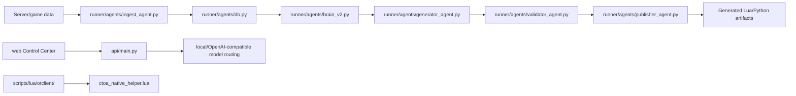

# CTOAi Engine Brain Pack

Generated at: `2026-07-15T14:16:00+00:00`
Repo root: `C:\Users\zycie\CTOAi`
Profile: `control-center`

This pack is curated and secret-safe. It excludes `.env*`, auth stores,
runtime data, logs, local databases, tokens, credentials, and generated
dependency folders. It is intended as a portable context artifact for
Codex or another code assistant.

## Included Sources


## `AI/README.md`

```markdown
# CTOAi Engine Brain

This folder is the Codex working context for the current CTOAi + OTClient lane.
It is intentionally split into small files so a model can load only the slice
needed for a task instead of relying on one long prompt.

## Load Order

1. `SYSTEM_PROMPT.md`
2. `PROJECT_CONTEXT.md`
3. `ENGINE_MEMORY.md`
4. `RULEBOOK.md`
5. The relevant index file for the task
6. The relevant persona from `SPECIALIZED_PROMPTS.md`
7. `TASK_TEMPLATE.md`

## Source Snapshot

- CTOAi repo root: `C:/Users/zycie/CTOAi`
- OTClient source tree: `scripts/lua/otclient/`
- Expanded inspection source used for this package: `.tmp/otclient_ai_source/otclient`
- Current limitation: no TFS fork source tree was included in the workspace, so
  TFS engine classes, packet handlers, and server-side protocol flow are marked
  as pending source rather than inferred.

## Files

- `SYSTEM_PROMPT.md`: primary Codex behavior for this project.
- `PROJECT_CONTEXT.md`: repo architecture and integration map.
- `ENGINE_MEMORY.md`: stable facts, decisions, and current state.
- `RULEBOOK.md`: project-specific engineering rules.
- `ARCHITECTURE_INDEX.md`: subsystem map and data flow.
- `API_INDEX.md`: CTOAi HTTP/API and local model surfaces.
- `LUA_INDEX.md`: Lua runtime modules and helper APIs.
- `OTCLIENT_INDEX.md`: OTClient native module map.
- `PACKET_INDEX.md`: protocol/packet status and known gaps.
- `CLASS_INDEX.md`: important Python/Lua classes and tables.
- `FEATURE_ROADMAP.md`: next implementation lanes.
- `P8_P16_EXECUTION_ROADMAP.md`: background-first post-P7 phase sequence and
  evidence gates through design-only Combat/CaveBot work.
- `../docs/otclient/P9_CONDITIONS_SHADOW_REPLAY_DESIGN.md`: review-ready P9
  data-only observation/replay contract, still blocked by P8 operational acceptance.
- `../docs/otclient/P9_CONDITIONS_SHADOW_ACCEPTANCE.md`: strict current-evidence
  recomputation and explicit data-only operator receipt boundary; it does not
  unlock P10 or runtime actions.
- `KNOWN_BUGS.md`: known risks and suspected defects.
- `TECH_DEBT.md`: cleanup backlog.
- `SPECIALIZED_PROMPTS.md`: project-aware task personas.
- `TASK_TEMPLATE.md`: reusable task intake and delivery template.
- `OPERATIONS_AUDIT.md`: current Docker/VPN/Vercel/GitHub/extension/local gate evidence.
- `CODEX_CAPABILITY_MAP.md`: Codex surfaces and external context tools to use next.
- `ENGINE_BRAIN_STATUS.md`: completion status, risks, and remaining work.
- `generated/FILE_TREE.md`: generated secret-safe file inventory.
- `generated/SYMBOL_MAP.md`: generated lightweight symbol map.
- `generated/manifest.json`: generated index metadata.
- `generated/ENV_DOCTOR.md`: generated local operations audit summary.
- `generated/ENV_DOCTOR.json`: generated local operations audit data.
- `generated/ENGINE_BRAIN_PACK.md`: generated portable secret-safe context pack.
- `generated/ENGINE_BRAIN_PACK.json`: generated context pack manifest.
```


## `AI/ENGINE_BRAIN_STATUS.md`

```markdown
# Engine Brain Status

Snapshot date: 2026-07-14 Europe/Warsaw

Canonical product snapshot: Helper source and last verified live package are
`v2.4.1`. Safe source candidate is `v2.9.0`; last separately verified live Safe
is `v2.8.0`; neutral chooser is `2.1.0`. Historical release entries below do
not override this snapshot.

Current phase state (2026-07-15): P8, P9, P10, and P11 are `operational_acceptance_complete`.
P8 closed with the official trusted pin,
fresh `v2.4.1` heartbeat, `62/62` parity, and stable no-screen invariants. P9,
P10, and P11 each have separate accepted, hash-bound, no-action receipts.

P12 execute-once review is `closed_with_deferred_heal_friend_lane`. P12
Conditions is `operational_acceptance_complete`:
exactly one approved sandbox executor call
ended `killed_and_disarmed`, retry remained false, and its accepted receipt
grants no downstream authority. P12 Equipment is also
`operational_acceptance_complete`. Registry v1 plan
`d041db806c6417b018c6ae390e3d384ccec9bead2a77e498a582093bf7c823e0`
was separately approved for its sandbox session and execution. The official
wrapper made exactly one `3097 -> 3099` executor request, verified transformed
rollback item `3093` in the source slot, scheduled no retry, and ended
`killed_and_disarmed`. Receipt `p12-equipment-bdf7027cf48c438d` is `accepted`
and grants no downstream or live authority.

The first terminally disarmed rejected Equipment attempt remains historical and
cannot be replayed. It exposed the server-specific `3096 -> 3093` and
`3097 -> 3099` transformations that Registry v1 now models. P12 Heal Friend is
`closed_blocked_no_compatible_vocation`. Plan
`964ff8f0c178c7b646a565380e96846a8b29780eb02a734a259713d9ccf023b3`
binds the accepted P11 and Equipment predecessors, exact target identity and
whitelist revision, ED-only execution, HP `<= 70`, range `<= 7`, zero retry,
and terminal KILL/disarm. Current 63-file manifest evidence passes `39/39`
static, `4/4` module attach, `16/16` full attach, and `19/19` runtime gates.
The sandbox session approval was granted, but its fresh preflight stopped on the
single blocker `vocation_must_be_ed`. The operator has only sorcerer and knight,
so `p12_heal_friend_no_compatible_vocation_closure.json` terminally expires the
session approval without action. Execution approval and reuse are forbidden;
attempt count remains `0`, retry false, final state `disarmed`, no cast occurred,
and no downstream or live authority exists.

P13 is `runtime_evidence_ready`: the fixed seven-entry
decision/result ledger, stable schema registry with independent v1/schema
SHA-256 pins, freshness/tamper checks, atomic
`ROADMAP_STATE.json/md` generator, sanitized audit contract, read-only Control
Center panel, and release-evidence phase consumer are implemented and tested.
The exact confirmation `refresh roadmap state` authorized the fixed-output
JSON/Markdown refresh and its raw output hashes are independently audit-bound.
P13 introduces no runtime executor, MCP
write tool, live authority, or P12 Heal Friend reopening. Historical compatibility marker: P12 is
`in_progress`. P12 Heal Friend is `plan_ready_for_sandbox_session_approval`,
`ready_for_sandbox_session_approval`, and P12 Heal Friend is `not_started` are
superseded; they remain only for older read-only cockpit checks.

P14 is active with status `foundation_in_progress`. The versioned signed
artifact-only request/result contract derives the official 63-file Helper
manifest from tracked sources, binds a clean checkout and exact revision, rejects
tamper/path drift, replays a deterministic manifest rollback, runs in a clean
Windows CI contract job, and is exposed read-only through Release Evidence and
Control Center. No real second-machine result, visual/in-world suite, canary,
actual rollback, promotion, runtime/live authority, or additional MCP tool is
claimed; P15 remains closed.

## Completed In This Brain

- Root prompt pack created under `AI/`.
- Project context summarized for CTOAi, OTClient Lua, API, and hybrid bot.
- OTClient helper source tree inspected and indexed.
- Lua and API surfaces indexed at a practical level.
- Packet/TFS sections marked as pending source rather than inferred.
- Operations audit added for Docker, VPN, Vercel, VS Code extension, GitHub, and
  local CTOAi gate.
- Codex capability map added for AGENTS.md, skills, MCP, hooks, plugins, and
  external context tooling.
- Generated file tree, symbol map, and manifest added under `AI/generated/`.
- `.\ctoa.ps1 brain refresh` added as the one-command local index refresh.
- `.\ctoa.ps1 brain doctor` added as the one-command local operations audit.
- `.\ctoa.ps1 brain pack` added as the one-command portable context packer.
- Nested `AGENTS.md` added for `AI/` and `scripts/lua/`.
- Canonical planning now distinguishes the primary full Helper P8-P16 mainline
  from the bounded CTOA Safe S0-S4 companion lane. Safe is defined as a compact,
  movable, fixed-label editor for supported healing/spell/Exeta/Conditions/Timer
  behavior with portable data-only presets; CaveBot, movement/routes, generic
  Settings, arbitrary Lua, and Helper-gate substitution are excluded.
- Exclusive project-loader candidate `v2.4.0` is repo- and stage-complete. The
  neutral chooser is the only CTOA autoload and requires a new Helper/Safe choice
  after each login; both project loaders fail closed without authorization and
  logout terminates the selected project. `PrepareDev` emits 62 manifest entries
  with only `ctoa_project_loader.lua` at package root, and `SmokePreflight` proves
  stage/sandbox parity. No live promotion or live crash-fix claim is made yet.
- Safe `v2.0.1` removes an invalid zero-argument `g_map.getSpectators()` call
  reached only after ENABLE. The replacement uses the detected fork's bounded
  center-position signature, guarded fallback, and executable Lua coverage.
  Fresh `ValidateDev` passed 145 tests and `SmokePreflight` passed; the sandbox
  is not running, so operational no-crash acceptance remains pending.
- Safe `v2.9.0` is now a repo-only candidate with an ordered per-entry Exeta
  editor, strict named `ctoa-safe-profile-v3` preset libraries, one-way v2
  migration, explicit fixed-path import/export, retained `.bak` recovery,
  geometry clamping, and keyboard navigation. Safe boot remains disarmed and
  the fixed module set remains Healing/Combat/Conditions/Support/Timer. This
  candidate has no sandbox visual acceptance or live promotion yet.
- Docker compose defaults hardened to loopback through `CTOA_BIND_HOST`,
  `CTOA_BOT_DASHBOARD_BIND_HOST`, and `CTOA_MONITOR_BIND_HOST`.
- OTClient Helper `v2.3.6` is live-promoted. The official wrapper created
  `runtime/solteria_helper_dev/live_backup_20260712-121859`, verified 58/58
  files, and kept `launch_after_promote=false`.
- The v2.3.5 lane adds the canonical passive P9 Recovery pair producer,
  `otp9accept`, fixed ignored P10 local override, exact container-slot binding,
  and P10.1 strict Release Evidence/Control Center eligibility checks. P11 stays
  closed until a fresh accepted non-fixture P10 report and matching receipt exist.
- Helper v2.3.6 adds a passive exact-target
  Heal Friend scan and a no-write P11 fixture replay with 55/55 deterministic
  cases. The replay explicitly reports operational acceptance as `not_evaluated`;
  it has no operational producer, receipt, Control Center unlock, dispatch, cast,
  talk, execute-once path, or runtime-readiness claim.
- Helper v2.3.7 is live-promoted. The official wrapper created
  `runtime/solteria_helper_dev/live_backup_20260712-150157`, verified 58/58
  stage/live hashes, and kept `launch_after_promote=false`. P10 now requires the
  fixed 30-case scenario corpus and its SHA-256, uses wall-clock time for every
  operational replay, and rejects caller-selected scenario paths and time.
  Nested trace/plan/report schemas and both evidence consumers enforce the same
  corpus. Privileged recovery/cavebot smoke commands cannot bypass disabled runtime.
- Helper v2.3.8 is live-promoted. The official wrapper created
  the latest `runtime/solteria_helper_dev/live_backup_20260712-163259`, verified 58/58
  stage/live hashes, and kept `launch_after_promote=false`. Safe boot now resets
  external enable state and persisted Recovery Bridge arms across init, reload,
  disable, and terminate. Profile and UI-preference files are evaluated as
  data-only chunks without OTClient or filesystem globals. Current-manifest
  sandbox evidence passed 4/4 module attach, 16/16 full attach, and 19/19 runtime
  module gates before promotion.
- Helper v2.3.9 is live-promoted. The official wrapper created
  the latest `runtime/solteria_helper_dev/live_backup_20260712-185148`, verified 58/58
  stage/live hashes, and kept `launch_after_promote=false`. The main Helper
  shell now meets its canonical hard gate at 130 named functions and 4308
  lines. Pure logic moved behind guarded support modules while lifecycle,
  runtime arming, OTClient API edges, and final dispatch remain in the shell.
  A first sandbox attempt exposed `module_visible=nil` in the Profile renderer;
  the callback adapter was restored, regression-tested, and the complete fresh
  sandbox chain passed before promotion.
- Helper v2.3.10 is live-promoted. The official wrapper created
  `runtime/solteria_helper_dev/live_backup_20260712-192857`. Passive adapters now
  own vocation/timer probe text, route/cavebot probe metadata and formatting,
  profile export descriptors, and initial operator-summary collection. The
  guarded shell retains native API sampling, profile/file mutations, movement,
  arming, and dispatch at 4298 lines and 129 named functions. Sandbox testing
  found and fixed both a nil UI-preference write payload and a native heap crash
  caused by a generic `findPath` wrapper; the stable direct guarded `pcall` path
  passed the complete fresh sandbox cycle before promotion. Final verification:
  1666 Python tests, 127/127 ValidateDev, 39/39 static gates, 4/4 and 16/16
  attach, and 19/19 runtime gates.
- The six P10 operator artifacts are now consumed consistently by Python Release
  Evidence and the web Control Center. A separate consumer-parity report binds
  their strict schemas, hashes, downstream references, status/blocker copies,
  freshness, no-action fields, and unchanged eligibility. ValidateDev runs this
  read-only gate before the independent P10 acceptance boundary; Control Center
  exposes no mutation or execution control for this evidence.
- `ctoa.ps1 otp10refresh` now refreshes that complete repo-only chain in fixed
  order and requires the final consumer-parity report to pass. Its successful
  process status means refresh/parity success, not operator readiness; the
  no-ID plan remains independently blocked and no acceptance or runtime action
  is granted. The completed run envelope binds all seven stage hashes to one
  UUID and matching failure cleanup preserves the last good receipt.
  Release Evidence and Control Center consume that receipt read-only and fail
  closed for missing, invalid, stale, mixed, or replayed evidence. The final
  verification passed 1657 Python tests, 147 web tests, 127/127 ValidateDev,
  39/39 static gates, 4/4 and 16/16 sandbox attach, and 19/19 runtime gates.
- P10 capture-profile readiness now has a dedicated `otp10doctor` operator
  command, strict JSON Schema, runbook, and ValidateDev no-action gate. The
  current tracked zero-ID template correctly reports `blocked`; no real item or
  container identifiers are inferred, persisted, or copied into evidence.
- P10 operator evidence now includes exclusive zero-ID profile initialization,
  a bounded sanitized Equipment observation preview, and a strict P9-to-P10
  dependency preflight. The preflight binds P8, non-fixture P9 report/receipt,
  doctor, and preview hashes while always preserving `eligibility_changed=false`
  and false action/live flags. The current operational chain remains correctly
  blocked; the tooling batch was promoted only after current-manifest sandbox
  evidence passed 4/4, 16/16, and 19/19.
- P10 profile changes have a separate `otp10plan` review boundary. It binds the
  fixed capture doctor and observation preview hashes, requires exact ring and
  candidate coordinates plus an exact planning confirmation, and emits only
  `runtime/solteria_helper_dev/equipment_capture_profile_change_plan.json`.
  The generator cannot read or write `.ctoa-local`, control OTClient, accept a
  receipt, or claim runtime readiness.
- P10 operator workflow now also has a deterministic candidate catalog with
  `selection_policy=none`, plus consolidated `otp10ready` explanation across
  doctor, preview, dependency preflight, catalog, and change plan. Missing,
  invalid, stale, and upstream blockers remain distinct; every suggested next
  action preserves unchanged eligibility and no runtime/live execution. The
  latest tooling manifest passed the full sandbox chain before live promotion.
- OTClient Helper `v2.3.4` was previously live-promoted. The official wrapper created a
  backup, verified 58/58 staged/live manifest hashes at promotion, completed the
  release gate and GoalStatus, and refreshed Control Center evidence. Later
  profile edits during play are mutable drift and do not redefine immutable
  package-code parity.
- Helper P6 Module Lane is repo- and sandbox-complete. Its evidence-aware module audit promotes
  passive lanes only when the dedicated smoke, current module gates, ReadyCheck,
  and a newer in-world tab screenshot all exist. Heal Friend, Conditions,
  Equipment, and Scripting now meet that `static_gated` contract while every
  corresponding runtime action remains unavailable. Healing/Recovery also has
  a fail-closed sandbox vitals gate: it rejected an armed runtime, then passed
  only after clean safe boot produced bounded real HP/MP evidence and a newer
  Healing-tab attachment and promoted the recovery lane before Combat review.
- Helper P6 evidence now passes 9/9 lanes as `static_gated`. Combat reports no
  active target; CaveBot proves movement capability plus retry/PZ/offline/empty
  route guards without walking; Timer returns `hold_timer_disabled`; and Loot
  returns `hold_feature_flag_disabled`, zero planned items, and a read-only
  container capability sample. Every report has newer in-world tab evidence and
  runtime remains disarmed. The next functional step is a separately reviewed
  runtime bridge after the completed v2.2.1 stabilization.
- Post-Recovery sequencing is now enforced by three independent passive safety
  gates rather than a generic module gate. Conditions comes first and
  allowlists only paralyze-recovery dry-run; Equipment follows with ring-only,
  exact-ID, rollback-ready, zero-retry dry-run; Heal Friend follows both and
  requires exact persisted whitelist plus stable party target identity. Runtime
  Policy classifies actions itself and requires a schema/evidence/action-bound
  accepted trace, so caller booleans or `runtime_action=false` cannot bypass the
  gate. Poison/burn/energy/bleed and amulet actions remain outside v1; Combat and
  CaveBot remain `deferred_high_risk`. Current staged evidence passes ValidateDev
  121/121, ModuleStaticGates 36/36, and each domain static gate 9/9. Earlier
  attach evidence exists, but the current release gate is blocked because
  ModuleAttachSmoke, SmokeAttachAll, and RuntimeModuleGatesSandboxSmoke are stale
  and live approval predates the current dev manifest. Those gates remain
  dry-run/no-dispatch; the current dev package was not promoted live, and runtime
  acceptance remains separate from any earlier package promotion.
- P8 `BackgroundNoScreen` is `operational_acceptance_complete`. Its bounded
  passive readers, positive wrapper allowlist, protected live-client boundary,
  `ctoa.ps1 otbg`, Release Evidence, and Control Center consumers preserve the
  no-action contract and never authorize dispatch or promotion. Acceptance used
  official promotion provenance, a fresh heartbeat newer than one canonical
  process, and full producer/consumer parity together. The observer cannot
  create that trusted pin. Earlier `legacy_or_unbound_attestation` artifacts
  remain historical diagnostic evidence only.
- `ModuleAttachSmoke` 4/4, `SmokeAttachAll` 16/16, and
  `RuntimeModuleGatesSandboxSmoke` evidence are now manifest-hash-bound at
  production and at the release-gate consumers. Legacy complete artifacts
  without a matching `manifest.sha256` remain blocked; mtime alone cannot
  make stale smoke fresh.
- The next static Helper slice moved diagnostics snapshot formatting and
  widget updates out of `ctoa_native_helper.lua` into the passive Diagnostics
  and UI adapters. It preserves safe-boot/runtime-action invariants and is
  covered by Lua-backed adapter tests plus the existing shell contract suite.
- P9 Conditions is `operational_acceptance_complete`. Its accepted receipt binds
  the fresh real Conditions trace, accepted P8, and canonical Recovery proofs;
  all dispatch, execute-once, promotion, and runtime-readiness fields remain
  false. Fixture success still does not claim runtime readiness. Canonical
  contract: `docs/otclient/P9_CONDITIONS_SHADOW_REPLAY_DESIGN.md`.
- P10 Equipment shadow/replay is `operational_acceptance_complete`. Its real
  passive input boundary was introduced in live-promoted Helper `v2.3.5`:
  the guarded adapter reports a bounded inventory observation, the reporter
  sanitizes it, and a repo-local producer combines it with an explicitly
  configured ring/container profile into a canonical snapshot. Operational
  replay rejects fixture provenance and noncanonical paths. A separate receipt
  preflight replays current inputs, binds the accepted P9 receipt to its raw
  report, requires exact confirmation, and never authorizes dispatch, runtime
  readiness, or promotion. Release Evidence, P7, and Control Center report P10
  replay and acceptance independently. The accepted P10 receipt binds real P9
  evidence and exact ring/container/slot inputs but grants no item movement or
  P12 execute-once authority.
- Live-promoted Helper v2.3.6 retains the case-sensitive `.otmod` autoload metadata for
  classic/mehah parsers, uses current and legacy console status enums, retains
  one lifecycle subscription across duplicate loader authorities, tears down
  idempotently, and starts hidden without window focus. P10 accepted semantics
  are now bound into the receipt hash and enforced by Python, JSON Schema,
  Release Evidence, and Control Center; snapshot/replay writers use confined
  exclusive atomic writes. Those hardening invariants remain active after P10
  and P11 acceptance.
- P9 also has a separate data-only operator acceptance boundary. It strictly
  recomputes the current report and hashes, rejects fixtures/reparse paths and
  stale or changing evidence, requires exact confirmation for persistence, and
  keeps all action flags false. The persisted
  `conditions_shadow_acceptance.json` receipt is accepted. Contract:
  `docs/otclient/P9_CONDITIONS_SHADOW_ACCEPTANCE.md`.
- Vocation-profile drift is visible as its own count but cannot satisfy parity:
  the current profile is executable Lua. A later schema-validated data-only
  persistence format is required before normal profile changes can be trusted as
  non-code drift.
- CTOAi Runtime 2 execution has started from the reviewed vBot architecture:
  `ctoa_helper_runtime_core.lua` now provides a passive runtime registry,
  failure-isolated event bus, and 4 ms budgeted cooperative scheduler with
  disabled-by-default tasks and bounded failure backoff.
- The first P1 slice, `ctoa_helper_combat_observer.lua`, normalizes and publishes
  `ctoa.combat-observation.v1` snapshots while remaining detached from OTClient
  action APIs and disabled after loader attachment.
- P1 is now wired through `ctoa_helper_otclient_observation_adapter.lua`, which
  performs guarded read-only target, spectator, protection-zone, cooldown, and
  latency reads. Its Runtime Core task remains disabled by default.
- Runtime 2 P2 is complete repo-side: `ctoa.runtime-core.v1` status is included
  in Helper diagnostics, bounded diagnostic samples, and the additive
  `runtime_core` capability-report section, including disabled, deferred, and
  failed task counters.
- Runtime 2 P3 has started with passive combat/targeting and recovery/healing
  observers. The recovery provider reads guarded HP, mana, percentage, PZ, and
  state APIs; both observer tasks remain disabled after loader attachment.
- Runtime 2 P3 is complete repo-side across combat, recovery, cavebot, loot,
  and equipment observation domains. Guarded providers expose only read state;
  the verified safe-boot snapshot contains five registered tasks, zero enabled
  tasks, and no executed tick work.
- Runtime 2 P4 executor work remains outside the v2.2.1 stabilization scope.
  The v2.2.1 Helper goal and release gate completed with a fresh manifest,
  static gates, theme matrix, in-world attach, relog evidence, and separately
  approved live promotion.
- Runtime 2 packaging now carries Runtime Core, five observers, and the guarded
  observation adapter through all five test-env package/sync/manifest lists.
  PrepareDev and ValidateDev rebuild the stage successfully with 117 tests;
  current attach and release evidence is complete.
- Sandbox attach diagnosis found and fixed a virtual/filesystem path mismatch:
  Helper derived `/ctoa_smoke_command.lua` from virtual UI prefs and then passed
  it to `io.open`, producing repeated `Smoke command failed: nil`. It now uses
  the real work-directory command file; the rebuilt package again passes 114
  tests; subsequent attach, relog, and live-promotion evidence completed.
- Helper-first 90-day plan adopted: Helper P0-P2 remain the active priority
  before broader CTOAi expansion.
- `schemas/otclient-helper-config.schema.json` added as the machine-readable
  `HELPER_CONFIG` safety schema.
- `scripts/ops/otclient_helper_profile_audit.py` added and wired into
  `ValidateDev` as the profile migration safety gate.
- Control Center evidence now includes a read-only OTClient Helper status
  surface backed by `runtime\solteria_helper_dev` artifacts.
- Release evidence packs now include OTClient Helper validation, package hash,
  release gate state, blockers, and next safe command.
- Release evidence packs now include the generated P7 operator brief status,
  decision, blocker/warning counts, and next safe command from
  `AI/generated/P7_OPERATOR_BRIEF.json`.
- Full workspace audit added through `scripts/ops/ctoa_full_workspace_audit.py`,
  with JSON inventory in `runtime/audits/` and durable docs in `docs/audits/`
  plus `docs/roadmaps/`. The inventory now uses `lstat`/regular-file checks and
  skips symlinked files before size accounting or SHA256 hashing, so repo-local
  symlinks cannot pull external local content into audit evidence. The audit
  also publishes an integrity gate with non-regular entry accounting, bounded
  hash counts, and proof that sensitive-name files were inventoried without
  content hashes. It now also consumes
  `runtime/audits/ctoai-full-workspace-validation.json` and reports a
  validation-evidence gate for Python, web, diff, and Engine Brain command
  evidence.
- Plan 3 first implementation wave completed: `brain refresh` now generates
  `OWNERSHIP_MAP`, `DOC_SYNC`, and `SECRET_GUARDRAIL` artifacts from the full
  workspace audit and canonical docs.
- Engine Brain indexing now prunes excluded volatile directories before
  traversal and tolerates disappearing build paths such as `web/.next/*`.
- `brain pack` now supports context profiles: `all`, `helper`,
  `control-center`, `infra`, and `security`.
- Local Codex skill `ctoa-engine-brain` added under
  `C:\Users\zycie\.codex\skills\ctoa-engine-brain` and validated with the
  skill creator quick validator.
- P6 Codex Integration has started as a read-only readiness gate rather than a
  deploy/action shortcut. `brain refresh` now generates
  `AI/generated/P6_CODEX_INTEGRATION_READINESS.md` and `.json`, checking the
  local Engine Brain skill, AGENTS.md coverage, Control Center evidence
  contracts, release evidence tooling, full workspace validation evidence,
  doc sync, and secret guardrails before reporting plugin-design readiness.
- Local plugin scaffold `ctoai-engine-brain` now exists under the user's local
  plugin workspace with a read-only operator skill, MCP config/server, and a
  personal marketplace entry. P6 readiness checks the plugin manifest, MCP
  config/server, operator skill, and marketplace source/policy before reporting
  readiness.
- The local plugin was cachebusted and installed from the personal marketplace
  through `codex plugin add ctoai-engine-brain@personal`; `codex plugin list`
  reports it as `installed, enabled`. P6 readiness now checks the installed
  Codex cache manifest version too.
- The local plugin now includes read-only smoke script
  `scripts/ctoai_engine_brain_status.py`, which summarizes manifest, P6
  readiness, pack, doctor, audit, and validation status without reading secrets,
  logs, databases, or live client state.
- The local plugin now includes read-only Control Center cockpit script
  `scripts/ctoai_control_center_cockpit.py`, exposed through MCP as
  `ctoai_control_center_cockpit`. It summarizes `runtime/evidence/latest.json`,
  tracked release-evidence markdown drilldown,
  `AI/generated/P7_OPERATOR_BRIEF.json`, P7 cockpit smoke evidence, and bounded
  Control Center action-audit drilldown status without running refresh, deploy,
  or live-client actions.
- The local plugin now includes read-only MCP server
  `scripts/ctoai_engine_brain_mcp.py`. It exposes four read-only tools
  (`ctoai_engine_brain_status`, `ctoai_engine_brain_self_check`,
  `ctoai_engine_brain_brief`, `ctoai_control_center_cockpit`) plus five
  dry-run-first safe-write refresh tools for repo hygiene, API cost, evidence
  pack, Engine Brain context, and P7 cockpit smoke workflows. Deploy/live actions remain blocked.
- The local plugin now includes read-only operator brief script
  `scripts/ctoai_engine_brain_brief.py`. It reports
  `decision=ready_for_p7_operator_workflow`, `status=ready`, and
  `hard_blockers=[]` from generated Engine Brain and validation evidence.
- `brain refresh` now generates `AI/generated/P7_OPERATOR_BRIEF.md` and
  `AI/generated/P7_OPERATOR_BRIEF.json`, giving Control Center and release
  evidence a read-only P7 operator decision artifact that does not require the
  plugin MCP server to be loaded.
- `brain refresh` now also generates `AI/generated/P7_OPERATOR_WORKFLOW.md` and
  `AI/generated/P7_OPERATOR_WORKFLOW.json` as the P7 risk gate. It reports
  the allowed read-only cockpit/status tools, the five audited safe-write
  refresh tools, and blocked `guarded_write`, `dangerous`, and
  `forbidden_ui` action classes.
- `brain refresh` now generates `AI/generated/P7_ACTION_READINESS.md` and
  `AI/generated/P7_ACTION_READINESS.json` as the action-expansion gate. It
  reports five Control Center `safe_write` candidates, five audited
  candidates, and now allows five bounded MCP write tools:
  `ctoai_repo_hygiene_refresh`, `ctoai_api_cost_refresh`,
  `ctoai_evidence_pack_refresh`, `ctoai_engine_brain_refresh`, and
  `ctoai_p7_cockpit_smoke_refresh`.
- `brain refresh` now generates `AI/generated/P7_SAFE_WRITE_TOOL_DESIGN.md`
  and `AI/generated/P7_SAFE_WRITE_TOOL_DESIGN.json` as the first
  `safe_write` MCP contract. It keeps `evidence-pack-refresh` /
  `ctoai_evidence_pack_refresh` as the primary design contract, allows
  `repo-hygiene-refresh` / `ctoai_repo_hygiene_refresh` and
  `api-cost-refresh` / `ctoai_api_cost_refresh` plus
  `engine-brain-refresh` / `ctoai_engine_brain_refresh` and
  `p7-cockpit-smoke-refresh` / `ctoai_p7_cockpit_smoke_refresh` as additional bounded
  evidence/context refreshes, and keeps every deploy/live action blocked.
- The local `ctoai-engine-brain` plugin now exposes
  `ctoai_repo_hygiene_refresh`, `ctoai_api_cost_refresh`,
  `ctoai_evidence_pack_refresh`, `ctoai_engine_brain_refresh`, and
  `ctoai_p7_cockpit_smoke_refresh` as bounded
  safe-write MCP tools. All default
  to dry-run, require a read-only `ctoai_control_center_cockpit` preflight with
  status `ready`, write Control Center-compatible
  `runtime/control-center/action-audit.jsonl` records, and require explicit
  confirmation before non-dry-run execution.
- Control Center Evidence now surfaces the generated P7 action-readiness fields
  from `AI/generated/P7_OPERATOR_BRIEF.json` in the Engine Brain cockpit card:
  readiness status, audited candidate ratio, MCP write-tool count, action
  readiness decision, and next safe command. The Overview/Local Status Engine
  Brain detail panel mirrors the same read-only action-gate state.
- Control Center Evidence and Ops drilldowns now also surface the generated P7
  safe-write design from `AI/generated/P7_OPERATOR_BRIEF.json`: design status,
  selected action, proposed MCP tool, MCP enabled flag, and next safe command.
- Control Center now correlates all enabled P7 safe-write actions with the
  bounded `runtime/control-center/action-audit.jsonl` tail sample, exposing
  latest matching audit ids, risk classes, dry-run/confirmed modes,
  authorization results, and sanitized summaries in the Engine Brain cockpit
  card.
- Control Center Evidence and Ops now derive a read-only P7 cockpit summary
  from `AI/generated/P7_OPERATOR_BRIEF.json`, including enabled safe-write MCP
  tool count, ready audit count, and the per-tool audit status list. Current
  cockpit state is five enabled tools and five ready audit traces.
- P6 readiness now checks the P7 Control Center contract directly. It blocks
  plugin-design readiness if Control Center config, evidence payloads, ops
  payloads, Evidence UI, or detail UI stop consuming
  `AI/generated/P7_OPERATOR_BRIEF.json`, including the read-only P7 cockpit
  summary and enabled-tool audit status list.
- `scripts/ops/control_center_p7_cockpit_smoke.py` is now the repeatable
  read-only P7 cockpit smoke gate. It validates generated P7 workflow files,
  release evidence, and `runtime/control-center/action-audit.jsonl` together,
  and P6 readiness tracks both the script and its regression tests.
- Control Center Evidence and Ops now surface
  `runtime/control-center/p7-cockpit-smoke.json` as read-only P7 smoke status,
  including check counts, safe-write audit counts, artifact health, and source
  links.
- The local `ctoai-engine-brain` plugin cockpit, self-check, and safe-write
  preflight now also surface `runtime/control-center/p7-cockpit-smoke.json`.
  Installed cache checks report `p7_cockpit_smoke status=ready`, `14/14`
  checks, `5/5` safe-write audits, and roadmap generation readiness `ready`.
- `scripts/ops/control_center_p7_safe_write_dry_run_smoke.py` now exercises all
  five bounded P7 safe-write MCP tools with `dry_run=true` against the local
  plugin stdio server and verifies matching Control Center action-audit records.
  P6 readiness tracks both the smoke script and its regression tests before any
  broader plugin action expansion.
- P7 safe-write dry-run smoke now separates normal cockpit preflight from the
  explicit self-stale bootstrap allowance: operator-ready evidence requires
  `dry_run_ready_count=5`, `preflight_ready_count=5`, and
  `bootstrap_allowed_count=0`; bootstrap remains limited to stale P7
  audit/smoke recovery and is not the final acceptance state.
- Control Center artifact health now uses the same P7 dry-run smoke acceptance
  rule, so a bootstrap-only or partial-preflight report blocks operator handoff
  instead of appearing as a passed artifact.
- P7 action readiness now advances the generated `next_safe_command` after all
  five enabled safe-write tools have dry-run/preflight evidence. The only
  confirmed recommendation in this lane is the selected evidence refresh:
  `ctoai_evidence_pack_refresh` with `dry_run=false` and
  `confirm='refresh evidence pack'`; deploy/live/client actions remain blocked.
- The selected confirmed evidence refresh was executed through the
  `ctoai-engine-brain` plugin MCP path with exact confirmation. P7 action
  readiness now recognizes the confirmed `evidence-pack-refresh` audit evidence
  and advances to `review_confirmed_safe_write_evidence`, so Control Center and
  the plugin cockpit recommend reviewing `runtime/control-center/action-audit.jsonl`
  and `runtime/evidence/latest.json` before any next plugin action is designed.
- `scripts/ops/control_center_p7_evidence_review.py` now performs that
  read-only review as a concrete gate. It writes
  `runtime/control-center/p7-evidence-review.json` and `.md`, validates the
  confirmed `dry_run=false` evidence-pack audit, release evidence, P7 cockpit
  smoke, P7 dry-run smoke, and P6 handoff smoke, and lets
  `P7_ACTION_READINESS` advance to `design_next_p7_plugin_action` only when
  the review is ready.
- Control Center Evidence and Ops now surface
  `runtime/control-center/p7-safe-write-dry-run-smoke.json` as read-only P7
  dry-run smoke status, including check counts, dry-run tool readiness,
  per-tool audit/preflight/bootstrap status, artifact health, operator-next
  gating, and source links.
- The local `ctoai-engine-brain` plugin cockpit, operator brief, self-check,
  and safe-write MCP preflight now also surface
  `runtime/control-center/p7-safe-write-dry-run-smoke.json`. The plugin was
  reinstalled as `0.1.0+codex.20260708000418`; installed cache checks report
  `p7_safe_write_dry_run_smoke status=ready`, `12/12` checks, `5/5`
  dry-run safe-write tools, `5/5` preflight-ready tools, and `0` bootstrap-only
  tools.
- Control Center Evidence now surfaces a read-only P6 plugin handoff card from
  `AI/generated/P6_CODEX_INTEGRATION_READINESS.json`, including marketplace
  status, installed cache version, P6 check counts, MCP contract counts, and the
  explicit fresh-thread verification requirement for `ctoai_engine_brain_brief`
  and `ctoai_control_center_cockpit`.
- `scripts/ops/control_center_p6_plugin_handoff_smoke.py` now writes
  `runtime/control-center/p6-plugin-handoff-smoke.json` and `.md` as the final
  read-only P6 plugin handoff smoke. It validates P6 readiness, marketplace and
  installed-cache evidence, plugin manifest version parity, P7 operator
  workflow policy, P7 operator brief readiness, P7 cockpit smoke, and P7
  safe-write dry-run smoke before fresh-thread plugin verification.
- Control Center Evidence and Ops now surface that P6 handoff smoke inside the
  existing P6 plugin card/detail: smoke status, check counts, current-thread
  discovery state, fresh-thread verification status, recommended tool order,
  and source link.
- The local `ctoai-engine-brain` plugin was reinstalled as
  `0.1.0+codex.20260708000418`. Its status, operator brief, Control Center
  cockpit, self-check, and MCP safe-write preflight now also surface
  `runtime/control-center/p6-plugin-handoff-smoke.json` as a read-only P6
  handoff gate before broader P6/P7 action expansion.
- P6 handoff now guards the plugin MCP startup path itself:
  `.mcp.json` must point at the absolute runnable
  `C:/Users/zycie/plugins/ctoai-engine-brain/scripts/ctoai_engine_brain_mcp.py`
  script so fresh Codex sessions do not try to start the server from the CTOAi
  repo working directory.
- Fresh `codex exec` visibility smoke attempted the read-only
  `ctoai_engine_brain_brief` MCP tool against server `ctoai-engine-brain`,
  proving new-session discovery. Noninteractive approval cancelled the tool
  call, so direct MCP protocol smoke was also run; it listed `9` tools and
  returned `ready` for brief, cockpit, and self-check with P6 smoke `17/17`.
- The plugin `ctoai_control_center_cockpit` payload now mirrors the practical
  Control Center drilldown: release evidence status, sprint/file coverage,
  latest markdown titles, bounded action-audit tail sampling, risk/action
  counts, invalid-line counts, source/sample byte counts, and sanitized recent
  action records. It also returns a read-only `operator_next` recommendation
  that mirrors the Control Center operator-safe next step and suppresses
  guarded live-promotion commands. P6 readiness blocks if the plugin cockpit
  loses those drilldown or operator-next markers.
- P6 readiness now also tracks the plugin P7 cockpit smoke contract regression
  in `tests/test_engine_brain_index.py`, including MCP tool schema, forbidden
  tool-name fragments, cockpit smoke payload fields, and safe-write preflight
  smoke status.
- Control Center Evidence and Ops now expose one read-only `operatorNext`
  surface. It selects the next operator-safe step from current Engine Brain,
  P7 smoke, action-audit, and evidence gates, prefers P7 dry-run safe-write
  refreshes when P6/P7 are ready, and suppresses guarded live-promotion
  commands from the top-level recommendation.
- Control Center Evidence now also exposes a dedicated read-only `P7 operator
  brief` card backed by `AI/generated/P7_OPERATOR_BRIEF.json`. The card
  surfaces the generated cockpit handoff status, P7 smoke counts, P7 dry-run
  smoke status, release evidence coverage, action-audit record counts, and
  recommended read-only plugin tool order without exposing live-promotion
  commands.
- The local plugin cockpit and operator brief now include a read-only
  plugin-style operator surface for roadmap generation status. It checks
  `AI/FEATURE_ROADMAP.md`, this status file,
  `docs/roadmaps/CTOAI_THREE_DEVELOPMENT_PLANS_2026-07-06.md`, and
  `AI/generated/DOC_SYNC.json` before treating further plugin-action expansion
  as roadmap-aligned.
- Control Center evidence now includes a read-only Engine Brain status surface
  backed by `AI/generated/manifest.json`, `ENGINE_BRAIN_PACK.json`,
  `DOC_SYNC.json`, and `SECRET_GUARDRAIL.json`.
- Control Center evidence now includes read-only stale-artifact detection for
  Helper manifest age, Helper ZIP hash mismatch, missing smoke evidence, and
  missing Control Center action audit records. Helper package hash checks now
  resolve `release_readiness.json` ZIP paths only inside the configured Helper
  dev lane, so an unsafe runtime JSON path cannot force Control Center to hash
  an arbitrary local file.
- Control Center evidence now surfaces read-only Helper live-promotion evidence
  from `live_promotion.json`, including promoted status, live client path,
  backup path, and a freshness check that stays separate from live deploy
  actions.
- Control Center evidence now includes read-only drilldowns for tracked
  release-evidence markdown and sanitized action-audit JSONL metadata. The
  release-evidence drilldown extracts markdown titles through a small bounded
  prefix reader and falls back to the file name for oversized or unsafe files.
  The action-audit drilldown reports action, target, risk, actor role,
  authorization, dry-run and result summaries without exposing raw
  `output_preview` command text. Oversized action-audit JSONL files are read
  through a bounded tail sample instead of a full-file read, and symlinked audit
  paths are rejected before `open`; the payload reports `truncated`, source
  bytes, sampled bytes, and a `warn` state before release sign-off.
- Control Center configured JSON evidence reads now use a bounded file-handle
  reader and reject symlinked or oversized configured files before parsing.
  Repo hygiene, API cost, Helper, Engine Brain, and runtime evidence JSON fail
  closed to missing/default status instead of following unsafe paths.
- Control Center ops now carries the same release-evidence and action-audit
  drilldowns into Overview and Local Status detail panels. The legacy
  `recentActions` fallback now uses the shared bounded action-audit reader and
  is redacted before the `/api/control-center/ops` payload is returned.
- Control Center evidence read endpoints now require operator-or-owner access
  before collecting runtime evidence or reading local markdown files. This
  protects `/api/control-center/evidence`, `/api/control-center/ops`,
  `/api/control-center/evidence/report`, and
  `/api/control-center/evidence/api-cost-report` from anonymous/member reads.
- Backend `/api/release-evidence` now follows the same browser-safe evidence
  discipline for its configured JSON file: bounded read, display-safe
  `evidence_path`, recursive token/password/API-key redaction, local absolute
  path collapse, symlink rejection before `stat/open`, and stable error
  messages without raw exception text.
- FastAPI HTTP audit JSONL persistence now redacts token/password/API-key/Bearer
  forms and local absolute paths from `actor`, `ip`, `ua`, request path, and
  nested `meta` before writing `CTOA_AUDIT_LOG_FILE`.
- FastAPI rate-limit identity now ignores `X-Forwarded-For` unless
  `CTOA_TRUST_PROXY_HEADERS=true`. When proxy headers are explicitly trusted,
  only the first syntactically valid forwarded IP is used for audit IPs and
  rate-limit buckets, preventing spoofed header rotation from bypassing read
  limits in default local/API deployments.
- Control Center evidence and ops payloads now display repo-local paths as
  repo-relative strings and external absolute paths as `[external]/name`,
  keeping user profile, temp, live-client, and custom runtime parent
  directories out of browser-visible JSON.
- Control Center markdown report endpoints now apply the same browser-visible
  redaction and display-path rules before returning release evidence or API
  cost markdown through `/api/control-center/evidence/report` and
  `/api/control-center/evidence/api-cost-report`. The shared sanitizer now
  handles Windows and POSIX absolute local paths while leaving UI/API routes
  such as `/api/control-center/actions` intact.
- Control Center markdown report reads are now physically bounded. Release-
  evidence and API-cost markdown endpoints read at most `max + 1` bytes through
  a file handle, reject symlinked configured report files before `open`, close
  the handle in `finally`, and return `413` for oversized configured report
  files, so an env/path mistake cannot force the route to load a linked or very
  large local artifact into memory.
- Control Center action execution now applies the same browser-visible
  sanitizer to action results before returning stdout/stderr or local failure
  messages to the UI. Returned action output and persisted audit previews both
  redact token/password forms and collapse Windows or POSIX absolute local
  paths.
- `/api/control-center/actions` now also sanitizes generic and authorization
  error JSON before returning it to the browser, so rejected/unknown action
  errors cannot echo token-like input or local host paths from exception
  messages.
- `/api/control-center` backend probe summaries and
  `/api/control-center/legacy` backend fetch details now use the same
  browser-visible sanitizer before JSON responses, keeping token/password forms
  and Windows/POSIX local paths out of fallback Control Center status payloads.
- Control Center action execution now redacts common secret forms from audit
  `reason` and `output_preview` fields before appending
  `runtime/control-center/action-audit.jsonl`, so the persisted runtime audit
  and the read-side drilldown both avoid copying tokens or passwords.
- Control Center evidence, ops detail panels, and action audit persistence now
  share the same redaction helper. This keeps legacy or hand-written
  `runtime/control-center/action-audit.jsonl` records with `token=...`,
  `password=...`, quoted JSON-like token/password/API-key fields, Bearer,
  GitHub, OpenAI, GitLab, or `PGPASSWORD` forms from leaking through read-only
  evidence drilldowns or `/api/control-center/ops`.
- Control Center chat transcripts, markdown exports, JSON chat logs, and
  `localStorage` persistence now use the same redaction helper before storing
  or exporting messages. Bearer, provider-token, token/password/API-key,
  quoted JSON-like secret fields, and quality/publication-note secrets are
  replaced with `[redacted]` while the current in-memory chat view remains
  unchanged.
- Control Center local Python-backed actions now resolve only
  `CTOA_PYTHON_BIN` as an absolute existing executable or the repo-local
  `.venv` Python. Missing trusted Python is recorded as an audited action
  failure instead of falling back to PATH-only `python`/`python3`.
- Control Center action execution now derives the workspace root safely from
  either repo-root or `web/` working directories. Explicit
  `CTOA_WORKSPACE_ROOT` overrides must be absolute existing directories, and
  allowlisted action scripts must resolve inside that workspace and exist before
  `execFile` runs.
- Control Center action script resolution now uses `realpath` containment.
  Repo-relative allowlisted scripts must still resolve inside the real
  workspace root after following parent symlinks or junctions, and direct
  script symlinks are rejected before `execFile`.

[truncated]
```


## `AI/FEATURE_ROADMAP.md`

```markdown
# Feature Roadmap

## Current State

- Canonical product snapshot (2026-07-14): Helper source and last verified live
  package are `v2.4.1`; Safe source candidate is `v2.9.0`, while the last
  separately verified live Safe package remains `v2.8.0`. Neutral chooser is
  `2.1.0`. Historical version paragraphs below are release history, not current
  version declarations.
- Current phase state (2026-07-15): P8, P9, P10, and P11 are `operational_acceptance_complete`.
  Their accepted receipts remain independent
  and grant no P12 action authority.
- P12 execute-once review is `closed_with_deferred_heal_friend_lane`. P12
  Conditions is `operational_acceptance_complete`:
  exactly one approved sandbox executor call
  succeeded, the trace ended `killed_and_disarmed`, retry remained false, and
  the accepted receipt grants no downstream authority.
- P12 Equipment is `operational_acceptance_complete`. Registry v1 plan
  `d041db806c6417b018c6ae390e3d384ccec9bead2a77e498a582093bf7c823e0`
  was separately approved and made exactly one `3097 -> 3099` sandbox executor
  request. Receipt `p12-equipment-bdf7027cf48c438d` is `accepted`; retry stayed
  false, transformed rollback item `3093` returned to the source slot, terminal
  state was `killed_and_disarmed`, and no downstream or live authority was
  granted. The earlier rejected attempt remains historical and cannot be replayed.
- P12 Heal Friend is `closed_blocked_no_compatible_vocation`. Plan
  `964ff8f0c178c7b646a565380e96846a8b29780eb02a734a259713d9ccf023b3`
  remains immutable and binds the accepted P11 shadow receipt, accepted P12
  Equipment predecessor, exact target identity and whitelist revision, ED-only
  vocation, HP `<= 70`, range `<= 7`, zero retry, and terminal KILL/disarm.
  The current 63-file manifest has `39/39` static gates, `4/4` module attach,
  `16/16` full attach, and `19/19` runtime gates. The separately approved
  sandbox session reached a fresh preflight whose only blocker was
  `vocation_must_be_ed`; the operator has only sorcerer and knight characters.
  `p12_heal_friend_no_compatible_vocation_closure.json` therefore expires that
  session approval, forbids its reuse and any execution approval, and records
  attempt count `0`, retry false, final state `disarmed`, no cast, and no
  downstream or live authority. No Conditions or Equipment authority was inherited.
  Fixture success is never reported as runtime readiness.
  Historical compatibility marker: P12 is `in_progress`. P12 Heal Friend is
  `plan_ready_for_sandbox_session_approval`, `ready_for_sandbox_session_approval`,
  and P12 Heal Friend is `not_started` are superseded and retained only for
  older read-only cockpit checks; none describes the current state.
- P13 is `runtime_evidence_ready`. The fixed seven-entry
  decision/result ledger, versioned schema registry with independent v1/schema
  SHA-256 pins, freshness/tamper checks,
  atomic `ROADMAP_STATE.json/md` generator, sanitized dry-run/success/failure
  audit contract, read-only Control Center panel, and release-evidence phase
  consumer are implemented and tested. The exact confirmation
  `refresh roadmap state` authorized the fixed-output refresh; generated JSON
  and Markdown now carry the terminal ledger, while the confirmed safe-write
  audit binds their raw hashes independently from freshness and tamper status.
  P13 adds no runtime executor, MCP write tool, live authority, or inherited
  permission, and it does not reopen the closed P12 Heal Friend lane.
- P14 is active with status `foundation_in_progress`. Its v1 request/result
  schemas, HMAC-SHA256 artifact-only handoff, tracked-source 63-file manifest,
  clean-checkout/revision binding, tamper/path tests, deterministic manifest
  rollback replay, Windows CI contract job, Release Evidence phase state, and
  read-only Control Center card are implemented. No operational second-runner
  result, visual/in-world evidence, canary, actual rollback, promotion, runtime,
  live, or MCP-write authority is claimed; P15 remains closed.
- The accepted shadow-gate dependency order remains **Conditions runtime safety gate**,
  then **Equipment runtime safety gate**, then **Heal Friend runtime safety gate**.
  P9-P11 acceptance is complete, but this order still governs the independent
  P12 execute-once lanes and grants no inherited action authority.

- Engine Brain Plan 3 is operational and maintained as the secret-safe context
  foundation; roadmap work now consumes its generated evidence.
- Product direction is now explicitly split: the full OTClient/Solteria Helper
  remains the primary P8-P16 project, while `mods/ctoa_safe` is a secondary
  minimalist, movable client panel with fixed module labels and broad editing
  inside its supported lanes. Safe may provide editable healing, spell and Exeta
  rotations, Conditions, Timer, and portable data-only presets, but permanently
  excludes CaveBot, route/movement automation, generic Settings, arbitrary Lua,
  and any path that satisfies or bypasses a Helper acceptance gate. The delivery
  contract is S0 scope reduction, S1 rotation editors, S2 mobile preset schema,
  S3 compact UI acceptance, and S4 separate package/release evidence.
- S0 is repo- and stage-complete in candidate package `v2.4.0`: a single neutral
  loader is the only CTOA autoload, asks after every login, activates exactly one
  of Helper or Safe, and tears it down on logout. Direct Helper/Safe initialization
  is rejected without the matching selection. Safe now has only three project
  files, fixed Healing/Combat/Conditions/Timer labels, forced safe boot, and no
  copied Helper runtime, CaveBot, or generic Settings surface. Operational crash
  closure remains unclaimed until fresh sandbox selection plus Safe ENABLE smoke
  and the separately approved promotion gate pass.
- Safe `v2.0.1` closes the ENABLE-only zero-argument spectator query found during
  crash-path review. It now uses the fork-native bounded center-position API and
  guarded fallback; an executable Lua fixture verifies the exact arguments.
  This strengthens the staged candidate but does not replace in-world crash proof.
- Safe `v2.8.0` advances S1/S2 with a fixed Support label below Conditions,
  module-specific ordered editors for Healing, Targeting, Spell Rotation, and
  Support, selection-to-form editing, bounded JSON persistence, and export-time
  removal of runtime timestamps. Healing includes HP/mana percentage controls,
  bounded randomization, and drag-and-drop item slots with hotkey fallback.
  Support accepts spell or item rules triggered always, by HP, or by mana.
  Combat rules include a compact monster-count checkbox and per-spell distance.
  Support is default-off and has no CaveBot, movement, Settings, scripting, or
  Helper-profile compatibility path.
- Safe `v2.8.0` is live-promoted after sandbox visual acceptance, real item
  drag/drop and JSON persistence proof, Helper attach coverage 4/4 and 16/16,
  runtime module gates 19/19, and exact repo/stage/live hash parity. Backup:
  `runtime/solteria_helper_dev/live_backup_20260713-021234`.
- Safe `v2.9.0` is the next repo-only candidate. It completes the ordered Exeta
  editor with per-entry monster count and cooldown, introduces strict
  `ctoa-safe-profile-v3` named preset libraries with v2 migration and explicit
  fixed-path import/export, keeps `.bak` recovery, excludes runtime arm state,
  clamps restored window geometry, and adds bounded keyboard navigation. It is
  not staged, visually accepted, or live-promoted yet.
- Add a separate cross-fork OTS Connection Profile lane for OTC, OTCv8,
  OTC Brasil, and derived clients. Keep the UI normalized while fork adapters
  map protocol/client differences. Store only authenticated encrypted envelopes;
  keep key material in the OS credential store, pin server identity when the
  fork supports it, redact logs/evidence, and require an explicit Connect action.
  Begin with passive capability discovery and validated profile import/export;
  do not place this surface inside Safe or couple it to Helper runtime arming.
  The public profile contract is now schema-closed in
  `schemas/otclient-server-profile.schema.json`; secrets are represented only by
  an OS-vault reference and unknown adapters or missing public-key pins fail.
  A bounded passive detector now identifies the source checkout as
  `redemption-mehah` and records proven UIItem/action-bar/keybind/shader/HTML
  capabilities without reading credentials or connecting. A protected live
  tree with no public markers remains explicitly `unknown`.
- Safe S4 now has an independent three-file release lane documented in
  `docs/otclient/solteria_safe_release.md`. Safe `v2.8.0` is live-promoted with
  3/3 source/live SHA-256 parity and backup
  `runtime/solteria_safe_release/live_backup_20260713-015729`; the running client
  PID remained unchanged. Activation and visual/runtime acceptance are pending
  a normal reload, so this evidence does not satisfy any Helper release gate.
- Helper `v2.4.1` hardens guarded auto-targeting so the currently attacked safe
  creature is not redispatched every retarget interval. This is an idempotency
  fix only and does not alter P8-P16 eligibility, runtime gates, or safe boot.
- Helper `v2.3.6` is live-promoted with 58/58 verified files and
  `launch_after_promote=false`; backup: `live_backup_20260712-121859`.
  It adds the passive P10 observation, canonical snapshot producer, operational
  replay, and separate acceptance receipt contract.
  The already-running live client still reports the prior capability version;
  P8 correctly returns `capability_version_mismatch` until the user performs a
  normal client restart. Promotion did not force-close or restart that session.
  Vocation-profile drift after play is tracked separately, but remains blocking
  because the current Lua profile is executable rather than data-only.
- Helper `v2.3.6` adds a passive exact-single-target
  Heal Friend scan boundary and a fixture-only P11 replay that passes 55/55
  deterministic cases under mandatory `--no-write`. P11 operational acceptance
  remains `not_started`: there is no operational producer, receipt, dispatch,
  Control Center unlock, cast, talk, execute-once, or runtime-readiness claim.
- Helper `v2.3.7` is live-promoted with 58/58 verified files,
  `launch_after_promote=false`, and backup `live_backup_20260712-150157`.
  It hardens P10 with a fixed 30-case
  corpus, scenario-pack SHA binding, current-wall-clock operational evaluation,
  strict nested schemas and Release Evidence/Control Center coverage parity.
  Privileged smoke commands now fail closed while runtime is disabled, while
  passive tab/probe smoke remains available for sandbox evidence.
- Helper `v2.3.8` is live-promoted with 58/58 stage/live SHA-256 matches,
  `launch_after_promote=false`; the latest content-bound P10 operator-tooling
  promotion backup is `live_backup_20260712-163259`.
  It closes safe-boot lifecycle bypasses across init, terminate, profile reload,
  external disable/enable, and the persisted Recovery Bridge arm. Profile and
  UI-preference Lua now execute in an empty data-only environment rather than
  inheriting OTClient or filesystem authority. The current-manifest sandbox
  evidence passed ModuleAttachSmoke 4/4, SmokeAttachAll 16/16, and runtime
  module gates 19/19 before promotion.
- Helper `v2.3.9` is live-promoted with backup
  `live_backup_20260712-185148`, 58/58 stage/live SHA-256 matches, and
  `launch_after_promote=false`. The main Lua shell was reduced from 160 to the
  enforced 130-function budget (4308 lines) by moving pure profile/input,
  route/target/cavebot, recovery/combat, registry, and UI metadata into existing
  support modules. Lifecycle, arming, OTClient API access, and final action
  guards remain shell-owned. The in-world smoke caught and fixed a missing
  Profile renderer visibility callback before promotion.
- Helper `v2.3.10` is live-promoted with backup
  `live_backup_20260712-192857`. It moves vocation/timer and route/cavebot probe
  presentation into passive adapters, adds schema-owned export descriptors for
  all six generated profile sections, and centralizes initial operator-summary
  collection. Native reads, route mutation, arming, movement, and dispatch stay
  in the guarded shell, now at 4298 lines and 129 named functions. Sandbox QA
  caught and fixed a nil UI-preference write and an unsafe generic wrapper around
  native `g_map.findPath`; the proven direct guarded `pcall` boundary is retained.
  Final evidence passed 1666 Python tests, ValidateDev 127/127, static gates
  39/39, attach 4/4 and 16/16, and runtime gates 19/19.
- P10 operator evidence now has strict read-only parity across its six producer
  artifacts, Python Release Evidence, and the web Control Center. A dedicated
  `ctoa.equipment-consumer-parity.v1` gate validates fixed paths, schemas,
  canonical hashes/bindings, copied status/blockers, freshness, unchanged
  eligibility, and all no-action fields. Control Center exposes only read-only
  summaries and evidence links; no write or action endpoint was added.
- P10 now has one fixed repo-only refresh entry point, `ctoa.ps1 otp10refresh`.
  It runs doctor, preview, dependency preflight, catalog, a no-ID change plan,
  readiness, and strict consumer parity in order. Producer blockers are allowed
  as data, but parity must pass; the command accepts no IDs, confirmation,
  acceptance, replay, client action, or `.ctoa-local` write path. Successful
  runs persist one UUID-bound anti-mix envelope with seven ordered canonical
  hashes; failed runs abort only their matching pending journal. The completed
  batch passed 1657 Python tests, 147 web tests, ValidateDev 127/127, static
  gates 39/39, sandbox attach 4/4 and 16/16, and runtime gates 19/19.
- P10 now exposes `ctoa.ps1 otp10doctor`: a schema-closed no-action preflight
  for the fixed ignored capture profile. It reports exact missing IDs,
  confirmation, validity, and identity-collision blockers, writes only bounded
  runtime evidence, and is enforced by ValidateDev without treating a blocked
  operational profile as fixture failure or runtime permission.
- The next P10 operator batch adds three fail-closed boundaries: exclusive
  zero-ID `otp10doctor init` with no overwrite path, bounded `otp10preview` for
  sanitized ring/container/slot evidence, and `otp10preflight` for the complete
  P8/P9/doctor/preview dependency chain. Preflight never changes eligibility and
  all three remain repo/runtime-evidence only. The content-bound release cycle
  passed 1585 tests, ValidateDev, 39/39 static gates, 4/4 module attach, 16/16
  full attach, and 19/19 runtime gates before the latest live promotion.
- P10 profile preparation now also has `otp10plan`: a strict hash-bound,
  data-only plan/diff over the fixed doctor and observation preview. It requires
  four exact IDs plus an exact planning confirmation, writes only repo runtime
  evidence, never reads or writes `.ctoa-local`, and grants no acceptance,
  readiness, eligibility, dispatch, execution, or promotion.
- The latest P10 operator batch adds `otp10catalog` with no selection or
  recommendation policy, `otp10plan` as a write-free exact-ID review artifact,
  and `otp10ready` as an ordered blocker/next-action explanation. ValidateDev
  enforces all three no-action contracts. The content-bound cycle passed 1612
  tests, 39/39 static gates, 4/4 module attach, 16/16 full attach, and 19/19
  runtime gates before promotion; operational readiness remains unclaimed.
- The v2.3.5 package retains the v2.3.4 loader hardening and adds a canonical
  passive Recovery trace/proof producer, `otp9accept`, a fixed ignored local P10
  profile override, exact container-slot binding, and P10.1 consumer closure.
  Release Evidence and Control Center now require the bound P10 report itself to
  be fresh, operational, non-fixture, blocker-free, rollback-ready, and scenario-
  complete before P11 predecessor eligibility can become true.
- The v2.3.4 package fixed lowercase OTML autoload metadata,
  cross-fork console enums, idempotent loader teardown/reload, and hidden
  no-focus startup. It also seals P10 receipt eligibility consistently across
  Python, JSON Schema, Release Evidence, and Control Center, and hardens passive
  snapshot/replay writes. It does not accept P10 or enable P11/runtime actions.
- P8 `BackgroundNoScreen` is `operational_acceptance_complete`. Its final
  acceptance used the official promotion-bound trusted pin, one fresh
  capability heartbeat newer than the canonical process, `62/62` live hash
  parity, and full producer/consumer no-action parity. The earlier
  `legacy_or_unbound_attestation` evidence remains historical and was never
  rebound into trust by the observer.
- The sandbox smoke chain is content-bound: `ModuleAttachSmoke` 4/4,
  `SmokeAttachAll` 16/16, and `RuntimeModuleGatesSandboxSmoke` must carry the
  current dev manifest SHA-256. Legacy reports remain blocked; a newer file
  timestamp alone is not evidence of freshness.
- P9 Conditions is `operational_acceptance_complete`. Its accepted data-only
  receipt binds fresh real Conditions evidence plus canonical P8 and Recovery
  predecessors; dispatch, execute-once, promotion, and runtime readiness remain
  false.
- P10 Equipment shadow/replay is `operational_acceptance_complete`. Its accepted
  receipt binds the exact ring/container/slot observation and the P9 receipt;
  it authorizes no item movement. The later P12 Equipment execute-once lane was
  completed through its own separate Registry v1 authority boundary.
- P11 Heal Friend shadow/replay is `operational_acceptance_complete`. It retains
  exactly one stable allowlisted party identity and no ranking, fallback,
  multi-target, cast, talk, dispatch, or promotion path.
- P6 is ready for plugin design and the five bounded P7 safe-write refresh tools
  are enabled with audit coverage.
- The next static Helper slice keeps the UI shell passive: Diagnostics owns
  snapshot text values and the UI adapter owns diagnostic widget updates;
  `ctoa_native_helper.lua` retains only guarded orchestration and runtime
  probing.

## Now

1. **P12 Heal Friend exact-whitelist boundary** — owner: Helper Runtime +
   Evidence; status: `plan_ready_for_sandbox_session_approval`; risk:
   `execute_once_sandbox`. Its lane-specific plan is bound to the persisted
   exact whitelist and current manifest gates. Next it requires the exact
   sandbox-session approval; later, on ED, a fresh stable party-target window,
   independent execution approval, one terminal trace, and its own receipt.
2. **P12 Conditions accepted boundary** — owner: Helper Runtime + Evidence;
   status: `operational_acceptance_complete`. Its one terminal trace and receipt
   stay immutable, killed/disarmed, zero-retry, sandbox-only, and grant no
   authority to Equipment, Heal Friend, live promotion, or automatic execution.
3. **P12 Equipment accepted boundary** — owner: Helper Runtime + Evidence;
   status: `operational_acceptance_complete`. Registry v1 receipt
   `p12-equipment-bdf7027cf48c438d` stays immutable: one attempt, zero retry,
   killed/disarmed, sandbox-only, and no authority for Heal Friend or live
   promotion.

## Next

- Request only the exact sandbox-session confirmation for plan
  `964ff8f0c178c7b646a565380e96846a8b29780eb02a734a259713d9ccf023b3`.
- Switch the sandbox to ED and wait for the approved target to be a visible,
  same-floor party member within seven tiles at or below 70% HP. The current EK
  character and missing approved target keep execution fail-closed.
- Request execution approval later and independently; permit at most one
  terminal attempt, zero retry, immediate KILL/disarm, and no live promotion.
- P13 adds decision/result replay and machine-readable roadmap state; P14 moves
  visual acceptance to a separate runner/VM.
- Add sandbox-to-live promotion visibility without implicit promotion.
- Index a supplied TFS fork and protocol sources; do not infer missing server
  behavior.
- Generate roadmap status from manifests and evidence to reduce manual drift.
- **Roadmap state refresh** remains `design_only`; retain its audited P7
  contract without enabling another safe-write tool; the active safe-write tool count stays five.
- Keep Combat and CaveBot explicitly `deferred_high_risk` until all three safer
  lanes have independent acceptance evidence and a new review opens P15/P16.

## Guardrails And Maintenance

The priority sections below retain the complete durable security, evidence, and
runtime maintenance contract. They are invariants, not simultaneous active
feature work.

## Default Horizon: 90 Days, Helper First

- Stabilize and productize the OTClient/Solteria Helper before broader CTOAi
  expansion.
- Treat CTOA Safe as a bounded companion lane, never as a replacement or fork of
  the full Helper roadmap. Shared utilities must preserve separate policies and
  prove that Safe exclusions cannot be restored through Helper configuration.
- Reduce the current `mods/ctoa_safe` prototype before product acceptance:
  remove CaveBot and generic Settings/profile surfaces, freeze the visible label
  set and order, then implement validated ordered spell/Exeta editors and
  non-executable portable presets with safe boot default-off.
- Keep `scripts/lua/otclient/` as the canonical Helper source tree; generated
  ZIPs stay under `runtime\solteria_helper_dev\` or release staging.
- Preserve safe boot defaults: runtime disarmed, combat/offensive/movement
  actions off unless explicitly enabled.
- Treat the live Solteria client as protected. Development uses
  `runtime\solteria_helper_dev` and the sandbox client first.
- Treat the user's single game screen as protected too. Routine agent work uses
  `BackgroundNoScreen`, bounded passive reads, and repo-local evidence only.
  Screenshot/focus/input/start-stop actions require an explicitly interactive
  session or a separate runner; they are not fallback behavior.
- Keep helper sandbox path validation strict: `SandboxClient` must stay under
  `%LOCALAPPDATA%`, use separator-aware containment, and must not equal or sit
  inside `SourceClient`.
- Required gates before live promotion: `PrepareDev`, `ValidateDev`,
  `SmokePreflight`, in-world `SmokeAttachAll`, then explicit live approval via
  `PromoteLiveCtoa -ApproveLiveDeploy`.
- A post-promotion live client launch is not implicit. Operators must add
  `-LaunchAfterPromote`; the wrapper may launch a missing live client but must
  never stop or restart an existing live client.
- Current Helper `v2.4.1` is live-promoted. Its promotion report verified the
  current manifest
  staged/live SHA-256 matches; release gate and GoalStatus passed. Runtime module
  acceptance remains fail-closed and separate from package promotion.
- Helper P6 Module Lane is repo- and sandbox-complete: Healing/Recovery, Combat,
  CaveBot, Loot, Timer, Heal Friend, Conditions, Equipment, and Scripting are
  all `static_gated` by dedicated reports, current ModuleStaticGates and
  ReadyCheck, and newer in-world tab evidence. Runtime stayed disarmed.
- The completion evidence is passive: Combat has no active target; CaveBot only
  reports movement capabilities and retry/PZ/offline/empty-route guards; Timer
  returns `hold_timer_disabled`; and Loot returns
  `hold_feature_flag_disabled` with zero planned items. No attack, movement,
  sio, condition recovery, equipment swap, loot move/open/use, timer cast,
  eval, or snippet runtime was enabled. The next functional phase requires a
  separate runtime-bridge review after the completed v2.2.1 stabilization.

## P0: Make This Brain Usable In Daily Codex Work

- Keep this `AI/` folder current when OTClient, Lua generator, API, or Control
  Center contracts change.
- Add a lightweight script that refreshes Lua/API/class inventories into
  markdown or JSON.
- Add this folder to the handoff checklist for large CTOAi tasks.
- Add `AI/generated/` for generated file tree and symbol maps.
- Add `.\ctoa.ps1 brain refresh` as the one-command local Engine Brain updater.
- Keep `scripts/ops/ctoa_full_workspace_audit.py` available for full-file
  inventory and roadmap refresh work. The audit must use `lstat`/regular-file
  checks and skip symlinked files before size accounting or SHA256 hashing, so a
  repo-local symlink cannot pull external local content into inventory evidence.
  It should also publish an audit-integrity gate with non-regular entry
  accounting, bounded hash counts, and proof that sensitive-name files were not
  hashed, plus a validation-evidence gate backed by local runtime command
  evidence for Python tests, web lint/tests, diff check, and Engine Brain
  refresh/doctor/pack.
- Generate `AI/generated/OWNERSHIP_MAP.md`, `AI/generated/DOC_SYNC.md`, and
  `AI/generated/SECRET_GUARDRAIL.md` during `brain refresh`.
- Keep Engine Brain indexing tolerant of volatile generated directories such as
  `web/.next/*`; excluded directories should be pruned before traversal.
- Use `brain pack all|helper|control-center|infra|security` for scoped context
  packs.
- Keep the local Codex skill `ctoa-engine-brain` aligned with the operator
  shortcuts, generated artifacts, and secret-safe context rules.
- Restore or replace the missing environment doctor with checks for Git, Docker,
  VPN/WARP, Vercel, VS Code/Codex extension, GitHub, and local update gate.
- Keep Docker compose bind defaults on loopback and require explicit env opt-in
  for LAN/VPN exposure.
- After compose/profile changes, recreate stale local containers when needed and
  require Engine Brain doctor to show `running_broad=0` and
  `configured_broad=0` before treating runtime exposure as clean.
- Keep production startup guardrails strict: API must use explicit
  `CTOA_CORS_ORIGINS`, a non-default `CTOA_JWT_SECRET`, and a pre-provisioned
  `CTOA_AUTH_STORE_FILE`; mobile console self-registration stays off by default
  in production and requires `CTOA_SELF_REGISTER_CODE` when explicitly enabled.
- Keep default account seeding and local seed-login fail-closed: seed accounts
  require explicit `CTOA_ALLOW_SEED_ACCOUNTS=true`, and Control Center local
  seed-login requires `CTOA_ENABLE_LOCAL_SEED_LOGIN=true` plus
  `CTOA_SEED_*_PASSWORD` env vars that are not stored in the repo.
- Keep web `ctoa_token` cookies centralized and production-safe: all writers
  should use `authCookies.ts`, stay `httpOnly` and `sameSite=lax`, and set
  `Secure` automatically in production.
- Keep `/api/auth` proxy responses browser-safe: backend `token`,
  `access_token`, `refresh_token`, nested token-like fields, and token/password
  strings must not be returned in JSON bodies. Cookie auth should still use the
  original backend token through the centralized httpOnly `ctoa_token` writer.
- Keep local `/api/auth/seed-login` on the same shared auth proxy sanitizer as
  `/api/auth`; it may extract the original backend token for the httpOnly
  cookie, but browser-visible JSON must never expose nested token-like backend
  fields or unsanitized backend detail strings.
- Keep public docs/site admin helpers constrained: API base URLs must be parsed
  and normalized, HTTP must remain local/private-dev only, local fallback admin
  passwords must not persist in `localStorage`, owner reset must clear
  session-scoped API tokens and local fallback admin passwords too, and
  `tests/test_docs_site_security.py` must reject dynamic HTML regressions.
- Keep public docs/site live dashboard constrained the same way: API base URLs
  must use the URL guardrail, tokens must stay session-scoped, dynamic
  `innerHTML` and inline handlers must stay out of the inline dashboard script.
- Keep mobile-console DB-backed account mutations privilege-safe: password
  changes, role changes, and deactivation must revoke existing sessions for the
  affected user so stale tokens cannot retain old owner/operator privileges.
- Keep mobile-console self-registration least-privilege: public/self-register
  paths may create only `member`, and operator endpoints must enforce
  `operator` or `owner` role rather than accepting any authenticated session.
- Keep API public registration fail-closed in production:
  `CTOA_API_SELF_REGISTER_ENABLED=true` requires
  `CTOA_API_SELF_REGISTER_CODE`, and `/api/auth/register` must never create
  `owner` or `operator` without an authenticated owner token.
- Keep backend chat routing diagnostics operator-only: `/api/chat` and
  `/v1/chat/completions` may expose `debug_route` metadata only to `owner` or
  `operator`, and the returned route object must stay allowlisted without
  backend URLs, fallback backend URLs, keys, or internal endpoint values. Router
  stdout logs must use the same sanitized route view.
- Keep Control Center chat persistence and exports secret-safe: localStorage
  snapshots, transcript downloads, markdown exports, and JSON chat logs must
  redact Bearer/provider tokens, token/password/API-key forms, quoted
  JSON-like secret fields, and quality/publication-note secrets before they are
  stored or exported.
- Keep dev auth placeholders static-scan clean while preserving production
  fail-closed behavior: production must continue rejecting unset/default
  `CTOA_JWT_SECRET`.
- Keep database CLI fallbacks secret-safe: `DB_PASSWORD` must not be placed in
  `psql` or `docker exec` command argv.
- Keep runner agent database connections secret-safe too: do not assemble
  `DB_PASSWORD` into text DSN strings that can be copied into exception or log
  paths, and redact secret-bearing DB exception messages before logging
  `agent_runs` write failures.
- Keep mobile-console command audit secret-safe: `/api/command` audit records
  must redact Bearer tokens, common provider tokens, token/password assignments,
  and common long token/password CLI options before writing
  `logs/mobile-console-audit.log`.
- Keep mobile-console operator command output secret-safe too: stdout/stderr
  returned from `/api/command`, status report helpers, and log tails should be
  sliced and redacted for Bearer, provider-token, token/password, and
  `PGPASSWORD` forms before the UI receives them. Local log-tail fallbacks must
  read from the end through a byte cap and reject symlinked log files before any
  UI response, while DB fallback stdout used for parsing stays unmodified.
- Keep mobile-console audit accountable without leaking credentials: audit
  records should include actor, role, auth mode, and auth transport, but never
  session tokens or CSRF tokens.
- Keep mobile-console cookie-authenticated mutations CSRF-protected with
  regression coverage: cookie-only unsafe methods require `X-CSRF-Token`, while
  bearer/header-authenticated operator calls stay header-authenticated.
- Keep mobile-console generated-artifact responses secret-safe:
  `/api/agents/generated/latest`, manifest summaries, and SLO observations
  should expose public artifact paths rather than local absolute
  `GENERATED_DIR`, temp-directory, or unknown runtime paths. Generated
  `latest.json` and run `manifest.json` reads should be byte-capped,
  symlink-rejecting, and fail closed to scan/default responses when oversized
  or invalid.
- Keep mobile-console local metadata JSON reads bounded too: command
  dictionary, product manifest, and product user config reads should reject
  symlinked files and oversized/non-object JSON before driving operator API
  responses.
- Keep mobile-console file metadata responses display-safe too: admin settings,
  idea parking, auto-trainer report status, disk probes, one-click generated
  directories, and client-sync result paths should expose public artifact names
  or repo-relative paths instead of absolute local host paths.
- Keep mobile-console auto-trainer report reads physically bounded:
  `/api/agents/auto-trainer/latest` should read markdown and JSON through
  byte caps, return stable parse/oversize states, and avoid echoing raw parser
  exception text.
- Keep legacy mobile-console dashboard rendering DOM-safe: API payloads in
  `mobile_console/static/app.js` must use `createElement`/`textContent`, and
  `tests/test_mobile_console_static_xss_security.py` must reject dynamic
  `innerHTML` regressions.
- Keep mobile-console preset execution structured: safe-mode `/api/command`
  presets must run through backend-owned `argv/cwd/env` specs, not raw
  pseudo-shell snippets.
- Keep legacy mobile-console full-access closed: `CTOA_MOBILE_FULL_ACCESS=true`
  must not re-enable arbitrary command text execution through `/api/command`;
  the endpoint should accept only backend-owned presets.
- Keep legacy mobile/desktop operator UIs aligned with that contract: status
  payloads should report `command_mode=presets`, the mobile legacy UI should
  not render a full-command box, and the desktop admin console should run only
  presets loaded from `/api/presets`.
- Keep legacy mobile/desktop Intel guarded writes behind explicit
  confirmation: `/api/agents/intel/launch`, `/api/agents/execution/run`, and
  `/api/agents/intel/run` should require owner auth plus `confirm=true` and a
  non-empty audit `reason` before DB writes, orchestrator triggers, or client
  sync can run.
- Keep mobile-console Intel target validation fail-closed in production:
  localhost, private IPs, link-local/metadata IPs, `.local` names, and
  single-label internal hosts require explicit
  `CTOA_ALLOW_PRIVATE_INTEL_TARGETS=true`.
- Keep mobile-console server/intel target URLs free of secret-bearing or
  ambiguous components before DB/audit/UI use: reject embedded credentials,
  query strings, fragments, backslashes, and decoded `.`/`..` traversal.
- Keep mobile-console local runtime proxy base URLs fail-closed:
  `CTOA_API_BASE_URL` and `CTOA_INTEL_API_BASE_URL` must target local runtime
  API hosts only (`localhost`, `127.0.0.1`, `[::1]`, or
  `host.docker.internal`) and must reject embedded credentials, query strings,
  fragments, backslashes, and decoded traversal before `/api/intel/*` or
  `/api/dashboard/release-evidence` can call `urlopen`. Runtime proxy paths
  must stay as relative `/api/...` paths without query strings, fragments,
  empty segments, traversal, backslashes, or encoded separators. Runtime proxy
  error text returned to browsers must use the shared redactor so URL/open
  failures cannot echo token/password forms.
- Keep Intel client-sync writes confined to `CTOA_CLIENT_SCRIPTS_DIR`; target
  slug, autoloader, and init-file settings must be validated before any copy.
  Init-file updates should reject symlinked or oversized files, fail fast before
  copying generated Lua, and write through hidden PID/UUID temp files with
  `fsync` plus atomic replace. Generated Lua copies should reject symlinked or
  oversized sources, reject existing destination symlinks, and write through the
  same atomic temp-file path.
- Keep repo-local static security scanning available through
  `requirements-dev.txt`; the pre-commit Bandit scope
  `runner mobile_console scripts desktop_console bot` must stay at
  `SEVERITY.HIGH=0` and `SEVERITY.MEDIUM=0`, and should remain at `results=0`
  and `errors=0` after each security or operator-script change.
- Keep `training/` supply-chain clean: Hugging Face `from_pretrained()` calls
  in scripts and notebooks must use an immutable
  `CTOA_TRAINING_MODEL_REVISION` commit SHA, remote model code must stay opt-in,
  GitHub dataset collectors must validate API/raw HTTPS hosts, allowlisted query
  strings, decoded URL paths, decoded dataset filenames, and backslashes before
  `urlopen` or file writes, and Bandit should report zero findings for both
  `training` and the broader `bot training scoring agents` slice.
- Keep prompt/eval/scoring workflows tolerant of partial operator context:
  BRAVE template rendering should surface missing variables as `[UNKNOWN]`
  instead of raising, and the prompt/scoring/evals Bandit slice should stay at
  zero findings.
- Keep bot runtime static-scan clean too: behavioral jitter and Q-learning
  exploration should use the centralized random helper, best-effort OS/UI
  probes should log concrete failures instead of silent `except/pass`, overlay
  subprocess launches should stay behind `runner.process_safety`, and hybrid
  bot template cache/source handling should reject path traversal, unsafe
  filename components, secret-bearing URLs, localhost/private/link-local or
  internal remote template hosts, and ambiguous remote template source paths
  before disk writes or `urlopen`.
- Keep bot client runtime profile handling diagnostic and atomic:
  `bot/config/runtime_profile.py` should not use broad `except Exception` for
  config load or numeric coercion, invalid profile JSON should expose a
  non-secret diagnostic code, and profile saves should use hidden PID/UUID temp
  files with `fsync`, `replace`, and cleanup.
- Keep Desktop Console updater guarded: release repos must stay in `owner/repo`
  form, Windows assets must be safe `.exe` filenames without path separators,
  update URLs/final redirects must stay on trusted GitHub HTTPS hosts, signed
  query strings are allowed only on final trusted GitHub asset CDN redirects,
  downloads must stay size-bounded and use temp-file cleanup plus atomic final
  replacement, and the desktop client must not auto-run downloaded update
  executables.
- Keep dependency audits clean: `pip-audit -r requirements.txt` and
  `npm audit --json` in `web\` should report zero vulnerabilities. Keep the
  web `postcss` pin/override unless Next ships a dependency path that no longer
  pulls vulnerable PostCSS. Keep `tests/test_web_dependency_security.py` as the
  regression guard for the PostCSS pin/override and lockfile tree.
- Keep non-security hashes explicit with `usedforsecurity=False`, prohibit
  Python `eval` in preview/parser tooling, and keep discovery agents on
  verified TLS by default. Insecure discovery TLS must remain explicit
  per-agent env opt-in only.
- Keep catalog/scout/ingest discovery requests behind
  `runner.http_safety.require_public_discovery_url`: public `http://` and
  `https://` targets are allowed, but loopback/private/link-local/metadata IPs,
  single-label or internal hostnames, embedded credentials, fragments, token
  query parameters, backslashes, and decoded path traversal must be rejected
  before `urlopen`.
- Keep runner HTTP callers behind `runner.http_safety.require_http_url` before
  generic network calls; token-bearing GitHub API wrappers and health/CI
  publishing must validate `GITHUB_REPOSITORY`/owner-name inputs through
  `runner.http_safety.require_github_repository` and use
  `runner.http_safety.require_github_api_url` so Bearer tokens are sent only to
  `https://api.github.com/repos/{owner}/{repo}/...` with non-empty owner/repo
  segments and without credentials, fragments, traversal, encoded path
  separators, or token query parameters.
- Keep Phase-5 attention notification webhooks behind
  `runner.http_safety.require_notify_webhook_url`: URLs must use HTTPS, target
  allowlisted Slack or Discord webhook hosts, and omit credentials, query
  strings, fragments, backslashes, empty/traversal segments, or encoded path
  separators before any `urlopen` call.
- Keep local runtime smoke URLs behind
  `runner.http_safety.require_loopback_http_url`; smoke credentials and bearer
  tokens must stay on `127.0.0.1`, `localhost`, or `[::1]` without credentials,
  query strings, fragments, backslashes, or traversal.
- Keep API auth-store and runner state artifact writes non-predictable:
  `api/main.py` auth JSON, `runner/runner.py` YAML state, and runner execution
  summary JSON, `runner/health_metrics.py` latest health snapshot JSON, and
  `desktop_console/app.py` operator settings JSON, plus Mobile Console admin
  settings and idea parking JSON, and `.ctoa-local/user-config.json` plus
  `.ctoa-local/bootstrap-state.json` from `ctoa_product_bootstrap.py` should use
  hidden PID/UUID temp files in the target directory, `fsync` before `replace`,
  cleanup in `finally`, and no `path.suffix + ".tmp"` sibling names. Desktop
  Console settings reads and Mobile Console local JSON reads should stay
  byte-bounded and fail closed to defaults for oversized, invalid, or symlinked
  state. API auth-store reads should stay byte-bounded, reject symlinked or
  invalid existing stores, and fail closed instead of seeding over a bad store.
  `ctoa_update_gate.py` should read
  `.ctoa-local/bootstrap-state.json` through a byte cap, reject symlinked state,
  and return a stable `invalid_bootstrap_state` status for malformed local
  launch state.
- Keep Helper/release-gate and sprint runtime state JSON/YAML writes on the
  same non-predictable temp-file contract. Helper profile audit, Helper goal
  audit, Helper release gate, Solteria Helper PowerShell test-env reports, and
  `sprint_state_sync.py` must use PID+UUID/GUID temp names with cleanup rather
  than PID-only or fixed suffix temp files.
- Keep LLM/model backend URLs behind shared fail-closed guards before prompts
  or provider keys are sent: local model HTTP is allowed only for loopback and
  `host.docker.internal`, remote model backends require explicit opt-in plus
  HTTPS, and Azure provider endpoints must be HTTPS hosts under the allowed
  Azure service domains with no credentials, query strings, fragments,
  backslashes, or traversal.
- Keep `scripts/ops` webhook senders behind route-specific guardrails. Generic
  Azure activity webhooks must be HTTP(S), Azure `discord_webhook` destinations
  must be allowlisted Discord webhook URLs, and Phase-5 notification webhooks
  must be allowlisted Slack or Discord URLs before any `urlopen` call.
- Keep Azure Activity webhook listener startup fail-closed: listener mode
  defaults to `127.0.0.1`, and any non-loopback bind requires
  `CTOA_AZURE_INGEST_SECRET` before the server starts.
- Keep trusted subprocess calls behind `runner.process_safety` where practical:
  resolve Git through `CTOA_GIT_BIN`/PATH/Windows Git fallback, resolve optional
  tools before use, avoid partial executable names in agent and ops code, and
  keep destructive sync helpers bounded to validated child paths under their
  target roots. Live-target open/export resolvers must also reject traversal,
  absolute, drive-rooted, and symlink-escape candidates, and manifest/export
  file handling must reject symlink traps before reading or writing evidence.
  Generator agents that write module artifacts must keep queue-provided output
  paths under `CTOA_GENERATED_DIR/<server-slug>/` and reject absolute paths,
  drive-style paths, traversal, backslashes, unsafe filename characters, and
  output symlinks before writing files or updating DB status. Generator
  manifest writes under `generated/manifests` must use the same containment and
  symlink-trap guard before writing per-run or latest manifest JSON.
  Read-side consumers of `generated/manifests/latest.json` must also reject
  `manifest_path` values that resolve outside the configured manifests
  directory before loading JSON or returning manifest summaries. Consumers that
  enumerate `generated/manifests/*/manifest.json` must use the same resolved
  containment check and skip symlinked run directories that escape the
  manifests root before trend, SLO, or night-report evidence is built.
  Night activity reports must also read logs through a bounded tail sample and
  expose sampled/source byte counts when the source log is truncated.
  Hybrid bot metrics/profiler exports must keep CSV/JSONL files under the
  selected metrics output directory and reject traversal, absolute paths,
  drive-style paths, backslashes, unsafe filename characters, control
  characters, unsupported extensions, realpath escapes, and symlink outputs.
  Track agents and generic deliverable writers must keep fallback deliverables
  under the repo root and reject absolute paths, drive-style paths, traversal,
  backslashes, unsafe filename characters, control characters, realpath escapes,
  and existing output symlinks before writing.
  Queue worker startup logs must display redacted Redis URLs, and invalid queue
  JSON payloads must not be copied into job metadata or result records.
  Generators that write executable helper scripts must emit the same guardrails
  so regenerated artifacts do not drift back to direct
  `subprocess`/PATH-only calls.
- Keep Control Center action execution on trusted executable resolution:
  Python-backed actions must use `CTOA_PYTHON_BIN` as an absolute existing path
  or the repo-local `.venv` Python, with audited failure when neither is
  available. Action workspace roots must resolve from repo-root or `web/` cwd
  without climbing above the repo, explicit `CTOA_WORKSPACE_ROOT` overrides must
  be absolute existing directories, and allowlisted scripts must remain inside
  that workspace. The action catalog read path must also be role-scoped so
  unauthenticated/member sessions cannot enumerate local command summari

[truncated]
```


## `AI/P8_P16_EXECUTION_ROADMAP.md`

```markdown
# CTOAi P8-P16 Execution Roadmap

Canonical snapshot (2026-07-14): Helper source/live is `v2.4.1`; Safe source
candidate is `v2.9.0`, last verified live Safe is `v2.8.0`, and chooser is
`2.1.0`. P8 operational acceptance completed on 2026-07-14: exactly one live
process, a fresh `v2.4.1` heartbeat newer than that process, trusted manifest
pin, `62/62` live hash parity, and unchanged process/screenshot invariants.
Repository validation for this snapshot passed with `1694 passed, 46 skipped`
outside e2e; web validation passed `147/147` tests and lint.

P9 promotion update (2026-07-14): the Helper release boundary was separated
from Safe, the fresh sandbox chain passed `4/4`, `16/16`, and `19/19`, and the
explicitly approved official promotion verified `59/59` Helper/chooser files.
The manifest contains zero `mods/ctoa_safe` entries. GoalStatus is complete and
the release gate is passed. The running live process was not restarted, so the
canonical P9 observation still waits for a normal client reload and fresh
Helper heartbeat.

The normal reload is now complete and `otbg` is `ready`. Canonical live `otp9`
accepts the fork-proven `player_states` source after synchronizing the Python
sanitizer, replay, and Recovery contracts (`186 passed, 2 skipped`). The current
real decision is a valid fail-closed `hold`, blocked only by
`protection_zone_inside` and `condition_absent`; scenario replay passes. No P9
acceptance receipt may be issued until a fresh passive sample observes the test
character outside PZ with paralyze present and all remaining guards ready.

That sample was captured on 2026-07-14 by a bounded passive monitor that invoked
the canonical wrapper immediately after the short-lived state appeared. P9 now
reports `shadow_plan_ready_for_operator_review`; the operational trace is
`shadow_plan_ready` with decision `would_plan_paralyze_recovery`, no blockers,
Recovery trace/proof `ready`, scenario pack `passed`, and report SHA-256
`65776a653981f9681b799faf29ce085fc63435d60284fb3c3849381acff075a4`.
Dispatch, runtime, execute-once, promotion, and intrusive-action fields remain
false/empty. The separate `otp9accept` receipt still requires exact operator
confirmation and has not been created.

P9 acceptance completed on 2026-07-14. The persisted receipt is `accepted`,
`acceptance_granted=true`, and binds canonical report SHA-256
`795c2d4b1a130376335035d144be1cff609fe51ed826a75f46530571579ce0df`;
the independently recomputed canonical hash matches. All runtime, dispatch,
execute-once, promotion, and intrusive-action fields remain false/empty. P10 is
now the active phase. Its first dependency preflight confirms the P9 report and
receipt are ready and hash-bound, but remains blocked by the missing local
operator exact-ID override, stale/blocked Equipment preview, unknown Equipment
PZ source, and no equipped ring. No item movement was performed.

The operator then supplied ring IDs `3096 -> 3097`. Passive inventory evidence
confirmed equipped ring `3096` and candidate `3097`; `10325` was an item ID in
another container, not a container handle. Runtime container handles are
session-scoped: the live observation used `container_id=1`, `slot_index=1`,
while the approved P10 sandbox resolved the same candidate at
`container_id=2`, `slot_index=1`. The sandbox chain passed module attach `4/4`,
full attach `16/16`, and runtime gates `19/19`, with all action flags false.
Equipment uses the fork-proven `player_states` PZ fallback across Lua, Python
validators, and JSON Schemas. `otp10autoplan` now refreshes the fixed passive
preview, accepts only the equipped and candidate item IDs, and binds
container/slot from exactly one fresh operational match in the same process;
missing or duplicate matches fail closed. The passive planning preview allows
`10000 ms` solely for the complete official-wrapper transport chain, while the operational
snapshot/replay boundary remains `6000 ms`. Targeted P10 validation passed
`187 passed, 5 skipped`. The separately approved Helper promotion then passed
the official release gate with independent `59/59` stage/live SHA-256 parity,
zero mismatches, and zero Safe files in the Helper manifest. Backup:
`runtime/solteria_helper_dev/live_backup_20260714-211806`. The active live
process was not restarted, so a normal client reload and fresh passive preview
are still required. No profile or item change was performed.

P10 operational acceptance completed on 2026-07-15. A fresh passive snapshot
bound equipped ring `3096` to candidate `3097` at session-local
`container_id=2`, `slot_index=1`; replay returned
`shadow_plan_ready_for_operator_review`, and the separately confirmed receipt
is `accepted`. Its acceptance basis SHA-256 is
`b6d08795b7f7352da96dd250aab98f17a8bb8b3e093689e7fe836636e5acf9e7`.
The scenario pack passed `30/30`, targeted acceptance validation passed
`44/44`, and runtime, dispatch, execute-once, promotion, item movement, and
intrusive-action fields remained false/empty.

P11 operational shadow acceptance completed on 2026-07-15. The fixed sandbox
adapter observed the exact allowlisted party target `268435471 / amir to moja
dziwka` at `53%` HP, distance `0`, on the same floor and visible, while the
local player `268435472 / el cvvel` remained excluded as self. The persisted
profile is `shadow_only`, uses retry budget `0`, and has canonical SHA-256
`c499ef6bfb059705f670c8ed8f239e00765463a6869934582718116b88bb4c00`.
Replay returned `would_plan_sio` without casting. The accepted receipt is
`heal-friend-shadow-acceptance-82535ea97fd19483`, binds canonical report
SHA-256 `b6d5f8e53c7e7354445ab9b134b4b04a7bda984df93c477ed2cbb2a57d575ed8`,
and has acceptance-basis SHA-256
`82535ea97fd19483f704451972f21cc56405c82cc0749f26724bce51cd774358`.
Runtime, dispatch, execute-once, promotion, cast, talk, and intrusive-action
fields remained false/empty. P12 is the next phase and still requires separate
per-lane execute-once reviews; P11 acceptance grants no P12 action authority.

Status: P8, P9, P10, and P11 are `operational_acceptance_complete`. P12 execute-once
review is `closed_with_deferred_heal_friend_lane`.
Current accepted-lane marker: Conditions and Equipment lanes are `operational_acceptance_complete`.
Heal Friend is `closed_blocked_no_compatible_vocation`. Equipment completed through separately approved
Registry v1 plan `d041db806c6417b018c6ae390e3d384ccec9bead2a77e498a582093bf7c823e0`:
accepted receipt `p12-equipment-bdf7027cf48c438d` records one attempt, zero
retry, `killed_and_disarmed`, and no downstream or live authority.
Historical evidence follows: P9's
first real passive trace remained fail-closed on `protection_zone_unknown` and
`condition_unknown`. The repo-only adapter candidate now uses the fork-proven
`player:getStates()` bitmask plus fork-proven `getSpeed()`/`getBaseSpeed()`
fallback and passed the approved in-world sandbox
session on 2026-07-14: module attach `4/4`, full attach `16/16`, and runtime
module gates `19/19`, with runtime continuously disarmed. The real sandbox
observation reported `protection_zone=inside` from `player_states`, paralyze
`absent`, and cooldown `ready`, with every execution flag false. Operational
`otp9` remains blocked until this adapter is promoted through a separately
approved Helper live release and a fresh live observation is collected; the
strict observer correctly rejected an attempted mixed live/sandbox evidence
path as `capability_explicit_path_mismatch`. The passive
P10 implementation was promoted only after its separate
v2.3.3 sandbox and explicit live gate passed. The promoted v2.3.4 hardening lane
adds cross-fork/no-focus startup and cross-consumer P10 receipt enforcement.
The v2.3.5 candidate adds the missing passive Recovery trace/proof producer,
safe local P10 capture override, exact slot binding, and P10.1 consumer closure;
it does not change operational acceptance. P9 is `offline_implementation_complete`; its
operational acceptance no longer depends on P8, but still lacks a reviewable
real Conditions trace. Canonical
Recovery predecessor trace/proof can now be produced passively, but the data-only P9 acceptance boundary is
implemented, but current evidence cannot create an accepted receipt. P10 now has
its own operational input and receipt boundary, but remains blocked. The live-promoted v2.3.6
lane adds only the fixture P11 exact-target replay and passive Helper scan
boundary; it does not change P8-P10 operational acceptance.
The live-promoted v2.3.7 lane expands P10 fixture coverage to 30 exact mutations and
closes time-override, scenario-path, nested-schema, and consumer-parity gaps;
it still cannot create operational acceptance or execute an item action.
The live-promoted v2.3.8 lane closes Helper safe-boot lifecycle bypasses and
loads Lua profiles/preferences with no OTClient or filesystem authority. Its
promotion is package hardening only and does not alter P8-P10 acceptance state.

## Operating Contract

The one-screen constraint is a product requirement, not an operator preference.
Routine Codex work must use `BackgroundNoScreen`: no mouse or keyboard input,
window focus, screenshots, client launch/stop, sandbox UI, or writes inside the
live client. Passive reads may consume bounded, sanitized heartbeat, log, process,
manifest, and hash evidence. Writes are confined to repo-local `runtime/` evidence.

Visual acceptance is not silently removed. UI-layout work waits for a separate
runner/VM or an explicit user-provided visual review. Live promotion remains a
separate, explicit wrapper action and never follows from background evidence.

## Product Topology: Helper Mainline And CTOA Safe

The Helper remains the main CTOAi OTClient project and owns the P8-P16 sequence.
It is the full operator platform: evidence and acceptance gates, profiles,
advanced configuration, Conditions, Equipment, Heal Friend, Combat and CaveBot
design/replay lanes, Control Center integration, and future sandbox bridges.
CTOA Safe does not replace the Helper and must not reduce or redirect the
Helper roadmap.

CTOA Safe is a secondary, deliberately constrained product lane. Its purpose is
to provide a compact, movable, minimalist in-client panel for the small set of
automations an operator wants close at hand. The visible module labels and their
order are product-owned and fixed; each supported module may expose a broad,
purpose-built editor without turning the panel into another full Helper.

CTOA Safe target scope:

- compact movable window, low visual footprint, fixed module labels, and one
  explicit master arm/disarm control;
- editable healing thresholds, spells, potions, cooldowns, and hotkey bindings;
- editable ordered combat spell rotations, per-entry conditions and cooldowns;
- editable Exeta rotations, including spell order, intervals, and minimum nearby
  creature conditions;
- narrowly scoped Conditions and Timer editing where it preserves the same
  compact interaction model;
- local, versioned, schema-validated presets with safe defaults, atomic saves,
  bounded values, and explicit import/export suitable for moving the same setup
  between supported clients;
- safe boot: loading the mod or a preset never arms runtime automation.

CTOA Safe permanent exclusions:

- no CaveBot, waypoint editor, route runner, movement automation, or hidden
  CaveBot compatibility switch;
- no generic Settings module or open-ended settings screen;
- no scripting console, arbitrary Lua editor, plugin marketplace, Control Center
  cockpit, or duplication of the Helper's evidence/acceptance platform;
- no automatic migration of a full Helper profile into executable Safe behavior.

The current `mods/ctoa_safe` prototype is an input to this lane, not the final
scope contract. Copied Helper surfaces that conflict with these boundaries,
especially CaveBot and generic profile/settings machinery, must be removed or
reduced before CTOA Safe is considered product-ready.

### CTOA Safe Delivery Lane

1. **S0 — Scope freeze and reduction:** define the fixed label set, remove
   CaveBot and generic Settings surfaces, inventory copied Helper dependencies,
   and keep only code required by the compact product.
2. **S1 — Editable rotations:** complete ordered spell and Exeta rotation editors
   with add/remove/reorder, per-entry validation, bounded timing/condition fields,
   and deterministic runtime selection.
3. **S2 — Mobile preset contract:** move editable data to a non-executable,
   versioned schema; provide atomic save, named presets, explicit import/export,
   migration, validation, and fail-closed recovery from malformed data.
4. **S3 — Minimal UI acceptance:** verify the fixed-label compact layout,
   movable-window persistence, keyboard-only access, clear armed state, and no
   accidental growth into Helper-style navigation. Visual acceptance follows the
   separate runner/VM or explicit user-review rule above.
5. **S4 — Separate package and release gate:** give Safe its own manifest,
   sandbox checks, evidence, versioning, and explicit promotion action. Safe
   acceptance must never satisfy or bypass a Helper P8-P16 gate.

S4 implementation status (2026-07-14): `complete_for_v2.8.0`; the separate
`v2.9.0` candidate requires a new sandbox and release cycle.
`scripts/windows/solteria_safe_release.ps1` now validates and promotes exactly
the three Safe files with an explicit approval switch, timestamped backup,
content-bound manifest, source/live SHA-256 parity, and unchanged live-process
proof. Safe `v2.8.0` was promoted 3/3 to the live Solteria tree; backup:
`runtime/solteria_safe_release/live_backup_20260713-015729`. PID 17988 remained
unchanged. The later sandbox visual report passed 10/10 for v2.8.0. File parity
and Safe acceptance remain independent from every Helper gate.

Safe implementation may progress alongside passive/offline Helper work, but
Helper milestones have priority when both lanes compete for the same runtime,
release, or validation work. Reusable schema, persistence, and guard utilities
may be shared only when their product policies remain separate and tests prove
that Safe exclusions cannot be re-enabled through shared Helper configuration.

S0 implementation status: `complete`. Package `v2.4.0` introduced the exclusive
per-login project loader documented in
`docs/otclient/CTOA_EXCLUSIVE_PROJECT_LOADER_V1.md`. Only the neutral chooser
autoloads; Helper and Safe reject direct startup, terminate on logout, and cannot
run together. The staged Safe tree has no copied Helper runtime files, CaveBot,
or generic Settings surface. The later v2.8.0 sandbox selection/ENABLE and
separately approved promotion provide operational crash closure.

The staged Safe `v2.0.1` hardening additionally replaces the invalid
zero-argument spectator query reached after ENABLE with the fork-proven bounded
center-position signature. Lua fixture evidence covers the exact native call
shape, but operational crash closure still requires the sandbox smoke above.

S1/S2 implementation update (2026-07-13): Safe `v2.8.0` exposes fixed
Healing, Combat, Conditions, Support, and Timer labels. Healing, Targeting,
Spell Rotation, and Support use purpose-built ordered list editors with
add/remove/edit/reorder operations and selection-to-form hydration. Their data
is bounded and persisted through the dedicated `ctoa-safe-profile-v2` JSON
contract; runtime-only timestamps are stripped during export. Support remains
default-off and Safe remains globally disarmed at boot. Target dispatch is
idempotent: an already attacked creature is not attacked again every tick.
The Healing editor now has independently configurable HP and mana thresholds,
bounded randomization, hotkey fallback, and drag-and-drop item slots. Support
rules are typed as spell or item and may trigger always, on HP, or on mana with
a randomized threshold range. Combat rotation entries use one compact
`require monster count` checkbox, a minimum count, and an explicit per-spell
distance. Editor close controls are inset from the content edge and primary
panel labels use a larger font scale. These changes do not alter safe boot,
module exclusions, or Helper gate ownership.

S1/S2/S3 candidate update (2026-07-14): repo-only Safe `v2.9.0` replaces the
remaining text-only Exeta configuration with an ordered editor and per-entry
monster/cooldown fields. `ctoa-safe-profile-v3` stores up to 12 named presets,
migrates v2 once, rejects unknown v3 fields, uses atomic save with retained
backup, and provides fixed-path import/export without arm state or runtime
timestamps. Restored geometry is clamped and Ctrl+Tab/Ctrl+Shift+Tab/Ctrl+E/
Ctrl+Space provide bounded keyboard navigation. S1/S2 implementation is
complete in source; S3 and the next S4 release remain pending sandbox visual
and explicit live approval.

### Cross-Fork OTS Connection Profile Lane

The planned OTC/OTCv8/OTC Brasil/fork connection layer is a separate platform
lane, not a Safe runtime module. Its contract is documented in
`docs/otclient/CTOA_ENCRYPTED_SERVER_PROFILE_DESIGN.md`: one normalized,
UI-friendly server profile; fork capability adapters; OS-keystore-backed local
secrets; authenticated encrypted profile envelopes; certificate/public-key
pinning where supported; and an explicit connect action. No password, token,
private key, or decrypted profile may enter Git, Engine Brain packs, logs, or
generated evidence. Implementation starts with passive capability discovery
and import/export validation before any login/connect adapter is enabled. The
public portable subset is schema-closed by
`schemas/otclient-server-profile.schema.json`; unknown adapters, unpinned keys,
and plaintext secret fields fail validation.
The first passive implementation is now present in
`scripts/ops/otclient_fork_capability_detector.py`. It identifies the available
source checkout as `redemption-mehah`, reports only proven file/API
capabilities, does not inspect profiles or credentials, and makes no connection.
Protected live packages without public fork markers remain `unknown` rather
than inheriting a guessed adapter.

The primary Helper continues independently as `v2.4.1`. Its guarded targeting
path applies the same idempotent-current-target rule without broadening any
P8-P16 permission or acceptance boundary. P8-P11 operational acceptance states
remain unchanged.

Safe `v2.8.0` operational acceptance update (2026-07-13): sandbox visual
acceptance passed for Healing item slots and HP/mana randomization, Support
`ITEM + MANA` drag-and-drop and JSON persistence, Combat monster-count/distance
controls, readable labels, and in-bounds editor close buttons. The test item
`23375` was assigned and persisted while Safe and Support remained disarmed.
Helper attach evidence passed 4/4 modules and 16/16 full tabs; runtime module
gates passed 19/19. The official wrapper promoted the current manifest to live
with backup `runtime/solteria_helper_dev/live_backup_20260713-021234`; repo,
stage, and live Safe hashes match. Release gate and GoalStatus both report
complete with no blockers.

Client feature extraction is also complete for the two requested shortcuts:
`Ctrl+Y` maps to `game_shaders` (Map/Outfit/Mount/Text), while the dynamic
registry proves `Ctrl+Shift+C` maps to `Debug / Toggle Chromium Color Test`
from `/webview_color_demo/webview_color_demo.lua:108`. Both complete module
trees are preserved under `C:/Users/zycie/Desktop/shader map outfit etc`.

## Phase Sequence

### P8 — BackgroundNoScreen Foundation

Objective: make routine Helper validation non-intrusive while the user plays.

State: `operational_acceptance_complete` since 2026-07-14. Acceptance proved an
official promotion-bound trusted pin, a fresh capability heartbeat, and full
producer/consumer parity for the no-action contract together.

Deliverables:

- bounded shared parsers for the current helper session, API probe, runtime state,
  and capability heartbeat;
- deterministic passive reporter path under the client work directory;
- `BackgroundStatus` wrapper action and `ctoa.ps1 otbg` shortcut;
- inherited, non-downgradable `BackgroundNoScreen` operator mode with a positive
  action allowlist and guards around GUI/input/screenshot/start-stop/live-write
  primitives;
- sanitized `background_status.json`, release-evidence summary, and read-only
  Control Center tile;
- mutable profile drift separated from immutable package-code parity.
- strict pin provenance classification plus read-only diagnostic parity that
  cannot create, repair, rebind, or accept a trust anchor.

Done gates:

- no client process or screenshot-count change during collection;
- immutable live files match a manifest pinned by an official promotion record
  and remain unchanged during the observation; the observer never creates or
  repairs that trust anchor itself;
- readiness requires exactly one canonical live process plus an online,
  5-second heartbeat newer than that process; missing safety fields, an
  untrusted promotion pin, or cross-client evidence fail closed;
- any drift in a Lua vocation profile is reported separately but still blocks
  parity because the current profile format is executable; it cannot become a
  non-blocking data change until persistence moves to a non-executable format;
- missing, stale, malformed, oversized, symlinked, or unsafe capability evidence
  never claims readiness;
- the report is advisory-only with `promotion_allowed=false`,
  `dispatch_allowed=false`, and an empty intrusive-action ledger;
- Python, Lua, PowerShell, web, release-evidence, doc-sync, and secret-guardrail
  tests pass.

Historical pre-acceptance evidence was `legacy_or_unbound_attestation`: all 58
manifest entries were safe to inspect, 57 matched, and one executable profile
drifted. It remained diagnostic-only and was not rebound into trust. Final P8
acceptance used a new official promotion-bound pin, one fresh `v2.4.1`
heartbeat newer than the canonical process, `62/62` live hash parity, and full
no-action consumer parity while process and screenshot invariants stayed
unchanged.

### P9 — Conditions Shadow Observation And Replay

Objective: validate only `plan_paralyze_recovery` from passive observations before
any execute-once design.

State: `operational_acceptance_complete` since 2026-07-14. Canonical contract:
`docs/otclient/P9_CONDITIONS_SHADOW_REPLAY_DESIGN.md`.

Acceptance dependencies were explicitly accepted P8 operational acceptance,
including its trusted promotion pin, fresh heartbeat, and full consumer-parity
proofs; a real current Conditions observation; and canonical ready, hash-bound
Recovery trace/proof reviewed inside P9 acceptance. Those dependencies passed
together before the accepted receipt was written. Offline/staging replay still
cannot claim runtime readiness or independently unlock a downstream phase.

Deliverables: sanitized Conditions observation schema, freshness/PZ tri-state,
action-bound trace replay, deterministic positive and negative scenario pack, and
read-only Control Center evidence. Before profile drift can be accepted as data,
profile persistence must gain a non-executable, schema-validated representation.

Implemented evidence: strict profile/observation/P8/Recovery/trace/report schemas,
the existing-heartbeat passive producer, bounded sanitizer, 44-case deterministic
fixture pack, canonical passive Recovery pair producer, `ctoa.ps1 otp9`,
`ctoa.ps1 otp9accept`, atomic runtime report, Release Evidence summary,
read-only Control Center tile, and a separate strict data-only operator acceptance
schema/preflight. Its writer revalidates fresh canonical evidence, hashes,
no-action invariants, reparse safety, and exact confirmation before an atomic
receipt write. The persisted receipt is `accepted` and binds the independently
recomputed canonical report SHA-256. All action, dispatch, execute-once,
promotion, and intrusive-action fields remain disabled or empty.

Done gates: stale/offline/dead/PZ/wrong-condition/wrong-spell/cooldown/retry cases
fail closed; replay parity is deterministic; runtime and dispatch remain false;
an accepted receipt requires a fresh real trace, canonical raw P8 and Recovery
inputs, exact `accept P9 conditions shadow` confirmation, and separate downstream
review.

### P10 — Equipment Ring-Only Shadow And Rollback Replay

Objective: validate one ring-swap plan and its rollback without touching inventory.

Dependencies: explicitly reviewed action-bound P9 trace plus its validated
data-only acceptance receipt. Neither artifact authorizes runtime dispatch.
Those dependencies and the separate P10 operational evidence are accepted.
State: `operational_acceptance_complete` since 2026-07-15; neither receipt
authorizes runtime dispatch.

Deliverables: a sanitized passive adapter observation, operator-configured exact
item/slot/container capture profile, canonical snapshot producer, zero-retry
plan, rollback simulation, tamper detection, raw-report-bound P9 receipt, and a
30-case negative scenario pack. `ctoa.ps1 otp10` produces the snapshot and runs
the operational replay; `ctoa.ps1 otp10accept` is the separate hash-bound exact-
confirmation receipt boundary. Real IDs are confined to the fixed ignored
`.ctoa-local/otclient` override; the tracked template is permanently unconfigured.
Release Evidence, P7, and Control Center expose
replay and acceptance separately. Neither command dispatches or promotes.

Done gates: ambiguous inventory, revision drift, missing slot, wrong IDs, missing
rollback, stale evidence, PZ, fixture provenance, noncanonical paths, or a P9
receipt/raw-report mismatch block readiness; no amulet or rotation scope. P11
eligibility requires both a strict fresh operational blocker-free P10 report and
its matching accepted non-fixture receipt. Both passed before P11 acceptance;
the P10 receipt still grants no execute-once authority.

### P11 — Heal Friend Exact-Whitelist Shadow And Replay

Objective: validate one `exura sio` decision without casting.

Dependencies: accepted P9 and P10 traces.

Deliverables: persisted whitelist revision, stable creature ID/name, real party-ID
membership, fresh HP/range/floor/visibility evidence, and deterministic replay.

Current status: `operational_acceptance_complete`. The fixed synthetic profile
and observation remain as deterministic regression fixtures, while the real
sandbox producer, exact-target local profile, operational replay, and separate
hash-bound acceptance receipt are complete.
The reviewed Vithrax/vBot spectator/Sio pattern has been capability-mapped into
the Helper without copying its macro or action paths. The passive scan now
requires one configured stable ID plus canonical name, party membership,
visibility, same floor, range, and valid HP; ranking and fallback were removed.
`HealFriendNoTargetSmoke` passes, the static runtime gate passes `9/9`, and the
final focused P11 validation passed `34 passed, 1 skipped` before acceptance;
the acceptance validator then passed `17 passed, 1 skipped`. The operational
receipt remains explicitly ineligible for runtime readiness or P12 without a
new, separate execute-once review.

Done gates: self/spoofed/changed/stale/non-party/out-of-range/PZ/cooldown cases fail
closed; whitelist mutation, ranking, multi-target healing, and dispatch remain out.

### P12 — Execute-Once Sandbox Acceptance

Objective: introduce separate, manually approved sandbox bridges in the order
Conditions, Equipment, Heal Friend.

Dependencies: complete P9-P11 shadow packs and a separate per-lane review.

Done gates for each lane: exactly one bounded action, current domain evidence,
operator confirmation, result trace, immediate KILL/disarm, zero automatic retry,
and no implication of live promotion. A lane cannot inherit another lane's approval.

Historical Conditions preparation evidence (2026-07-15): the separate execute-once bridge,
session-approval contract, execution-approval contract, and terminal receipt
validator and the sandbox-only command transport are implemented. Focused
validation passed `93/93`; `ValidateDev`
passed `154/154`; `SmokePreflight`, `ModuleContract` (`32/32`), and
`ModuleStaticGates` (`39/39`) passed against the current manifest. The current
hash-bound plan is
`ce7f011bea67fcd75f0004557e91279f5cc58ddfa820311ce83adceb618aca07`
with no blockers. Its state is `ready_for_sandbox_session_approval`, attempt
count `0`, runtime/dispatch/execute-once/live-promotion flags false, and no
intrusive actions. No sandbox package sync, cast, or live promotion has occurred
under P12.

The Conditions sandbox session was separately approved on 2026-07-15 as
`p12-conditions-session-7932a9fab7954713`, bound to the plan and accepted P9
receipt. The stale sandbox process was replaced through the official wrapper;
the new sandbox boot reached and executed the neutral chooser loader while the
live process remained unchanged. Execution approval is still false, attempt
count remains zero, and the operator must select CTOA Helper and enter the
sandbox character before attach/readiness evidence can be collected.

The refreshed in-world session then passed `ReadyCheck`, Conditions attach,
`SmokeAttachModules` `4/4`, `SmokeAttachAll` `16/16`, and
`RuntimeModuleGatesSandboxSmoke` `19/19`, all against manifest SHA-256
`79465eb48ef484f5994451a193e833d31f7c9e00e064cea4b341500a917b1923`.
The current execution preflight is `waiting_for_paralyze`: the guarded heartbeat
is fresh, online/alive/outside-PZ, cooldown-ready, runtime-disarmed and no-action,
but `condition_state=absent`. The attempt remains unconsumed and execution
approval remains false until a fresh observation reports paralyze present.

The next bounded observation reported paralyze `present` with a 789 ms heartbeat
age and no blockers, so the Conditions lane reached
`ready_for_execution_approval`. The official wrapper now repeats this preflight
after execution approval and immediately before command delivery; if the
condition expires, it sends no command and leaves attempt count zero.

Before command delivery, the operator corrected the exact EK recovery spell:
the canonical EK profile and live capability both prove vocation `ek` and
`ctoa_ek_profile.healing.spell = "exura ico"`. No command had been sent and
attempt count remained zero. The former `exura` plan
`ce7f011bea67fcd75f0004557e91279f5cc58ddfa820311ce83adceb618aca07`
and its approvals are superseded and cannot authorize the corrected action.
The new plan binds vocation `ek`, the EK profile hash, action
`cast_exura_ico`, spell `exura ico`, and accepted P9 condition evidence; its
SHA-256 is
`93a99ec795c93641017eac3a8fe258c324a581e0d8aeb279fa8ba3bb950ce17f`.
Focused tests passed `27/27`, `ValidateDev` passed `154/154`, and current
static gates passed `39/39`. A new plan-bound sandbox session approval and
fresh in-world evidence are required before execution can be reconsidered.

The corrected EK session was approved as
`p12-conditions-session-709b17c7269d4ede`. Sandbox PID `27324` loaded the
`exura ico` module with stage/sandbox SHA-256 parity while live PID `29352`
remained unchanged. The corrected manifest then passed `ReadyCheck`, module
attach `4/4`, full attach `16/16`, and runtime gates `19/19`. Current execution
preflight remains blocked without consuming an attempt because paralyze is
absent and the game cooldown group is active; runtime is still disarmed and no
command has been delivered.

Final Conditions acceptance (2026-07-15): the first approved command was held
before the executor because the old observer reported `paralyze_not_present`;
its trace proved `result=not_called` and terminal `killed_and_disarmed`. Review
found two fail-closed defects: a rejected guard consumed the attempt counter,
and boolean `false` values were serialized as empty strings. The bridge now
increments `attempt_count` only immediately before a real executor call and
preserves boolean terminal fields. The condition adapter and direct P12 guard
also share the fork-proven speed fallback because this client can visibly show
paralysis without setting state bit `32`. Regression tests passed `14/14`, full
`ValidateDev` passed `154/154`, module attach passed `4/4`, full attach passed
`16/16`, and runtime gates passed `19/19` against manifest SHA-256
`81d6ced724ac99ee3e3a91e336f4506d7218c882c7addcd5a12620453cb80e71`.

The replacement plan
`67c27a26797b0b01e4f8dfccec4e02b0e5f454ca6818434709e4b55850f49810`
was separately approved for session and execution. The official wrapper made
exactly one executor call for `cast_exura_ico`; trace result was `success`,
attempt count `1`, retry scheduled `false`, and terminal state
`killed_and_disarmed`. Receipt `p12-conditions-78a8b689653640af` is `accepted`
with no blockers and grants no downstream authority. The sandbox runtime remains
disarmed, only the sandbox client process is running, and live was untouched.
That Conditions receipt granted no Equipment authority; the subsequent separate
Equipment lane and its result are recorded below.

First Equipment execute-once result (2026-07-15): plan
`f129ccaefd6b9c0ca9b6d7bdba69addc6c8cd20c4233c196aa625daceea9432f`
was separately approved for the sandbox session and execution. The official
wrapper dispatched exactly one request to move source item `3097` from dynamic
`container_id=3`, `slot_index=1` onto the ring slot occupied by `3096`.
The terminal log proves `attempt=1`, `result=requested`, `retry=false`, and
`final=killed_and_disarmed`; no retry occurred and only sandbox PID `21124`
was running. The original postcondition was incorrect for this server because
ring IDs transform across the equipment boundary: the passive reporter briefly
observed equipped `3099`, then the ring slot became empty, while source slot
`3/1` contained transformed rollback item `3093`. Reconciled receipt
`p12-equipment-4716714ecc674b47` is therefore correctly `rejected`; it grants
no acceptance or downstream authority. A replacement Equipment attempt must
use separately reviewed backpack/equipped ID pairs (`3097 -> 3099` and
`3096 -> 3093`), a fresh prepared inventory state, and new plan-bound session
and execution approvals. The consumed attempt must never be replayed.

Equipment Family Registry v1 is now the corrective design boundary. It models
`3093/3096` as one ring family and `3097/3099` as another, with separate
inventory, equipped, and returned states. The Helper UI exposes disabled-by-
default family checkboxes instead of editable numeric IDs; selecting a family
does not arm runtime or authorize an item move. Unknown ID transitions produce
only a passive `review_required` proposal. The registry is slot-generic for
future amulets, but P12 execution remains strictly ring-only and a new registry-
bound plan plus two new approvals are required before another attempt.

Fresh Registry v1 sandbox evidence (2026-07-15): official `SmokePreflight`
passed for the 62-file manifest, stage/sandbox registry SHA-256 matched at
`c9061af7927e0863de637b7e5db7924401162a178f392f3394cdedf161cab8a6`,
and sandbox PID `8484` remained runtime-disarmed. The Equipment view visibly
showed separate `Primary ring` and `Secondary ring` checkboxes, both OFF, with
no raw-ID input or layout overlap. Module attach passed `4/4`, full in-world
attach passed `16/16`, and runtime module gates passed `19/19`. No family was
enabled and no equipment action, retry, or live promotion occurred.

Final Equipment acceptance (2026-07-15): Registry v1 plan
`d041db806c6417b018c6ae390e3d384ccec9bead2a77e498a582093bf7c823e0`
was separately approved for session and execution after current manifest-bound
attach/runtime gates, fresh sandbox capability, and prepared inventory evidence
passed. The official wrapper made exactly one request to move `3097` onto the
ring slot. The terminal observation verified equipped `3099` and transformed
rollback item `3093` in source container `2`, slot `1`. Attempt count was `1`,
retry remained `false`, and final state was `killed_and_disarmed`. Receipt
`p12-equipment-bdf7027cf48c438d` is `accepted`, grants no downstream authority,
and did not touch a live client. The earlier rejected attempt remains immutable
historical evidence and cannot be replayed. P12 Heal Friend plan
`964ff8f0c178c7b646a565380e96846a8b29780eb02a734a259713d9ccf023b3`
is now `closed_blocked_no_compatible_vocation`. Its bridge is present in the
63-file manifest, attach/runtime evidence passes `4/4`, `16/16`, and `19/19`,
and the plan binds ED plus the exact accepted P11 target policy. The sandbox
session was approved, then a fresh preflight stopped on the single
`vocation_must_be_ed` blocker. Because the operator has only sorcerer and knight,
`p12_heal_friend_no_compatible_vocation_closure.json` expires that approval and
forbids execution or reuse. Attempt count remains `0`, retry false, final state
`disarmed`, no cast occurred, and no downstream or live authority exists.
The earlier phrase "P12 Heal Friend is now the next" and historical marker P12
is `in_progress`, plus `plan_ready_for_sandbox_session_approval`,
`ready_for_sandbox_session_approval`, and Heal Friend `not_started` are
superseded and retained only for compatibility with older read-only cockpit checks.

### P13 — Runtime Evidence And Machine-Readable Roadmap State

Objective: make P8-P12 state replayable and drift-resistant.

Status: `runtime_evidence_ready`. The terminal no-action
Heal Friend closure is represented as the seventh immutable ledger entry without
reopening P12 or introducing an executor. Schemas, generator, dry-run audit,
read-only Control Center consumption, release-evidence phase state, and tests are
complete. The exact confirmed fixed-output refresh is audit-bound and P13 grants
no runtime, live, MCP-write, or reopened P12 authority.

Deliverables: bounded decision/result ledger, SHA-pinned versioned schema registry,
artifact freshness and tamper status, read-only Control Center cards, and generated
`ROADMAP_STATE.json/md`.

Done gates: atomic writes, path confinement, symlink rejection, redaction, stable
schema tests, pack parity, and an audited dry-run contract. Enabling another MCP
safe-write tool requires a separate review; the P7 tool count does not grow here.

### P14 — Independent Runner And Release Automation

Objective: move visual and in-world regression work away from the user's only screen.

Status: `foundation_in_progress`. The v1 signed artifact-only request/result
contract, tracked-source Helper manifest derivation, clean-checkout/revision binding,
tamper/path-confinement tests, deterministic manifest rollback replay, and clean
Windows CI job are implemented. This foundation launches no client, uses no operator
workstation focus/input, grants no promotion/live authority, and adds no MCP tool.
P14 remains open until a real second machine/VM returns matching signed evidence and
completes isolated visual/in-world plus actual canary/rollback rehearsals.

Deliverables: second-machine/VM runner contract, artifact-only handoff, CI schema and
replay checks, signed manifest/evidence bundle, canary/rollback evidence, and explicit
promotion approval outside plugin MCP actions.

Done gates: no operator workstation focus/input dependency, reproducible clean-runner
evidence, immutable artifact provenance, and tested rollback.

### P15 — Combat Design-Only Digital Twin

Objective: model monster-only combat risks without an attack executor.

Dependencies: P8-P14 complete and a new formal risk review.

Scope: target identity, player/NPC/PZ guards, spell/rune budgets, cooldowns, kill
switch, deterministic replay, and adversarial scenarios. `g_game.attack`, rune use,
and live dispatch remain forbidden in this phase.

### P16 — CaveBot Design-Only Digital Twin

Objective: model movement/path/retry/stuck behavior independently of Combat.

Dependencies: P15 review complete; a separate movement risk review.

Scope: route provenance, floor/PZ transitions, reachability, retry budgets, stuck
detection, and kill switch. `autoWalk` and live movement remain forbidden.

## Beyond P16

Only accepted low-risk lanes may enter an explicit live-canary program. Combat and
CaveBot require separate canaries and must never be opened by a generic static gate.
TFS/protocol indexing remains read-only until real source is supplied. Multi-client
or hosted operation starts only after provenance, tenancy, secrets, rollback, and
operator-authorization models have their own evidence-backed phase.

## Commit And Release Boundaries

1. P8 implementation ships as one reviewable background-observability bundle;
   operational acceptance remains separate and fail-closed until its three
   required proofs pass together.
2. P9, P10, and P11 remain separate commits/PRs and cannot share acceptance evidence.
3. P12 uses one bridge commit and one acceptance record per lane.
4. P13/P14 are platform work and do not smuggle runtime executors into evidence code.
5. P15/P16 remain design/replay only until new user approval and new gates exist.
```


## `AI/API_INDEX.md`

```markdown
# API Index

## FastAPI Surface

Source: `api/main.py`

Known endpoints:

- `GET /health`
- `GET /api/status`
- `POST /api/auth/register`
- `POST /api/auth/login`
- `GET /api/auth/me`
- `POST /api/community/invite`
- `POST /api/community/invite/accept`
- `GET /api/community/members`
- `POST /api/community/members/{username}/role`
- `GET /api/community/feed`
- `GET /api/community/invites`
- `GET /api/release-evidence`
- `POST /api/chat`
- `POST /v1/chat/completions`
- `GET /api/safety/metrics`
- `GET /api/safety/telemetry`
- `GET /api/safety/status`

## Request Models

- `Message`
- `ChatRequest`
- `OpenAIChatRequest`
- `RegisterRequest`
- `LoginRequest`
- `InviteRequest`
- `AcceptInviteRequest`
- `RoleUpdateRequest`

## Important Environment Variables

- `CTOA_ENV`
- `CTOA_LOCAL_MODEL_URL`
- `CTOA_LOCAL_MODEL_NAME`
- `CTOA_MODEL_SMALL`
- `CTOA_MODEL_LARGE`
- `CTOA_SMALL_MODEL_URL`
- `CTOA_LARGE_MODEL_URL`
- `CTOA_SMALL_API_KEY`
- `CTOA_LARGE_API_KEY`
- `CTOA_ROUTE_DEFAULT`
- `CTOA_ROUTER_LONG_CHARS`
- `CTOA_ROUTER_LONG_TURNS`
- `CTOA_QUALITY_RETRY`
- `CTOA_ROUTER_LOG`
- `CTOA_RELEASE_EVIDENCE_FILE`
- `CTOA_AUTH_STORE_FILE`
- `CTOA_AUTH_REQUIRED`
- `CTOA_API_SELF_REGISTER_ENABLED`
- `CTOA_API_SELF_REGISTER_CODE`
- `CTOA_JWT_SECRET`
- `CTOA_JWT_TTL_SECONDS`
- `CTOA_RATE_LIMIT_ENABLED`
- `CTOA_TRUST_PROXY_HEADERS`
- `CTOA_CHAT_RATE_LIMIT_PER_MIN`
- `CTOA_AUTH_RATE_LIMIT_PER_MIN`
- `CTOA_READ_RATE_LIMIT_PER_MIN`
- `CTOA_AUDIT_LOG_FILE`
- `CTOA_SAFETY_TELEMETRY_FILE`
- `CTOA_SAFETY_ALERT_THRESHOLD`

## Behavior Rules

- Production must have a non-default `CTOA_JWT_SECRET`.
- Production public member self-registration is disabled unless
  `CTOA_API_SELF_REGISTER_ENABLED=true` and `CTOA_API_SELF_REGISTER_CODE` are
  configured.
- `/api/auth/register` cannot create `owner` or `operator` accounts without an
  authenticated owner token, even when the auth store is empty.
- Rate limiting is grouped by endpoint type.
- Rate limiting and HTTP audit IP identity use the socket client by default.
  `X-Forwarded-For` is trusted only when `CTOA_TRUST_PROXY_HEADERS=true`, and
  then only the first syntactically valid forwarded IP is accepted.
- Audit logging writes JSONL-style HTTP audit entries.
- HTTP audit entries redact token/password/API-key/Bearer forms and collapse
  local absolute paths in actor, IP, user-agent, request path, and nested meta
  before writing `CTOA_AUDIT_LOG_FILE`.
- Chat execution selects model/backend based on request complexity and route
  settings.
- Safety sanitizer records interventions and masks unsafe assistant claims.
- Release evidence reads from `CTOA_RELEASE_EVIDENCE_FILE` or default
  `runtime/release/latest-approval.json`, with bounded JSON reads,
  display-safe `evidence_path`, recursive token/password/API-key redaction, and
  local absolute path collapse before browser response.

## Test Guidance

When touching `api/main.py`, prefer targeted API tests for:

- auth required vs disabled
- role checks
- rate limit groups
- audit logging side effects
- chat model route selection
- safety sanitizer output
- release evidence missing/invalid/valid states
```


## `AI/ARCHITECTURE_INDEX.md`

```markdown
# Architecture Index

## High-Level Flow



## Main Subsystems

### API and Control Plane

- `api/main.py` is the main FastAPI app.
- It owns auth, chat routing, community endpoints, safety telemetry, release
  evidence, and OpenAI-compatible chat completion compatibility.
- Web Control Center helpers are under `web/src/lib/`.

### Agent Pipeline

- Catalog discovers candidate servers.
- Ingest stores server/game data.
- Brain plans modules.
- Generator renders modules.
- Validator checks syntax and quality.
- Publisher moves validated output to delivery surfaces.

### Local Bot Runtime

- Perception: screen/window/memory parsing.
- Action: movement, combat, loot, spell rotation.
- Safety: scheduler/session/humanizer.
- Overlay: runtime status and macro UI.

### Hybrid Bot Runtime

- Higher-level gameplay loop with vision, templates, pathfinding, command
  execution, and metrics.
- Intended to bridge manual, hybrid, and autonomous modes.

### OTClient Native Runtime

- Loader only loads the helper by default.
- Helper owns config, UI, HUD, profile save/load, runtime toggles, and manager
  registration.
- Native combat/heal/loot modules provide direct OTClient event/API examples.

## Integration Points

- `scripts/lua/otclient/` is the canonical OTClient helper source tree.
- `scripts/lua/*.lua` contains small standalone generated/runtime Lua modules.
- `prompts/mmo-lua-pack.yaml` defines prompt quality expectations for MMO Lua.
- `runner/agents/generator_agent.py` emits Lua templates.
- `runner/agents/validator_agent.py` validates generated Lua/Python output.

## Trust Boundaries

- Local secrets: `.env`, runtime auth store, JWT secret, local DB state.
- External model backends: configured through `CTOA_*MODEL*` environment
  variables.
- OTClient native API: not uniform across forks; always guard calls.
- TFS protocol: unknown until source is provided.
```


## `docs/CTOA_CLI.md`

```markdown
# CTOAi CLI (MVP)

Single entrypoint for day-to-day operations using short commands.

## Entry point

Run from repository root:

```powershell
.\ctoa.ps1 help
```

## Command legend

- `menu` (`m`) - interactive command picker for the most common workflows
- `next` (`nx`) - show the recommended next step and current review lane
- `cc` (`control-center`) - open the visual Control Center and start web dev if needed
- `dev` - developer profile; starts mobile console in dev mode
- `ops` - operator profile; runs core/risk/sprint health checks
- `prod` - production profile; runs update gate and sprint-029 validation
- `status` (`s`) - combined snapshot: local guards + VPS services + dashboard health
- `up` - start mobile console in dev mode (`uvicorn` on port `8787`)
- `test` (`t`) - run local test suite (excludes `tests/e2e`)
- `val <sprint>` (`v`) - run sprint validator and write CI artifact JSON
- `nightly [sprint]` (`n`) - run nightly stability batch for sprint (default `029`)
- `doctor` (`d`) - run core guard + runtime freeze guard + sprint-029 validator
- `vps <action>` - run VPS operation via `scripts/ops/ctoa-vps.ps1 -Action <action>`
- `runner <status|restart|logs>` - runner service shortcuts
- `report <status|restart|now|logs>` - report service shortcuts
- `mobile <status|restart|logs>` - mobile service shortcuts
- `logs <runner|health|agents|report|mobile>` - logs shortcuts
- `dash snap` - VPS dashboard snapshot
- `report now` - publish report via service environment
- `otprofile "<opis profilu EK>"` - generate and deploy an OTClient EK profile
- `otpreview` - render and open the helper UI preview
- `otmockup` - render and open the helper UI mockup
- `otdeploy approve-live` - promote the staged Helper through the official wrapper after all release gates pass
- `otest` - run `ValidateDev` through the official wrapper and open the local preview; never touches live
- `otbg` - collect bounded passive `BackgroundNoScreen` evidence against an official promotion pin; never launches, stops, focuses, captures, sends input to, or writes inside a client
- `otp9` - refresh bounded `otbg` evidence and run the strict data-only Conditions shadow replay; writes only repo-local evidence and never dispatches, executes once, or promotes
- `otp10preview` - render a bounded, sanitized ring/container/slot observation preview from canonical `BackgroundNoScreen` evidence; never reads or controls an OTClient process
- `otp10catalog` - classify exact ring/container/slot candidates from the fixed preview without selecting or recommending an item
- `otp10plan [equipped candidate container slot "plan P10 capture profile change"]` - fail closed without arguments or generate a hash-bound repo-runtime profile plan/diff; never reads or writes `.ctoa-local` and grants no acceptance or readiness
- `otp10autoplan equipped candidate "plan P10 capture profile change"` - refresh canonical `BackgroundNoScreen` evidence, rebuild the fixed passive preview, and resolve the session-scoped candidate container/slot from exactly one fresh operational item-ID match in one command; missing and duplicate matches fail closed, and the command still writes only a reviewable no-action plan
- `otp10apply planSha "zatwierdzam zastosowanie planu P10 <planSha>"` - apply only the reviewed hash-bound plan to the fixed ignored local capture profile after verifying the current-profile SHA; retains `.bak`, writes a no-action receipt, and never reads or controls OTClient
- `otp10preflight` - validate the fixed repo-only P8/P9 report and receipt, capture doctor, and Equipment observation preview chain; writes one blocked/passed report without changing eligibility or performing runtime/live actions
- `otp10ready` - consolidate doctor, preview, dependency, catalog, and change-plan blockers into ordered human-safe next commands; missing inputs remain blocked and eligibility is unchanged
- `otp10refresh` - refresh the complete fixed repo-only P10 operator chain through strict consumer parity; accepts no paths, IDs, confirmation, acceptance, replay, client-control, or local-profile-write inputs
- `brain refresh` - regenerate secret-safe Engine Brain file tree and symbol map
- `brain doctor` - run secret-safe Engine Brain environment audit
- `brain pack [all|helper|control-center|infra|security]` - build a portable secret-safe Engine Brain markdown pack

## Practical examples

```powershell
# Interactive start
.\ctoa.ps1 next
.\ctoa.ps1 cc
.\ctoa.ps1 menu

# Profiles
.\ctoa.ps1 dev
.\ctoa.ps1 ops
.\ctoa.ps1 prod

# Unified status snapshot
.\ctoa.ps1 status

# Quick startup
.\ctoa.ps1 up

# Fast validation loop
.\ctoa.ps1 t
.\ctoa.ps1 v 029

# Daily health check
.\ctoa.ps1 d

# VPS operations
.\ctoa.ps1 runner status
.\ctoa.ps1 report restart
.\ctoa.ps1 mobile logs
.\ctoa.ps1 logs health
.\ctoa.ps1 vps ValidateServices
.\ctoa.ps1 dash snap
.\ctoa.ps1 report now
.\ctoa.ps1 otprofile "EK monk, bez aoe na 1, exeta od 2 visible, potion F1 heal 80"
.\ctoa.ps1 otest
.\ctoa.ps1 otbg
.\ctoa.ps1 otp9
.\ctoa.ps1 otp10preview
.\ctoa.ps1 otp10catalog
.\ctoa.ps1 otp10plan 3051 3048 2 1 "plan P10 capture profile change"
.\ctoa.ps1 otp10autoplan 3051 3048 "plan P10 capture profile change"
.\ctoa.ps1 otp10apply <planSha> "zatwierdzam zastosowanie planu P10 <planSha>"
.\ctoa.ps1 otp10preflight
.\ctoa.ps1 otp10ready
.\ctoa.ps1 otp10refresh
.\ctoa.ps1 otdeploy approve-live
.\ctoa.ps1 brain refresh
.\ctoa.ps1 brain doctor
.\ctoa.ps1 brain pack
.\ctoa.ps1 brain pack helper
```

## Fixed P10 operator refresh

`otp10refresh` runs exactly this sequence: capture-profile doctor, passive
observation preview, dependency preflight, candidate catalog, change plan with
no explicit identifiers, operator readiness, then consumer parity. Producer
stages use `--allow-blocked`, so a coherent data-only blocker is preserved and
the sequence can continue. Consumer parity runs without that override and must
finish `passed`; otherwise the command exits non-zero.

The orchestrator's own `status=passed` means that every artifact was refreshed
and consumer parity passed. It does not mean `operator_inputs_ready`: the
no-ID change-plan stage is normally blocked and readiness remains separately
visible in the summary.

The command writes the seven fixed stage files plus the strict anti-mix,
anti-replay receipt
`runtime/solteria_helper_dev/equipment_operator_refresh_run.json`. The receipt
binds one UUIDv4, ordered stage receipts, exact canonical artifact hashes,
freshness/skew checks, and the final consumer-parity hash. Failed runs clean up
only their matching pending UUID and preserve the last good completed envelope.
It does not run
`otp10`, either acceptance command, the client, or the local-profile initializer,
and it never accepts an item ID or operator confirmation. See
`docs/otclient/P10_EQUIPMENT_OPERATOR_REFRESH_RUN.md` for the fixed finalizer
contract.

## Rule for adding aliases

If you run any command manually more than 2 times, add a dedicated alias to `ctoa.ps1`.

This keeps operations centralized and reduces context switching across scripts/tasks/web UIs.

## Shared command vocabulary (CLI + Web)

Command dictionary source:

- `schemas/ctoa-command-dictionary.json`

Web/API exposure:

- `GET /api/commands/dictionary`

This keeps dashboard/web and CLI aligned to the same command names and meanings.

## Suggested daily usage

- Start with `menu` if you do not remember the command.
- Start with `next` if you are overloaded and need one concrete recommendation.
- Use `cc` when you need the visual cockpit instead of reading code or scripts; it starts web dev if port 3000 is not responding.
- Use `dev` when you are building locally.
- Use `ops` when you want a quick operational snapshot.
- Use `prod` before release-facing work.
```


## `docs/P7_ROADMAP_STATE_REFRESH_DESIGN.md`

```markdown
# P7 Roadmap State Refresh Design

Status: `implemented_cli_only_confirmed_refresh_complete`; the MCP tool is not
enabled and Control Center remains read-only.

## Selection

- Action ID: `roadmap-state-refresh`
- Proposed MCP tool: `ctoai_roadmap_state_refresh` (not implemented or enabled)
- Risk class: `safe_write`
- Purpose: derive one machine-readable roadmap state from existing generated
  manifests and evidence, reducing drift between `Current State`, `Now`, and
  `Next` without editing hand-authored roadmap policy.

Exactly this one CLI action is implemented for the bounded P13 lane. Deploy,
live client, promotion, arbitrary command, and arbitrary path actions remain
outside both the CLI and plugin surfaces.

## Bounded Write Contract

The implemented CLI may write only:

- `AI/generated/ROADMAP_STATE.json`
- `AI/generated/ROADMAP_STATE.md`
- sanitized audit records in `runtime/control-center/action-audit.jsonl`

Inputs are fixed to `AI/FEATURE_ROADMAP.md`, `AI/generated/manifest.json`,
`AI/generated/P7_OPERATOR_BRIEF.json`, and bounded Helper/Control Center
evidence summaries. It must not read `.env`, auth stores, logs, databases,
arbitrary runtime files, or paths supplied by a caller.

The versioned registry and both JSON Schema contracts are independently pinned
by raw SHA-256 in the generator. Same-version semantic mutation therefore fails
closed even before the first `ROADMAP_STATE.json` baseline exists.

## Dry Run And Confirmation

`dry_run=true` is the default. It performs the Control Center cockpit preflight,
parses the fixed inputs, and returns planned output paths, status changes, and
content hashes without writing either roadmap artifact.

Confirmed execution requires all of:

1. `ctoai_control_center_cockpit` preflight status `ready`;
2. `dry_run=false`;
3. exact confirmation text `refresh roadmap state`;
4. fixed workspace validation;
5. atomic temporary-file replacement for both outputs;
6. a sanitized `safe_write` audit record containing action ID, mode,
   authorization result, output hashes, and success/failure summary.

No deploy or live-client command may be returned as `next_command`.

## Control Center Gate

Control Center consumes only the fixed JSON artifact. It validates the state
hash and authority boundary, displays the seven terminal ledger entries, and
checks confirmed audit binding separately from freshness and tamper status.
There is no refresh button or command in the evidence model. The MCP write tool
count remains unchanged.

## Implemented Tests

- schema and fixed-input parsing;
- first-generation registry/schema hash-pin tamper rejection;
- output path confinement and symlink rejection;
- dry-run produces zero artifact writes;
- exact confirmation rejection/acceptance;
- cockpit preflight failure is fail-closed;
- atomic JSON/Markdown output parity;
- sanitized audit record on dry-run, confirmed success, and failure;
- CLI rejects arbitrary command/path fields and exposes no caller-selected
  source or output path;
- Control Center evidence and detail views remain read-only without an action
  button or command;
- regression proof that active safe-write tool count remains five until a
  separate reviewed enablement change.

## Enablement Boundary

Implementation, dry-run evidence, confirmed fixed-output generation, and MCP
enablement remain separate authorities. The CLI implementation and read-only UI
do not authorize or enable `ctoai_roadmap_state_refresh`. The real dry-run wrote
only its sanitized audit record; the later exact confirmation
`refresh roadmap state` authorized the fixed JSON/Markdown outputs and a
hash-bound confirmed audit record. No MCP, runtime, P12 reopening, or live
authority follows.
```


## `docs/otclient/P14_INDEPENDENT_RUNNER_CONTRACT.md`

```markdown
# P14 Independent Runner And Release Automation

Status: `foundation_in_progress`.

P14 moves regression evidence away from the operator workstation. The first
implementation slice is deliberately artifact-only: it does not launch a client,
capture the user's screen, send input, dispatch network or game actions, promote a
package, or add an MCP write tool.

## Capability basis

The current source checkout at `C:\otclient` was detected as
`mehah-redemption` with high confidence. Module discovery, `.otmod` metadata,
`g_ui.loadUI`, `g_ui.createWidget`, OTUI files, anchors, and state selectors are
supported by native-source evidence. The exact client version and all widget aliases
remain unproven and are not used as an authorization signal.

## Contract

`scripts/ops/otclient_p14_independent_runner.py` exposes only three commands:

- `prepare` derives the official 63-file Helper package manifest from tracked
  `scripts/lua/otclient` and `mods/ctoa_chooser` sources, embeds the terminal P13
  roadmap state, adds a rollback baseline, signs the canonical request, and writes
  only `request.json` under the selected artifact root.
- `verify` accepts only that fixed request file, verifies the versioned schema,
  trusted key ID, HMAC-SHA256 signature, embedded hashes, terminal P13 boundary,
  sanitized Helper manifest, Git revision, clean checkout, and deterministic
  rollback replay. It writes only `result.json`.
- `verify-result` performs the controller-side schema, signature, request-hash,
  check-order, authority, clean-checkout, and rollback binding verification without
  writing another artifact.

The request never carries a command, executable path, local client path, runtime
log, credential, signing key, or arbitrary output path. Every authority field is
fixed to false. Canary status is `planned_not_executed`; promotion always requires a
separate external approval and cannot be granted by this runner.

The signing key and its trusted ID are injected outside the repository:

```powershell
$env:CTOA_P14_RUNNER_SIGNING_KEY = '<at least 32 bytes from a secret store>'
$env:CTOA_P14_RUNNER_KEY_ID = 'independent-runner-prod'
```

The key must never be committed, printed, copied into Engine Brain, or included in
an uploaded artifact. HMAC is the v1 transport integrity mechanism; production
sender and runner must obtain the shared key from their independent secret stores.

## CI replay

`.github/workflows/p14-independent-runner-contract.yml` runs on a clean Windows
runner. It generates job-scoped test signing material, runs the schema/tamper/path
tests, prepares the signed request from tracked sources, verifies it on the same
clean job, and uploads the non-promotable request/result evidence for seven days.
The CI key is discarded, so that artifact proves the contract job only and is never
eligible for release promotion.

## Current gate and next slice

The local checkout is intentionally fail-closed for an operational request while it
contains tracked modifications or lacks externally supplied signing material. The
foundation is complete when local tests pass; P14 itself remains open until a real
second machine or VM returns a matching signed result, an isolated visual/in-world
suite is attached without operator-workstation focus/input, and a canary plus actual
rollback rehearsal are independently evidenced. Promotion approval remains outside
plugin MCP actions.
```


## `docs/roadmaps/CTOAI_THREE_DEVELOPMENT_PLANS_2026-07-06.md`

```markdown
# CTOAi Three Development Plans

Basis: full workspace audit with `45487` inventoried files and `1382` git-tracked files.

## Plan 1: Helper-First Productization

Goal: turn the OTClient/Solteria Helper into a safe, repeatable product lane before broad expansion.

Product split: Helper remains the primary full platform and owns P8-P16. CTOA Safe is a separate compact movable panel with fixed module labels and deep editing only inside supported modules. Safe has no CaveBot, movement/routes, generic Settings, arbitrary Lua, or authority to satisfy a Helper gate.

### 0-30 Days

- Keep `scripts/lua/otclient/` canonical and keep live Solteria protected.
- S0 source and staging are complete in candidate `v2.4.0`: the neutral chooser is the only CTOA autoload, requires a new Helper/Safe choice after every login, rejects direct project startup, and terminates the selected project on logout. Safe contains only its `.otmod`, explicit loader, and self-contained project; copied Helper runtime files, CaveBot, and generic Settings are absent.
- Keep S0 operational acceptance pending until a fresh sandbox Safe selection plus ENABLE smoke passes without a client crash and the separately approved, manifest-bound promotion is verified. Staging evidence cannot claim the live crash fixed.
- Require `PrepareDev`, `ValidateDev`, `SmokePreflight`, in-world `SmokeAttachAll`, and explicit live approval.
- Expand `otclient_helper_profile_audit.py` from text checks toward schema-backed migration validation.
- Keep Control Center Helper status read-only and backed by runtime artifacts.
- Current Helper phase state: P8, P9, P10, and P11 are `operational_acceptance_complete`; P12 execute-once review is `closed_with_deferred_heal_friend_lane`. Conditions and Equipment are separately accepted, terminally disarmed, zero-retry, and grant no downstream authority. Heal Friend plan `964ff8f0c178c7b646a565380e96846a8b29780eb02a734a259713d9ccf023b3` is `closed_blocked_no_compatible_vocation`: its approved sandbox session reached a fresh ED-only blocked preflight, then `p12_heal_friend_no_compatible_vocation_closure.json` expired the approval because only sorcerer and knight are available. Attempt count is 0, execution approval and reuse are forbidden, and no cast, retry, downstream authority, or live promotion occurred. P13 Runtime Evidence And Machine-Readable Roadmap State is `runtime_evidence_ready`: its fixed seven-entry ledger, SHA-pinned schema registry, freshness/tamper validation, atomic generator, sanitized audit trail, read-only Control Center surface, and release-evidence consumer are implemented and tested. Exact confirmation `refresh roadmap state` authorized the fixed JSON/Markdown outputs and their hash-bound confirmed audit record. No runtime executor, MCP write tool, live authority, or P12 Heal Friend reopening is introduced. Keep BackgroundNoScreen as the default routine evidence lane with no mouse/keyboard input, focus, screenshots, client launch/stop, or live-client writes.
- P14 Independent Runner And Release Automation is active as `foundation_in_progress`: signed artifact-only request/result schemas, tracked-source package manifest derivation, clean-checkout/revision binding, deterministic manifest rollback replay, Windows CI, Release Evidence, and a read-only Control Center card are implemented. A real second-machine/VM result, isolated visual/in-world suite, canary, and actual rollback rehearsal remain required; no promotion, runtime/live authority, or additional MCP tool exists.
- Keep the post-Recovery runtime sequence fixed: Conditions paralyze-only gate, then Equipment ring-only rollback gate, then Heal Friend exact-whitelist gate. Require action-bound predecessor traces and current `RuntimeModuleGatesSandboxSmoke` evidence; Combat and CaveBot remain `deferred_high_risk` and may receive passive refactor work only.

### 31-60 Days

- Split `ctoa_native_helper.lua` only along stable boundaries: config/schema, profile persistence, UI, runtime loops, diagnostics.
- Preserve `ctoa_project_loader.lua` as the only public root loader; keep `ctoa_native_helper.lua` reachable only through an authorized Helper selection.
- Add stable diagnostics export coverage for HP/MP, movement, combat, magic, container/loot, UI/resources.

### 61-90 Days

- Keep visual acceptance explicit, but move `SmokeAttachAll` screenshots to a separate runner/VM or user-provided review so routine Codex work never takes over the user's only screen.
- Block `releasable_to_live=true` unless staged package hashes match full in-world evidence.
- Package Helper release notes and evidence as one reviewable artifact.

## Plan 2: Control Center And Evidence Platform

Goal: make Control Center the operator cockpit for status, evidence, safe commands, and release confidence.

### 0-30 Days

- Normalize evidence paths through `controlCenterEvidenceConfig.ts` and `.env.example`.
- Add tests for every evidence payload shape before adding UI panels.
- Keep Control Center markdown report reads physically size-bounded with file-handle reads of at most `max + 1` bytes, symlink rejection before `open`, `finally` cleanup, and no full-file `readFile` path.
- Keep Control Center release-evidence drilldown metadata bounded too; title extraction must not full-read large markdown artifacts.
- Keep Control Center configured JSON and action-audit reads physically bounded, symlink-rejecting, and fail-closed before any browser-visible evidence payload is built.
- Keep release evidence pack generation on the same bounded, symlink-rejecting local-read contract for configured JSON, action-audit JSONL, release markdown discovery, and Helper dev status.
- Keep Control Center API base URLs origin-only: reject path components, path separators, credentials, query strings, fragments, and non-local HTTP before proxy or browser API calls.
- Keep panels read-only unless actions are explicitly risk-modeled and audited.
- Keep API public registration fail-closed in production; privileged account creation must always require an authenticated owner token.
- Keep production Intel launch targets protected from localhost/private/internal URLs unless `CTOA_ALLOW_PRIVATE_INTEL_TARGETS=true` is explicitly set.
- Keep Intel client-sync write paths confined to `CTOA_CLIENT_SCRIPTS_DIR` and validate target/autoloader/init settings before copying files.
- Keep the static security scan lane active: Bandit high and medium severity must remain zero, discovery TLS must verify by default, remote template sources must stay on public HTTP(S) hosts, and insecure legacy opt-ins must be explicit.
- Keep operator script inputs fail-closed before network calls or child processes: runtime smoke base URLs and LAB003 base URLs stay on loopback HTTP(S), generic alert webhooks must be HTTP(S), Discord-native alert webhooks must stay on allowlisted Discord webhook URLs, Azure Activity listener binds default to loopback and requires `CTOA_AZURE_INGEST_SECRET` for non-loopback hosts, LAB003 child PowerShell launches use the current `$PSHOME` executable, GS reset API URLs/timing values are validated before shutdown or health probes, and direct GS API validator probes stay loopback-only before `urlopen`.

### 31-60 Days

- Add release-evidence drilldowns for Helper, repo hygiene, API cost, action audit, and VPS parity.
- Surface `background_status.json` as a read-only Helper tile with heartbeat freshness, immutable parity, runtime state, and zero action controls.
- Add stale-artifact detection: manifest age, package hash mismatch with Helper dev-lane path containment, missing smoke, missing action audit.
- Add one operator-safe `next` recommendation surface that never bypasses gates.

### 61-90 Days

- Turn evidence pack generation into a release prerequisite.
- Add dashboard-level comparison between last released evidence and current runtime evidence.
- Add CI checks for evidence schemas and docs links.

## Plan 3: Engine Brain And CTOAi Platform

Goal: make `AI/` the local, secret-safe planning/context layer and evolve it into a reusable CTOAi/Codex capability.

### 0-30 Days

- Keep `AI/FEATURE_ROADMAP.md`, `AI/ENGINE_BRAIN_STATUS.md`, and `AI/generated/*` fresh after workflow changes.
- Use `ctoa.ps1 brain refresh`, `brain doctor`, and `brain pack` as the operator workflow.
- Add this full workspace audit as a recurring Engine Brain input.

### 31-60 Days

- Generate ownership maps from inventory: path owner, source/runtime/vendor category, validation gate.
- Add stale-doc detection between README, docs index, CLI docs, and command dictionary.
- Add local-only secret guardrails for AI packs and generated context.

### 61-90 Days

- Convert the stabilized Engine Brain workflow into a Codex skill or CTOAi plugin.
- Add repo context packs that can target Helper, Control Center, infra, or security lanes.
- Gate plugin design through `AI/generated/P6_CODEX_INTEGRATION_READINESS.md`, generated by `brain refresh` from current local evidence.
- Generate `AI/generated/P7_OPERATOR_WORKFLOW.md` as the read-only P7 risk gate before adding plugin actions.
- Generate `AI/generated/P7_ACTION_READINESS.md` as the audited safe-write candidate gate before enabling plugin write tools.
- Generate `AI/generated/P7_SAFE_WRITE_TOOL_DESIGN.md` as the primary safe-write tool contract and require enabled safe-write MCP tools to match audited evidence/reporting actions.
- Generate `AI/generated/P7_OPERATOR_BRIEF.md` as the read-only daily operator handoff for Control Center and release evidence.
- Keep the local `ctoai-engine-brain` plugin bounded to `ctoai_engine_brain_status`, `ctoai_engine_brain_self_check`, `ctoai_engine_brain_brief`, plus audited `ctoai_evidence_pack_refresh` and `ctoai_api_cost_refresh` safe-write tools.
- Keep deploy/live actions out of the plugin MCP surface; only dry-run-first evidence/reporting refreshes may write, and they must append Control Center action-audit evidence.
- Prepare a plugin-style operator surface for audit, release evidence, and roadmap generation.
- Keep `AI/P8_P16_EXECUTION_ROADMAP.md` as the post-P7 execution contract: P8 background observability, P9-P11 independent low-risk shadow/replay lanes, P12 execute-once sandbox review, P13 evidence/roadmap state, P14 independent runner, and P15-P16 design-only Combat/CaveBot twins.
```


## `AI/generated/manifest.json`

```json
{
  "schema_version": 1,
  "generated_at": "2026-07-15T14:15:53+00:00",
  "root": "C:\\Users\\zycie\\CTOAi",
  "file_count": 1432,
  "outputs": {
    "file_tree": "AI\\generated\\FILE_TREE.md",
    "symbol_map": "AI\\generated\\SYMBOL_MAP.md",
    "ownership_map": "AI\\generated\\OWNERSHIP_MAP.md",
    "ownership_json": "AI\\generated\\OWNERSHIP_MAP.json",
    "doc_sync": "AI\\generated\\DOC_SYNC.md",
    "doc_sync_json": "AI\\generated\\DOC_SYNC.json",
    "secret_guardrail": "AI\\generated\\SECRET_GUARDRAIL.md",
    "secret_guardrail_json": "AI\\generated\\SECRET_GUARDRAIL.json",
    "p6_readiness": "AI\\generated\\P6_CODEX_INTEGRATION_READINESS.md",
    "p6_readiness_json": "AI\\generated\\P6_CODEX_INTEGRATION_READINESS.json",
    "p7_operator_workflow": "AI\\generated\\P7_OPERATOR_WORKFLOW.md",
    "p7_operator_workflow_json": "AI\\generated\\P7_OPERATOR_WORKFLOW.json",
    "p7_action_readiness": "AI\\generated\\P7_ACTION_READINESS.md",
    "p7_action_readiness_json": "AI\\generated\\P7_ACTION_READINESS.json",
    "p7_safe_write_tool_design": "AI\\generated\\P7_SAFE_WRITE_TOOL_DESIGN.md",
    "p7_safe_write_tool_design_json": "AI\\generated\\P7_SAFE_WRITE_TOOL_DESIGN.json",
    "p7_operator_brief": "AI\\generated\\P7_OPERATOR_BRIEF.md",
    "p7_operator_brief_json": "AI\\generated\\P7_OPERATOR_BRIEF.json"
  },
  "doc_sync_status": "passed",
  "secret_guardrail_status": "passed",
  "p6_readiness_status": "ready_for_plugin_design",
  "p7_operator_workflow_status": "safe_write_ready",
  "p7_action_readiness_status": "safe_write_tools_enabled",
  "p7_safe_write_tool_design_status": "implemented",
  "p7_operator_brief_status": "ready",
  "excluded_dirs": [
    ".git",
    ".hg",
    ".next",
    ".pytest_cache",
    ".svn",
    ".tmp",
    ".venv",
    "__pycache__",
    "build",
    "data",
    "dist",
    "logs",
    "node_modules",
    "runtime"
  ],
  "excluded_file_patterns": [
    ".env-",
    ".env.",
    "credential",
    "password",
    "secret",
    "token"
  ]
}
```


## `AI/generated/ENV_DOCTOR.md`

```markdown
# Engine Brain Environment Doctor

Generated at: `2026-07-15T14:14:09+00:00`
Overall status: `warn`

| Check | Status | Key evidence |
|---|---|---|
| `git` | `ok` | branch=codex/p8-background-noscreen; dirty=265; path=C:\Program Files\Git\cmd\git.EXE |
| `docker` | `ok` | containers=2; running_broad=0; configured_broad=0 |
| `vpn` | `warn` | warp_connected=False |
| `vercel` | `ok` | version=54.10.3; project=ctoa-web |
| `vscode` | `warn` | openai=['openai.chatgpt@26.623.141536']; old_dirs=3 |
| `github` | `warn` | open_prs=6; dirty_prs=5; failed_runs=0 |
| `update_gate` | `ok` | gate=ok; product=CTOA Toolkit; version=1.1.1 |

## GitHub Dirty PRs

- `#184` [WIP] Fix CTOA VPS Global Save Cycle failure - https://github.com/famatyyk/CTOAi/pull/184
- `#160` test(copilot-instructions): expand conformance coverage to all seven sections - https://github.com/famatyyk/CTOAi/pull/160
- `#157` feat: add /analyze-prompt Copilot slash command - https://github.com/famatyyk/CTOAi/pull/157
- `#153` docs: add alternative LLM model recommendations to copilot instructions and .env.example - https://github.com/famatyyk/CTOAi/pull/153
- `#152` Enable workspace-level Python trace logging in VS Code - https://github.com/famatyyk/CTOAi/pull/152
```


## `AI/generated/OWNERSHIP_MAP.md`

```markdown
# Engine Brain Ownership Map

Generated at: `2026-07-15T14:15:53+00:00`
Source audit: `runtime\audits\ctoai-full-workspace-audit.json`
Status: `ready`

| Path | Owner | Validation gate | Files | Categories |
|---|---|---|---:|---|
| `.ctoa-local` | Local/uncategorized | `manual review` | 12 | runtime_or_local_state:12 |
| `.devcontainer` | Local/uncategorized | `manual review` | 2 | tracked_source:2 |
| `.dockerignore` | Local/uncategorized | `manual review` | 1 | tracked_source:1 |
| `.env.example` | Local/uncategorized | `manual review` | 1 | tracked_source:1 |
| `.foundry` | Local/uncategorized | `manual review` | 1 | tracked_source:1 |
| `.git` | Local/uncategorized | `manual review` | 747 | git_internal:747 |
| `.gitattributes` | Local/uncategorized | `manual review` | 1 | tracked_source:1 |
| `.github` | Local/uncategorized | `manual review` | 44 | tracked_source:41, untracked_local:3 |
| `.gitignore` | Local/uncategorized | `manual review` | 1 | tracked_source:1 |
| `.gitmodules` | Local/uncategorized | `manual review` | 1 | tracked_source:1 |
| `.luarc.json` | Local/uncategorized | `manual review` | 1 | tracked_source:1 |
| `.pre-commit-config.yaml` | Local/uncategorized | `manual review` | 1 | tracked_source:1 |
| `.pytest_cache` | Local/uncategorized | `manual review` | 5 | vendor_or_cache:5 |
| `.ruff_cache` | Local/uncategorized | `manual review` | 39 | untracked_local:39 |
| `.tmp` | Local/uncategorized | `manual review` | 105 | runtime_or_local_state:105 |
| `.venv` | Local/uncategorized | `manual review` | 4543 | vendor_or_cache:4543 |
| `.vscode` | Local/uncategorized | `manual review` | 4 | tracked_source:4 |
| `AGENTS.md` | Local/uncategorized | `manual review` | 1 | tracked_source:1 |
| `AI` | Engine Brain | `brain refresh; brain pack` | 48 | tracked_source:46, untracked_source_candidate:2 |
| `CHANGELOG.md` | Local/uncategorized | `manual review` | 1 | tracked_source:1 |
| `Dockerfile` | Local/uncategorized | `manual review` | 1 | tracked_source:1 |
| `Dockerfile.api` | Local/uncategorized | `manual review` | 1 | tracked_source:1 |
| `Dockerfile.bot` | Local/uncategorized | `manual review` | 1 | tracked_source:1 |
| `README.md` | Local/uncategorized | `manual review` | 1 | tracked_source:1 |
| `__pycache__` | Local/uncategorized | `manual review` | 4 | vendor_or_cache:4 |
| `_local_archive` | Local/uncategorized | `manual review` | 111 | runtime_or_local_state:111 |
| `agent.yaml` | Local/uncategorized | `manual review` | 1 | tracked_source:1 |
| `agents` | Agent governance | `pytest tests/ --ignore=tests/e2e` | 32 | tracked_source:30, untracked_source_candidate:2 |
| `alembic` | Local/uncategorized | `manual review` | 6 | tracked_source:4, untracked_local:2 |
| `alembic.ini` | Local/uncategorized | `manual review` | 1 | tracked_source:1 |
| `api` | API runtime | `pytest tests/ --ignore=tests/e2e` | 9 | tracked_source:3, untracked_source_candidate:6 |
| `bot` | Bot runtime | `pytest tests/ --ignore=tests/e2e` | 144 | tracked_source:43, untracked_source_candidate:101 |
| `config` | Local/uncategorized | `manual review` | 11 | local_secret_or_sensitive:1, tracked_source:7, untracked_source_candidate:3 |
| `conftest.py` | Local/uncategorized | `manual review` | 1 | tracked_source:1 |
| `core` | Local/uncategorized | `manual review` | 3 | tracked_source:3 |
| `ctoa-vps.ps1` | Local/uncategorized | `manual review` | 1 | tracked_source:1 |
| `ctoa.ps1` | Local/uncategorized | `manual review` | 1 | tracked_source:1 |
| `ctoa_client_capabilities.json` | Local/uncategorized | `manual review` | 1 | untracked_local:1 |
| `ctoa_local.log` | Local/uncategorized | `manual review` | 1 | untracked_local:1 |
| `ctoa_ui_prefs.lua` | Local/uncategorized | `manual review` | 1 | untracked_local:1 |
| `data` | Local/uncategorized | `manual review` | 5 | runtime_or_local_state:5 |
| `deploy` | VPS/deploy | `engine_brain_doctor; deployment smoke` | 43 | tracked_source:43 |
| `desktop_console` | Local/uncategorized | `manual review` | 16 | tracked_source:6, untracked_source_candidate:10 |
| `docker` | Local/uncategorized | `manual review` | 1 | tracked_source:1 |
| `docker-compose.yml` | Local/uncategorized | `manual review` | 1 | tracked_source:1 |
| `docs` | Documentation | `doc sync guard` | 326 | tracked_source:311, untracked_source_candidate:15 |
| `evals` | Local/uncategorized | `manual review` | 6 | tracked_source:6 |
| `logs` | Local/uncategorized | `manual review` | 3 | runtime_or_local_state:3 |
| `metrics` | Local/uncategorized | `manual review` | 56 | runtime_or_local_state:56 |
| `mobile_console` | Mobile console | `pytest tests/ --ignore=tests/e2e` | 20 | tracked_source:9, untracked_source_candidate:11 |
| `mods` | Local/uncategorized | `manual review` | 5 | untracked_local:5 |
| `node_modules` | Local/uncategorized | `manual review` | 1 | vendor_or_cache:1 |
| `policies` | Local/uncategorized | `manual review` | 1 | tracked_source:1 |
| `product` | Local/uncategorized | `manual review` | 4 | tracked_source:4 |
| `prompts` | Local/uncategorized | `manual review` | 6 | tracked_source:4, untracked_source_candidate:2 |
| `releases` | Release evidence | `release_evidence_pack.py` | 36 | tracked_source:36 |
| `requirements-bot.txt` | Local/uncategorized | `manual review` | 1 | tracked_source:1 |
| `requirements-dev.txt` | Local/uncategorized | `manual review` | 1 | tracked_source:1 |
| `requirements.txt` | Local/uncategorized | `manual review` | 1 | tracked_source:1 |
| `runner` | Runner runtime | `pytest tests/ --ignore=tests/e2e` | 154 | tracked_source:57, untracked_source_candidate:97 |
| `runtime` | Local/uncategorized | `manual review` | 5274 | runtime_or_local_state:5274 |
| `runtime_context.py` | Local/uncategorized | `manual review` | 1 | tracked_source:1 |
| `schemas` | Contracts | `schema consumers and pytest` | 44 | tracked_source:20, untracked_source_candidate:24 |
| `scoring` | Local/uncategorized | `manual review` | 5 | tracked_source:3, untracked_source_candidate:2 |
| `scripts` | Operator automation | `pytest targeted script tests` | 538 | tracked_source:271, untracked_source_candidate:267 |
| `src` | Local/uncategorized | `manual review` | 1 | tracked_source:1 |
| `tests` | Regression suite | `pytest tests/ --ignore=tests/e2e` | 641 | local_secret_or_sensitive:2, tracked_source:203, untracked_source_candidate:436 |
| `training` | Local/uncategorized | `manual review` | 8 | tracked_source:5, untracked_source_candidate:3 |
| `up` | Local/uncategorized | `manual review` | 1 | tracked_source:1 |
| `web` | Control Center | `cd web; npm run lint; npm test` | 32305 | local_secret_or_sensitive:2, tracked_source:98, untracked_source_candidate:5420, vendor_or_cache:26785 |
| `workflows` | Sprint workflows | `sprint validators` | 89 | tracked_source:89 |
```


## `AI/generated/DOC_SYNC.md`

```markdown
# Engine Brain Doc Sync

Generated at: `2026-07-15T14:15:53+00:00`
Status: `passed`

| Check | Path | Status | Missing |
|---|---|---|---|
| `brain_cli_docs` | `docs/CTOA_CLI.md` | `passed` | - |
| `otclient_cli_docs` | `docs/CTOA_CLI.md` | `passed` | - |
| `command_dictionary_brain` | `schemas/ctoa-command-dictionary.json` | `passed` | - |
| `command_dictionary_otclient` | `schemas/ctoa-command-dictionary.json` | `passed` | - |
| `docs_index_plan3_artifacts` | `docs/INDEX.md` | `passed` | - |
| `roadmap_plan3` | `docs/roadmaps/CTOAI_THREE_DEVELOPMENT_PLANS_2026-07-06.md` | `passed` | - |
| `roadmap_p8_p16` | `AI/P8_P16_EXECUTION_ROADMAP.md` | `passed` | - |
```


## `AI/generated/SECRET_GUARDRAIL.md`

```markdown
# Engine Brain Secret Guardrail

Generated at: `2026-07-15T14:15:53+00:00`
Status: `passed`
Sensitive/local env path count in audit: `7`

Generated Engine Brain context must not include exact local sensitive/env paths or secret contents.

| Generated path | Exact sensitive path hits |
|---|---:|
| `AI\generated\FILE_TREE.md` | 0 |
| `AI\generated\SYMBOL_MAP.md` | 0 |
| `AI\generated\OWNERSHIP_MAP.md` | 0 |
| `AI\generated\OWNERSHIP_MAP.json` | 0 |
| `AI\generated\DOC_SYNC.md` | 0 |
| `AI\generated\DOC_SYNC.json` | 0 |
```


## `AI/generated/P6_CODEX_INTEGRATION_READINESS.md`

```markdown
# P6 Codex Integration Readiness

Generated at: `2026-07-15T14:15:53+00:00`
Status: `ready_for_plugin_design`

P6 allows only four read-only status/cockpit tools plus audited repo-hygiene, API-cost, evidence-pack, Engine Brain, and P7 cockpit-smoke safe-write refreshes. Do not add deploy/live shortcuts or bypass Control Center evidence gates.

Recommended next: Operate the plugin as four read-only status/cockpit tools plus audited repo-hygiene, API-cost, evidence-pack, Engine Brain, and P7 cockpit-smoke safe-write refreshes.

| Check | Status | Evidence |
|---|---|---|
| `ai_agents_instruction` | `passed` | AI/AGENTS.md |
| `lua_agents_instruction` | `passed` | scripts/lua/AGENTS.md |
| `engine_brain_skill_source` | `passed` | codex_home/skills/ctoa-engine-brain/SKILL.md |
| `ctoai_plugin_manifest` | `passed` | home/plugins/ctoai-engine-brain/.codex-plugin/plugin.json |
| `ctoai_plugin_brief_script` | `passed` | home/plugins/ctoai-engine-brain/scripts/ctoai_engine_brain_brief.py |
| `ctoai_plugin_mcp_config` | `passed` | home/plugins/ctoai-engine-brain/.mcp.json |
| `ctoai_plugin_mcp_absolute_script` | `passed` | absolute MCP script path is runnable |
| `ctoai_plugin_mcp_server` | `passed` | home/plugins/ctoai-engine-brain/scripts/ctoai_engine_brain_mcp.py |
| `ctoai_plugin_operator_skill` | `passed` | home/plugins/ctoai-engine-brain/skills/ctoai-engine-brain-operator/SKILL.md |
| `ctoai_plugin_status_script` | `passed` | home/plugins/ctoai-engine-brain/scripts/ctoai_engine_brain_status.py |
| `ctoai_plugin_control_center_cockpit_script` | `passed` | home/plugins/ctoai-engine-brain/scripts/ctoai_control_center_cockpit.py |
| `ctoai_plugin_self_check_script` | `passed` | home/plugins/ctoai-engine-brain/scripts/ctoai_engine_brain_self_check.py |
| `ctoai_plugin_p7_workflow_status_contract` | `passed` | home/plugins/ctoai-engine-brain/scripts/ctoai_engine_brain_status.py |
| `ctoai_plugin_p7_workflow_brief_contract` | `passed` | home/plugins/ctoai-engine-brain/scripts/ctoai_engine_brain_brief.py |
| `ctoai_plugin_operator_brief_cockpit_handoff_contract` | `passed` | home/plugins/ctoai-engine-brain/scripts/ctoai_engine_brain_brief.py |
| `ctoai_plugin_control_center_cockpit_mcp_contract` | `passed` | home/plugins/ctoai-engine-brain/scripts/ctoai_engine_brain_mcp.py |
| `ctoai_plugin_control_center_cockpit_drilldown_contract` | `passed` | home/plugins/ctoai-engine-brain/scripts/ctoai_control_center_cockpit.py |
| `ctoai_plugin_control_center_cockpit_self_check_contract` | `passed` | home/plugins/ctoai-engine-brain/scripts/ctoai_engine_brain_self_check.py |
| `ctoai_plugin_p7_action_readiness_status_contract` | `passed` | home/plugins/ctoai-engine-brain/scripts/ctoai_engine_brain_status.py |
| `ctoai_plugin_p7_action_readiness_brief_contract` | `passed` | home/plugins/ctoai-engine-brain/scripts/ctoai_engine_brain_brief.py |
| `ctoai_plugin_p7_safe_write_design_status_contract` | `passed` | home/plugins/ctoai-engine-brain/scripts/ctoai_engine_brain_status.py |
| `ctoai_plugin_p7_safe_write_design_brief_contract` | `passed` | home/plugins/ctoai-engine-brain/scripts/ctoai_engine_brain_brief.py |
| `ctoai_plugin_repo_hygiene_refresh_mcp_contract` | `passed` | home/plugins/ctoai-engine-brain/scripts/ctoai_engine_brain_mcp.py |
| `ctoai_plugin_evidence_pack_refresh_mcp_contract` | `passed` | home/plugins/ctoai-engine-brain/scripts/ctoai_engine_brain_mcp.py |
| `ctoai_plugin_api_cost_refresh_mcp_contract` | `passed` | home/plugins/ctoai-engine-brain/scripts/ctoai_engine_brain_mcp.py |
| `ctoai_plugin_engine_brain_refresh_mcp_contract` | `passed` | home/plugins/ctoai-engine-brain/scripts/ctoai_engine_brain_mcp.py |
| `ctoai_plugin_p7_cockpit_smoke_refresh_mcp_contract` | `passed` | home/plugins/ctoai-engine-brain/scripts/ctoai_engine_brain_mcp.py |
| `ctoai_plugin_p6_handoff_smoke_status_contract` | `passed` | home/plugins/ctoai-engine-brain/scripts/ctoai_engine_brain_status.py |
| `ctoai_plugin_p6_handoff_smoke_cockpit_contract` | `passed` | home/plugins/ctoai-engine-brain/scripts/ctoai_control_center_cockpit.py |
| `ctoai_plugin_p6_handoff_smoke_brief_contract` | `passed` | home/plugins/ctoai-engine-brain/scripts/ctoai_engine_brain_brief.py |
| `ctoai_plugin_p6_handoff_smoke_self_check_contract` | `passed` | home/plugins/ctoai-engine-brain/scripts/ctoai_engine_brain_self_check.py |
| `ctoai_plugin_bounded_write_policy_contract` | `passed` | home/plugins/ctoai-engine-brain/scripts/ctoai_engine_brain_self_check.py |
| `ctoai_plugin_p7_cockpit_smoke_contract_tests` | `passed` | tests/test_engine_brain_index.py |
| `ctoai_plugin_marketplace_entry` | `passed` | personal marketplace entry |
| `ctoai_plugin_installed_cache` | `passed` | installed personal cache version 0.1.0+codex.20260715104609 |
| `control_center_evidence_contract` | `passed` | web/src/lib/controlCenterEvidence.ts |
| `control_center_evidence_tests` | `passed` | web/src/lib/__tests__/controlCenterEvidence.test.ts |
| `control_center_p7_cockpit_smoke_script` | `passed` | scripts/ops/control_center_p7_cockpit_smoke.py |
| `control_center_p7_cockpit_smoke_tests` | `passed` | tests/test_control_center_p7_cockpit_smoke.py |
| `control_center_p7_safe_write_dry_run_smoke_script` | `passed` | scripts/ops/control_center_p7_safe_write_dry_run_smoke.py |
| `control_center_p7_safe_write_dry_run_smoke_tests` | `passed` | tests/test_control_center_p7_safe_write_dry_run_smoke.py |
| `control_center_p7_evidence_review_script` | `passed` | scripts/ops/control_center_p7_evidence_review.py |
| `control_center_p7_evidence_review_tests` | `passed` | tests/test_control_center_p7_evidence_review.py |
| `control_center_p6_plugin_handoff_smoke_script` | `passed` | scripts/ops/control_center_p6_plugin_handoff_smoke.py |
| `control_center_p6_plugin_handoff_smoke_tests` | `passed` | tests/test_control_center_p6_plugin_handoff_smoke.py |
| `control_center_safe_write_action_catalog` | `passed` | web/src/lib/controlCenterActions.ts |
| `control_center_p7_operator_brief_config` | `passed` | web/src/lib/controlCenterEvidenceConfig.ts |
| `control_center_p7_operator_brief_payload` | `passed` | web/src/lib/controlCenterEvidence.ts |
| `control_center_p7_operator_brief_ops` | `passed` | web/src/lib/controlCenterOps.ts |
| `control_center_p7_operator_brief_ui` | `passed` | web/src/components/ControlCenterEvidencePanel.tsx |
| `control_center_p7_operator_brief_detail_ui` | `passed` | web/src/components/ControlCenterDetailPanels.tsx |
| `release_evidence_pack` | `passed` | scripts/ops/release_evidence_pack.py |
| `release_evidence_p7_operator_brief` | `passed` | scripts/ops/release_evidence_pack.py |
| `full_workspace_validation_evidence` | `passed` | runtime\audits\ctoai-full-workspace-validation.json |
| `engine_brain_generated_context` | `passed` | doc_sync_status=passed; secret_guardrail_status=passed |
```


## `AI/generated/P7_OPERATOR_WORKFLOW.md`

```markdown
# P7 Operator Workflow

Generated at: `2026-07-15T14:15:53+00:00`
Status: `safe_write_ready`
Decision: `allow_bounded_safe_write_tools`

P7 operator workflow allows five audited safe_write evidence/context refresh tools. Deploy/live actions stay blocked.

Risk model: `docs/CTOAI_COMMAND_RISK_MODEL.md`
Next safe command: Use ctoai_repo_hygiene_refresh, ctoai_api_cost_refresh, ctoai_evidence_pack_refresh, ctoai_engine_brain_refresh, and ctoai_p7_cockpit_smoke_refresh with dry_run=true before any confirmed refresh.

## Allowed MCP Tools

| Tool | Risk | Purpose |
|---|---|---|
| `ctoai_engine_brain_status` | `read_only` | Summarize generated Engine Brain, validation, doctor, and pack status. |
| `ctoai_engine_brain_self_check` | `read_only` | Verify plugin install state and generated workspace evidence. |
| `ctoai_engine_brain_brief` | `read_only` | Return the generated P7 operator decision and next safe command. |
| `ctoai_control_center_cockpit` | `read_only` | Return read-only Control Center runtime evidence, P7 cockpit, and action-audit status. |
| `ctoai_repo_hygiene_refresh` | `safe_write` | Dry-run-first refresh of repo hygiene evidence with Control Center-compatible audit logging. |
| `ctoai_api_cost_refresh` | `safe_write` | Dry-run-first refresh of API cost evidence with Control Center-compatible audit logging. |
| `ctoai_evidence_pack_refresh` | `safe_write` | Dry-run-first refresh of release evidence with Control Center-compatible audit logging. |
| `ctoai_engine_brain_refresh` | `safe_write` | Dry-run-first refresh of Engine Brain generated context with Control Center-compatible audit logging. |
| `ctoai_p7_cockpit_smoke_refresh` | `safe_write` | Dry-run-first refresh of P7 cockpit smoke evidence with Control Center-compatible audit logging. |

## Blocked Action Classes

| Risk class | Blocked until |
|---|---|
| `guarded_write` | Risk metadata, confirmation modal, operator/owner role gate, and audit evidence exist. |
| `dangerous` | Owner-only typed confirmation, dry-run path, rollback evidence, and audit review exist. |
| `forbidden_ui` | Never expose through plugin or Control Center UI. |

## Gates Before Actions

- Every plugin tool must have a stable risk class from docs/CTOAI_COMMAND_RISK_MODEL.md.
- Every write-capable tool must be represented in Control Center action audit before enablement.
- Only ctoai_repo_hygiene_refresh, ctoai_api_cost_refresh, ctoai_evidence_pack_refresh, ctoai_engine_brain_refresh, and ctoai_p7_cockpit_smoke_refresh may be exposed as safe_write in this wave.
- Every safe-write MCP tool must default to dry-run and append runtime/control-center/action-audit.jsonl.
- No tool may bypass PromoteLiveCtoa -ApproveLiveDeploy for Solteria Helper live promotion.
- No tool may read .env, logs, databases, runtime client state, or private Solteria client data into generated context.
- P6 readiness, P7 operator brief, release evidence pack, doc sync, and secret guardrail must all be current.
```


## `AI/generated/P7_ACTION_READINESS.md`

```markdown
# P7 Action Readiness

Generated at: `2026-07-15T14:15:53+00:00`
Status: `safe_write_tools_enabled`
Decision: `monitor_enabled_safe_write_tools`

P7 action readiness is evidence-only. MCP write tools stay disabled until every candidate has audit evidence and explicit enablement.

Risk model: `docs/CTOAI_COMMAND_RISK_MODEL.md`
Action audit: `runtime\control-center\action-audit.jsonl` with `151` records.
MCP write tools: `5`
Next safe command: Design the next P7 plugin action only after risk model coverage, audit logging, Control Center gates, and targeted MCP tests exist; keep deploy/live actions outside the plugin surface.

## Safe Write Candidates

| Action | Source | Risk model | Audit | MCP allowed | Missing gates |
|---|---:|---:|---:|---:|---|
| `repo-hygiene-refresh` | `True` | `True` | `True` | `True` | `none` |
| `api-cost-refresh` | `True` | `True` | `True` | `True` | `none` |
| `evidence-pack-refresh` | `True` | `True` | `True` | `True` | `none` |
| `engine-brain-refresh` | `True` | `True` | `True` | `True` | `none` |
| `p7-cockpit-smoke-refresh` | `True` | `True` | `True` | `True` | `none` |
```


## `AI/generated/P7_SAFE_WRITE_TOOL_DESIGN.md`

```markdown
# P7 Safe Write Tool Design

Generated at: `2026-07-15T14:15:53+00:00`
Status: `implemented`
Decision: `ready_for_dry_run_operation`

Primary safe-write MCP design remains evidence-pack refresh; repo hygiene, API cost, and Engine Brain refreshes are allowed as additional bounded evidence/context tools. Deploy/live actions remain blocked.

Mode: `dry_run_first`
MCP enabled: `True`
Selected action: `evidence-pack-refresh`
Proposed MCP tool: `ctoai_evidence_pack_refresh`
Risk class: `safe_write`
Control Center source: `web/src/lib/controlCenterActions.ts`
Risk model: `docs/CTOAI_COMMAND_RISK_MODEL.md`
Audit sink: `runtime/control-center/action-audit.jsonl`
Blocked reasons: `none`
Next safe command: Run ctoai_evidence_pack_refresh with dry_run=true and verify runtime/control-center/action-audit.jsonl before confirmed execution.

## Implementation Contract

- Reuse Control Center action semantics for evidence-pack-refresh or an equivalent audited runner.
- Default to dry-run before any write and expose the dry-run result in the MCP response.
- Append a sanitized action audit record before returning.
- Accept no arbitrary command, path, shell, live-deploy, or Solteria Helper promotion arguments.
- Do not read .env, logs, databases, runtime client state, or private client data into AI/generated context.
- Keep live, deploy, guarded_write, dangerous, and forbidden_ui actions out of this tool.
- Keep MCP tool listing read-only until implementation tests and audit parity pass in a later turn.

## Required Tests

- MCP tools/list still exposes only read-only tools while this design artifact is design-only.
- Dry-run call returns planned evidence-pack refresh output without mutating release artifacts.
- Real execution requires explicit safe_write intent and appends a sanitized action audit record.
- Denied or malformed arguments return blocked status without running a command.
- Release evidence and Control Center panels show the tool status without secret leakage.
```


## `AI/generated/P7_OPERATOR_BRIEF.md`

```markdown
# P7 Operator Brief

Generated at: `2026-07-15T14:15:53+00:00`
Decision: `ready_for_p7_operator_workflow`
Status: `ready`

Generated operator brief. Only audited repo-hygiene, API-cost, evidence-pack, Engine Brain, and P7 cockpit-smoke safe_write tools are allowed; deploy/live actions remain blocked.

Next safe command: Design the next P7 plugin action only after risk model coverage, audit logging, Control Center gates, and targeted MCP tests exist; keep deploy/live actions outside the plugin surface.

## Evidence

- P6 readiness: `ready_for_plugin_design` with `55` checks.
- P7 workflow: `safe_write_ready` with `9` MCP tools and `5` safe-write tools.
- P7 action readiness: `safe_write_tools_enabled` with `5/5` audited candidates and `5` MCP write tools.
- P7 safe-write design: `implemented` for `ctoai_evidence_pack_refresh` with MCP enabled `True`.
- P7 cockpit handoff: `ready`; smoke `14/14`; safe-write audits `5/5`; release files `35`; action audit records `151`.
- OTClient helper: `blocked`; release gate `blocked`; module contract `passed` (32/32); sandbox queue `passed`; runtime `ready_for_readycheck`; first step `local_ready`.
- BackgroundNoScreen: `stale`; integrity `passed`; capability `fresh`; runtime `disarmed`.
- Helper roadmap phase evidence: `p14_foundation_ready`; aligned `True`; P8/P9/P10/P11 `operational_acceptance_complete`/`operational_acceptance_complete`/`operational_acceptance_complete`/`operational_acceptance_complete`; P12 `complete`.
- P9 Conditions shadow: `stale`; contract `True`; fresh `False`; fixtures `passed`; runtime readiness `False`.
- P10 Equipment shadow: `stale`; contract `True`; fresh `False`; fixtures `passed`; rollback `ready`; runtime readiness `False`.
- P10 Equipment acceptance: `invalid`; contract `False`; fresh `False`; report bound `True`; accepted `False`; P11 eligible `False`.
- Roadmap generation: `ready`; docs `4/4`; doc sync `passed`; Plan 3 `passed`; P8-P16 `passed`.
- Validation evidence: `16` commands from `2026-07-11T19:04:23+00:00`.
- Hard blockers: `none`.
- Warnings: `brain_doctor`, `diff_check`.
```


## `AI/generated/ROADMAP_STATE.json`

```json
{
  "authority": {
    "allowed_output_paths": [
      "AI/generated/ROADMAP_STATE.json",
      "AI/generated/ROADMAP_STATE.md",
      "runtime/control-center/action-audit.jsonl"
    ],
    "control_center_mode": "read_only",
    "live_authority": false,
    "mcp_write_tool_enabled": false,
    "p12_heal_friend_reopened": false,
    "runtime_actions": false,
    "runtime_executor_added": false
  },
  "blockers": [],
  "control_center_preflight": {
    "cockpit_handoff_status": "ready",
    "hard_blockers": [],
    "operator_brief_status": "ready",
    "ready": true,
    "roadmap_generation_status": "ready",
    "status": "ready"
  },
  "freshness_status": "current",
  "generated_at": "2026-07-15T13:25:55.553813Z",
  "ledger": [
    {
      "age_seconds": 31548,
      "attempt_count": null,
      "bindings": [],
      "blockers": [],
      "created_at": "2026-07-15T04:40:07Z",
      "decision_id": "p8-background-acceptance",
      "decision_status": "accepted",
      "dispatch_allowed": false,
      "downstream_authority_granted": false,
      "evidence_path": "runtime/solteria_helper_dev/background_status.json",
      "evidence_schema_version": "ctoa.otclient-headless-status.v1",
      "evidence_sha256": "97df52ac6064aa4bce7a736e2d580c5136c2c6b3138a262cff97a04a7bab5d51",
      "evidence_status": "ready",
      "execute_once_allowed": false,
      "final_state": null,
      "freshness_status": "immutable_terminal",
      "integrity_status": "passed",
      "intrusive_action_count": 0,
      "lane": "background",
      "live_promotion": false,
      "ordinal": 8,
      "phase": "P8",
      "predecessor_ids": [],
      "previous_evidence_sha256": "97df52ac6064aa4bce7a736e2d580c5136c2c6b3138a262cff97a04a7bab5d51",
      "result_status": "operational_acceptance_complete",
      "retry_scheduled": null,
      "runtime_actions": false,
      "terminal": true
    },
    {
      "age_seconds": 67223,
      "attempt_count": null,
      "bindings": [
        {
          "actual_sha256": "795c2d4b1a130376335035d144be1cff609fe51ed826a75f46530571579ce0df",
          "expected_sha256": "795c2d4b1a130376335035d144be1cff609fe51ed826a75f46530571579ce0df",
          "mode": "canonical_json_sha256",
          "path": "runtime/solteria_helper_dev/conditions_shadow_replay.json",
          "role": "report",
          "status": "passed"
        }
      ],
      "blockers": [],
      "created_at": "2026-07-14T18:45:31.632000Z",
      "decision_id": "p9-conditions-shadow-acceptance",
      "decision_status": "accepted",
      "dispatch_allowed": false,
      "downstream_authority_granted": false,
      "evidence_path": "runtime/solteria_helper_dev/conditions_shadow_acceptance.json",
      "evidence_schema_version": "ctoa.conditions-shadow-acceptance.v1",
      "evidence_sha256": "cd251c883ca83e83769b5c1cd6721dd6062b1913c2614388070d04b560afde8a",
      "evidence_status": "accepted",
      "execute_once_allowed": false,
      "final_state": null,
      "freshness_status": "immutable_terminal",
      "integrity_status": "passed",
      "intrusive_action_count": 0,
      "lane": "conditions",
      "live_promotion": false,
      "ordinal": 9,
      "phase": "P9",
      "predecessor_ids": [
        "p8-background-acceptance"
      ],
      "previous_evidence_sha256": "cd251c883ca83e83769b5c1cd6721dd6062b1913c2614388070d04b560afde8a",
      "result_status": "operational_acceptance_complete",
      "retry_scheduled": null,
      "runtime_actions": false,
      "terminal": true
    },
    {
      "age_seconds": 31544,
      "attempt_count": null,
      "bindings": [
        {
          "actual_sha256": "e3f9048a7432593ff010f5dee0229d0cc42d6c221ef9b4c8028523896bd5c16e",
          "expected_sha256": "e3f9048a7432593ff010f5dee0229d0cc42d6c221ef9b4c8028523896bd5c16e",
          "mode": "canonical_json_sha256",
          "path": "runtime/solteria_helper_dev/equipment_shadow_replay.json",
          "role": "report",
          "status": "passed"
        }
      ],
      "blockers": [],
      "created_at": "2026-07-15T04:40:11.067000Z",
      "decision_id": "p10-equipment-shadow-acceptance",
      "decision_status": "accepted",
      "dispatch_allowed": false,
      "downstream_authority_granted": false,
      "evidence_path": "runtime/solteria_helper_dev/equipment_shadow_acceptance.json",
      "evidence_schema_version": "ctoa.equipment-shadow-acceptance.v1",
      "evidence_sha256": "ca062e4ddc41029dbae059bae303e6b4a5b4a87a66442c7f846ae050a3fa9548",
      "evidence_status": "accepted",
      "execute_once_allowed": false,
      "final_state": null,
      "freshness_status": "immutable_terminal",
      "integrity_status": "passed",
      "intrusive_action_count": 0,
      "lane": "equipment",
      "live_promotion": false,
      "ordinal": 10,
      "phase": "P10",
      "predecessor_ids": [
        "p9-conditions-shadow-acceptance"
      ],
      "previous_evidence_sha256": "ca062e4ddc41029dbae059bae303e6b4a5b4a87a66442c7f846ae050a3fa9548",
      "result_status": "operational_acceptance_complete",
      "retry_scheduled": null,
      "runtime_actions": false,
      "terminal": true
    },
    {
      "age_seconds": 28161,
      "attempt_count": null,
      "bindings": [
        {
          "actual_sha256": "b6d5f8e53c7e7354445ab9b134b4b04a7bda984df93c477ed2cbb2a57d575ed8",
          "expected_sha256": "b6d5f8e53c7e7354445ab9b134b4b04a7bda984df93c477ed2cbb2a57d575ed8",
          "mode": "canonical_json_sha256",
          "path": "runtime/solteria_helper_dev/heal_friend_shadow_replay.json",
          "role": "report",
          "status": "passed"
        }
      ],
      "blockers": [],
      "created_at": "2026-07-15T05:36:33.724000Z",
      "decision_id": "p11-heal-friend-shadow-acceptance",
      "decision_status": "accepted",
      "dispatch_allowed": false,
      "downstream_authority_granted": false,
      "evidence_path": "runtime/solteria_helper_dev/heal_friend_shadow_acceptance.json",
      "evidence_schema_version": "ctoa.heal-friend-shadow-acceptance.v1",
      "evidence_sha256": "9bce6d49dc9177aa962a9eec7d80ee61848eb9b8d0dbd3bc72cce71921cf0819",
      "evidence_status": "accepted",
      "execute_once_allowed": false,
      "final_state": null,
      "freshness_status": "immutable_terminal",
      "integrity_status": "passed",
      "intrusive_action_count": 0,
      "lane": "heal_friend",
      "live_promotion": false,
      "ordinal": 11,
      "phase": "P11",
      "predecessor_ids": [
        "p10-equipment-shadow-acceptance"
      ],
      "previous_evidence_sha256": "9bce6d49dc9177aa962a9eec7d80ee61848eb9b8d0dbd3bc72cce71921cf0819",
      "result_status": "operational_acceptance_complete",
      "retry_scheduled": null,
      "runtime_actions": false,
      "terminal": true
    },
    {
      "age_seconds": 22863,
      "attempt_count": 1,
      "bindings": [
        {
          "actual_sha256": "67c27a26797b0b01e4f8dfccec4e02b0e5f454ca6818434709e4b55850f49810",
          "expected_sha256": "67c27a26797b0b01e4f8dfccec4e02b0e5f454ca6818434709e4b55850f49810",
          "mode": "field_match",
          "path": "runtime/solteria_helper_dev/p12_conditions_execute_once_plan.json",
          "role": "plan",
          "status": "passed"
        },
        {
          "actual_sha256": "6ce8a238169ffd4aa0762603cc1b1a1457072d8ce45005e5f8e34a549c94bfec",
          "expected_sha256": "6ce8a238169ffd4aa0762603cc1b1a1457072d8ce45005e5f8e34a549c94bfec",
          "mode": "canonical_json_sha256",
          "path": "runtime/solteria_helper_dev/p12_conditions_session_approval.json",
          "role": "approval",
          "status": "passed"
        },
        {
          "actual_sha256": "125af0ec0e73ca8015b50ee8b08392ab76fb3637145f272743cdb96b4851f69c",
          "expected_sha256": "125af0ec0e73ca8015b50ee8b08392ab76fb3637145f272743cdb96b4851f69c",
          "mode": "canonical_json_sha256",
          "path": "runtime/solteria_helper_dev/p12_conditions_execute_once_trace.json",
          "role": "trace",
          "status": "passed"
        }
      ],
      "blockers": [],
      "created_at": "2026-07-15T07:04:51.648000Z",
      "decision_id": "p12-conditions-execute-once",
      "decision_status": "accepted",
      "dispatch_allowed": false,
      "downstream_authority_granted": false,
      "evidence_path": "runtime/solteria_helper_dev/p12_conditions_execute_once_receipt.json",
      "evidence_schema_version": "ctoa.p12-conditions-execute-once-receipt.v1",
      "evidence_sha256": "ce9017f67a8efac96903fead66a925a3aa6e237352883ee9ac99e44da4e5fba8",
      "evidence_status": "accepted",
      "execute_once_allowed": false,
      "final_state": "killed_and_disarmed",
      "freshness_status": "immutable_terminal",
      "integrity_status": "passed",
      "intrusive_action_count": 1,
      "lane": "conditions",
      "live_promotion": false,
      "ordinal": 12,
      "phase": "P12",
      "predecessor_ids": [
        "p9-conditions-shadow-acceptance"
      ],
      "previous_evidence_sha256": "ce9017f67a8efac96903fead66a925a3aa6e237352883ee9ac99e44da4e5fba8",
      "result_status": "operational_acceptance_complete",
      "retry_scheduled": false,
      "runtime_actions": false,
      "terminal": true
    },
    {
      "age_seconds": 10382,
      "attempt_count": 1,
      "bindings": [
        {
          "actual_sha256": "d041db806c6417b018c6ae390e3d384ccec9bead2a77e498a582093bf7c823e0",
          "expected_sha256": "d041db806c6417b018c6ae390e3d384ccec9bead2a77e498a582093bf7c823e0",
          "mode": "field_match",
          "path": "runtime/solteria_helper_dev/p12_equipment_execute_once_plan.json",
          "role": "plan",
          "status": "passed"
        },
        {
          "actual_sha256": "7a232baf0b87abdac05cf71998cd17962187b0e9eab25aa5ac6f169489821eec",
          "expected_sha256": "7a232baf0b87abdac05cf71998cd17962187b0e9eab25aa5ac6f169489821eec",
          "mode": "canonical_json_sha256",
          "path": "runtime/solteria_helper_dev/p12_equipment_session_approval.json",
          "role": "approval",
          "status": "passed"
        },
        {
          "actual_sha256": "a4352002e593779fe6809fceb52cda4c53a7530862ce9fdb969a0ed86ee45930",
          "expected_sha256": "a4352002e593779fe6809fceb52cda4c53a7530862ce9fdb969a0ed86ee45930",
          "mode": "canonical_json_sha256",
          "path": "runtime/solteria_helper_dev/p12_equipment_execute_once_trace.json",
          "role": "trace",
          "status": "passed"
        }
      ],
      "blockers": [],
      "created_at": "2026-07-15T10:32:52.914000Z",
      "decision_id": "p12-equipment-execute-once",
      "decision_status": "accepted",
      "dispatch_allowed": false,
      "downstream_authority_granted": false,
      "evidence_path": "runtime/solteria_helper_dev/p12_equipment_execute_once_receipt.json",
      "evidence_schema_version": "ctoa.p12-equipment-execute-once-receipt.v1",
      "evidence_sha256": "c36483f5da4ecefe9a5f7fb0be5c069999053e84b2040131b9a0f643b10cf635",
      "evidence_status": "accepted",
      "execute_once_allowed": false,
      "final_state": "killed_and_disarmed",
      "freshness_status": "immutable_terminal",
      "integrity_status": "passed",
      "intrusive_action_count": 1,
      "lane": "equipment",
      "live_promotion": false,
      "ordinal": 13,
      "phase": "P12",
      "predecessor_ids": [
        "p10-equipment-shadow-acceptance"
      ],
      "previous_evidence_sha256": "c36483f5da4ecefe9a5f7fb0be5c069999053e84b2040131b9a0f643b10cf635",
      "result_status": "operational_acceptance_complete",
      "retry_scheduled": false,
      "runtime_actions": false,
      "terminal": true
    },
    {
      "age_seconds": 4675,
      "attempt_count": 0,
      "bindings": [
        {
          "actual_sha256": "aaf2b8fb7bcd6fe9f828bf41fb9a52c0e53ea0a7a062125f359bc6a72d612f21",
          "expected_sha256": "aaf2b8fb7bcd6fe9f828bf41fb9a52c0e53ea0a7a062125f359bc6a72d612f21",
          "mode": "raw_sha256",
          "path": "runtime/solteria_helper_dev/p12_heal_friend_execute_once_plan.json",
          "role": "plan",
          "status": "passed"
        },
        {
          "actual_sha256": "f6db26767ae5c5605d501c11b47d26813a0f808887ffb7b61109b8ddc49433fe",
          "expected_sha256": "f6db26767ae5c5605d501c11b47d26813a0f808887ffb7b61109b8ddc49433fe",
          "mode": "raw_sha256",
          "path": "runtime/solteria_helper_dev/p12_heal_friend_session_approval.json",
          "role": "approval",
          "status": "passed"
        },
        {
          "actual_sha256": "607aabf45e4bb417779af61cf91d826d3d82c0551f9a28b73ac0ecabb87a6a87",
          "expected_sha256": "607aabf45e4bb417779af61cf91d826d3d82c0551f9a28b73ac0ecabb87a6a87",
          "mode": "raw_sha256",
          "path": "runtime/solteria_helper_dev/p12_heal_friend_execution_preflight.json",
          "role": "preflight",
          "status": "passed"
        }
      ],
      "blockers": [],
      "created_at": "2026-07-15T12:08:00.489000Z",
      "decision_id": "p12-heal-friend-no-compatible-vocation",
      "decision_status": "closed_no_action",
      "dispatch_allowed": false,
      "downstream_authority_granted": false,
      "evidence_path": "runtime/solteria_helper_dev/p12_heal_friend_no_compatible_vocation_closure.json",
      "evidence_schema_version": "ctoa.p12-heal-friend-no-compatible-vocation-closure.v1",
      "evidence_sha256": "1290568c48439e3bd512754a21b75dcac6bc05e17d48c36c1edc56b3b3189d9b",
      "evidence_status": "closed_blocked_no_compatible_vocation",
      "execute_once_allowed": false,
      "final_state": "disarmed",
      "freshness_status": "immutable_terminal",
      "integrity_status": "passed",
      "intrusive_action_count": 0,
      "lane": "heal_friend",
      "live_promotion": false,
      "ordinal": 14,
      "phase": "P12",
      "predecessor_ids": [
        "p11-heal-friend-shadow-acceptance",
        "p12-equipment-execute-once"
      ],
      "previous_evidence_sha256": "1290568c48439e3bd512754a21b75dcac6bc05e17d48c36c1edc56b3b3189d9b",
      "result_status": "closed_blocked_no_compatible_vocation",
      "retry_scheduled": false,
      "runtime_actions": false,
      "terminal": true
    }
  ],
  "next_action": "Consume this P13 state read-only in Control Center; keep runtime, live authority, MCP writes, and the closed P12 Heal Friend lane unchanged.",
  "next_phase": "P14",
  "phase": "P13",
  "phase_status": "runtime_evidence_ready",
  "previous_state_sha256": "2ac9245d863d26343dad0a0a76abe4ee80c89d0d0152e9b70f4af33d11cf1610",
  "schema_registry": {
    "entry_count": 7,
    "path": "schemas/ctoa-roadmap-schema-registry.v1.json",
    "previous_sha256": "c3dd65689219229de0a5d5bcda50f7b60779ad8cc6ea0262dc73386c7ae17fb2",
    "schema_path": "schemas/ctoa-roadmap-schema-registry.schema.json",
    "schema_sha256": "e63f70b0443c5327a9bf2e597a30e6f49748ae5dee86c7e305ea3b4d28102dd6",
    "schema_version": "ctoa.roadmap-schema-registry.v1",
    "sha256": "c3dd65689219229de0a5d5bcda50f7b60779ad8cc6ea0262dc73386c7ae17fb2",
    "status": "passed"
  },
  "schema_version": "ctoa.roadmap-state.v1",
  "source_health": [
    {
      "age_seconds": null,
      "contract_status": "passed",
      "freshness_status": "timeless",
      "load_status": "loaded",
      "name": "feature_roadmap",
      "path": "AI/FEATURE_ROADMAP.md",
      "sha256": "c90cce6b8d345548b7d6e5ccb11905c941ad2f6c66598e613af8c3b7b91f4216"
    },
    {
      "age_seconds": 11,
      "contract_status": "passed",
      "freshness_status": "current",
      "load_status": "loaded",
      "name": "engine_brain_manifest",
      "path": "AI/generated/manifest.json",
      "sha256": "42f0c1fe9ce9da5c9a0582c7088cd76a2c2baa8446844375497a3882eacdfb59"
    },
    {
      "age_seconds": 11,
      "contract_status": "passed",
      "freshness_status": "current",
      "load_status": "loaded",
      "name": "operator_brief",
      "path": "AI/generated/P7_OPERATOR_BRIEF.json",
      "sha256": "58a9359fa4a6115b9084c2ee06b4e717878d6b68ff0c6cc0a3cbbc9b8c7d6c09"
    },
    {
      "age_seconds": 389,
      "contract_status": "passed",
      "freshness_status": "current",
      "load_status": "loaded",
      "name": "helper_manifest",
      "path": "runtime/solteria_helper_dev/manifest.json",
      "sha256": "21ac5e73a18fe0d027c22608b95785d90e62c5e6c56f5245724fab8c8045c573"
    },
    {
      "age_seconds": 7288,
      "contract_status": "passed",
      "freshness_status": "current",
      "load_status": "loaded",
      "name": "runtime_module_gates",
      "path": "runtime/solteria_helper_dev/runtime_module_gates_sandbox_smoke.json",
      "sha256": "6015c1da86590bf699d5e118176dd20984e49016282493ec67ee4541cfdf3a26"
    }
  ],
  "state_sha256": "2aacaa7d3a3e30cec10822824f46239b5ef5ea80f879ade3286f1b6096495b99",
  "status": "ready",
  "summary": {
    "accepted_count": 6,
    "blocked_count": 0,
    "closed_no_action_count": 1,
    "ledger_count": 7,
    "live_authority_count": 0,
    "runtime_authority_count": 0,
    "tampered_count": 0,
    "total_attempt_count": 2
  },
  "tamper_status": "passed"
}
```


## `AI/generated/ROADMAP_STATE.md`

```markdown
# CTOAi P13 Roadmap State

Generated at: `2026-07-15T13:25:55.553813Z`
State SHA-256: `2aacaa7d3a3e30cec10822824f46239b5ef5ea80f879ade3286f1b6096495b99`
Status: `ready`
Phase: `P13` / `runtime_evidence_ready`; next `P14`.
Freshness: `current`; tamper: `passed`.

## Authority Boundary

- Control Center is read-only.
- No runtime executor, runtime action, MCP write tool, or live authority is introduced.
- P12 Heal Friend remains closed and is not reopened.

## Decision / Result Ledger

| Order | Decision | Phase | Lane | Decision | Result | Integrity | Freshness | Attempts | Final state |
|---:|---|---|---|---|---|---|---|---:|---|
| 8 | `p8-background-acceptance` | `P8` | `background` | `accepted` | `operational_acceptance_complete` | `passed` | `immutable_terminal` | - | `-` |
| 9 | `p9-conditions-shadow-acceptance` | `P9` | `conditions` | `accepted` | `operational_acceptance_complete` | `passed` | `immutable_terminal` | - | `-` |
| 10 | `p10-equipment-shadow-acceptance` | `P10` | `equipment` | `accepted` | `operational_acceptance_complete` | `passed` | `immutable_terminal` | - | `-` |
| 11 | `p11-heal-friend-shadow-acceptance` | `P11` | `heal_friend` | `accepted` | `operational_acceptance_complete` | `passed` | `immutable_terminal` | - | `-` |
| 12 | `p12-conditions-execute-once` | `P12` | `conditions` | `accepted` | `operational_acceptance_complete` | `passed` | `immutable_terminal` | 1 | `killed_and_disarmed` |
| 13 | `p12-equipment-execute-once` | `P12` | `equipment` | `accepted` | `operational_acceptance_complete` | `passed` | `immutable_terminal` | 1 | `killed_and_disarmed` |
| 14 | `p12-heal-friend-no-compatible-vocation` | `P12` | `heal_friend` | `closed_no_action` | `closed_blocked_no_compatible_vocation` | `passed` | `immutable_terminal` | 0 | `disarmed` |

## Summary

- Ledger entries: `7`; accepted: `6`; closed without action: `1`.
- Blocked: `0`; tampered: `0`; total bounded attempts: `2`.
- Runtime authority: `0`; live authority: `0`.

## Source Health

- `feature_roadmap`: contract `passed`, freshness `timeless`, source `AI/FEATURE_ROADMAP.md`.
- `engine_brain_manifest`: contract `passed`, freshness `current`, source `AI/generated/manifest.json`.
- `operator_brief`: contract `passed`, freshness `current`, source `AI/generated/P7_OPERATOR_BRIEF.json`.
- `helper_manifest`: contract `passed`, freshness `current`, source `runtime/solteria_helper_dev/manifest.json`.
- `runtime_module_gates`: contract `passed`, freshness `current`, source `runtime/solteria_helper_dev/runtime_module_gates_sandbox_smoke.json`.

## Next Action

Consume this P13 state read-only in Control Center; keep runtime, live authority, MCP writes, and the closed P12 Heal Friend lane unchanged.
```


## `AI/generated/FILE_TREE.md`

```markdown
# Engine Brain File Tree

Generated at: `2026-07-15T14:15:53+00:00`

Excluded: `.env*`, secrets/tokens/credentials, `.git`, `.venv`,
`node_modules`, `runtime`, `logs`, `data`, `.tmp`, build outputs.

| Path | Bytes |
|---|---:|
| `.ctoa-local/bootstrap-state.json` | 383 |
| `.ctoa-local/daily/2026-06-23.md` | 3915 |
| `.ctoa-local/otclient/equipment-shadow-capture-profile.json` | 394 |
| `.ctoa-local/otclient/heal-friend-shadow-profile.json` | 768 |
| `.ctoa-local/user-config.json` | 461 |
| `.devcontainer/devcontainer-lock.json` | 1265 |
| `.devcontainer/devcontainer.json` | 1526 |
| `.foundry/.deployment.json` | 114 |
| `.github/ci-smoke-check.txt` | 38 |
| `.github/copilot-instructions.md` | 5576 |
| `.github/dependabot.yml` | 467 |
| `.github/instructions/ops-powershell-safety.instructions.md` | 1889 |
| `.github/instructions/runner-governance.instructions.md` | 1744 |
| `.github/ISSUE_TEMPLATE/config.yml` | 475 |
| `.github/ISSUE_TEMPLATE/ctoa-031-experiment-charter.md` | 1949 |
| `.github/ISSUE_TEMPLATE/ctoa-032-agent-capability-matrix.md` | 1640 |
| `.github/ISSUE_TEMPLATE/ctoa-033-braver-experiment-packs.md` | 1617 |
| `.github/ISSUE_TEMPLATE/ctoa-034-tool-advisor-sandbox-tuning.md` | 1574 |
| `.github/ISSUE_TEMPLATE/ctoa-035-agent-evaluation-scorecard.md` | 1555 |
| `.github/ISSUE_TEMPLATE/ctoa-036-daily-experiment-review-loop.md` | 1612 |
| `.github/ISSUE_TEMPLATE/ctoa-037-promotion-gate.md` | 1621 |
| `.github/ISSUE_TEMPLATE/ctoa-038-monitoring-alert-p0.md` | 740 |
| `.github/prompts/pr-quality-build-gate-review.prompt.md` | 1729 |
| `.github/prompts/sprint-wave1-readiness.prompt.md` | 1680 |
| `.github/PULL_REQUEST_TEMPLATE/p8-background-noscreen.md` | 957 |
| `.github/PULL_REQUEST_TEMPLATE/p9-conditions-shadow.md` | 1115 |
| `.github/PULL_REQUEST_TEMPLATE/template.md` | 622 |
| `.github/skills/ci-hotfix-workflow/SKILL.md` | 3039 |
| `.github/workflows/browser-e2e-smoke.yml` | 1158 |
| `.github/workflows/cd_bot.yml` | 7124 |
| `.github/workflows/ctoa-approval-watchdog.yml` | 3519 |
| `.github/workflows/ctoa-ci-executive-weekly.yml` | 1068 |
| `.github/workflows/ctoa-close-on-gate.yml` | 887 |
| `.github/workflows/ctoa-copilot-ci.yml` | 9288 |
| `.github/workflows/ctoa-daily-ci-health.yml` | 4820 |
| `.github/workflows/ctoa-daily-insights.yml` | 941 |
| `.github/workflows/ctoa-issue-sync.yml` | 687 |
| `.github/workflows/ctoa-monitoring-alerts.yml` | 14232 |
| `.github/workflows/ctoa-pipeline.yml` | 30466 |
| `.github/workflows/ctoa-runtime-smoke-e2e-8001.yml` | 2546 |
| `.github/workflows/ctoa-smoke-must-pass.yml` | 949 |
| `.github/workflows/ctoa-status-sync.yml` | 980 |
| `.github/workflows/ctoa-vps-hygiene-weekly.yml` | 3891 |
| `.github/workflows/ctoa-weekly-report.yml` | 750 |
| `.github/workflows/docker-build.yml` | 3569 |
| `.github/workflows/main_ctoai.yml` | 3256 |
| `.github/workflows/p14-independent-runner-contract.yml` | 2500 |
| `.github/workflows/pr_quality.yml` | 1985 |
| `.github/workflows/site-pages.yml` | 423 |
| `.github/workflows/vps-authorize-ctoa-key.yml` | 4091 |
| `.github/workflows/vps-gs-cycle.yml` | 10161 |
| `.github/workflows/vps-stack-deploy.yml` | 8308 |
| `.luarc.json` | 268 |
| `.pre-commit-config.yaml` | 888 |
| `.vscode/extensions.json` | 155 |
| `.vscode/launch.json` | 2063 |
| `.vscode/settings.json` | 1277 |
| `.vscode/tasks.json` | 114679 |
| `agent.yaml` | 80 |
| `AGENTS.md` | 2819 |
| `agents/AGENT10_DOCUMENTATION_SAGE.md` | 2620 |
| `agents/agent10_documentation_sage.yaml` | 2253 |
| `agents/AGENT2_CORE_ARCHITECT.md` | 2164 |
| `agents/agent2_core_architect.yaml` | 2010 |
| `agents/AGENT3_DATA_ENGINEER.md` | 1470 |
| `agents/agent3_data_engineer.yaml` | 1882 |
| `agents/AGENT4_ML_BRAIN.md` | 1403 |
| `agents/agent4_ml_brain.yaml` | 1725 |
| `agents/AGENT5_SECURITY_GUARDIAN.md` | 1566 |
| `agents/agent5_security_guardian.yaml` | 1619 |
| `agents/AGENT6_GAME_LOGIC_EXPERT.md` | 2294 |
| `agents/agent6_game_logic_expert.yaml` | 1846 |
| `agents/AGENT7_CODE_SMITH.md` | 1806 |
| `agents/agent7_code_smith.yaml` | 1875 |
| `agents/AGENT8_QA_TERMINATOR.md` | 1413 |
| `agents/agent8_qa_terminator.yaml` | 1706 |
| `agents/AGENT9_DEVOPS_MASTER.md` | 1450 |
| `agents/agent9_devops_master.yaml` | 1993 |
| `agents/ctoa-agents.yaml` | 10819 |
| `agents/definitions.py` | 5911 |
| `agents/STRATEGOS.md` | 2276 |
| `agents/strategos_agent.yaml` | 2500 |
| `agents/toolkit/ctoai_foundry_agent/__init__.py` | 44 |
| `agents/toolkit/ctoai_foundry_agent/app.py` | 8044 |
| `agents/toolkit/ctoai_foundry_agent/README.md` | 1641 |
| `agents/toolkit/ctoai_foundry_agent/requirements.txt` | 143 |
| `agents/toolkit/editable_agents.json` | 2105 |
| `agents/toolkit/README.md` | 647 |
| `AI/AGENTS.md` | 1000 |
| `AI/API_INDEX.md` | 3125 |
| `AI/ARCHITECTURE_INDEX.md` | 2492 |
| `AI/CHECKPOINT_2026-07-07.md` | 3788 |
| `AI/CHECKPOINT_2026-07-08.md` | 10285 |
| `AI/CLASS_INDEX.md` | 1815 |
| `AI/CODEX_CAPABILITY_MAP.md` | 5237 |
| `AI/ENGINE_BRAIN_STATUS.md` | 148910 |
| `AI/ENGINE_MEMORY.md` | 2971 |
| `AI/FEATURE_ROADMAP.md` | 77693 |
| `AI/generated/DOC_SYNC.json` | 1164 |
| `AI/generated/DOC_SYNC.md` | 681 |
| `AI/generated/ENGINE_BRAIN_PACK.json` | 4135 |
| `AI/generated/ENGINE_BRAIN_PACK.md` | 308491 |
| `AI/generated/ENV_DOCTOR.json` | 7449 |
| `AI/generated/ENV_DOCTOR.md` | 1264 |
| `AI/generated/FILE_TREE.md` | 81474 |
| `AI/generated/manifest.json` | 2062 |
| `AI/generated/OWNERSHIP_MAP.json` | 17575 |
| `AI/generated/OWNERSHIP_MAP.md` | 6872 |
| `AI/generated/P6_CODEX_INTEGRATION_READINESS.json` | 11010 |
| `AI/generated/P6_CODEX_INTEGRATION_READINESS.md` | 6915 |
| `AI/generated/P7_ACTION_READINESS.json` | 4870 |
| `AI/generated/P7_ACTION_READINESS.md` | 1142 |
| `AI/generated/P7_OPERATOR_BRIEF.json` | 11945 |
| `AI/generated/P7_OPERATOR_BRIEF.md` | 2116 |
| `AI/generated/P7_OPERATOR_WORKFLOW.json` | 4690 |
| `AI/generated/P7_OPERATOR_WORKFLOW.md` | 3015 |
| `AI/generated/P7_SAFE_WRITE_TOOL_DESIGN.json` | 2705 |
| `AI/generated/P7_SAFE_WRITE_TOOL_DESIGN.md` | 2024 |
| `AI/generated/ROADMAP_STATE.json` | 17137 |
| `AI/generated/ROADMAP_STATE.md` | 2721 |
| `AI/generated/SYMBOL_MAP.md` | 342351 |
| `AI/KNOWN_BUGS.md` | 1384 |
| `AI/LUA_INDEX.md` | 2874 |
| `AI/OPERATIONS_AUDIT.md` | 5139 |
| `AI/OTCLIENT_INDEX.md` | 4204 |
| `AI/P8_P16_EXECUTION_ROADMAP.md` | 40971 |
| `AI/PACKET_INDEX.md` | 1405 |
| `AI/PROJECT_CONTEXT.md` | 3648 |
| `AI/README.md` | 2927 |
| `AI/RULEBOOK.md` | 4666 |
| `AI/SPECIALIZED_PROMPTS.md` | 2904 |
| `AI/SYSTEM_PROMPT.md` | 2486 |
| `AI/TASK_TEMPLATE.md` | 1156 |
| `AI/TECH_DEBT.md` | 1803 |
| `alembic/env.py` | 1412 |
| `alembic/versions/20260521_0001_sprint0_baseline.py` | 445 |
| `api/__init__.py` | 1 |
| `api/main.py` | 54986 |
| `api/startup_guard.py` | 1328 |
| `bot/__init__.py` | 1 |
| `bot/action/__init__.py` | 2631 |
| `bot/action/combat.py` | 1616 |
| `bot/action/input_backend.py` | 3021 |
| `bot/action/loot.py` | 315 |
| `bot/action/movement.py` | 2988 |
| `bot/action/spell_rotation.py` | 6620 |
| `bot/config/__init__.py` | 42 |
| `bot/config/runtime_profile.py` | 5961 |
| `bot/connection/__init__.py` | 1 |
| `bot/connection/ots_config.py` | 2579 |
| `bot/dashboard/__init__.py` | 1 |
| `bot/dashboard/app.py` | 6627 |
| `bot/decision/__init__.py` | 1 |
| `bot/decision/brain.py` | 2266 |
| `bot/decision/hunt_strategy.py` | 2683 |
| `bot/decision/ml_model.py` | 7980 |
| `bot/decision/rules.py` | 2199 |
| `bot/infra/docker-compose.yml` | 848 |
| `bot/infra/grafana/dashboards/tibia_bot.json` | 4684 |
| `bot/infra/grafana/provisioning/dashboards/default.yaml` | 175 |
| `bot/infra/grafana/provisioning/datasources/prometheus.yaml` | 159 |
| `bot/infra/prometheus.yml` | 159 |
| `bot/main.py` | 8297 |
| `bot/overlay/__init__.py` | 0 |
| `bot/overlay/macro_overlay.py` | 23823 |
| `bot/overlay/status_overlay.py` | 20975 |
| `bot/perception/__init__.py` | 1 |
| `bot/perception/memory_reader.py` | 8646 |
| `bot/perception/parser.py` | 15541 |
| `bot/perception/screen.py` | 1708 |
| `bot/perception/state.py` | 1124 |
| `bot/perception/window.py` | 10438 |
| `bot/safety/__init__.py` | 1 |
| `bot/safety/humanizer.py` | 4457 |
| `bot/safety/nonsecurity_random.py` | 951 |
| `bot/safety/scheduler.py` | 6918 |
| `bot/safety/session.py` | 1777 |
| `CHANGELOG.md` | 14700 |
| `config/bot_macro_pad.json` | 1487 |
| `config/bot_spell_rotation.json` | 2749 |
| `config/client_profiles.json` | 2161 |
| `config/ctoa-user-config.template.json` | 400 |
| `config/otclient/conditions-shadow-profile.json` | 467 |
| `config/otclient/equipment-shadow-capture-profile.template.json` | 446 |
| `config/otclient/equipment-shadow-profile.json` | 454 |
| `config/otclient/p8-p9-review-bundles.json` | 4210 |
| `config/rosetta-presets.json` | 19137 |
| `config/security/public-exposure-policy.json` | 1080 |
| `conftest.py` | 121 |
| `core/protected-files.txt` | 222 |
| `core/runtime-freeze-policy.json` | 301 |
| `ctoa-vps.ps1` | 547 |
| `ctoa.ps1` | 50130 |
| `ctoa_client_capabilities.json` | 3702 |
| `ctoa_ui_prefs.lua` | 397 |
| `deploy/local/observability/grafana/provisioning/datasources/datasources.yml` | 224 |
| `deploy/local/observability/loki-config.yml` | 539 |
| `deploy/local/observability/prometheus.yml` | 274 |
| `deploy/local/observability/promtail-config.yml` | 349 |
| `deploy/vps/docker-compose.yml` | 819 |
| `deploy/vps/runbook-wrapper-map.md` | 1128 |
| `deploy/vps/SETUP.md` | 10270 |
| `desktop_console/__init__.py` | 154 |
| `desktop_console/api_client.py` | 6829 |
| `desktop_console/app.py` | 90357 |
| `desktop_console/README.md` | 3955 |
| `desktop_console/update_client.py` | 8610 |
| `desktop_console/version.py` | 136 |
| `docker-compose.yml` | 1800 |
| `docs/adr/ADR-001-shared-clock-hybrid-modules.md` | 1201 |
| `docs/AGENT_PROMPT_DEFINITIVE.md` | 4201 |
| `docs/AGENT_TRAINING_MASTERPLAN.md` | 3605 |
| `docs/ARCHITECTURE.md` | 21905 |
| `docs/audits/CTOAI_FULL_WORKSPACE_AUDIT_2026-07-06.md` | 6992 |
| `docs/audits/CTOAI_PUBLIC_EXPOSURE_LOCKDOWN_2026-07-15.md` | 3687 |
| `docs/audits/CTOAI_SECURITY_HARDENING_2026-07-06.md` | 114540 |
| `docs/audits/CTOAI_WORKTREE_EXECUTION_PLAN_2026-07-11.md` | 8548 |
| `docs/audits/CTOAI_WORKTREE_TRIAGE_2026-07-09.md` | 6985 |
| `docs/azure-activity-log-validation-checklist.md` | 555 |
| `docs/azure-alerts-automation-setup.md` | 4007 |
| `docs/BUSINESS_STRATEGY.md` | 5029 |
| `docs/CLIENT_DISTRIBUTION_MODEL.md` | 2985 |
| `docs/COMMUNITY_ENGAGEMENT_PLAN.md` | 16234 |
| `docs/CORE_GUARDRAILS.md` | 1090 |
| `docs/CTOA_CLI.md` | 7772 |
| `docs/CTOAI_COMMAND_RISK_MODEL.md` | 11804 |
| `docs/CTOAI_CONTROL_CENTER_PHASE1.md` | 9084 |
| `docs/CTOAI_FOUNDATION_CLEANUP.md` | 7779 |
| `docs/CTOAI_LEGACY_FEATURE_INVENTORY.md` | 8857 |
| `docs/CTOAI_SURFACE_CONSOLIDATION.md` | 3282 |
| `docs/DEPLOYMENT.md` | 6848 |
| `docs/evidence/azure-activity-log-manual-validation-2026-05-23.md` | 584 |
| `docs/evidence/vps-worktree-hygiene/ctoa-237-20260515T135557Z/preupdate-gate-20260515T135557Z.txt` | 1132 |
| `docs/evidence/vps-worktree-hygiene/ctoa-237-20260515T135557Z/preupdate-status-20260515T135557Z.txt` | 709 |
| `docs/evidence/vps-worktree-hygiene/phase1-20260515T130807Z/branch.txt` | 5 |
| `docs/evidence/vps-worktree-hygiene/phase1-20260515T130807Z/classification.md` | 3065 |
| `docs/evidence/vps-worktree-hygiene/phase1-20260515T130807Z/diff-stat.txt` | 373 |
| `docs/evidence/vps-worktree-hygiene/phase1-20260515T130807Z/head.txt` | 41 |
| `docs/evidence/vps-worktree-hygiene/phase1-20260515T130807Z/status-full.txt` | 1196 |
| `docs/evidence/vps-worktree-hygiene/phase1-20260515T130807Z/status-porcelain.txt` | 951 |
| `docs/evidence/vps-worktree-hygiene/phase1-20260515T130807Z/status-short.txt` | 709 |
| `docs/evidence/vps-worktree-hygiene/phase1-20260515T130807Z/summary.md` | 224 |
| `docs/evidence/vps-worktree-hygiene/phase1-20260515T130807Z/untracked.txt` | 693 |
| `docs/evidence/vps-worktree-hygiene/phase2-20260515T140911Z/branch.txt` | 5 |
| `docs/evidence/vps-worktree-hygiene/phase2-20260515T140911Z/changed-paths.txt` | 879 |
| `docs/evidence/vps-worktree-hygiene/phase2-20260515T140911Z/head.txt` | 8 |
| `docs/evidence/vps-worktree-hygiene/phase2-20260515T140911Z/post-status-porcelain.txt` | 0 |
| `docs/evidence/vps-worktree-hygiene/phase2-20260515T140911Z/status-porcelain.txt` | 951 |
| `docs/evidence/vps-worktree-hygiene/phase2-20260515T140911Z/status-short.txt` | 709 |
| `docs/evidence/vps-worktree-hygiene/phase2-20260515T140911Z/summary.md` | 602 |
| `docs/evidence/vps-worktree-hygiene/phase2-20260515T140911Z/untracked.txt` | 693 |
| `docs/evidence/vps-worktree-hygiene/phase3-20260515T141636Z/fetch-output.txt` | 132 |
| `docs/evidence/vps-worktree-hygiene/phase3-20260515T141636Z/pull-output.txt` | 12749 |
| `docs/evidence/vps-worktree-hygiene/phase3-20260515T141636Z/status-after.txt` | 0 |
| `docs/evidence/vps-worktree-hygiene/phase3-20260515T141636Z/status-before.txt` | 0 |
| `docs/evidence/vps-worktree-hygiene/phase3-20260515T141636Z/summary.md` | 296 |
| `docs/evidence/vps-worktree-hygiene/phase4-exec-20260515T143536Z/format-patch.resume.stdout.txt` | 563 |
| `docs/evidence/vps-worktree-hygiene/phase4-exec-20260515T143536Z/resume-main-status.txt` | 0 |
| `docs/evidence/vps-worktree-hygiene/phase4-exec-20260515T143536Z/summary.json` | 3267 |
| `docs/evidence/vps-worktree-hygiene/phase4-exec-20260515T143536Z/summary.md` | 954 |
| `docs/evidence/vps-worktree-hygiene/phase4-readiness-20260515T141731Z/grouped-paths.json` | 422 |
| `docs/evidence/vps-worktree-hygiene/phase4-readiness-20260515T141731Z/stash-list.txt` | 52 |
| `docs/evidence/vps-worktree-hygiene/phase4-readiness-20260515T141731Z/stash-top-name-status.txt` | 198 |
| `docs/evidence/vps-worktree-hygiene/phase4-readiness-20260515T141731Z/stash-top-stat.txt` | 372 |
| `docs/evidence/vps-worktree-hygiene/phase4-readiness-20260515T141731Z/summary.md` | 277 |
| `docs/evidence/vps-worktree-hygiene/phase5-drycheck-20260515T185948Z/cron-install.out.txt` | 231 |
| `docs/evidence/vps-worktree-hygiene/phase5-drycheck-20260515T185948Z/remote-head.txt` | 11 |
| `docs/evidence/vps-worktree-hygiene/phase5-drycheck-20260515T185948Z/remote-latest-path.txt` | 80 |
| `docs/evidence/vps-worktree-hygiene/phase5-drycheck-20260515T185948Z/report.txt` | 295 |
| `docs/evidence/vps-worktree-hygiene/phase5-drycheck-20260515T185948Z/status-porcelain.txt` | 0 |
| `docs/evidence/vps-worktree-hygiene/phase5-drycheck-20260515T185948Z/summary.md` | 157 |
| `docs/evidence/vps-worktree-hygiene/phase5-drycheck-20260516T022001Z/report.txt` | 295 |
| `docs/evidence/vps-worktree-hygiene/phase5-drycheck-20260516T022001Z/status-porcelain.txt` | 0 |
| `docs/evidence/vps-worktree-hygiene/phase5-drycheck-20260516T022001Z/summary.md` | 157 |
| `docs/evidence/vps-worktree-hygiene/phase5-drycheck-20260517T022001Z/report.txt` | 465 |
| `docs/evidence/vps-worktree-hygiene/phase5-drycheck-20260517T022001Z/status-porcelain.txt` | 54 |
| `docs/evidence/vps-worktree-hygiene/phase5-drycheck-20260517T022001Z/summary.md` | 174 |
| `docs/evidence/vps-worktree-hygiene/phase5-drycheck-20260518T022001Z/report.txt` | 465 |
| `docs/evidence/vps-worktree-hygiene/phase5-drycheck-20260518T022001Z/status-porcelain.txt` | 108 |
| `docs/evidence/vps-worktree-hygiene/phase5-drycheck-20260518T022001Z/summary.md` | 174 |
| `docs/evidence/vps-worktree-hygiene/phase5-drycheck-20260519T022001Z/report.txt` | 465 |
| `docs/evidence/vps-worktree-hygiene/phase5-drycheck-20260519T022001Z/status-porcelain.txt` | 162 |
| `docs/evidence/vps-worktree-hygiene/phase5-drycheck-20260519T022001Z/summary.md` | 174 |
| `docs/evidence/vps-worktree-hygiene/phase5-drycheck-20260520T022001Z/report.txt` | 465 |
| `docs/evidence/vps-worktree-hygiene/phase5-drycheck-20260520T022001Z/status-porcelain.txt` | 216 |
| `docs/evidence/vps-worktree-hygiene/phase5-drycheck-20260520T022001Z/summary.md` | 174 |
| `docs/evidence/vps-worktree-hygiene/phase5-drycheck-20260521T022001Z/report.txt` | 465 |
| `docs/evidence/vps-worktree-hygiene/phase5-drycheck-20260521T022001Z/status-porcelain.txt` | 270 |
| `docs/evidence/vps-worktree-hygiene/phase5-drycheck-20260521T022001Z/summary.md` | 174 |
| `docs/evidence/vps-worktree-hygiene/phase5-drycheck-20260522T022001Z/report.txt` | 465 |
| `docs/evidence/vps-worktree-hygiene/phase5-drycheck-20260522T022001Z/status-porcelain.txt` | 554 |
| `docs/evidence/vps-worktree-hygiene/phase5-drycheck-20260522T022001Z/summary.md` | 174 |
| `docs/evidence/vps-worktree-hygiene/phase5-drycheck-20260523T022001Z/report.txt` | 465 |
| `docs/evidence/vps-worktree-hygiene/phase5-drycheck-20260523T022001Z/status-porcelain.txt` | 608 |
| `docs/evidence/vps-worktree-hygiene/phase5-drycheck-20260523T022001Z/summary.md` | 174 |
| `docs/evidence/vps-worktree-hygiene/phase5-drycheck-20260524T022001Z/report.txt` | 465 |
| `docs/evidence/vps-worktree-hygiene/phase5-drycheck-20260524T022001Z/status-porcelain.txt` | 662 |
| `docs/evidence/vps-worktree-hygiene/phase5-drycheck-20260524T022001Z/summary.md` | 174 |
| `docs/evidence/vps-worktree-hygiene/phase5-drycheck-20260525T022001Z/report.txt` | 465 |
| `docs/evidence/vps-worktree-hygiene/phase5-drycheck-20260525T022001Z/status-porcelain.txt` | 751 |
| `docs/evidence/vps-worktree-hygiene/phase5-drycheck-20260525T022001Z/summary.md` | 174 |
| `docs/evidence/vps-worktree-hygiene/phase5-drycheck-20260526T022001Z/report.txt` | 465 |
| `docs/evidence/vps-worktree-hygiene/phase5-drycheck-20260526T022001Z/status-porcelain.txt` | 805 |
| `docs/evidence/vps-worktree-hygiene/phase5-drycheck-20260526T022001Z/summary.md` | 174 |
| `docs/evidence/vps-worktree-hygiene/phase5-drycheck-20260527T022001Z/report.txt` | 465 |
| `docs/evidence/vps-worktree-hygiene/phase5-drycheck-20260527T022001Z/status-porcelain.txt` | 859 |
| `docs/evidence/vps-worktree-hygiene/phase5-drycheck-20260527T022001Z/summary.md` | 174 |
| `docs/evidence/vps-worktree-hygiene/phase5-drycheck-20260528T022001Z/report.txt` | 465 |
| `docs/evidence/vps-worktree-hygiene/phase5-drycheck-20260528T022001Z/status-porcelain.txt` | 913 |
| `docs/evidence/vps-worktree-hygiene/phase5-drycheck-20260528T022001Z/summary.md` | 174 |
| `docs/evidence/vps-worktree-hygiene/phase5-drycheck-20260529T022001Z/report.txt` | 465 |
| `docs/evidence/vps-worktree-hygiene/phase5-drycheck-20260529T022001Z/status-porcelain.txt` | 967 |
| `docs/evidence/vps-worktree-hygiene/phase5-drycheck-20260529T022001Z/summary.md` | 174 |
| `docs/evidence/vps-worktree-hygiene/phase5-drycheck-20260530T022001Z/report.txt` | 465 |
| `docs/evidence/vps-worktree-hygiene/phase5-drycheck-20260530T022001Z/status-porcelain.txt` | 1021 |
| `docs/evidence/vps-worktree-hygiene/phase5-drycheck-20260530T022001Z/summary.md` | 174 |
| `docs/evidence/vps-worktree-hygiene/phase5-drycheck-20260531T022001Z/report.txt` | 465 |
| `docs/evidence/vps-worktree-hygiene/phase5-drycheck-20260531T022001Z/status-porcelain.txt` | 1075 |
| `docs/evidence/vps-worktree-hygiene/phase5-drycheck-20260531T022001Z/summary.md` | 174 |
| `docs/evidence/vps-worktree-hygiene/phase5-drycheck-20260601T022001Z/report.txt` | 465 |
| `docs/evidence/vps-worktree-hygiene/phase5-drycheck-20260601T022001Z/status-porcelain.txt` | 1129 |
| `docs/evidence/vps-worktree-hygiene/phase5-drycheck-20260601T022001Z/summary.md` | 174 |
| `docs/evidence/vps-worktree-hygiene/phase5-drycheck-20260602T022001Z/report.txt` | 465 |
| `docs/evidence/vps-worktree-hygiene/phase5-drycheck-20260602T022001Z/status-porcelain.txt` | 1183 |
| `docs/evidence/vps-worktree-hygiene/phase5-drycheck-20260602T022001Z/summary.md` | 174 |
| `docs/evidence/vps-worktree-hygiene/phase5-drycheck-20260603T022001Z/report.txt` | 465 |
| `docs/evidence/vps-worktree-hygiene/phase5-drycheck-20260603T022001Z/status-porcelain.txt` | 1237 |
| `docs/evidence/vps-worktree-hygiene/phase5-drycheck-20260603T022001Z/summary.md` | 174 |
| `docs/evidence/vps-worktree-hygiene/phase5-drycheck-20260604T022001Z/report.txt` | 465 |
| `docs/evidence/vps-worktree-hygiene/phase5-drycheck-20260604T022001Z/status-porcelain.txt` | 1291 |
| `docs/evidence/vps-worktree-hygiene/phase5-drycheck-20260604T022001Z/summary.md` | 174 |
| `docs/evidence/vps-worktree-hygiene/phase5-drycheck-20260605T022001Z/report.txt` | 465 |
| `docs/evidence/vps-worktree-hygiene/phase5-drycheck-20260605T022001Z/status-porcelain.txt` | 1345 |
| `docs/evidence/vps-worktree-hygiene/phase5-drycheck-20260605T022001Z/summary.md` | 174 |
| `docs/evidence/vps-worktree-hygiene/phase5-drycheck-20260606T022002Z/report.txt` | 465 |
| `docs/evidence/vps-worktree-hygiene/phase5-drycheck-20260606T022002Z/status-porcelain.txt` | 1399 |
| `docs/evidence/vps-worktree-hygiene/phase5-drycheck-20260606T022002Z/summary.md` | 174 |
| `docs/evidence/vps-worktree-hygiene/phase5-drycheck-20260607T022002Z/report.txt` | 465 |
| `docs/evidence/vps-worktree-hygiene/phase5-drycheck-20260607T022002Z/status-porcelain.txt` | 1453 |
| `docs/evidence/vps-worktree-hygiene/phase5-drycheck-20260607T022002Z/summary.md` | 174 |
| `docs/evidence/vps-worktree-hygiene/phase5-drycheck-20260608T022001Z/report.txt` | 465 |
| `docs/evidence/vps-worktree-hygiene/phase5-drycheck-20260608T022001Z/status-porcelain.txt` | 1507 |
| `docs/evidence/vps-worktree-hygiene/phase5-drycheck-20260608T022001Z/summary.md` | 174 |
| `docs/evidence/vps-worktree-hygiene/phase5-drycheck-20260609T022001Z/report.txt` | 465 |
| `docs/evidence/vps-worktree-hygiene/phase5-drycheck-20260609T022001Z/status-porcelain.txt` | 23 |
| `docs/evidence/vps-worktree-hygiene/phase5-drycheck-20260609T022001Z/summary.md` | 174 |
| `docs/evidence/vps-worktree-hygiene/phase5-morning-brief.md` | 342 |
| `docs/evidence/vps-worktree-hygiene/phase5-nightly-checklist.md` | 1454 |
| `docs/evidence/vps-worktree-hygiene/README.md` | 5847 |
| `docs/examples/azure-activity-log-samples.json` | 2059 |
| `docs/experiments/agent-experiment-week-plan.md` | 7880 |
| `docs/experiments/ci-executive-weekly-template.md` | 984 |
| `docs/experiments/ci-remediation-plan-7d.md` | 2182 |
| `docs/experiments/ctoa-031-037-issue-bodies.md` | 6217 |
| `docs/experiments/daily-experiment-scorecard.md` | 1309 |
| `docs/experiments/day1-2026-03-19-execution.md` | 3736 |
| `docs/experiments/day1-go-hold-kill-2026-03-19.yaml` | 1308 |
| `docs/experiments/day2-assignment-matrix-2026-03-19.md` | 2269 |
| `docs/experiments/day2-end-of-day-decision-memo-2026-03-19.md` | 5612 |
| `docs/experiments/day2-scorecard-dry-run-2026-03-19.md` | 2109 |
| `docs/experiments/day3-assignment-matrix-2026-03-20.md` | 1811 |
| `docs/experiments/day3-end-of-day-decision-memo-2026-03-20.md` | 3632 |
| `docs/experiments/day3-go-hold-kill-2026-03-20.yaml` | 1305 |
| `docs/experiments/day3-replay-checklist-exp-001-exp-002.md` | 1583 |
| `docs/experiments/day3-run-sheet-2026-03-20-0900-1000.md` | 3762 |
| `docs/experiments/day4-assignment-matrix-2026-03-21.md` | 1686 |
| `docs/experiments/day4-end-of-day-decision-memo-2026-03-21.md` | 1481 |
| `docs/experiments/day4-run-sheet-2026-03-21-0900-1000.md` | 3335 |
| `docs/experiments/decision-memo-template.md` | 1325 |
| `docs/experiments/exp-001-exp-002-baseline-challenger-checklist.md` | 2022 |
| `docs/experiments/exp-001-promotion-prep-2026-03-20.md` | 3647 |
| `docs/experiments/exp-001-promotion-release-run-sheet-2026-03-20.md` | 3602 |
| `docs/experiments/exp-002-archived-findings-2026-03-20.md` | 1524 |
| `docs/experiments/exp-next-cycle-routing-micro-hypothesis.md` | 2077 |
| `docs/gs-ops-README.md` | 5665 |
| `docs/history/ARCHIVED_CURRENT_PRIORITY_MAP_2026-03-19.md` | 872 |
| `docs/history/sprints/SPRINT-002.md` | 2357 |
| `docs/history/sprints/SPRINT-003.md` | 3386 |
| `docs/history/sprints/SPRINT-004.md` | 4441 |
| `docs/history/sprints/SPRINT-005.md` | 4382 |
| `docs/history/sprints/SPRINT-006.md` | 4265 |
| `docs/history/sprints/SPRINT-007.md` | 2307 |
| `docs/history/sprints/SPRINT-040.md` | 1038 |
| `docs/history/sprints/SPRINT-042.md` | 5143 |
| `docs/history/sprints/SPRINT-043.md` | 112 |
| `docs/history/sprints/SPRINT-044.md` | 112 |
| `docs/history/sprints/SPRINT-045-PROGRESS.md` | 854 |
| `docs/history/sprints/SPRINT-045.md` | 5558 |
| `docs/history/sprints/SPRINT-046-PROGRESS.md` | 917 |
| `docs/history/sprints/SPRINT-046.md` | 8252 |
| `docs/history/sprints/SPRINT-047-PROGRESS.md` | 915 |
| `docs/history/sprints/SPRINT-047.md` | 5181 |
| `docs/history/sprints/SPRINT-048-PROGRESS.md` | 915 |
| `docs/history/sprints/SPRINT-048.md` | 3674 |
| `docs/history/sprints/SPRINT-049-HANDOFF-CTOA-256.md` | 1285 |
| `docs/history/sprints/SPRINT-049-PROGRESS.md` | 2440 |
| `docs/history/sprints/SPRINT-049.md` | 3859 |
| `docs/history/sprints/SPRINT-050-PROGRESS.md` | 3959 |
| `docs/history/sprints/SPRINT-050.md` | 3295 |
| `docs/history/sprints/SPRINT-051-PROGRESS.md` | 3407 |
| `docs/history/sprints/SPRINT-051.md` | 3238 |
| `docs/history/sprints/SPRINT-052-PROGRESS.md` | 3796 |
| `docs/history/sprints/SPRINT-052.md` | 3228 |
| `docs/history/sprints/SPRINT-053-PROGRESS.md` | 3599 |
| `docs/history/sprints/SPRINT-053.md` | 3215 |
| `docs/history/sprints/SPRINT-054-PROGRESS.md` | 3629 |
| `docs/history/sprints/SPRINT-054.md` | 3215 |
| `docs/history/sprints/SPRINT-055-PROGRESS.md` | 2706 |
| `docs/history/sprints/SPRINT-055.md` | 3197 |
| `docs/history/sprints/SPRINT-056-PROGRESS.md` | 985 |
| `docs/history/sprints/SPRINT-056.md` | 3165 |
| `docs/history/sprints/SPRINT-057-PROGRESS.md` | 985 |
| `docs/history/sprints/SPRINT-057.md` | 2872 |
| `docs/history/sprints/SPRINT-058-PROGRESS.md` | 1171 |
| `docs/history/sprints/SPRINT-058.md` | 2877 |
| `docs/history/sprints/SPRINT-059-PR-EXECUTIVE.md` | 1316 |
| `docs/history/sprints/SPRINT-059-PROGRESS.md` | 1171 |
| `docs/history/sprints/SPRINT-059.md` | 1883 |
| `docs/history/sprints/SPRINT-060-PROGRESS.md` | 985 |
| `docs/history/sprints/SPRINT-060.md` | 1888 |
| `docs/history/sprints/SPRINT-061-PROGRESS.md` | 985 |
| `docs/history/sprints/SPRINT-061.md` | 1388 |
| `docs/history/sprints/SPRINT-062-PROGRESS.md` | 985 |
| `docs/history/sprints/SPRINT-062.md` | 2142 |
| `docs/history/sprints/SPRINT-063-PROGRESS.md` | 830 |
| `docs/history/sprints/SPRINT-063.md` | 1320 |
| `docs/history/sprints/SPRINT-064-PROGRESS.md` | 830 |
| `docs/history/sprints/SPRINT-064.md` | 1309 |
| `docs/history/sprints/SPRINT-065-PROGRESS.md` | 830 |
| `docs/history/sprints/SPRINT-065.md` | 1317 |
| `docs/history/sprints/SPRINT-066-PROGRESS.md` | 825 |
| `docs/history/sprints/SPRINT-066.md` | 1604 |
| `docs/history/sprints/SPRINT-067-PROGRESS.md` | 826 |
| `docs/history/sprints/SPRINT-067.md` | 1882 |
| `docs/history/sprints/SPRINT-068-PROGRESS.md` | 902 |
| `docs/history/sprints/SPRINT-068.md` | 1918 |
| `docs/history/sprints/SPRINT-069-PROGRESS.md` | 942 |
| `docs/history/sprints/SPRINT-069.md` | 1316 |
| `docs/history/sprints/SPRINT_007_AGENT_EXECUTION_REPORT.md` | 4393 |
| `docs/HYBRID_BOT_IMPLEMENTATION.md` | 12154 |
| `docs/INDEX.md` | 4164 |
| `docs/INFRASTRUCTURE_CANONICAL.md` | 2069 |
| `docs/INFRASTRUCTURE_DECISION_LOG.md` | 2450 |
| `docs/ISSUE_TRIAGE.md` | 1784 |
| `docs/LAB003_10H_WORK_SHIFT_PLAN.md` | 2605 |
| `docs/LOCAL_SETUP.md` | 7359 |
| `docs/loot-target-spec.md` | 507 |
| `docs/MARKET_ANALYSIS_2025.md` | 4947 |
| `docs/MOBILE_CONSOLE.md` | 5749 |
| `docs/operating-model.md` | 454 |
| `docs/otclient/CTOA_ENCRYPTED_SERVER_PROFILE_DESIGN.md` | 3729 |
| `docs/otclient/CTOA_EXCLUSIVE_PROJECT_LOADER_V1.md` | 5068 |
| `docs/otclient/ctoai_runtime_2_execution_plan.md` | 5554 |
| `docs/otclient/helper_redesign.md` | 7979 |
| `docs/otclient/HELPER_RUNTIME_BRIDGE_V1.md` | 2578 |
| `docs/otclient/HELPER_RUNTIME_MODULE_GATES_V1.md` | 4319 |
| `docs/otclient/P10_EQUIPMENT_OPERATOR_REFRESH_RUN.md` | 4374 |
| `docs/otclient/P10_EQUIPMENT_SHADOW_REPLAY_DESIGN.md` | 9926 |
| `docs/otclient/P11_HEAL_FRIEND_SHADOW_REPLAY_DESIGN.md` | 2947 |
| `docs/otclient/P14_INDEPENDENT_RUNNER_CONTRACT.md` | 3412 |
| `docs/otclient/P8_P9_REVIEW_BOUNDARIES.md` | 1977 |
| `docs/otclient/P9_CONDITIONS_SHADOW_ACCEPTANCE.md` | 3356 |
| `docs/otclient/P9_CONDITIONS_SHADOW_REPLAY_DESIGN.md` | 6585 |
| `docs/otclient/solteria_helper_development_plan.md` | 10485 |
| `docs/otclient/solteria_helper_input_contracts.md` | 4430 |
| `docs/otclient/solteria_helper_module_contract.md` | 4360 |
| `docs/otclient/solteria_helper_module_workplan.md` | 12778 |
| `docs/otclient/solteria_helper_next_modules_plan.md` | 20821 |
| `docs/otclient/solteria_helper_sandbox_smoke_queue.md` | 10222 |
| `docs/otclient/solteria_helper_shell_budget_plan.md` | 4136 |
| `docs/otclient/solteria_helper_supplemental_refactor_plan.md` | 27770 |
| `docs/otclient/solteria_helper_test_env.md` | 30697 |
| `docs/otclient/SOLTERIA_HELPER_V2_1_1_STYLE_MODERNIZATION_PLAN_2026-07-11.md` | 7950 |
| `docs/otclient/SOLTERIA_HELPER_V2_1_1A_STABILIZATION_REFACTOR_PLAN_2026-07-11.md` | 2206 |
| `docs/otclient/SOLTERIA_HELPER_V2_1_UX_PLAN_2026-07-11.md` | 1797 |
| `docs/otclient/SOLTERIA_HELPER_V2_2_0_VOCATION_COMBAT_PLAN_2026-07-11.md` | 1741 |
| `docs/otclient/SOLTERIA_HELPER_V2_EXECUTION_PLAN_2026-07-11.md` | 3394 |
| `docs/otclient/solteria_safe_release.md` | 1627 |
| `docs/otclient/tibia_control_center_helper_p0_plan.md` | 5553 |
| `docs/otclient/VBOT_5_ARCHITECTURE_EXECUTION_PLAN_2026-07-11.md` | 5431 |
| `docs/otclient/vbot_import_review.md` | 5466 |
| `docs/otclient/zerobot_reference.md` | 4707 |
| `docs/OTCLIENT_INTEGRATION.md` | 12887 |
| `docs/OTCLIENT_QUICKSTART.md` | 2776 |
| `docs/P7_ROADMAP_STATE_REFRESH_DESIGN.md` | 3717 |
| `docs/paper_extracted.txt` | 35869 |
| `docs/pathing-spec.md` | 485 |
| `docs/POST_GA_DELIVERY_TRAIN_BASELINE.md` | 1733 |
| `docs/POST_GA_DELIVERY_TRAIN_CANDIDATE.yaml` | 496 |
| `docs/PRODUCT_PORTFOLIO.md` | 2871 |
| `docs/PRODUCT_PUBLIC_PRIVATE_ARCHITECTURE.md` | 4890 |
| `docs/PRODUCTIZATION_TRACK_C.md` | 4674 |
| `docs/README_BOT.md` | 14155 |
| `docs/README_INVENTORY.md` | 2172 |
| `docs/REALTIME_MODULE_CREATION.md` | 3229 |
| `docs/REPO_HYGIENE_POLICY.md` | 5355 |
| `docs/REPO_SCHEMA.md` | 10994 |
| `docs/ROADMAP_V0.2.0_TO_V1.0.0.md` | 878 |
| `docs/roadmaps/CTOAI_THREE_DEVELOPMENT_PLANS_2026-07-06.md` | 10423 |
| `docs/runbook-althea-enc3-reverseeng.md` | 3502 |
| `docs/runbook-azure-activity-log-interpretation.md` | 2855 |
| `docs/runbook-disk-emergency.md` | 2223 |
| `docs/runbook-enc3-reverseeng.md` | 13429 |
| `docs/runbook-phase5-alerts-incident.md` | 2514 |
| `docs/runbook-vps-agent-outputs.md` | 5948 |
| `docs/runbook-vps-mobile-console.md` | 2576 |
| `docs/site/assets/opentibia/ATTRIBUTION.md` | 614 |
| `docs/site/script.js` | 38292 |
| `docs/SPRINT_GOVERNANCE.md` | 9642 |
| `docs/STRATEGOS_DESKTOP_WEB_REBUILD_PLAN.md` | 2361 |
| `docs/targeting-rules.md` | 236 |
| `docs/telemetry-schema.md` | 197 |
| `docs/VALIDATION_CHECKLIST.md` | 9492 |
| `evals/prompt-variants/azure-activity-baseline.md` | 315 |
| `evals/prompt-variants/azure-activity-fact-first.md` | 1138 |
| `evals/prompt-variants/azure-activity-strict-evidence.md` | 441 |
| `evals/README-azure-agent-eval-dataset.md` | 763 |
| `evals/runs/README.md` | 1177 |
| `mobile_console/__init__.py` | 0 |
| `mobile_console/app.py` | 121249 |
| `mobile_console/services/__init__.py` | 212 |
| `mobile_console/services/admin_settings_service.py` | 604 |
| `mobile_console/services/ideas_service.py` | 1685 |
| `mobile_console/static/app.js` | 30184 |
| `mobile_console/static/dashboard_helpers.js` | 938 |
| `mods/ctoa_chooser/ctoa_chooser.otmod` | 343 |
| `mods/ctoa_chooser/ctoa_chooser_loader.lua` | 10558 |
| `mods/ctoa_safe/ctoa_safe.otmod` | 303 |
| `mods/ctoa_safe/ctoa_safe_helper.lua` | 99895 |
| `mods/ctoa_safe/ctoa_safe_loader.lua` | 3078 |
| `policies/ci-gate-policy.yaml` | 566 |
| `product/ctoa-toolkit.manifest.json` | 325 |
| `product/packages/core.manifest.json` | 708 |
| `product/packages/pro.manifest.json` | 480 |
| `product/packages/studio.manifest.json` | 371 |
| `prompts/braver-library.yaml` | 3632 |
| `prompts/braver_templates.py` | 5238 |
| `prompts/design-infra-playbook.yaml` | 1014 |
| `prompts/mmo-lua-pack.yaml` | 4062 |
| `README.md` | 6636 |
| `releases/evidence/release-validation-dashboardsnapshot-2026-05-24.md` | 921 |
| `releases/evidence/sprint-050/CTOA-260.md` | 578 |
| `releases/evidence/sprint-050/CTOA-261.md` | 609 |
| `releases/evidence/sprint-050/CTOA-262.md` | 553 |
| `releases/evidence/sprint-050/CTOA-263.md` | 1076 |
| `releases/evidence/sprint-051/CTOA-266.md` | 676 |
| `releases/evidence/sprint-051/CTOA-267.md` | 640 |
| `releases/evidence/sprint-051/CTOA-268.md` | 553 |
| `releases/evidence/sprint-051/CTOA-269.md` | 994 |
| `releases/evidence/sprint-052/CTOA-272.md` | 575 |
| `releases/evidence/sprint-052/CTOA-273.md` | 580 |
| `releases/evidence/sprint-052/CTOA-274.md` | 558 |
| `releases/evidence/sprint-052/CTOA-275.md` | 936 |
| `releases/evidence/sprint-053/CTOA-278.md` | 516 |
| `releases/evidence/sprint-053/CTOA-279.md` | 564 |
| `releases/evidence/sprint-053/CTOA-280.md` | 771 |
| `releases/evidence/sprint-053/CTOA-281.md` | 897 |
| `releases/evidence/sprint-054/CTOA-282.md` | 432 |
| `releases/evidence/sprint-054/CTOA-283.md` | 508 |
| `releases/evidence/sprint-054/CTOA-284.md` | 509 |
| `releases/evidence/sprint-054/CTOA-285.md` | 538 |
| `releases/evidence/sprint-054/CTOA-286.md` | 778 |
| `releases/evidence/sprint-054/CTOA-287.md` | 854 |
| `releases/evidence/sprint-055/CTOA-288.md` | 432 |
| `releases/evidence/sprint-055/CTOA-289.md` | 508 |
| `releases/evidence/sprint-055/CTOA-290.md` | 529 |
| `releases/evidence/sprint-055/CTOA-291.md` | 529 |
| `releases/evidence/sprint-055/CTOA-292.md` | 778 |
| `releases/evidence/sprint-055/CTOA-293.md` | 883 |
| `releases/evidence/sprint-056/CTOA-294.md` | 432 |
| `releases/evidence/sprint-056/CTOA-295.md` | 508 |
| `releases/evidence/sprint-056/CTOA-296.md` | 505 |
| `releases/evidence/sprint-056/CTOA-297.md` | 514 |
| `releases/evidence/sprint-056/CTOA-298.md` | 778 |
| `releases/evidence/sprint-056/CTOA-299.md` | 838 |
| `releases/v1.1.1-release-notes.md` | 2210 |
| `requirements-bot.txt` | 525 |
| `requirements-dev.txt` | 126 |
| `requirements.txt` | 577 |
| `runner/__init__.py` | 112 |
| `runner/agents/__init__.py` | 256 |
| `runner/agents/activation_agent.py` | 9427 |
| `runner/agents/brain_v2.py` | 10487 |
| `runner/agents/catalog_agent.py` | 15656 |
| `runner/agents/db.py` | 3581 |
| `runner/agents/executor.py` | 28127 |
| `runner/agents/generator_agent.py` | 35621 |
| `runner/agents/ingest_agent.py` | 8582 |
| `runner/agents/orchestrator.py` | 2709 |
| `runner/agents/publisher_agent.py` | 6801 |
| `runner/agents/routing.py` | 500 |
| `runner/agents/scout_agent.py` | 12207 |
| `runner/agents/validator_agent.py` | 6552 |
| `runner/alert_rules.py` | 3097 |
| `runner/close_on_gate.py` | 3595 |
| `runner/daily_insights.py` | 6334 |
| `runner/drift_checker.py` | 2444 |
| `runner/generated_manifest_safety.py` | 3281 |
| `runner/generator_validator_samples.py` | 5979 |
| `runner/health_metrics.py` | 21276 |
| `runner/health_trend.py` | 4412 |
| `runner/http_safety.py` | 10943 |
| `runner/hybrid_bot/__init__.py` | 1008 |
| `runner/hybrid_bot/bot_runner.py` | 14245 |
| `runner/hybrid_bot/cli.py` | 7611 |
| `runner/hybrid_bot/clock.py` | 250 |
| `runner/hybrid_bot/command_executor.py` | 14571 |
| `runner/hybrid_bot/file_safety.py` | 2070 |
| `runner/hybrid_bot/gameplay_engine.py` | 11632 |
| `runner/hybrid_bot/INTEGRATION_COMPLETE.md` | 14231 |
| `runner/hybrid_bot/interactive_mode.py` | 11148 |
| `runner/hybrid_bot/metrics.py` | 15053 |
| `runner/hybrid_bot/pathfinding.py` | 11395 |
| `runner/hybrid_bot/performance_profiler.py` | 8328 |
| `runner/hybrid_bot/prompt_logic.py` | 11668 |
| `runner/hybrid_bot/README.md` | 15326 |
| `runner/hybrid_bot/screenshot_provider.py` | 8349 |
| `runner/hybrid_bot/state_manager.py` | 10822 |
| `runner/hybrid_bot/template_library.py` | 15009 |
| `runner/hybrid_bot/vision_layer.py` | 14219 |
| `runner/issue_sync.py` | 6474 |
| `runner/llm_providers/__init__.py` | 1760 |
| `runner/llm_providers/azure_foundry.py` | 1949 |
| `runner/llm_providers/local_model.py` | 1927 |
| `runner/mythibia_local_brain.py` | 11506 |
| `runner/pipeline/__init__.py` | 170 |
| `runner/pipeline/scheduler.py` | 589 |
| `runner/process_safety.py` | 2977 |
| `runner/queue_worker.py` | 4368 |
| `runner/requirements.txt` | 54 |
| `runner/response_guardrails.py` | 2491 |
| `runner/runner.py` | 20638 |
| `runner/status_sync.py` | 9396 |
| `runner/tibia_sources.py` | 25210 |
| `runner/weekly_report.py` | 8409 |
| `runtime_context.py` | 2934 |
| `schemas/ci-gate-policy.schema.json` | 1426 |
| `schemas/conditions-observation.schema.json` | 1776 |
| `schemas/conditions-p8-proof.schema.json` | 2493 |
| `schemas/conditions-recovery-proof.schema.json` | 1759 |
| `schemas/conditions-recovery-trace.schema.json` | 1619 |
| `schemas/conditions-shadow-acceptance.schema.json` | 8029 |
| `schemas/conditions-shadow-profile.schema.json` | 1312 |
| `schemas/conditions-shadow-replay-report.schema.json` | 4775 |
| `schemas/conditions-shadow-scenario-pack.schema.json` | 1353 |
| `schemas/conditions-shadow-trace.schema.json` | 2874 |
| `schemas/ctoa-command-dictionary.json` | 6351 |
| `schemas/ctoa-p14-runner-request.schema.json` | 9091 |
| `schemas/ctoa-p14-runner-result.schema.json` | 4651 |
| `schemas/ctoa-roadmap-schema-registry.schema.json` | 3617 |
| `schemas/ctoa-roadmap-schema-registry.v1.json` | 9859 |
| `schemas/ctoa-roadmap-state.schema.json` | 8966 |
| `schemas/equipment-candidate-catalog.schema.json` | 5727 |
| `schemas/equipment-capture-profile-change-plan.schema.json` | 12979 |
| `schemas/equipment-capture-profile-doctor.schema.json` | 1514 |
| `schemas/equipment-consumer-parity-report.schema.json` | 5914 |
| `schemas/equipment-dependency-preflight.schema.json` | 9837 |
| `schemas/equipment-observation-preview.schema.json` | 7189 |
| `schemas/equipment-operator-readiness.schema.json` | 7963 |
| `schemas/equipment-operator-refresh-run.schema.json` | 9308 |
| `schemas/equipment-shadow-acceptance.schema.json` | 5591 |
| `schemas/equipment-shadow-capture-profile.schema.json` | 1379 |
| `schemas/equipment-shadow-observation.schema.json` | 2558 |
| `schemas/equipment-shadow-profile.schema.json` | 1198 |
| `schemas/equipment-shadow-replay-report.schema.json` | 3988 |
| `schemas/equipment-shadow-scenario-pack.schema.json` | 1991 |
| `schemas/equipment-shadow-snapshot-ingest.schema.json` | 1610 |
| `schemas/equipment-shadow-snapshot.schema.json` | 2711 |
| `schemas/equipment-shadow-trace.schema.json` | 5276 |
| `schemas/heal-friend-observation.schema.json` | 2974 |
| `schemas/heal-friend-scan.schema.json` | 2592 |
| `schemas/heal-friend-shadow-profile.schema.json` | 2129 |
| `schemas/heal-friend-shadow-replay-report.schema.json` | 3022 |
| `schemas/heal-friend-shadow-scenario-pack.schema.json` | 1090 |
| `schemas/heal-friend-shadow-trace.schema.json` | 3328 |
| `schemas/intel-projects.schema.json` | 1136 |
| `schemas/mobile_console_api_contract.snapshot.json` | 8456 |
| `schemas/otclient-helper-config.schema.json` | 4451 |
| `schemas/otclient-server-profile.schema.json` | 2310 |
| `schemas/release-artifact.schema.json` | 1190 |
| `scoring/tibia-tool-matrix.yaml` | 1508 |
| `scoring/tool-advisor-rules.yaml` | 1083 |
| `scoring/tool_advisor.py` | 4485 |
| `scripts/analyze_pdf.py` | 1903 |
| `scripts/calibrate_colors.py` | 6188 |
| `scripts/calibrate_memory.py` | 9545 |
| `scripts/enc3_analyze.py` | 4200 |
| `scripts/enc3_disasm.py` | 3072 |
| `scripts/enc3_format.py` | 2063 |
| `scripts/enc3_header.py` | 1183 |
| `scripts/enc3_recover_func.py` | 5451 |
| `scripts/enc3_xref_scan.py` | 985 |
| `scripts/enc3_xref_scan_rva.py` | 2374 |
| `scripts/example_strategos_local_ai.py` | 6635 |
| `scripts/lua/AGENTS.md` | 1183 |
| `scripts/lua/auto_heal.lua` | 1760 |
| `scripts/lua/ctoa_hotkey_status.lua` | 1535 |
| `scripts/lua/ctoa_path_probe.lua` | 1248 |
| `scripts/lua/emergency_heal.lua` | 460 |
| `scripts/lua/event_logger.lua` | 2180 |
| `scripts/lua/loot_filter.lua` | 1538 |
| `scripts/lua/module_reporter.lua` | 1112 |
| `scripts/lua/otclient/ctoa_ed_profile.lua` | 2505 |
| `scripts/lua/otclient/ctoa_ek_profile.lua` | 7816 |
| `scripts/lua/otclient/ctoa_helper_action_catalog.lua` | 8148 |
| `scripts/lua/otclient/ctoa_helper_cavebot_observer.lua` | 3342 |
| `scripts/lua/otclient/ctoa_helper_cavebot_runtime.lua` | 21458 |
| `scripts/lua/otclient/ctoa_helper_client_reporter.lua` | 28797 |
| `scripts/lua/otclient/ctoa_helper_combat_observer.lua` | 5193 |
| `scripts/lua/otclient/ctoa_helper_combat_runtime.lua` | 18454 |
| `scripts/lua/otclient/ctoa_helper_conditions.lua` | 8869 |
| `scripts/lua/otclient/ctoa_helper_conditions_execute_once.lua` | 10970 |
| `scripts/lua/otclient/ctoa_helper_conditions_runtime_gate.lua` | 4848 |
| `scripts/lua/otclient/ctoa_helper_decision_pipeline.lua` | 6154 |
| `scripts/lua/otclient/ctoa_helper_decision_trace.lua` | 3937 |
| `scripts/lua/otclient/ctoa_helper_diagnostics.lua` | 20800 |
| `scripts/lua/otclient/ctoa_helper_dispatch_guard.lua` | 4041 |
| `scripts/lua/otclient/ctoa_helper_domain_contract.lua` | 5152 |
| `scripts/lua/otclient/ctoa_helper_equipment.lua` | 11914 |
| `scripts/lua/otclient/ctoa_helper_equipment_execute_once.lua` | 8892 |
| `scripts/lua/otclient/ctoa_helper_equipment_family_registry.lua` | 8095 |
| `scripts/lua/otclient/ctoa_helper_equipment_observer.lua` | 3333 |
| `scripts/lua/otclient/ctoa_helper_equipment_runtime_gate.lua` | 6159 |
| `scripts/lua/otclient/ctoa_helper_feature_flags.lua` | 6789 |
| `scripts/lua/otclient/ctoa_helper_heal_friend.lua` | 12343 |
| `scripts/lua/otclient/ctoa_helper_heal_friend_execute_once.lua` | 11289 |
| `scripts/lua/otclient/ctoa_helper_heal_friend_runtime_gate.lua` | 7677 |
| `scripts/lua/otclient/ctoa_helper_hotkeys.lua` | 6384 |
| `scripts/lua/otclient/ctoa_helper_hud.lua` | 3845 |
| `scripts/lua/otclient/ctoa_helper_loot_observer.lua` | 3083 |
| `scripts/lua/otclient/ctoa_helper_loot_runtime.lua` | 4304 |
| `scripts/lua/otclient/ctoa_helper_modal.lua` | 5267 |
| `scripts/lua/otclient/ctoa_helper_module_status.lua` | 4789 |
| `scripts/lua/otclient/ctoa_helper_modules.lua` | 18204 |
| `scripts/lua/otclient/ctoa_helper_operator_summary.lua` | 6395 |
| `scripts/lua/otclient/ctoa_helper_otclient_observation_adapter.lua` | 25857 |
| `scripts/lua/otclient/ctoa_helper_plan_queue.lua` | 2684 |
| `scripts/lua/otclient/ctoa_helper_planner.lua` | 5062 |
| `scripts/lua/otclient/ctoa_helper_profile_persistence.lua` | 16442 |
| `scripts/lua/otclient/ctoa_helper_profile_schema.lua` | 28078 |
| `scripts/lua/otclient/ctoa_helper_recovery_bridge.lua` | 9857 |
| `scripts/lua/otclient/ctoa_helper_recovery_observer.lua` | 4249 |
| `scripts/lua/otclient/ctoa_helper_recovery_runtime.lua` | 6142 |
| `scripts/lua/otclient/ctoa_helper_route.lua` | 13192 |
| `scripts/lua/otclient/ctoa_helper_runtime_core.lua` | 10804 |
| `scripts/lua/otclient/ctoa_helper_runtime_module_gate.lua` | 4103 |
| `scripts/lua/otclient/ctoa_helper_runtime_policy.lua` | 11127 |
| `scripts/lua/otclient/ctoa_helper_runtime_readiness.lua` | 3844 |
| `scripts/lua/otclient/ctoa_helper_sandbox_handoff.lua` | 4120 |
| `scripts/lua/otclient/ctoa_helper_scripting.lua` | 2946 |
| `scripts/lua/otclient/ctoa_helper_targeting.lua` | 8464 |
| `scripts/lua/otclient/ctoa_helper_timer_runtime.lua` | 4199 |
| `scripts/lua/otclient/ctoa_helper_ui.lua` | 96274 |
| `scripts/lua/otclient/ctoa_helper_vocation_profiles.lua` | 4056 |
| `scripts/lua/otclient/ctoa_ms_profile.lua` | 2464 |
| `scripts/lua/otclient/ctoa_native_combat.lua` | 18058 |
| `scripts/lua/otclient/ctoa_native_heal.lua` | 9644 |
| `scripts/lua/otclient/ctoa_native_helper.lua` | 195867 |
| `scripts/lua/otclient/ctoa_native_loot.lua` | 11632 |
| `scripts/lua/otclient/ctoa_otclient.otmod` | 326 |
| `scripts/lua/otclient/ctoa_otclient_loader.lua` | 8595 |
| `scripts/lua/otclient/ctoa_rp_profile.lua` | 2476 |
| `scripts/lua/otclient/README.md` | 25967 |
| `scripts/lua/pathing_helper.lua` | 1361 |
| `scripts/lua/proximity_watch.lua` | 797 |
| `scripts/lua/safety_interrupt.lua` | 359 |
| `scripts/lua/status_beacon.lua` | 475 |
| `scripts/lua/supply_manager.lua` | 1155 |
| `scripts/lua/target_priority.lua` | 1955 |
| `scripts/lua/telemetry_exporter.lua` | 399 |
| `scripts/ops/aggregate_agent_eval.py` | 2402 |
| `scripts/ops/analyze-enc3.ps1` | 3923 |
| `scripts/ops/api_cost_report.py` | 19017 |
| `scripts/ops/assemble_by_handle_offset.py` | 6315 |
| `scripts/ops/assemble_io_dense_stream.py` | 1816 |
| `scripts/ops/assemble_overlap_graph_variants.py` | 11610 |
| `scripts/ops/assemble_window_aware_variants.py` | 5674 |
| `scripts/ops/auto_trainer.py` | 7488 |
| `scripts/ops/azure-alerts-runner.ps1` | 4953 |
| `scripts/ops/azure_activity_alerts.py` | 15878 |
| `scripts/ops/azure_activity_webhook_listener.py` | 5693 |
| `scripts/ops/bootstrap_sprints_029_040.py` | 16837 |
| `scripts/ops/bridge_replacement_readiness.py` | 3669 |
| `scripts/ops/build-loader.ps1` | 556 |
| `scripts/ops/capture_io_dense_live.py` | 12151 |
| `scripts/ops/capture_loader_exec_aggressive.py` | 10262 |
| `scripts/ops/capture_loa

[truncated]
```


## `AI/generated/SYMBOL_MAP.md`

```markdown
# Engine Brain Symbol Map

Generated at: `2026-07-15T14:15:53+00:00`

This is a lightweight map for navigation, not a full source dump.

## `agents/definitions.py`

- L24: def _normalize_agent(agent)
- L39: def _read_registry_payload(registry_path)
- L46: def _load_registry(registry_path)
- L58: def validate_registry_consistency(registry_path)
- L103: def get_agent_config(agent_id)
- L108: def list_agents()
- L113: def get_agents_for_task(task_id)
- L122: def _load_toolkit_registry(registry_path)
- L134: def list_toolkit_agents(registry_path)
- L139: def get_toolkit_agent_config(agent_id, registry_path)
- L144: class APICostOptimizerAgent
- L147: def __init__(self)
- L164: def score_action_risk(self, tool_name, payload)
- L172: def registry_config(self)

## `agents/toolkit/ctoai_foundry_agent/app.py`

- L31: class IncidentInput
- L39: class AgentResponse
- L49: class CTOAIFoundryRouter
- L52: def __init__(self)
- L73: def _append_evidence(self, kind, payload)
- L83: def _chat(self, model, prompt)
- L103: def triage(self, incident)
- L126: def finalize(self, incident, triage)
- L171: def invoke(self, incident)
- L181: def health()
- L186: def invoke(payload)
- L190: def run_cli()
- L203: def main()

## `alembic/env.py`

- L15: def _db_url()
- L29: def run_migrations_offline()
- L37: def run_migrations_online()

## `alembic/versions/20260521_0001_sprint0_baseline.py`

- L20: def upgrade()
- L25: def downgrade()

## `api/main.py`

- L32: def _env_bool(name, default)
- L39: def _env_int(name, default)
- L49: def _is_production_env()
- L57: def _is_weak_secret(secret)
- L85: def _backend_kind(url)
- L134: def _api_self_register_enabled()
- L138: def _api_self_register_code()
- L142: def _validate_api_security_config()
- L217: def _safety_telemetry_snapshot()
- L235: def _sanitize_assistant_content(content)
- L254: def _friendly_model_error(exc)
- L291: class Message
- L296: class ChatRequest
- L306: class OpenAIChatRequest
- L316: class RegisterRequest
- L324: class LoginRequest
- L329: class BootstrapRequest
- L335: class InviteRequest
- L340: class AcceptInviteRequest
- L344: class RoleUpdateRequest
- L348: def _estimate_chars(messages)
- L352: def _is_complex(messages)
- L357: def _low_quality(content, user_chars)
- L369: def _utc_now_iso()
- L373: def _atomic_write_json(path, payload)
- L408: def _display_path(path_value)
- L431: def _redact_release_evidence_text(value)
- L445: def _public_release_evidence_value(value, key)
- L462: def _public_audit_value(value, key)
- L479: def _read_release_evidence_payload(path)
- L495: def _hash_password(password)
- L499: def _verify_password(password, hashed)
- L506: def _sanitize_username(username)
- L515: def _seed_password(env_name)
- L522: def _seed_accounts()
- L555: def _default_account_seed_blocked()
- L559: def _read_auth_store_payload(path)
- L578: def _load_auth_store()
- L620: def _save_auth_store(store)
- L624: def _append_activity(store)
- L647: def _b64url_encode(data)
- L651: def _b64url_decode(data)
- L656: def _jwt_encode(payload)
- L667: def _jwt_decode(token)
- L692: def _issue_token(user)
- L703: def _extract_bearer(authorization)
- L716: def _first_forwarded_ip(value)
- L726: def _client_ip_from_request(request)
- L736: def _rate_limit_group(path)
- L746: def _rate_limit_for_group(group)
- L754: def _consume_rate_limit(ip, group, now_ts)
- L799: def _audit_actor_from_request(request)
- L813: def _append_audit_http(request, status, actor, meta)
- L839: async def security_middleware(request, call_next)
- L881: def _current_user(authorization)
- L904: def _require_roles(user, allowed)
- L909: def _select_models(req)
- L982: async def _call_model(model_name, backend_url, backend_key, messages, temperature, max_tokens)
- L1016: async def _execute_chat(req)
- L1104: def _safe_chat_route_info(route_info)
- L1120: def _require_chat_debug_route_user(user)
- L1130: def health()
- L1135: def status()
- L1156: def bootstrap(req)
- L1204: def register(req, authorization)
- L1270: def login(req)
- L1294: def me(authorization)
- L1300: def create_invite(req, authorization)
- L1337: def accept_invite(req, authorization)
- L1385: def community_members(authorization)
- L1405: def set_member_role(username, req, authorization)
- L1446: def community_feed(authorization)
- L1455: def community_invites(authorization)
- L1466: def release_evidence()
- L1547: async def chat(req, authorization)
- L1566: async def chat_completions(req, authorization)
- L1608: async def safety_metrics(authorization)
- L1622: async def safety_telemetry(authorization)
- L1631: async def safety_status()

## `api/startup_guard.py`

- L7: def _env_bool(name, default)
- L14: def _is_production_env()
- L18: def validate_early_security_config()

## `bot/action/__init__.py`

- L18: def set_current_state(state)
- L22: def _select_target()
- L32: def _attack_with_rotation()
- L38: def _follow_route()
- L63: def execute_action(action)

## `bot/action/combat.py`

- L24: def _can_act()
- L28: def attack_target()
- L36: def use_hp_potion()
- L43: def use_strong_hp_potion()
- L50: def use_mp_potion()
- L57: def use_antidote()

## `bot/action/input_backend.py`

- L24: def _noop_press(_key)
- L28: def _noop_click(_x, _y)
- L38: def _load_pydirectinput()
- L54: def _load_pyautogui()
- L79: def is_available()
- L83: def backend_name()
- L87: def _is_tibia_active_window()
- L104: def _can_dispatch_input()
- L112: def press(key)
- L118: def click(x, y)

## `bot/action/loot.py`

- L9: def loot_corpse()

## `bot/action/movement.py`

- L19: def _auto_follow_key()
- L23: def _auto_follow_interval_ms()
- L27: def _auto_follow_stuck_ms()
- L31: def _auto_follow_refresh_ms()
- L35: def walk_to(x, y)
- L46: def idle_move()
- L55: def _state_position_tuple(state)
- L72: def auto_follow(state)

## `bot/action/spell_rotation.py`

- L36: def _default_config()
- L51: def _load_config()
- L75: def _active_client_profile_lower()
- L79: def _merge_rotation_config(cfg)
- L113: def _active_window_title_lower()
- L129: def _detect_profession(level, cfg)
- L163: def cast_rotation_spell(level, profession_override)

## `bot/config/runtime_profile.py`

- L28: def _set_config_error(code, message, exc)
- L37: def last_config_error()
- L41: def _load_config()
- L93: def active_profile_name()
- L101: def _profile_values()
- L118: def _raw_value(key, default)
- L125: def get_str(key, default)
- L132: def get_int(key, default)
- L140: def get_float(key, default)
- L148: def get_bool(key, default)
- L160: def get_list(key, default)
- L175: def config_path()
- L179: def reload_config()
- L186: def _write_json_atomic(path, payload)
- L203: def save_profile_values(profile, updates)

## `bot/connection/ots_config.py`

- L11: def _env(key, default)
- L16: class OTSConfig
- L38: def is_configured(self)
- L41: def summary(self)
- L49: def _parse_region(s)
- L60: def get_config()
- L69: def _load_dotenv()

## `bot/dashboard/app.py`

- L42: def health()
- L46: def scheduler_status()
- L56: def stats()
- L71: def metrics()
- L103: def index()

## `bot/decision/brain.py`

- L19: def decide_action(state)

## `bot/decision/hunt_strategy.py`

- L21: def best_target_from_nearby(state)
- L42: def get_active_route(level, max_risk)
- L49: def get_potion_thresholds()
- L62: def next_waypoint(level)

## `bot/decision/ml_model.py`

- L76: def _load()
- L110: def save_qtable()
- L128: def _epsilon()
- L134: def _state_key(state)
- L144: def _row(table, key)
- L150: def predict_action(state)
- L172: def update_q(state, action, reward, next_state)
- L212: def compute_reward(prev_state, action, result, curr_state)

## `bot/decision/rules.py`

- L24: def _auto_follow_enabled()
- L29: class Rule
- L51: def evaluate_rules(state)

## `bot/main.py`

- L43: def _manual_action(state)
- L51: def _record_loop_telemetry(tick, elapsed_ms, stage, ok, details)
- L62: def run()
- L76: def _shutdown(sig, frame)
- L86: def _print_stats()

## `bot/overlay/macro_overlay.py`

- L32: def _now_iso()
- L36: def _default_config()
- L98: def _ensure_defaults(data)
- L110: def _load_config()
- L124: def _save_config(data)
- L130: def _normalize_macro(entry, index)
- L143: def _normalize_preset(entry, index)
- L153: def _pretty_age(remaining)
- L161: def _parse_steps(text)
- L170: def _normalize_step(step)
- L179: class MacroOverlayApp
- L180: def __init__(self, root)
- L264: def _build_editor(self, parent)
- L326: def _build_help(self, parent)
- L338: def _build_presets(self, parent)
- L357: def _field(self, parent, label, variable, row, col, width)
- L374: def _refresh_list(self)
- L384: def _selected_macro(self)
- L390: def _load_selected(self, index)
- L406: def _on_select(self, _event)
- L412: def _update_preview(self)
- L420: def _append_log(self, message)
- L427: def _refresh_timer(self)
- L436: def _collect_macro(self)
- L457: def _save_current(self)
- L472: def _run_steps(self, steps)
- L487: def _preview_steps(self, label, steps)
- L494: def _fire_preset(self, name, group, cooldown_ms, steps)
- L513: def worker()
- L528: def _fire_macro(self, macro)
- L555: def _fire_current(self)
- L558: def worker()
- L571: def _reset_current_cd(self)
- L578: def _new_macro(self)
- L584: def _duplicate_macro(self)
- L593: def _delete_macro(self)
- L604: def _reload(self)
- L613: def _tick(self)
- L619: def run()

## `bot/overlay/status_overlay.py`

- L41: class RailSwitch
- L44: def __init__(self, master)
- L69: def set_state(self, enabled)
- L73: def _on_click(self, _event)
- L78: def _draw(self)
- L122: class OverlayApp
- L123: def __init__(self, root)
- L382: def refresh(self)
- L412: def _toggle_pin(self)
- L415: def _set_alpha(self, value)
- L421: def _start_drag(self, event)
- L425: def _drag(self, event)
- L430: def _reload_config(self)
- L440: def _render_module_row(self, parent, label, key, enabled)
- L457: def _paint_module_switch(self, key, enabled)
- L463: def _module_auto_follow(self)
- L466: def _module_spell_rotation(self)
- L469: def _module_focus_guard(self)
- L472: def _sync_module_buttons(self)
- L481: def _toggle_module(self, key, desired_state)
- L494: def _save_follow_key(self)
- L504: def _save_follow_timing(self)
- L527: def _start_bot(self)
- L552: def _stop_bot(self)
- L569: def _open_macro_pad(self)
- L589: def _refresh_diagnostics(self)
- L609: def _on_close(self)
- L613: def _read_state(self)
- L623: def run()

## `bot/perception/memory_reader.py`

- L65: class _PROCESSENTRY32
- L81: class TibiaMemoryReader
- L84: def __init__(self, process_name)
- L91: def attach(self)
- L114: def detach(self)
- L124: def read_position(self)
- L133: def read_hp(self)
- L141: def read_mp(self)
- L149: def read_level(self)
- L152: def read_exp(self)
- L155: def read_all(self)
- L167: def _find_pid(self)
- L195: def _read_bytes(self, address, size)
- L210: def _read_int32(self, address)
- L216: def _read_int64(self, address)
- L227: def get_reader()

## `bot/perception/parser.py`

- L68: def _parse_region(raw)
- L78: def _scale_region(region, frame)
- L103: def _load_calibration()
- L145: def _bgr_range(mean_bgr, tolerance)
- L182: def _rescale_from_pct(pct, max_value)
- L186: def _stabilize_resource_value(current, current_max, prev, prev_max)
- L209: def _bar_percentage(frame, region, low, high)
- L239: def _has_target(frame, region)
- L247: def _target_hp_pct(frame, region)
- L254: def _template_target_match(frame)
- L273: def _ocr_reader()
- L285: def _ocr_extract_ratios(frame)
- L318: def reload_calibration()
- L336: def parse_game_state(screenshot_pixels, prev_state)

## `bot/perception/screen.py`

- L18: def _capture_window_pixels()
- L27: def capture_screen(region)
- L40: def capture_region_pixels(region)

## `bot/perception/state.py`

- L7: class Position
- L14: class GameState
- L31: def hp_pct(self)
- L35: def mp_pct(self)
- L38: def is_low_hp(self, threshold)
- L41: def is_low_mp(self, threshold)

## `bot/perception/window.py`

- L40: def _window_title_patterns()
- L45: def _active_window_title_hint()
- L58: class _BITMAPINFOHEADER
- L74: class _BITMAPINFO
- L82: class WindowHandle
- L88: def width(self)
- L92: def height(self)
- L96: def left(self)
- L100: def top(self)
- L104: def find_tibia_window()
- L115: def _enum_cb(hwnd, _lParam)
- L193: def capture_window(handle)
- L283: def bring_to_front(handle)

## `bot/safety/humanizer.py`

- L25: def human_delay(min_ms, max_ms)
- L33: def reaction_delay()
- L38: def combat_pause()
- L56: def think_pause()
- L64: def loot_delay()
- L69: def potion_delay()
- L79: def bezier_path(start, end, steps)
- L94: def misclick_jitter(x, y)
- L99: def move_mouse_human(start, end)
- L119: def random_afk_twitch()

## `bot/safety/nonsecurity_random.py`

- L18: def random()
- L22: def randint(left, right)
- L26: def uniform(left, right)
- L30: def gauss(mean, sigma)
- L34: def choice(items)
- L38: def shuffle(items)

## `bot/safety/scheduler.py`

- L33: def _env_int(key, default)
- L40: class SessionScheduler
- L43: def __init__(self, active_start, active_end, session_min_h, session_max_h, break_min_m, break_max_m)
- L68: def should_run(self)
- L100: def tick(self)
- L107: def session_elapsed_s(self)
- L113: def status(self)
- L134: def _in_active_window(self, dt)
- L144: def _plan_session(self)
- L166: def _start_break(self)
- L186: def get_scheduler()

## `bot/safety/session.py`

- L23: class SessionManager
- L24: def __init__(self)
- L33: def is_active(self)
- L47: def stop(self)
- L50: def _take_break(self)
- L59: def _is_night()

## `ctoa.ps1`

- L29: function Get-CliVpsHost
- L40: function Get-PythonExe
- L48: function Resolve-ControlCenterUrl
- L100: function Invoke-FromRoot
- L120: function Invoke-FromRootCapture
- L150: function Get-CommandDictionary
- L177: function Show-Help
- L287: function Get-GitExe
- L301: function Get-NpmExe
- L312: function Get-WorktreeSummary
- L334: function Show-Next
- L357: function Open-ControlCenter
- L412: function Resolve-Sprint
- L426: function Invoke-ValidateSprint
- L446: function Invoke-Nightly
- L463: function Invoke-Up
- L477: function Invoke-Test
- L488: function Invoke-Doctor
- L501: function Invoke-DevProfile
- L506: function Invoke-OpsProfile
- L511: function Invoke-ProdProfile
- L521: function Invoke-VpsAction
- L561: function Invoke-VpsActionCapture
- L609: function Invoke-RunnerCommand
- L621: function Invoke-ReportCommand
- L634: function Invoke-MobileCommand
- L646: function Invoke-LogsCommand
- L660: function Invoke-StatusSnapshot
- L740: function Invoke-DashboardSnapshot
- L744: function Invoke-ReportNow
- L748: function Invoke-OtProfileBuilder
- L762: function Invoke-OtHelperPreview
- L772: function Invoke-OtHelperMockup
- L782: function Invoke-OtHelperDeploy
- L803: function Invoke-OtTestLoop
- L818: function Invoke-OtBackgroundStatus
- L834: function Invoke-OtConditionsShadowReplay
- L896: function Invoke-OtEquipmentShadowReplay
- L966: function Invoke-OtEquipmentObservationPreview
- L990: function Invoke-OtEquipmentCandidateCatalog
- L1014: function Invoke-OtEquipmentCaptureProfileChangePlan
- L1086: function Invoke-OtEquipmentCaptureProfileDoctor
- L1105: function Invoke-OtEquipmentCaptureProfileApply
- L1128: function Invoke-OtEquipmentDependencyPreflight
- L1140: function Invoke-OtEquipmentOperatorReadiness
- L1152: function Invoke-OtEquipmentOperatorRefresh
- L1176: function Invoke-OtConditionsShadowAcceptance
- L1193: function Invoke-OtEquipmentShadowAcceptance
- L1210: function Invoke-OtHealFriendCandidateCatalog
- L1222: function Invoke-EngineBrain
- L1253: function Get-ValueOrDefault
- L1265: function Show-Menu

## `ctoa_ui_prefs.lua`

- L13: lua hud

## `docs/site/script.js`

- L21: symbol createIdeaId
- L28: symbol encodeSecret
- L32: symbol nowTs
- L36: symbol isPrivateIpv4Host
- L49: symbol isLocalDevHost
- L54: symbol normalizeApiBase
- L79: symbol inferSameOriginApiBase
- L86: symbol getApiBase
- L91: symbol setApiBase
- L100: symbol syncApiBaseInputs
- L112: symbol getApiToken
- L116: symbol setApiSession
- L134: symbol getConsoleUrl
- L145: symbol apiRequest
- L178: symbol loadJson
- L191: symbol saveJson
- L195: symbol loadSessionJson
- L208: symbol saveSessionJson
- L212: symbol canUseIdeasBackend
- L216: symbol loadIdeas
- L220: symbol saveIdeas
- L226: symbol refreshIdeasFromBackend
- L236: symbol addIdea
- L267: symbol removeIdea
- L278: symbol clearIdeas
- L287: symbol formatDate
- L298: symbol updateIdeaCount
- L315: symbol downloadJsonFile
- L327: symbol renderIdeas
- L386: symbol setupIdeaForm
- L435: symbol getDefaultAdminState
- L443: symbol loadAdminState
- L448: symbol saveAdminState
- L452: symbol loadAdminStateFromBackend
- L470: symbol getAdminUsers
- L480: symbol saveAdminUsers
- L485: symbol getUserRecord
- L491: symbol isAdminLocked
- L496: symbol getLockSecondsLeft
- L501: symbol resetAuthFailures
- L506: symbol markAuthFailure
- L516: symbol isAdminLoggedIn
- L528: symbol getAdminSession
- L535: symbol isOwnerSession
- L540: symbol setAdminLoggedIn
- L552: symbol clearAdminSessionState
- L558: symbol applyAdminState
- L607: symbol setupAdminDrawerHover
- L654: symbol showAuthModal
- L672: symbol setupAdminAuth
- L975: symbol setupMenuPanels
- L1200: symbol setupDecks

## `mobile_console/app.py`

- L48: def generate_latest()
- L98: def _is_production_env()
- L106: def _is_windows_host()
- L108: def _command_exists(name)
- L112: def _read_orchestrator_loop_pid()
- L122: def _windows_orchestrator_state()
- L136: def _service_is_active(unit)
- L150: def _disk_probe()
- L171: def _lab_tasks_probe()
- L189: def _require_http_url(url)
- L196: def _require_local_runtime_api_base_url(url, label)
- L218: def _require_local_runtime_proxy_path(path, label)
- L243: def _private_intel_targets_allowed()
- L252: def _is_private_or_local_intel_host(hostname)
- L269: def _safe_proxy_error(exc)
- L273: def _intel_api_health_probe()
- L306: def _intel_api_proxy(path, timeout)
- L363: def _ctoa_api_proxy(path, timeout)
- L412: def _load_json_file(path)
- L429: def _is_production_env()
- L433: def _read_generated_manifest_json(path)
- L450: def _atomic_local_state_temp_path(path)
- L454: def _remove_local_state_temp(path)
- L461: def _atomic_write_local_json(path, payload)
- L475: def _atomic_write_text(path, text)
- L488: def _atomic_write_bytes(path, data)
- L501: def _read_local_json_bounded(path, max_bytes)
- L515: def _read_text_bounded(path, max_bytes)
- L527: def _read_tail_text_bounded(path, lines, max_bytes)
- L543: def _read_json_bounded(path, max_bytes)
- L558: def _normalize_package_tier(value)
- L565: def _is_windows_host()
- L573: def _prom_get_or_create_counter(name, documentation, labels)
- L586: def _prom_get_or_create_histogram(name, documentation, labels)
- L626: async def enforce_mobile_console_capability(request, call_next)
- L642: async def collect_http_metrics(request, call_next)
- L663: class CommandRequest
- L669: class ServerRegisterRequest
- L673: class IntelMissionRequest
- L681: class GuardedActionRequest
- L686: class QueueJobRequest
- L689: class AuthLoginRequest
- L694: class AdminSettingsPayload
- L700: class IdeaCreatePayload
- L704: class LiveDashboardProfilePayload
- L709: class RegisterAccountPayload
- L715: class SelfRegisterPayload
- L721: class ChangePasswordPayload
- L725: class ChangeRolePayload
- L747: def _default_admin_settings()
- L755: def _normalize_admin_settings(payload)
- L765: def _read_admin_settings()
- L775: def _write_admin_settings(payload)
- L782: def _normalize_idea_item(payload, fallback_author)
- L804: def _read_idea_parking()
- L823: def _write_idea_parking(ideas)
- L848: def _mobile_token()
- L853: def _full_access()
- L857: def _self_register_enabled()
- L866: def _self_register_code()
- L870: def _session_cookie_secure()
- L879: def _safe_command_specs()
- L924: def _allowed_commands()
- L928: def _normalize_user(username)
- L932: def _admin_credentials()
- L946: def _validate_security_config()
- L976: def _extract_bearer(authorization)
- L985: def _create_session(username, role)
- L999: def _get_session(token)
- L1012: def _delete_session(token)
- L1019: def _delete_sessions_for_user(username)
- L1031: def _try_auth_context(x_ctoa_token, authorization, x_ctoa_session, ctoa_session)
- L1065: def _token_valid(x_ctoa_token, authorization, x_ctoa_session, ctoa_session)
- L1079: def _csrf_required(request, ctx)
- L1087: def _verify_csrf(request, ctx, x_csrf_token)
- L1096: def require_authenticated(request, x_ctoa_token, authorization, x_ctoa_session, x_csrf_token, ctoa_session)
- L1116: def require_operator(ctx)
- L1123: def require_owner(ctx)
- L1130: def _slice_command_output(value)
- L1134: def _redact_audit_text(value, max_length)
- ... 92 more symbols omitted

## `mobile_console/services/admin_settings_service.py`

- L6: class AdminSettingsService
- L9: def __init__(self, read_settings, write_settings)
- L17: def get(self)
- L20: def save(self, payload)

## `mobile_console/services/ideas_service.py`

- L8: class IdeasService
- L11: def __init__(self, read_items, write_items, normalize_item)
- L21: def list_items(self)
- L24: def add(self, text, author)
- L41: def delete(self, idea_id)
- L50: def clear(self)

## `mobile_console/static/app.js`

- L14: symbol getToken
- L18: symbol getSessionToken
- L22: symbol setToken
- L26: symbol api
- L49: symbol refreshOwnerUi
- L65: symbol applyRoleState
- L73: symbol setRoleBadge
- L142: symbol checkAuthAuto
- L397: symbol clearElement
- L403: symbol createTextElement
- L412: symbol appendText
- L416: symbol safeStatusKey
- L421: symbol createStatusBadge
- L441: symbol createEmptyTrend
- L445: symbol renderReasonGroup
- L463: symbol renderTimeline
- L493: symbol bindTrendToggles
- L506: symbol statusClassFromSeverity
- L513: symbol appendEmptyTableRow
- L523: symbol renderTrendBars
- L554: symbol createTrendToggle
- L564: symbol appendReasonGroup
- L572: symbol renderTrendSummary
- L634: symbol renderDashboardStatusContext
- L850: symbol fetchAgentLog

## `mobile_console/static/dashboard_helpers.js`

- L2: symbol escapeHtml
- L11: symbol badgeStatus

## `mods/ctoa_chooser/ctoa_chooser_loader.lua`

- L6: lua helper
- L8: lua loader_paths
- L12: lua safe
- L14: lua loader_paths
- L31: lua log
- L43: lua removeScheduled
- L49: lua fileExists
- L59: lua resolvePath
- L64: lua projectApi
- L69: lua terminateProject
- L77: lua terminateAllProjects
- L85: lua Loader.isSelected
- L92: lua destroyChooser
- L97: lua createWidget
- L122: lua setColor
- L126: lua setBackground
- L130: lua loadProjectFile
- L149: lua Loader.activate
- L173: lua showChooser
- L213: lua onGameStart
- L228: lua onGameEnd
- L237: lua Loader.init
- L253: lua Loader.terminate

## `mods/ctoa_safe/ctoa_safe_helper.lua`

- L38: lua healing
- L58: lua rules
- L66: lua combat
- L78: lua exeta_spells
- L84: lua target_rules
- L85: lua rotation_spells
- L94: lua conditions
- L105: lua support
- L107: lua rules
- L109: lua timer
- L120: lua deepCopy
- L141: lua presets
- L153: lua module_rows
- L159: lua bound_keys
- L166: lua nowMs
- L174: lua isOnline
- L180: lua safeProjectActive
- L185: lua getPlayer
- L191: lua getHpPercent
- L200: lua getMpPercent
- L209: lua getNearbyMonsterCount
- L250: lua castSpell
- L258: lua pressHotkey
- L271: lua safeLog
- L279: lua fileLog
- L296: lua setStatus
- L303: lua updateTitle
- L320: lua clamp
- L326: lua useInventoryItem
- L343: lua randomizedThreshold
- L350: lua ruleThreshold
- L358: lua selectConfiguredTarget
- L381: lua sameCreature
- L392: lua cleanString
- L399: lua cleanBoolean
- L404: lua profilePath
- L412: lua cleanStringList
- L423: lua cleanExetaRotation
- L442: lua cleanRotation
- L465: lua cleanTargets
- L482: lua cleanHealingRules
- L496: lua cleanSupportRules
- L519: lua detectVocation
- L545: lua presetPath
- L551: lua cleanPresetId
- L558: lua keysAllowed
- L568: lua healing
- L569: lua combat
- L570: lua conditions
- L571: lua support
- L575: lua healing
- L576: lua rotation
- L577: lua target
- L578: lua exeta
- L579: lua support
- L582: lua validRuleList
- L591: lua validPresetShape
- L604: lua validLibrary
- L618: lua findPreset
- L626: lua applyPresetData
- L693: lua currentPresetSnapshot
- L700: lua healing
- L712: lua combat
- L722: lua conditions
- L729: lua support
- L730: lua timer
- L736: lua loadProfile
- L816: lua selectPreset
- L825: lua createPreset
- L837: lua deletePreset
- L850: lua exportPreset
- L863: lua importPreset
- L880: lua markDirty
- L884: lua scheduleAutosave
- L900: lua mkWidget
- L939: lua setColor
- L945: lua setBg
- L951: lua setFontScale
- L960: lua applySafeBoot
- L981: lua destroyEditPanel
- ... 46 more symbols omitted

## `mods/ctoa_safe/ctoa_safe_loader.lua`

- L12: lua log
- L24: lua selectionAuthorized
- L31: lua fileExists
- L41: lua resolveHelperPath
- L47: lua Loader.init
- L66: lua Loader.terminate

## `prompts/braver_templates.py`

- L11: class _SafeFormatDict
- L12: def __missing__(self, key)
- L138: def get_template(template_type)
- L143: def normalize_component_name(component)
- L148: def render_template(template_type, component)
- L155: def get_all_components()

## `runner/agents/activation_agent.py`

- L43: def _slug(value)
- L47: def _targets()
- L75: def _write_json(path, payload)
- L80: def _write_text(path, text)
- L85: def _persist_manifest(server_id, manifest)
- L92: def _run_sync_hook()
- L127: def _character_plan(server_slug)
- L142: def _bot_profile(server, signal, target_dir)
- L161: def _deploy_script(server_slug)
- L173: def _bootstrap_lua(server_name, bot_profile_path)
- L189: def run_once()

## `runner/agents/brain_v2.py`

- L89: def _get_daily_counts()
- L104: def _existing_task_ids(server_id)
- L112: def _available_data_types(server_id)
- L120: def plan_for_server(server_id)
- L167: def run_once()

## `runner/agents/catalog_agent.py`

- L110: def _catalog_profile()
- L118: def _parse_window_hours(window, fallback_start, fallback_end)
- L135: def _hour_in_window(hour, start, end)
- L141: def _source_allowed_now(source_url, profile)
- L170: def _source_priority(source_url)
- L178: def _default_sources()
- L185: def _fetch_text(url)
- L213: def _is_candidate_url(url)
- L232: def _extract_candidates(source_url, body)
- L260: def _count_players_hint(text)
- L274: def _score_candidate(source_url, context)
- L320: def _upsert_server(url)
- L336: def _write_signal(server_id, source_url, score, tags, pop_hint, context, detail)
- L364: def _enrich_existing_servers()
- L444: def run_once()

## `runner/agents/db.py`

- L39: class DbConnectConfig
- L48: def _connect_config()
- L62: def _sanitize_db_error(exc)
- L72: def get_pool()
- L82: def get_conn()
- L96: def query_one(sql, params)
- L104: def query_all(sql, params)
- L111: def execute(sql, params)
- L117: def log_run(agent, status, message)

## `runner/agents/executor.py`

- L40: def now_iso()
- L44: def _safe_repo_relative_path(path_str)
- L71: def write_deliverable(path_str, title, body)
- L83: def get_llm_provider()
- L95: def invoke_llm_for_task(task_id, prompt, context)
- L123: class TrackAAgent
- L133: def execute(task_id, deliverables)
- L173: def create_runbook_disk_emergency()
- L285: def create_validation_checklist()
- L418: def create_consistency_report()
- L451: class TrackBAgent
- L461: def execute(task_id, deliverables)
- L487: def enhance_weekly_report()
- L493: class TrackCAgent
- L503: def execute(task_id, deliverables)
- L537: def create_drift_checker()
- L642: class TrackDAgent
- L652: def execute(task_id, deliverables)
- L678: def create_sprint_governance()
- L861: def execute_agent_for_task(task)

## `runner/agents/generator_agent.py`

- L36: def _now_iso()
- L40: def _safe_output_path(base_dir, output_file)
- L70: def _safe_output_dir(base_dir, relative_dir)
- L76: def _write_run_manifest(run_started_at, generated, failed)
- L117: def _server_ctx(server_id)
- L152: def _safe_lua_string(s)
- L157: def _render(template_id, ctx)
- L168: def _tpl_auto_heal(ctx)
- L192: def _tpl_auto_reconnect(ctx)
- L215: def _tpl_loot_filter(ctx)
- L251: def _tpl_cavebot_pathing(ctx)
- L280: def _tpl_target_selector(ctx)
- L305: def _tpl_anti_stuck(ctx)
- L333: def _tpl_alarmy(ctx)
- L370: def _tpl_healer_profiles(ctx)
- L404: def _tpl_flee_logic(ctx)
- L435: def _tpl_target_blacklist(ctx)
- L460: def _tpl_auto_resupply(ctx)
- L489: def _tpl_server_blacklist(ctx)
- L516: def _tpl_server_loot_map(ctx)
- L543: def _tpl_highscore_scout(ctx)
- L568: def _tpl_server_stats(ctx)
- L590: def _tpl_player_tracker(ctx)
- L620: def _tpl_hunt_orchestrator(ctx)
- L710: def _tpl_economy_bot(ctx)
- L749: def _tpl_pvp_guard(ctx)
- L778: def _tpl_depot_manager(ctx)
- L804: def _tpl_gold_tracker(ctx)
- L827: def _tpl_bank_automation(ctx)
- L854: def _tpl_human_delay(ctx)
- L878: def _tpl_break_scheduler(ctx)
- L913: def _tpl_login_randomizer(ctx)
- L940: def _tpl_rune_maker(ctx)
- L963: def _tpl_combo_spells(ctx)
- L990: def _tpl_area_spell_ctrl(ctx)
- L1026: def _tpl_exp_tracker(ctx)
- L1050: def _tpl_session_log(ctx)
- L1075: def _tpl_respawn_optimizer(ctx)
- L1146: def _slug(url)
- L1153: def generate_module(mod)
- L1220: def run_once()

## `runner/agents/ingest_agent.py`

- L36: def _fetch_json(url)
- L64: def _normalise_monsters(data)
- L81: def _normalise_items(data)
- L98: def _normalise_players(data)
- L114: def _normalise_highscores(data)
- L131: def _normalise_server_info(data)
- L157: def _detect_type(path)
- L165: def ingest_server(server_id, base_url)
- L219: def run_once()

## `runner/agents/orchestrator.py`

- L42: def run_pipeline()

## `runner/agents/publisher_agent.py`

- L44: def _criteria_met(today_str)
- L73: def _collect_validated()
- L80: def _create_zip(today_str, mods)
- L92: def _write_manifest(today_str, mods, zip_path)
- L113: def _git_commit_release(manifest_path, tag)
- L135: def _gh_release(tag, zip_path, manifest_path)
- L159: def run_once()

## `runner/agents/routing.py`

- L6: def select_track(domain)

## `runner/agents/scout_agent.py`

- L157: def _fetch(url)
- L198: def _safe_slug(url)
- L202: def _dedupe_paths(paths)
- L213: def _infer_profile(base_url)
- L221: def _force_generic_hosts()
- L226: def _probe_paths(server_id, base_url, paths, source, probed, deadline)
- L273: def scout_server(server_id, base_url)
- L379: def run_once()

## `runner/agents/validator_agent.py`

- L44: def _luac_check(path)
- L64: def _bracket_balance(src)
- L76: def _py_compile_check(path)
- L90: def validate_lua(path, src)
- L131: def validate_python(path, src)
- L157: def validate_module(mod)
- L210: def run_once()

## `runner/alert_rules.py`

- L104: def check_generation_failed_spike(reason_counts, max_fails)

## `runner/close_on_gate.py`

- L14: def github_api(method, url, token, payload)
- L36: def parse_waiting_task_ids(issue_body)
- L58: def main()

## `runner/daily_insights.py`

- L22: def parse_iso(ts)
- L31: def load_yaml(path)
- L41: def github_api(method, url, token, payload)
- L63: def build_daily_comment(backlog, state)
- L148: def comment_daily_insight(comment_body)
- L178: def main()

## `runner/drift_checker.py`

- L28: def now_iso()
- L32: def check_service_status(service)
- L65: def main()

## `runner/generated_manifest_safety.py`

- L9: def _is_relative_to(path, root)
- L17: def resolve_latest_manifest_path(manifests_dir, latest_payload)
- L50: def iter_safe_manifest_files(manifests_dir)
- L95: def public_manifest_path(manifest_path, manifests_dir)

## `runner/generator_validator_samples.py`

- L28: def now_iso()
- L32: def load_latest_manifest(manifests_dir)
- L58: def build_generator_sample(latest_manifest)
- L98: def build_validator_sample(latest_manifest)
- L136: def write_json(path, payload)
- L141: def write_markdown(path, generator_payload, validator_payload)
- L161: def main()

## `runner/health_metrics.py`

- L33: def now_iso()
- L37: def _atomic_temp_path(path)
- L41: def _remove_temp_path(path)
- L48: def _atomic_write_json(path, payload)
- L62: def _read_proc_stat_totals()
- L74: def read_cpu_percent(sample_seconds)
- L117: def read_memory_percent()
- L164: def read_disk_percent(path)
- L171: def read_uptime_human()
- L192: def read_load_average()
- L199: def check_processes(processes_to_check)
- L229: def _run_tool(name, args)
- L251: def collect_metrics()
- L320: def check_thresholds(metrics)
- L340: def format_health_dashboard(metrics, alerts)
- L394: def publish_to_github(dashboard_md)
- L424: def persist_snapshot(metrics, alerts)
- L432: def print_live_line(metrics, alerts)
- L444: def maybe_run_disk_cleanup(metrics, now_ts, enabled, threshold, cooldown_seconds, command, last_run_ts)
- L499: def run_once(publish)
- L512: def run_watch(interval, samples, publish, cpu_sustain, disk_auto_cleanup, disk_cleanup_threshold, disk_cleanup_cooldown, disk_cleanup_cmd)
- L569: def build_parser()
- L620: def main()

## `runner/health_trend.py`

- L15: def parse_iso(ts)
- L22: def read_rows(path)
- L39: def avg(values)
- L45: def summarize_window(rows, since)
- L100: def print_window(label, summary)
- L115: def main()

## `runner/http_safety.py`

- L46: def env_enabled(name)
- L50: def require_http_url(url)
- L58: def require_github_repository(repo)
- L75: def require_github_api_url(url)
- L107: def require_loopback_http_url(url)
- L125: def _reject_token_query(parsed, label)
- L131: def _is_ip_literal(host)
- L139: def _reject_private_discovery_host(host, label)
- L163: def require_public_discovery_url(url)
- L179: def _reject_url_secret_parts(parsed, label)
- L191: def require_model_backend_url(url)
- L205: def require_azure_service_url(url)
- L217: def _require_strict_path_parts(parsed, label)
- L232: def require_notify_webhook_url(url)
- L250: def require_discord_webhook_url(url)
- L264: def discovery_ssl_context(insecure_env_name)

## `runner/hybrid_bot/bot_runner.py`

- L36: class BotConfig
- L49: class ActionExecutor
- L52: def __init__(self, send_command)
- L61: def execute(self, action, parameters)
- L105: class HybridBotRunner
- L123: def __init__(self, config, screenshot_provider, command_executor)
- L144: def command_callback(cmd)
- L172: async def run(self)
- L189: async def _tick(self)
- L266: def _capture_frame(self)
- L276: def _collect_perception(self, frame)
- L287: def _apply_state_updates(self, position, health, creatures)
- L312: def _decide_and_execute(self)
- L319: def _emit_tick_telemetry(self, decision)
- L327: def stop(self)
- L335: def set_waypoints(self, waypoints)
- L341: def start_hunting_location(self, name)
- L348: def _print_final_report(self)
- L363: def get_status(self)

## `runner/hybrid_bot/cli.py`

- L37: async def cmd_run(args)
- L74: def cmd_benchmark(args)
- L115: def cmd_export(args)
- L129: def main()

## `runner/hybrid_bot/clock.py`

- L8: def utc_now()

## `runner/hybrid_bot/command_executor.py`

- L27: class _FallbackKey
- L36: class _FallbackButton
- L48: class CommandExecutor
- L74: def __init__(self, base_delay_ms, typing_delay_ms, enable_delays)
- L101: def execute(self, command)
- L181: async def execute_async(self, command)
- L187: def _type_spell(self, spell_name)
- L197: def _press_key(self, key)
- L219: def _press_named_key(self, key_name)
- L226: def _press_combo(self, combo)
- L249: def _resolve_key(self, key_name)
- L278: def _attack_target(self)
- L300: def _wait(self)
- L305: def _reconnect(self)
- L324: def _apply_delay(self)
- L333: def set_delaying(self, enable)
- L338: def get_stats(self)
- L349: class BatchCommandExecutor
- L361: def __init__(self, executor)
- L366: def add(self, command, duration_ms)
- L376: async def execute(self)
- L395: def clear(self)

## `runner/hybrid_bot/file_safety.py`

- L10: def resolve_output_dir(output_dir)
- L19: def safe_child_path(base_dir, relative_path)

## `runner/hybrid_bot/gameplay_engine.py`

- L27: class GameplayMode
- L35: class CombatStats
- L45: def dps(self)
- L50: def increment_kill(self, xp_gain, loot_value)
- L57: class CombatEngine
- L60: def __init__(self, player_level)
- L72: def _build_priority_queue(self)
- L82: def choose_target(self, visible_creatures)
- L129: def should_flee(self, health_percent, critical_threshold)
- L134: class MovementEngine
- L137: def __init__(self, max_distance_before_recall)
- L150: def set_home(self, x, y, z)
- L155: def set_hunting_path(self, waypoints)
- L161: def get_next_waypoint(self, current_x, current_y)
- L179: def should_recall_home(self, current_x, current_y)
- L191: class LootEngine
- L194: def __init__(self, max_backpack_items, skip_items)
- L210: def should_pickup_loot(self, item_name)
- L223: def should_drop_loot(self, backpack_items)
- L228: class HealingEngine
- L231: def __init__(self)
- L241: def should_cast_heal(self, health_percent, heal_threshold)
- L252: def should_cast_buff(self, buff_name)
- L259: def record_heal(self)
- L263: def record_buff(self, buff_name)
- L268: class GameplayEngine
- L275: def __init__(self, mode, player_level)
- L296: def make_decision(self, player_state, visible_creatures, time_delta)
- L344: def set_mode(self, mode)
- L349: def get_stats(self)

## `runner/hybrid_bot/interactive_mode.py`

- L31: class InteractiveCommand
- L52: class InteractiveState
- L59: def update_activity(self)
- L64: class KeyboardListener
- L71: def __init__(self)
- L76: async def start(self, command_queue)
- L88: def on_key_press(key)
- L106: def _map_key_to_command(self, key)
- L142: def stop(self)
- L151: class InteractiveMode
- L158: def __init__(self, command_executor, screenshot_callback)
- L184: async def run(self)
- L212: async def _handle_command(self, command)
- L279: async def _periodic_update(self)
- L284: def _print_status(self)
- L301: def _print_session_stats(self)

## `runner/hybrid_bot/metrics.py`

- L29: class MetricsSnapshot
- L58: class SessionMetrics
- L77: def __post_init__(self)
- L82: class MetricsCollector
- L92: def __init__(self, output_dir, snapshot_interval_seconds, disable_file_output)
- L136: def record_snapshot(self, location, duration_seconds, xp_gained, monsters_killed, loot_value_gold, supplies_cost_gold, player_health_percent, player_level, distance_traveled_sqm, notes)
- L195: def _append_snapshot_to_file(self, snapshot)
- L204: def _append_event_to_file(self, event)
- L214: def load_snapshots_from_file(self, filepath)
- L234: def record_event(self, name, duration_ms, ok, error, details)
- L256: def get_session_summary(self)
- L293: def get_location_stats(self, location)
- L314: def print_session_report(self)
- L350: def export_metrics_csv(self, output_file)
- L377: def compare_with_manual_metrics(bot_metrics, manual_xp_per_hour, manual_balance_per_hour)

## `runner/hybrid_bot/pathfinding.py`

- L24: class SQMType
- L38: class Coordinate
- L44: def distance_to(self, other)
- L50: class PathNode
- L58: def __post_init__(self)
- L61: def __lt__(self, other)
- L64: def __hash__(self)
- L67: def __eq__(self, other)
- L74: class PathSegment
- L83: class Pathfinder
- L95: def __init__(self, player_level, sqm_cost_map, base_movement_ms)
- L120: def find_path(self, start, goal, sqm_terrain, max_iterations)
- L207: def _get_neighbors(self, pos)
- L225: def _is_valid_position(self, pos)
- L230: def _calculate_move_cost(self, sqm_type)
- L236: def _reconstruct_path(self, node, sqm_terrain)
- L263: def estimate_travel_time_ms(self, segments)
- L268: class WaypointBuffer
- L276: def __init__(self, waypoints)
- L281: def get_current_waypoint(self)
- L287: def advance(self)
- L294: def reset(self)
- L298: def distance_to_current(self, pos)
- L308: def generate_terrain_map(map_data)

## `runner/hybrid_bot/performance_profiler.py`

- L28: class TimingSnapshot
- L39: def to_dict(self)
- L52: class PerformanceStats
- L82: def update(self, snapshot)
- L116: def print_report(self)
- L144: class PerformanceProfiler
- L162: def __init__(self, output_dir)
- L176: class TimingContext
- L179: def __init__(self, profiler, timer_name)
- L184: def __enter__(self)
- L188: def __exit__(self, exc_type, exc_val, exc_tb)
- L206: def measure(self, timer_name)
- L218: def record_snapshot(self)
- L225: def get_stats(self)
- L229: def export_to_json(self, filename)
- L245: def print_report(self)

## `runner/hybrid_bot/prompt_logic.py`

- L25: class Action
- L40: class GameState
- L58: class Decision
- L67: class PromptLogic
- L79: def __init__(self, use_llm, model_name)
- L102: def decide_action_heuristic(self, state)
- L169: def decide_action_with_llm(self, state)
- L208: def make_decision(self, state)
- L228: def _build_state_prompt(self, state)
- L253: def _get_system_prompt(self)
- L275: def _parse_llm_response(self, response)
- L300: def prompt_training_mode(level, current_xp_percent)
- L309: def prompt_hunting_profit(balance_per_hour)
- L318: def prompt_resource_management(supplies_cost, loot_value)

## `runner/hybrid_bot/screenshot_provider.py`

- L36: class ScreenshotProvider
- L46: def __init__(self, window_title, monitor_index, use_mss, game_window_bounds)
- L73: def _initialize_capture_method(self)
- L92: def capture(self)
- L111: def _capture_mss(self)
- L142: def _capture_pil(self)
- L163: def get_bounds(self)
- L179: def set_bounds(self, bounds)
- L184: def close(self)
- L193: def find_tibia_window()

## `runner/hybrid_bot/state_manager.py`

- L26: class PlayerState
- L41: def position(self)
- L45: def is_alive(self)
- L49: def is_critical(self)
- L54: class TargetState
- L64: def position(self)
- L68: def is_valid(self)
- L73: class LocationMetrics
- L83: def elapsed_minutes(self)
- L87: def xp_per_hour(self)
- L92: def balance_per_hour(self)
- L98: def supplies_per_hour(self)
- L103: class StateManager
- L114: def __init__(self, initial_level)
- L129: def update_player_state(self, x, y, z, hp_percent, mp_percent, is_poisoned, is_paralyzed)
- L148: def update_target(self, name, x, y, distance, is_engaged, health_percent)
- L165: def clear_target(self)
- L169: def update_inventory(self, items)
- L175: def start_location(self, name)
- L187: def record_monster_kill(self, xp_gain, loot_value)
- L194: def record_supply_cost(self, cost)
- L200: def should_heal(self)
- L204: def is_critical_health(self)
- L208: def should_rotate_location(self)
- L218: def is_inventory_full(self, capacity_percent_threshold)
- L228: def snapshot(self)
- L252: def print_summary(self)
- L276: def get_location_history(self)

## `runner/hybrid_bot/template_library.py`

- L38: def _safe_template_component(value, label)
- L52: def _require_template_source_url(url)
- L68: class Template
- L80: class TemplateLibrary
- L93: def __init__(self, cache_dir, server_url, use_cache)
- L123: def load_creatures(self, creature_names)
- L146: def _load_creature(self, name)
- L183: def load_minimap_sections(self, world_bounds, section_size)
- L230: def _cache_file(self, tpl_type, name)
- L241: def _load_from_disk(self, path, tpl_type, name)
- L277: def _load_from_server(self, url, tpl_type, name)
- L321: def save_template(self, template)
- L334: def get_creature(self, name)
- L338: def get_minimap_section(self, x, y, z)
- L343: def get_all_creatures(self)
- L349: def get_stats(self)
- L366: def print_stats(self)
- L401: def create_default_library(cache_dir)

## `runner/hybrid_bot/vision_layer.py`

- L29: def _vision_deps_available()
- L34: class GPSPosition
- L43: class HealthState
- L51: class Creature
- L65: class VisionLayer
- L75: def __init__(self, templates_dir)
- L92: def _load_templates(self)
- L112: def detect_position_from_minimap(self, minimap_screenshot)
- L169: def detect_health_from_healthbar(self, healthbar_region)
- L226: def detect_creatures_from_sprites(self, game_screen, creature_db)
- L285: def detect_engagement_from_target_window(self, target_window)
- L318: def extract_healthbar_region(game_screen, ui_layout)
- L345: def extract_minimap_region(game_screen, ui_layout)
- L366: def extract_target_window(game_screen, ui_layout)

## `runner/issue_sync.py`

- L20: def github_api(method, url, token, payload)
- L42: def load_backlog()
- L50: def make_issue_title(task)
- L54: def make_issue_body(backlog_id, task)
- L84: def list_open_issues(base, token)
- L101: def group_backlog_issues_by_task_id(open_issues)
- L116: def split_primary_and_duplicates(issues_by_task_id)
- L133: def main()

## `runner/llm_providers/__init__.py`

- L11: class LLMProvider
- L15: def complete(self, system_prompt, user_prompt, temperature, max_tokens)
- L26: def health(self)
- L31: def get_provider()

## `runner/llm_providers/azure_foundry.py`

- L19: class AzureFoundryProvider
- L22: def __init__(self)
- L39: def health(self)
- L43: def complete(self, system_prompt, user_prompt, temperature, max_tokens)

## `runner/llm_providers/local_model.py`

- L15: class LocalModelProvider
- L18: def __init__(self)
- L30: def health(self)
- L40: def complete(self, system_prompt, user_prompt, temperature, max_tokens)

## `runner/mythibia_local_brain.py`

- L98: def now_iso()
- L102: def ensure_queue()
- L129: def render(template_name)
- L148: def generate()

## `runner/pipeline/scheduler.py`

- L6: def count_active_tasks(tasks, active_states)
- L10: def build_new_task_candidates(tasks, priority_rank)

## `runner/process_safety.py`

-

[truncated]
```
