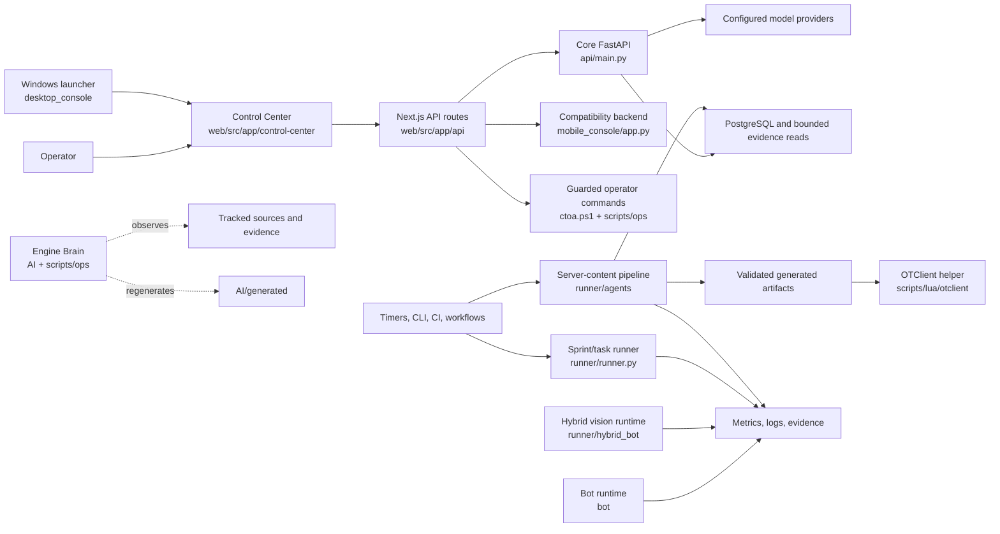
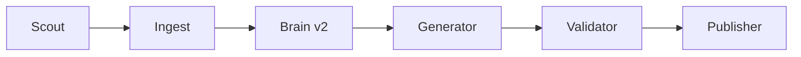

# CTOAi Architecture

Status: canonical system architecture.

This document describes the current CTOAi system: its deployable surfaces,
runtime pipelines, data ownership, trust boundaries, and extension rules. It
replaces the historical model of a fixed ten-agent runner. Agent count and
concurrency are runtime concerns, not architectural invariants.

## Document authority

Use the following documents together:

| Question | Source of truth |
| --- | --- |
| How do components interact? | This document |
| Which repository surface owns a job? | [Repo Schema](REPO_SCHEMA.md) |
| How is production deployed? | [Infrastructure Canonical](INFRASTRUCTURE_CANONICAL.md) |
| How do sprint gates and approvals work? | [Sprint Governance](SPRINT_GOVERNANCE.md) |
| What is the compact machine-oriented map? | [Engine Brain Architecture Index](../AI/ARCHITECTURE_INDEX.md) |
| What is the current operating status? | [README](../README.md) and generated Engine Brain evidence |

Generated files under `AI/generated/` report observed repository state. They do
not replace source code, configuration, or the contracts above.

## System context

CTOAi is an operations platform with a web control plane, API surfaces, agent
and bot runtimes, governance automation, and native OTClient integration.



Arrows describe allowed integration direction, not a requirement that every
deployment enables every component. Optional providers and runtimes must fail
closed or report degraded state rather than silently changing ownership.

## Architectural planes

| Plane | Responsibilities | Canonical surfaces |
| --- | --- | --- |
| Interface | Operator cockpit, chat, desktop entry, client-facing status | `web/`, `desktop_console/` |
| API and application | Authentication, chat, compatibility APIs, community and evidence endpoints | `api/`, `mobile_console/` |
| Agent execution | Content ingestion, planning, generation, validation, publishing | `runner/agents/`, `prompts/`, `scoring/`, `schemas/` |
| Runtime | Bot decisions, safe actions, sessions, hybrid vision and native helper behavior | `bot/`, `runner/hybrid_bot/`, `scripts/lua/otclient/` |
| Governance | Sprint state, approvals, CI gates, policies and release evidence | `runner/runner.py`, `workflows/`, `policies/`, `releases/` |
| Operations | Bootstrap, refresh, diagnostics, deployment and service health | `ctoa.ps1`, `scripts/ops/`, `deploy/` |
| Observability | Logs, telemetry, reports and generated repository maps | `runtime/`, `logs/`, `releases/evidence/`, `AI/generated/` |

The planes are ownership boundaries. They may share contracts, but a new UI,
API, or script must not become a second canonical implementation of an existing
job.

## Canonical components

### Control Center

`web/src/app/control-center` is the main operator cockpit. Its server routes in
`web/src/app/api/control-center/` expose snapshots, evidence, operations, and
guarded actions. Shared policy, authentication, redaction, timeout, and evidence
logic belongs in `web/src/lib/`; route handlers should remain thin.

Read-only status and evidence paths are distinct from state-changing actions.
The latter require explicit policy and authorization checks and must not accept
arbitrary commands, filesystem paths, or upstream URLs.

### API surfaces

`api/main.py` is the core FastAPI application. It owns health and status,
authentication, chat, OpenAI-compatible chat, community, safety, telemetry, and
release-evidence endpoints. `mobile_console/app.py` provides backend and legacy
compatibility contracts; it is not the canonical operator UI.

API adapters may translate transport formats, but business and security rules
must have one owner. Production startup must validate required authentication
configuration. Evidence reads are bounded and redacted before returning data.

### Sprint and task runner

`runner/runner.py` persists backlog and sprint state, advances the canonical
delivery lifecycle, executes approved work, and produces reports. State changes
must be atomic and reproducible. GitHub synchronization is an integration, not
the local source of truth for an in-progress state transition.

The canonical lifecycle is:

```text
NEW -> IN_PROGRESS -> IN_QA -> IN_CI_GATE -> WAITING_APPROVAL
    -> RELEASED | BLOCKED
```

Approval boundaries must remain explicit. A timer or agent may prepare a
decision but must not manufacture a human approval.

### Server-content agent pipeline

`runner/agents/orchestrator.py` executes crash-isolated stages in order:



The stages use `runner/agents/db.py` for durable coordination. Their high-level
contract is:

1. discover eligible servers;
2. ingest and normalize game data;
3. plan module work;
4. render candidate files;
5. validate quality and safety;
6. publish only when release criteria are satisfied.

Each stage records its own outcome and may fail independently. Publication must
consume validated output, never an unchecked generator result. Adding a stage
requires an explicit input/output contract, idempotency behavior, failure
recording, and focused tests.

### Bot runtimes

`bot/main.py` owns the local perception-decision-action loop, sessions, safety,
and telemetry. `runner/hybrid_bot/` owns the optional screenshot/template,
pathfinding, command, and performance pipeline. These surfaces may share schemas
and policy, but they must not bypass action safety or file-safety guards.

Native OTClient integration lives in `scripts/lua/otclient/`. The loader and
`ctoa_native_helper.lua` compose focused observer, planner, runtime, UI, and
vocation modules. Client-specific capabilities must be detected or configured;
code must not assume all OTClient forks expose the same APIs.

### Engine Brain and evidence

Engine Brain observes tracked source, ownership, gates, and evidence, then
regenerates compact indexes under `AI/generated/`. Its normal refresh path is
read-mostly and dry-run-first. It may report that a write tool is available, but
that does not authorize a live mutation.

`runtime/`, `logs/`, local databases, and generated diagnostics are operating
state. They are not authoritative source code and must not be committed unless a
specific evidence contract says otherwise.

## Core flows

### Operator action

```text
browser -> Control Center route -> authentication and policy
        -> read-only adapter or allowlisted action
        -> bounded result -> redaction -> audit/evidence -> response
```

### Chat request

```text
ChatWindow -> web chat route -> configured backend -> api/main.py
           -> provider adapter -> policy/quality handling -> streamed or JSON response
```

Provider selection is configuration. UI code must not embed provider secrets or
depend directly on one model vendor.

### Generated server artifact

```text
server discovery -> normalized database state -> planned module
                 -> generated candidate -> validation -> publication/evidence
```

Retries must be safe at stage boundaries. A partial generation is not a
published artifact.

### Runtime tick

```text
observe -> normalize state -> decide under policy -> execute guarded action
        -> record telemetry -> schedule next tick
```

Safety checks occur immediately before execution, using current state. A plan
validated against stale state is not sufficient authorization to act.

## Data ownership

| Data class | Owner | Persistence rule |
| --- | --- | --- |
| Source and contracts | Tracked repository files | Reviewed and versioned |
| Configuration defaults | Templates such as `.env.example` and deployment manifests | Versioned without secrets |
| Credentials and tokens | Environment or secret manager | Never committed or emitted in evidence |
| Agent coordination | PostgreSQL through `runner/agents/db.py` | Durable, migrated, bounded |
| Sprint/backlog state | Runner state contracts | Atomic writes; runtime copies stay local |
| Runtime telemetry | Runtime/logging surfaces | Retained and redacted by policy |
| Release evidence | `releases/evidence/` and governed docs evidence | Tracked only when a gate requires it |
| Engine Brain indexes | `AI/generated/` | Regenerated from current evidence |

Schema changes must update all known consumers. Configuration readers should
reject invalid security-critical values rather than guess a permissive default.

## Trust boundaries and invariants

1. **Browser to server:** authenticate privileged routes, enforce roles, validate
   request origin where applicable, and rate-limit exposed endpoints.
2. **Server to provider:** keep credentials server-side, use timeouts, bound
   payloads, and sanitize logged failures.
3. **Control Center to operations:** expose allowlisted actions only. Separate
   read-only, safe-write, guarded-write, and dangerous capabilities.
4. **Repository to runtime:** source and templates are versioned; secrets, logs,
   caches, local databases, and transient state are not.
5. **Generator to publisher:** validation and release criteria are mandatory
   boundaries.
6. **Planner to executor:** re-check current safety conditions before acting.
7. **External content to filesystem:** normalize identifiers and paths, prevent
   traversal, and write atomically inside an owned root.
8. **Engine Brain to live systems:** observation or dry-run evidence does not
   imply mutation authority.

Network listeners default to loopback unless the canonical deployment contract
explicitly places them behind an authenticated proxy. Proxy headers are trusted
only from configured proxies. Fixed host addresses do not belong in this
architecture document.

## Deployment topology

The repository supports a containerized production topology with PostgreSQL,
the core API, optional model services, and bot/runtime services. API containers
run `api.main:app`; bot containers run `bot.main`. Hostnames, ports, service
counts, and provider choices come from deployment configuration.

The web Control Center may be deployed independently from the Python services.
All cross-service URLs must be configured, validated, and protected against
server-side request forgery. See
[Infrastructure Canonical](INFRASTRUCTURE_CANONICAL.md) for current production
values and [Deployment](DEPLOYMENT.md) for procedures.

## Performance and reliability

- Bound filesystem evidence reads, request bodies, provider responses, and log
  output.
- Apply timeouts at network and process boundaries; surface degraded state.
- Keep pipeline stages idempotent and restartable, with durable status and
  failure recording.
- Use scheduling and database coordination for backpressure. Do not encode a
  fixed number of workers as a product invariant.
- Keep route handlers and orchestration layers thin; move reusable policy and
  transformations to owned modules.
- Measure latency, error rate, queue age, stage duration, and publish failures
  before adding caching or concurrency.
- Prefer atomic replacement for state and artifact writes so readers never see
  partial output.

No universal throughput or latency target is declared here. SLOs belong to the
deployment or product contract that can measure and enforce them.

## Validation by change type

| Change | Minimum validation |
| --- | --- |
| Python runtime/API/runner | Targeted tests, then `python -m pytest tests/ --ignore=tests/e2e -q` |
| Web Control Center | Relevant route/lib tests plus web lint/test commands |
| Sprint/release logic | Relevant `sprintNN_validate.py`, contract tests, then broad pytest |
| Deployment or service topology | Deployment smoke checks and Engine Brain doctor |
| Documentation or ownership | Link review, doc sync, secret guardrail, Engine Brain refresh |
| OTClient native modules | Loader/module contract checks against the supported fork profile |

`pre-commit run --all-files` remains the broad repository quality gate when the
environment supports every configured hook.

## Extension rules

Before adding a component:

1. identify its plane and single owner;
2. reuse the canonical surface for an existing job;
3. define input, output, persistence, retry, and authorization contracts;
4. define degraded and failure behavior;
5. add focused tests and observable evidence;
6. update this document only when component or trust-boundary relationships
   change;
7. update [Repo Schema](REPO_SCHEMA.md) when ownership changes.

The following are explicitly historical assumptions and must not guide new
implementation: a fixed ten-agent fleet, fixed production IP addresses, a
single mandatory model provider, publication without an independent validation
stage, or runtime directories as authoritative repository state.
