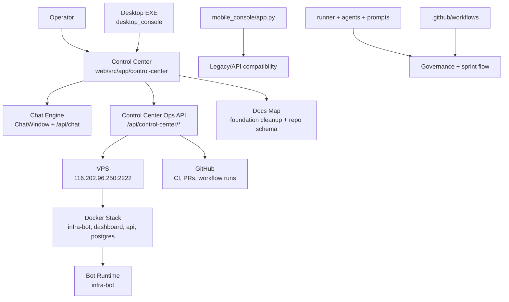
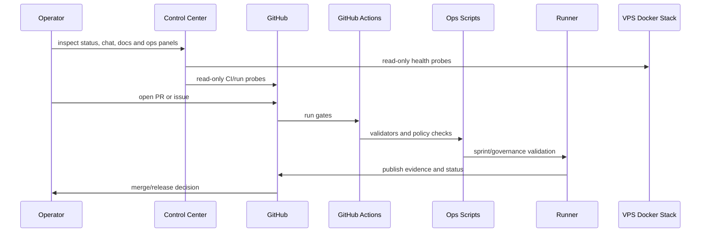

# CTOAi Repo Schema

Status: refreshed on 2026-06-29.

This document is the current repository map and foundation contract for CTOAi. It replaces the older schema that treated `mobile_console` and `desktop_console` as the main execution surfaces. The current direction is simpler:

```text
One job, one canonical surface.
```

## What CTOAi is

CTOAi is an AI operations platform. Its current product body has several planes:

| Plane | Meaning |
| --- | --- |
| Control Center | Main operator cockpit and visual command surface. |
| Runtime Plane | Bot runtime, agents, scheduler, input backend and execution state. |
| Ops Plane | VPS, Docker, deploys, rebuilds, disk, logs and service health. |
| Governance Plane | Approvals, CI gates, evidence, policy and release decisions. |
| Telemetry Plane | Metrics, monitoring, reports, alerts and runtime visibility. |
| Interfaces | Web cockpit, Windows launcher, chat surface and API clients. |

## Canonical surfaces

| Job | Canonical surface | Notes |
| --- | --- | --- |
| Main operator cockpit | `web/src/app/control-center` | Daily work starts here. |
| Chat engine | `web/src/components/ChatWindow.tsx` | Reused by standalone chat and Control Center. |
| Control Center chat wrapper | `web/src/components/ControlCenterChatPanel.tsx` | Wrapper, not a separate chat product. |
| Ops status API | `web/src/app/api/control-center/*` | Read-only VPS/Docker/Bot/GitHub visibility. |
| Windows entry point | `desktop_console` | Launcher/profile/update shell, not the main cockpit. |
| Backend/API compatibility | `mobile_console/app.py` | Backend and legacy API provider. |
| Operator commands | `ctoa.ps1` and guarded scripts | Command engine under UI/API wrappers. |
| Production runtime | VPS Docker stack | Live runtime target. |

## Layered architecture



## Top-level ownership map

| Path | Owner role | Current decision |
| --- | --- | --- |
| `web/` | Main web UI, chat, Control Center and web API routes | Canonical cockpit |
| `desktop_console/` | Windows desktop app, updater, endpoint profiles | Wrapper/launcher |
| `mobile_console/` | FastAPI backend and legacy static console routes | Backend-only plus legacy UI |
| `api/` | API entry points and chat/system integration | Active backend surface |
| `bot/` | Bot runtime, dashboard reference and bot-specific services | Runtime Plane |
| `deploy/` | VPS/systemd/Docker deployment definitions | Ops Plane |
| `scripts/` | Local and VPS automation, validators and helpers | Command engine |
| `ctoa.ps1` | Windows operator command surface | Command engine |
| `runner/` | Agent/sprint orchestration runtime | Governance/runtime |
| `agents/` | Agent definitions and role specs | Governance/runtime |
| `prompts/` | BRAVE(R) templates and prompt packs | Prompt engine |
| `scoring/` | Tool advisor and scoring logic | Governance/runtime |
| `workflows/` | Sprint and delivery flow contracts | Governance Plane |
| `policies/` | CI/security/governance policy contracts | Governance Plane |
| `.github/workflows/` | GitHub Actions gates and automation | CI/Governance |
| `tests/` | Python, JS and integration coverage | Validation |
| `runtime/` | Generated runtime state and CI artifacts | Evidence/runtime state |
| `docs/` | Architecture, runbooks, evidence and cleanup maps | Documentation |
| `docs/site/live-dashboard.html` | Old static live dashboard | Legacy/reference |
| `bot/dashboard/app.py` | Bot-specific status dashboard | Legacy/reference until absorbed |

## Responsibility tree

```text
CTOAi/
|- web/                         canonical Control Center, chat and web API routes
|  |- src/app/control-center/    main operator cockpit
|  |- src/app/api/control-center/ops/  read-only ops status endpoint
|  |- src/components/ChatWindow.tsx    canonical chat UI engine
|  |- src/components/ControlCenterShell.tsx
|  |- src/components/ControlCenterChatPanel.tsx
|  |- src/components/ControlCenterOpsGrid.tsx
|  |- src/components/ControlCenterDetailPanels.tsx
|- desktop_console/             Windows launcher/profile/updater shell
|- mobile_console/              backend API and legacy UI compatibility
|- api/                         API integration surface
|- bot/                         bot runtime and reference bot dashboard
|- deploy/                      VPS, Docker and service deployment definitions
|- scripts/                     ops automation, validators and helper scripts
|- ctoa.ps1                     Windows command engine
|- runner/                      orchestration runtime
|- agents/                      agent definitions
|- prompts/                     BRAVE(R) prompt templates
|- scoring/                     tool scoring and advisor logic
|- workflows/                   sprint flow contracts
|- policies/                    governance policy contracts
|- .github/workflows/           CI and automation gates
|- tests/                       validation suite
|- runtime/                     generated evidence and runtime state
|- docs/                        architecture, runbooks and cleanup decisions
```

## Interface consolidation map

| Surface | Old role | New role |
| --- | --- | --- |
| `web/src/app/control-center` | New cockpit | Main cockpit |
| `web/src/app/page.tsx` | Standalone chat/login | Transitional surface until Control Center owns login/session flow |
| `desktop_console/app.py` | Full desktop console | Windows launcher/wrapper |
| `mobile_console/static/index.html` | Operational console UI | Legacy UI until parity in Control Center |
| `docs/site/live-dashboard.html` | Static live dashboard | Legacy reference until absorbed |
| `bot/dashboard/app.py` | Bot status dashboard | Dev/runtime reference until absorbed |
| `scripts/windows/open-control-center.ps1` | New helper | Lightweight Control Center opener |

## Current Control Center endpoints

| Endpoint | Purpose | Risk class |
| --- | --- | --- |
| `GET /api/control-center` | Backend reachability probe | Read-only |
| `GET /api/control-center/ops` | VPS disk, Docker, bot runtime and GitHub CI details | Read-only |
| `GET /api/control-center/evidence` | Release evidence, local quality, cost report and action audit summary | Read-only |
| `GET /api/control-center/legacy` | Read-only migration panel for old console capabilities | Read-only |
| `POST /api/chat` | Chat completion route used by `ChatWindow` | User-initiated chat |

## Current ops probes

| Tile/panel | Probe |
| --- | --- |
| VPS disk | `ssh df -h /` and `ssh df -B1 /` |
| Docker store | `docker system df` on VPS |
| Docker images | `docker images --format '{{json .}}'` |
| Bot runtime | `docker ps` filtered by `infra-bot` |
| Bot logs preview | `docker logs --tail 40 infra-bot-1` |
| GitHub CI | `gh run list --repo famatyyk/CTOAi` |

These probes are read-only. Write operations such as restart, rebuild, cleanup or deploy need explicit guarded actions before they appear in the UI.

## Delivery and governance flow



## Governance status mapping

Canonical sprint/task flow:

```text
NEW -> IN_PROGRESS -> IN_QA -> IN_CI_GATE -> WAITING_APPROVAL -> RELEASED | BLOCKED
```

| Status | Operational meaning | Primary ownership |
| --- | --- | --- |
| `NEW` | Task exists but is not scheduled yet. | `runner/`, `workflows/` |
| `IN_PROGRESS` | Work is actively scheduled/executed. | `runner/` |
| `IN_QA` | Implementation is ready for regression checks. | `tests/`, `scripts/ops/` |
| `IN_CI_GATE` | CI/security/policy gates are running or blocked. | `.github/workflows/`, `policies/` |
| `WAITING_APPROVAL` | Automated wave passed; manual sign-off needed. | `workflows/`, sprint docs |
| `RELEASED` | Accepted and recorded as released. | sprint release pack |
| `BLOCKED` | Held by a policy, test, infra or approval blocker. | runner reports and gate evidence |

## Validation chain

| Scope | Command/source |
| --- | --- |
| Frontend web tests | `npm test` in `web/` |
| Python tests | `python -m pytest` |
| Sprint validators | `scripts/ops/sprint0xx_validate.py` |
| Repo hygiene | `scripts/ops/repo_hygiene_audit.py` |
| CI gates | `.github/workflows/` |
| VPS status | Control Center ops endpoint and VPS runbooks |

## Cleanup references

| Document | Purpose |
| --- | --- |
| `docs/CTOAI_FOUNDATION_CLEANUP.md` | Active cleanup decision table |
| `docs/CTOAI_LEGACY_FEATURE_INVENTORY.md` | Migration inventory for legacy UI capabilities |
| `docs/CTOAI_COMMAND_RISK_MODEL.md` | Risk classes and confirmation model for operational commands |
| `docs/CTOAI_SURFACE_CONSOLIDATION.md` | Rule for one canonical surface per job |
| `docs/CTOAI_CONTROL_CENTER_PHASE1.md` | Control Center implementation history |
| `docs/ARCHITECTURE.md` | Older high-level architecture, still useful but not the current interface map |
| `docs/MOBILE_CONSOLE.md` | Mobile console/service runbook |

## Deprecated assumptions

The old assumption below is no longer current:

```text
mobile_console and desktop_console are the main execution surfaces.
```

The current assumption is:

```text
Control Center is the main operator cockpit.
desktop_console is a Windows launcher/wrapper.
mobile_console is backend/API compatibility plus legacy UI until parity.
```

## Quick navigation

| Need | Start here |
| --- | --- |
| Daily operator cockpit | `web/src/app/control-center` |
| Chat implementation | `web/src/components/ChatWindow.tsx` |
| Control Center shell | `web/src/components/ControlCenterShell.tsx` |
| Ops endpoint | `web/src/app/api/control-center/ops/route.ts` |
| Windows launcher | `desktop_console/` and `scripts/windows/open-control-center.ps1` |
| VPS/mobile service runbook | `docs/MOBILE_CONSOLE.md` |
| Foundation cleanup | `docs/CTOAI_FOUNDATION_CLEANUP.md` |
