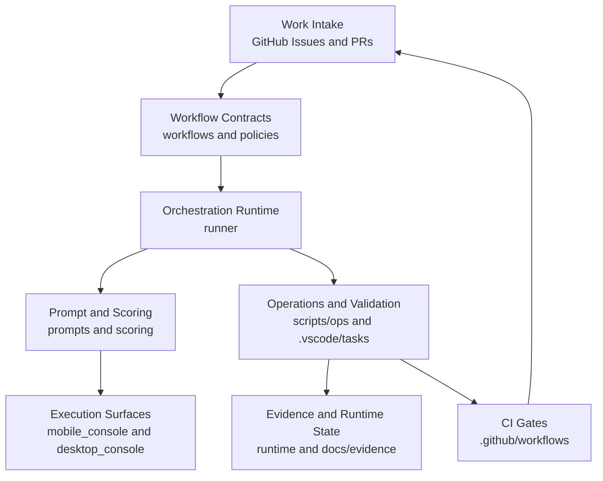
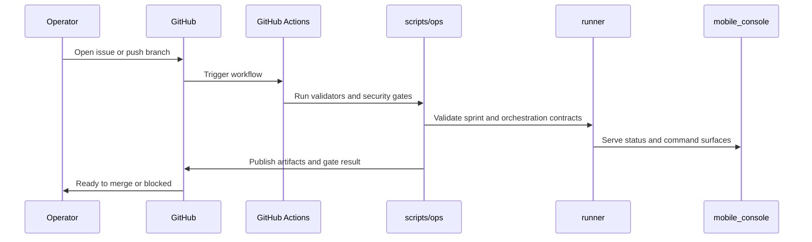
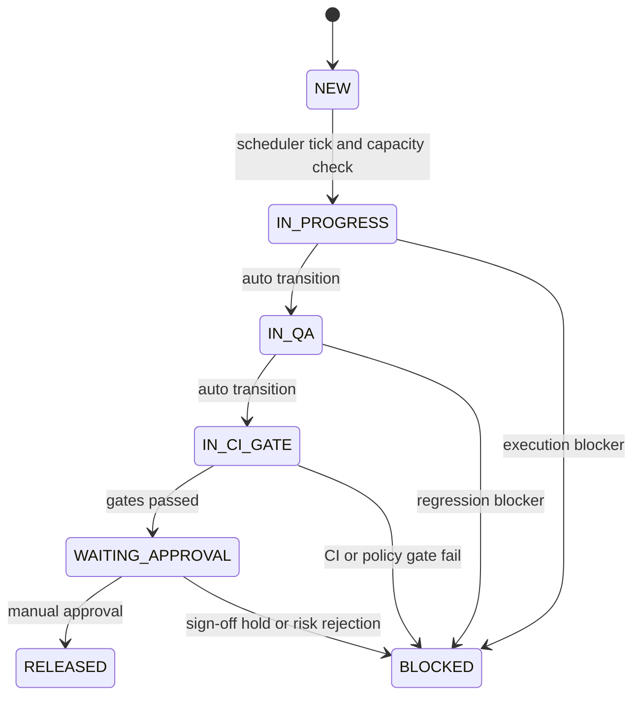

# CTOAi Repo Schema

## Purpose

This document is an operational schema of the repository: what each top-level area owns, how execution flows through the system, and where governance gates are enforced.

## Layered Architecture



## Top-Level Ownership Map

- agents/: Agent roster and static definitions.
- prompts/: BRAVER prompt templates and domain packs.
- scoring/: Tool ranking rules and advisor logic.
- runner/: Execution and control-plane runtime.
- workflows/: Sprint backlog and delivery flow contracts.
- policies/: Governance policy packs used by gates.
- scripts/ops/: Validation, release, VPS automation, and scheduler scripts.
- .github/workflows/: CI pipelines and quality/security gates.
- mobile_console/: FastAPI operational control surface.
- desktop_console/: Desktop client and update client.
- tests/: Unit and integration validation of contracts and behavior.
- runtime/: Generated CI artifacts and operational state.
- docs/: Architecture, runbooks, governance, and evidence.
- core/: Protected assets and integrity manifest.
- config/ and product/: Product metadata and bootstrap config.

## Responsibility Tree

```text
CTOAi/
|- .github/workflows/        CI and gate orchestration
|- .vscode/tasks.json        Local canonical run and validate tasks
|- agents/                   Agent definitions and registry
|- prompts/                  BRAVER templates and prompt packs
|- scoring/                  Tool advisor and scoring rules
|- workflows/                Sprint backlog and delivery flow YAML
|- policies/                 CI and governance policy contracts
|- runner/                   Runtime orchestrator and execution logic
|- scripts/ops/              Validators, release ops, VPS and schedulers
|- mobile_console/           API and static UI for operational console
|- desktop_console/          Desktop app and update channel logic
|- tests/                    Behavioral and contract tests
|- runtime/                  Output artifacts, reports, gate JSON
|- docs/                     Architecture and operational documentation
|- core/                     Protected files and integrity controls
|- config/ and product/      Product config and manifest metadata
|- deploy/                   Deployment scripts and service definitions
```

## Control and Delivery Flow



## Canonical Validation Chain

- CTOA: Run All Tests
- CTOA: Sprint-040 Validate (or active sprint validator)
- CTOA: Launch Pack

## Governance Status Mapping v2

Canonical flow:

NEW -> IN_PROGRESS -> IN_QA -> IN_CI_GATE -> WAITING_APPROVAL -> RELEASED | BLOCKED

### State semantics and source-of-truth files

| Status | Operational meaning | Primary file ownership |
| --- | --- | --- |
| NEW | Task exists in backlog and is not scheduled yet. | runner/pipeline/scheduler.py, runner/runner.py |
| IN_PROGRESS | Task is scheduled by the hourly planner and actively executed. | runner/runner.py |
| IN_QA | Implementation is complete enough for QA regression checks. | runner/runner.py, scripts/ops/sprint0xx_validate.py |
| IN_CI_GATE | Automated quality/security gates are running or blocked. | runner/runner.py, .github/workflows/ctoa-pipeline.yml, workflows/sprint-0xx-delivery-flow.yaml |
| WAITING_APPROVAL | Wave-1 is done; awaiting manual Wave-2 sign-off. | runner/runner.py, workflows/sprint-0xx-delivery-flow.yaml |
| RELEASED | Manual approval granted and release state accepted. | runner/runner.py |
| BLOCKED | Task cannot progress because of gate/policy/reliability blocker. | runner/runner.py, workflows/sprint-0xx-delivery-flow.yaml |

### Transition implementation map

| Transition | Runtime implementation | Contract / policy hook |
| --- | --- | --- |
| NEW -> IN_PROGRESS | scheduler candidate selection + tick scheduling | runner/pipeline/scheduler.py, runner/runner.py |
| IN_PROGRESS -> IN_QA | timed auto transition | runner/runner.py (AUTO_TRANSITIONS) |
| IN_QA -> IN_CI_GATE | timed auto transition | runner/runner.py (AUTO_TRANSITIONS) |
| IN_CI_GATE -> WAITING_APPROVAL | timed auto transition after gate pass window | runner/runner.py (AUTO_TRANSITIONS) |
| WAITING_APPROVAL -> RELEASED | manual approve action | runner/runner.py (approve_task) |
| any active state -> BLOCKED | blocker capture and hold logic | workflows/sprint-0xx-delivery-flow.yaml on_fail rules + runner report/status views |

### Concrete workflow bindings (current sprint examples)

- Sprint gate hold in CI phase:
    workflows/sprint-042-delivery-flow.yaml uses on_fail rule that keeps sprint in IN_CI_GATE and escalates blockers.
- Sprint release hold before manual sign-off:
    workflows/sprint-042-delivery-flow.yaml uses on_fail rule that keeps tasks in WAITING_APPROVAL.
- Backlog acceptance requiring approval/release states:
    workflows/backlog-sprint-044.yaml requires tasks to be in WAITING_APPROVAL or RELEASED before final sign-off acceptance.

### Governance flow diagram



## Operational Command Map v3

This map binds local operational tasks to their validator or ops command path and the expected artifact output location.

| VS Code task (tasks.json) | Validator or ops command | Output artifact |
| --- | --- | --- |
| CTOA: Run All Tests | python -m pytest tests/ --ignore=tests/e2e -v | none (terminal evidence only) |
| CTOA: Check Update Gate | scripts/ops/ctoa_update_gate.py | none (gate decision in terminal or CI context) |
| CTOA: Launch Pack | scripts/ops/ctoa_update_gate.py + launch dry-run checks | none (launch decision in terminal) |
| CTOA: Repo Hygiene Audit | scripts/ops/repo_hygiene_audit.py --json-out runtime/repo-hygiene/latest.json | runtime/repo-hygiene/latest.json |
| CTOA: Nightly Stability Batch | scripts/ops/nightly_stability.py --json-out runtime/ci-artifacts/nightly-stability-YYYYMMDD.json | runtime/ci-artifacts/nightly-stability-YYYYMMDD.json |
| CTOA: Sprint-040 Validate | scripts/ops/sprint040_validate.py --run-tests --json-out runtime/ci-artifacts/sprint-040-validation.json | runtime/ci-artifacts/sprint-040-validation.json |
| CTOA: Sprint-041 Validate | scripts/ops/sprint041_validate.py --run-tests --json-out runtime/ci-artifacts/sprint-041-validation.json | runtime/ci-artifacts/sprint-041-validation.json |
| CTOA: Sprint-042 Validate | scripts/ops/sprint042_validate.py --run-tests --json-out runtime/ci-artifacts/sprint-042-validation.json | runtime/ci-artifacts/sprint-042-validation.json |

### Wave task chaining model

| Wave task | Composition | Expected artifact outcome |
| --- | --- | --- |
| CTOA: Sprint-040 Wave-1 Run | Run All Tests -> Sprint-040 Validate -> Launch Pack | sprint-040 validation JSON + launch pass/fail signal |
| CTOA: Sprint-041 Wave-1 Run | Run All Tests -> Sprint-041 Validate -> Launch Pack | sprint-041 validation JSON + launch pass/fail signal |
| CTOA: Sprint-042 Wave-1 Run | Run All Tests -> Sprint-042 Validate -> Launch Pack | sprint-042 validation JSON + launch pass/fail signal |

### Artifact conventions

- Sprint validator artifacts: runtime/ci-artifacts/sprint-0xx-validation.json
- Nightly stability artifacts: runtime/ci-artifacts/nightly-stability-YYYYMMDD.json
- Repo hygiene artifacts: runtime/repo-hygiene/latest.json
- Composite Wave-1 tasks: aggregate outputs from their dependency chain, no dedicated single JSON by default

## Quick Navigation

- Architecture baseline: docs/ARCHITECTURE.md
- Governance model: docs/SPRINT_GOVERNANCE.md
- Core guardrails: docs/CORE_GUARDRAILS.md
- Local setup and tasks: docs/LOCAL_SETUP.md
