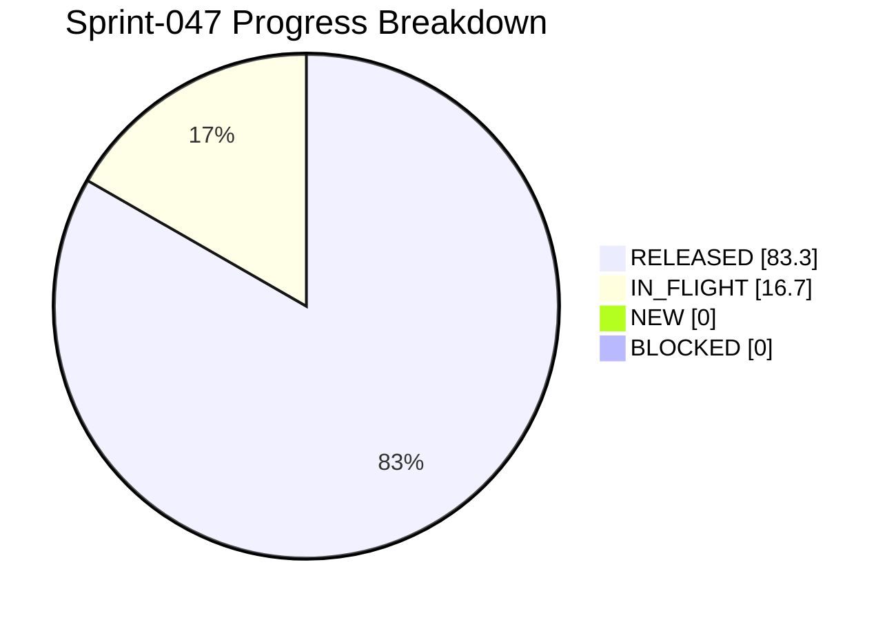

# Project Progress Diagram - Sprint-047

Generated: 2026-05-15T14:28:06Z
Backlog: sprint-047
Source: C:/Users/zycie/CTOAi/workflows/backlog-sprint-047.yaml
Completion: 83.3% (5/6 RELEASED)



## Status Split

| Bucket | Tasks | Percent |
|---|---|---|
| RELEASED | 5 | 83.3% |
| IN_FLIGHT | 1 | 16.7% |
| NEW | 0 | 0.0% |
| BLOCKED | 0 | 0.0% |

## Raw Status Counts

- NEW: 0
- IN_PROGRESS: 0
- IN_QA: 0
- IN_CI_GATE: 0
- WAITING_APPROVAL: 1
- RELEASED: 5
- BLOCKED: 0

## Refresh Command

```bash
python scripts/ops/project_progress_diagram.py --backlog C:/Users/zycie/CTOAi/workflows/backlog-sprint-047.yaml --state C:/Users/zycie/CTOAi/runtime/task-state.yaml --output C:/Users/zycie/CTOAi/docs/history/sprints/SPRINT-047-PROGRESS.md --project-name Sprint-047
```

