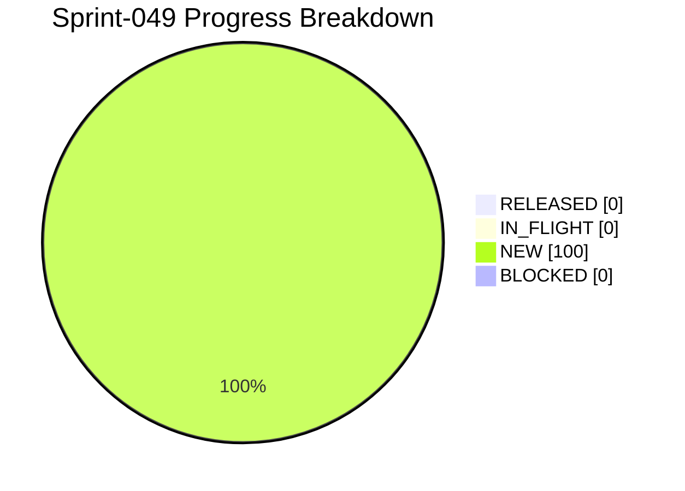

# Project Progress Diagram - Sprint-049

Generated: 2026-05-22T09:09:28Z
Backlog: sprint-049
Source: C:/Users/zycie/CTOAi/workflows/backlog-sprint-049.yaml
Completion: 0.0% (0/6 RELEASED)



## Status Split

| Bucket | Tasks | Percent |
|---|---|---|
| RELEASED | 0 | 0.0% |
| IN_FLIGHT | 0 | 0.0% |
| NEW | 6 | 100.0% |
| BLOCKED | 0 | 0.0% |

## Raw Status Counts

- NEW: 6
- IN_PROGRESS: 0
- IN_QA: 0
- IN_CI_GATE: 0
- WAITING_APPROVAL: 0
- RELEASED: 0
- BLOCKED: 0

## Refresh Command

```bash
python scripts/ops/project_progress_diagram.py --backlog C:/Users/zycie/CTOAi/workflows/backlog-sprint-049.yaml --state C:/Users/zycie/CTOAi/runtime/task-state.yaml --output C:/Users/zycie/CTOAi/docs/history/sprints/SPRINT-049-PROGRESS.md --project-name Sprint-049
```

## CTOA-253 Evidence (Legacy Validator Compatibility)

- Date: 2026-05-24
- Scope: Wire missing local tasks required by legacy validators for Sprint-043 and Sprint-044.
- Changes:
- Added tasks in `.vscode/tasks.json`: `CTOA: Sprint-043 Validate`, `CTOA: Sprint-043 Wave-1 Run`, `CTOA: Sprint-044 Validate`, `CTOA: Sprint-044 Wave-1 Run`.
- Validation outcomes: `sprint043_validate` PASS 11/11, `sprint044_validate` PASS 11/11.
- Result: Legacy flow artifacts do not crash validators, and local task gate compatibility is restored on mainline.
