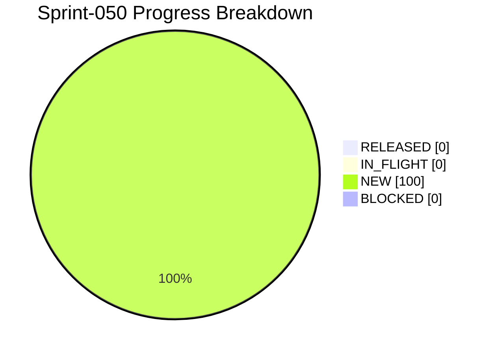

# Project Progress Diagram - Sprint-050

Generated: 2026-05-24T21:27:46Z
Backlog: sprint-050
Source: C:/Users/zycie/Documents/GitHub/CTOAi/workflows/backlog-sprint-050.yaml
Completion: 0.0% (0/6 RELEASED)



## Status Split

| Bucket | Tasks | Percent |
|---|---|---|
| RELEASED | 0 | 0.0% |
| IN_FLIGHT | 0 | 0.0% |
| NEW | 6 | 100.0% |
| BLOCKED | 0 | 0.0% |

## Raw Status Counts

- NEW: 6
- IN_PROGRESS: 0
- IN_QA: 0
- IN_CI_GATE: 0
- WAITING_APPROVAL: 0
- RELEASED: 0
- BLOCKED: 0

## Refresh Command

```bash
python scripts/ops/project_progress_diagram.py --backlog C:/Users/zycie/Documents/GitHub/CTOAi/workflows/backlog-sprint-050.yaml --state C:/Users/zycie/Documents/GitHub/CTOAi/runtime/task-state.yaml --output C:/Users/zycie/Documents/GitHub/CTOAi/docs/history/sprints/SPRINT-050-PROGRESS.md --project-name Sprint-050
```

## CTOA-259 Evidence (Sprint-050 Validator + Wave-1 Chain)

- Date: 2026-05-24
- Scope: Execute Sprint-050 Wave-1 chain post-commit and confirm all gates are green.
- Gate outcomes:
- `CTOA: Run All Tests` PASS (`168 passed, 5 skipped`).
- `CTOA: Sprint-050 Validate` PASS (`14/14` checks passed).
- `CTOA: Launch Pack` PASS (`launch_allowed`, `Launch dry-run PASS`).
- Runtime artifact path: `runtime/ci-artifacts/sprint-050-validation.json`.
- Result: Sprint-050 Wave-1 chain is operational and validator wiring is confirmed on `main`.

## CTOA-260 Evidence (Approval Observability + Operator Guidance)

- Date: 2026-05-24
- Scope: Harden approval queue observability and make closure path auditable.
- Changes:
- Added Sprint-050 approval closure checklist in `docs/VALIDATION_CHECKLIST.md`.
- Added minimal evidence bundle requirements for approval actions.
- Added approval failure triage guidance for queue visibility and state transition persistence.
- Tracked evidence: `releases/evidence/sprint-050/CTOA-260.md`.
- Result: Approval flow from `WAITING_APPROVAL` to `RELEASED` is explicit and operator-auditable.

## CTOA-261 Evidence (Runtime Evidence Promotion Rules)

- Date: 2026-05-24
- Scope: Define deterministic policy for promoting release-significant runtime artifacts.
- Changes:
- Added Sprint-050 evidence promotion policy in `docs/REPO_HYGIENE_POLICY.md`.
- Documented required promotion classes, runtime-only classes, canonical targets, and promotion workflow.
- Tracked evidence: `releases/evidence/sprint-050/CTOA-261.md`.
- Result: Sign-off-critical artifacts have explicit promotion rules and canonical tracked destinations.
