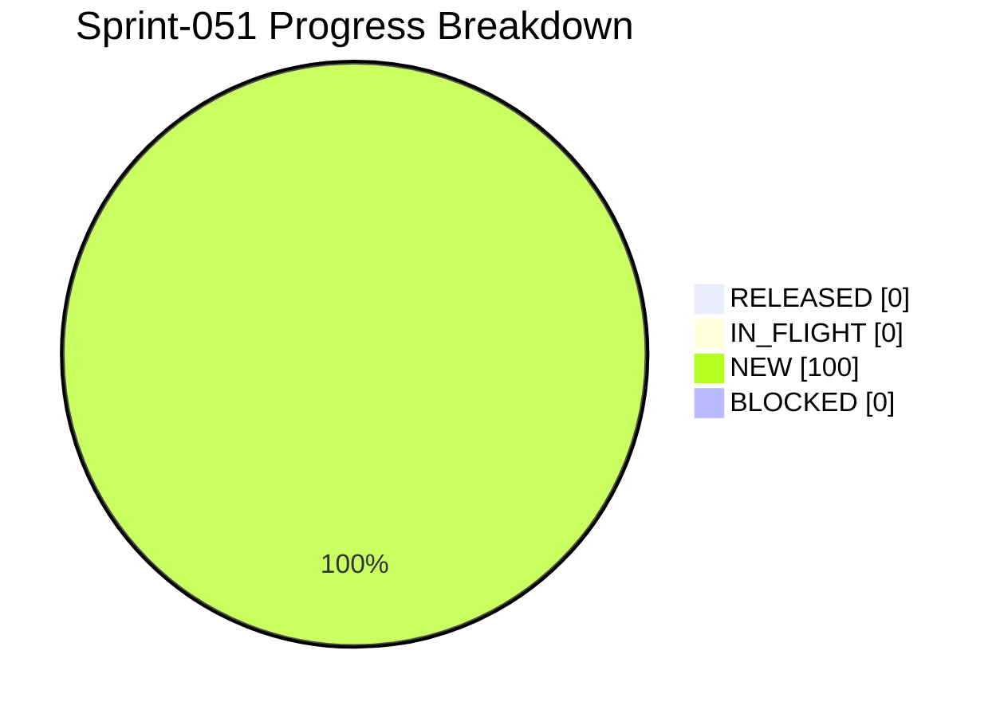

# Project Progress Diagram - Sprint-051

Generated: 2026-05-24T21:45:02Z
Backlog: sprint-051
Source: C:/Users/zycie/Documents/GitHub/CTOAi/workflows/backlog-sprint-051.yaml
Completion: 0.0% (0/6 RELEASED)



## Status Split

| Bucket | Tasks | Percent |
|---|---|---|
| RELEASED | 0 | 0.0% |
| IN_FLIGHT | 0 | 0.0% |
| NEW | 6 | 100.0% |
| BLOCKED | 0 | 0.0% |

## Raw Status Counts

- NEW: 6
- IN_PROGRESS: 0
- IN_QA: 0
- IN_CI_GATE: 0
- WAITING_APPROVAL: 0
- RELEASED: 0
- BLOCKED: 0

## Refresh Command

```bash
python scripts/ops/project_progress_diagram.py --backlog C:/Users/zycie/Documents/GitHub/CTOAi/workflows/backlog-sprint-051.yaml --state C:/Users/zycie/Documents/GitHub/CTOAi/runtime/task-state.yaml --output C:/Users/zycie/Documents/GitHub/CTOAi/docs/history/sprints/SPRINT-051-PROGRESS.md --project-name Sprint-051
```

## CTOA-266 Evidence (Runtime State Synchronization Hardening)

- Date: 2026-05-24
- Scope: Harden post-wave runtime state synchronization checks and closure guidance.
- Changes:
- Added Sprint-051 state synchronization operator checklist in `docs/VALIDATION_CHECKLIST.md`.
- Added required pre/post report snapshots and explicit drift statement in evidence bundle.
- Added state-sync failure triage path for backlog scope and approval mismatch cases.
- Tracked evidence: `releases/evidence/sprint-051/CTOA-266.md`.
- Result: Operator closure path now explicitly includes runtime state/evidence synchronization checks.

## CTOA-267 Evidence (Tracked Evidence Continuity)

- Date: 2026-05-24
- Scope: Enforce continuity of tracked sign-off artifacts for Sprint-051.
- Changes:
- Added Sprint-051 continuity addendum in `docs/REPO_HYGIENE_POLICY.md`.
- Declared canonical Sprint-051 tracked evidence targets and continuity check condition.
- Tracked evidence: `releases/evidence/sprint-051/CTOA-267.md`.
- Result: Sprint-051 sign-off package has explicit continuity and promotion requirements.

## CTOA-268 Evidence (Sprint-051 Wave-1 Execution)

- Date: 2026-05-24
- Scope: Execute Wave-1 chain and publish complete gate outcomes with residual risk notes.
- Gate outcomes:
- `CTOA: Run All Tests` PASS (`168 passed, 5 skipped`).
- `CTOA: Sprint-051 Validate` PASS (`14/14` checks passed).
- `CTOA: Launch Pack` PASS (`launch_allowed`, `Launch dry-run PASS`).
- `python scripts/ops/core_guard.py --check` PASS.
- Runtime artifact: `runtime/ci-artifacts/sprint-051-wave1-run.log`.
- Tracked evidence: `releases/evidence/sprint-051/CTOA-268.md`.
- Residual risk: runtime task-state still reports Sprint-051 tasks as `NEW` and needs operational state transition sync.
- Result: Wave-1 gates are green and evidence package is complete for sign-off.

## CTOA-269 Evidence (Sign-Off + Sprint-052 Handoff)

- Date: 2026-05-24
- Scope: Publish Sprint-051 closure decision and actionable Sprint-052 handoff.
- Sign-off memo recorded: `releases/evidence/sprint-051/CTOA-269.md`.
- Handoff focus:
- Add deterministic post-wave state reconciliation to persist task transitions.
- Extend validator coverage for automatic state/evidence mismatch detection.
- Keep tracked evidence continuity checks mandatory before release closure.
- Result: Sprint-051 closure package and Sprint-052 handoff recommendations are documented and auditable.
