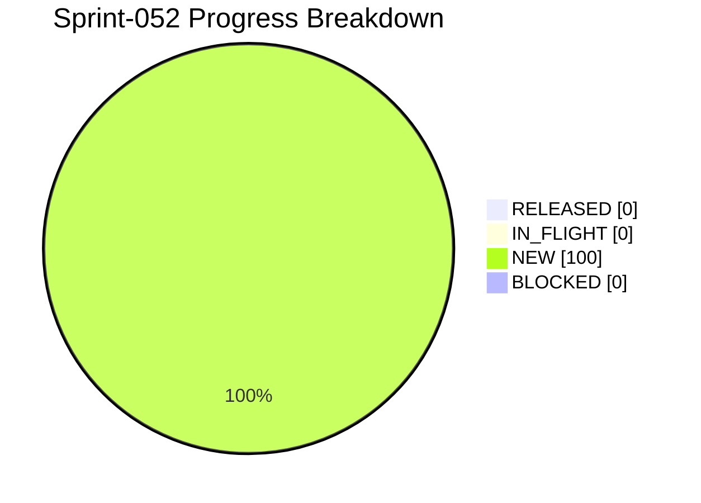

# Project Progress Diagram - Sprint-052

Generated: 2026-05-24T21:59:08Z
Backlog: sprint-052
Source: C:/Users/zycie/Documents/GitHub/CTOAi/workflows/backlog-sprint-052.yaml
Completion: 0.0% (0/6 RELEASED)



## Status Split

| Bucket | Tasks | Percent |
| --- | --- | --- |
| RELEASED | 0 | 0.0% |
| IN_FLIGHT | 0 | 0.0% |
| NEW | 6 | 100.0% |
| BLOCKED | 0 | 0.0% |

## Raw Status Counts

- NEW: 6
- IN_PROGRESS: 0
- IN_QA: 0
- IN_CI_GATE: 0
- WAITING_APPROVAL: 0
- RELEASED: 0
- BLOCKED: 0

## Refresh Command

```bash
python scripts/ops/project_progress_diagram.py --backlog C:/Users/zycie/Documents/GitHub/CTOAi/workflows/backlog-sprint-052.yaml --state C:/Users/zycie/Documents/GitHub/CTOAi/runtime/task-state.yaml --output C:/Users/zycie/Documents/GitHub/CTOAi/docs/history/sprints/SPRINT-052-PROGRESS.md --project-name Sprint-052
```

## CTOA-270 Evidence (Kickoff Baseline)

- Date: 2026-05-24
- Scope: Publish Sprint-052 baseline artifacts and scope lock.
- Delivered artifacts:
- `workflows/backlog-sprint-052.yaml`
- `workflows/sprint-052-delivery-flow.yaml`
- `docs/history/sprints/SPRINT-052.md`
- Result: Sprint-052 kickoff package is published and executable.

## CTOA-271 Evidence (Validator + Wave-1 Wiring)

- Date: 2026-05-24
- Scope: Wire Sprint-052 validator, local tasks, and CI gate.
- Validation outcome: `CTOA: Sprint-052 Validate` PASS (`16/16` checks passed).
- CI wiring: sprint-052 delivery gate and evidence upload block added in pipeline.
- Result: Sprint-052 validation chain is operational.

## CTOA-272 Evidence (Automatic Post-Wave-1 State Sync)

- Date: 2026-05-24
- Scope: Add deterministic state sync step after Wave-1 chain.
- Implementation:
- `scripts/ops/sprint_state_sync.py`
- Local task `CTOA: Sprint-052 State Sync`
- Wave-1 chain dependency updated to include state sync.
- Runtime verification snapshot: sprint-052 report shows `RELEASED: 6/6` after Wave-1.
- Tracked evidence: `releases/evidence/sprint-052/CTOA-272.md`.

## CTOA-273 Evidence (State/Evidence Mismatch Gate)

- Date: 2026-05-24
- Scope: Add critical mismatch gate to Sprint-052 validator.
- Implementation: `state_evidence_alignment` check in `scripts/ops/sprint052_validate.py`.
- Gate behavior: if sprint doc is `RELEASED` and runtime state is not aligned, validator fails with mismatch counts.
- Tracked evidence: `releases/evidence/sprint-052/CTOA-273.md`.

## CTOA-274 Evidence (Sprint-052 Wave-1 Execution)

- Date: 2026-05-25
- Scope: Execute Wave-1 chain and publish complete gate outcomes with aligned state evidence.
- Gate outcomes:
- `CTOA: Run All Tests` PASS (`168 passed, 5 skipped`).
- `CTOA: Sprint-052 Validate` PASS (`16/16` checks passed).
- `CTOA: Launch Pack` PASS (`launch_allowed`, `Launch dry-run PASS`).
- `python scripts/ops/core_guard.py --check` PASS.
- `CTOA: Sprint-052 State Sync` PASS (`released=6/6`).
- Runtime artifact: `runtime/ci-artifacts/sprint-052-wave1-run.log`.
- Tracked evidence: `releases/evidence/sprint-052/CTOA-274.md`.
- Residual risk: none.
- Result: Wave-1 chain is green and runtime state is aligned with governance evidence.

## CTOA-275 Evidence (Sign-Off + Sprint-053 Handoff)

- Date: 2026-05-25
- Scope: Publish Sprint-052 closure and actionable Sprint-053 handoff recommendations.
- Sign-off memo recorded: `releases/evidence/sprint-052/CTOA-275.md`.
- Handoff focus:
- Add dry-run option to state sync script for safer operational previews.
- Add CI assertion for RELEASED docs gated by sync+mismatch pass.
- Keep tracked evidence continuity checks mandatory for sign-off artifacts.
- Result: Sprint-052 closure package and Sprint-053 handoff are documented and auditable.
