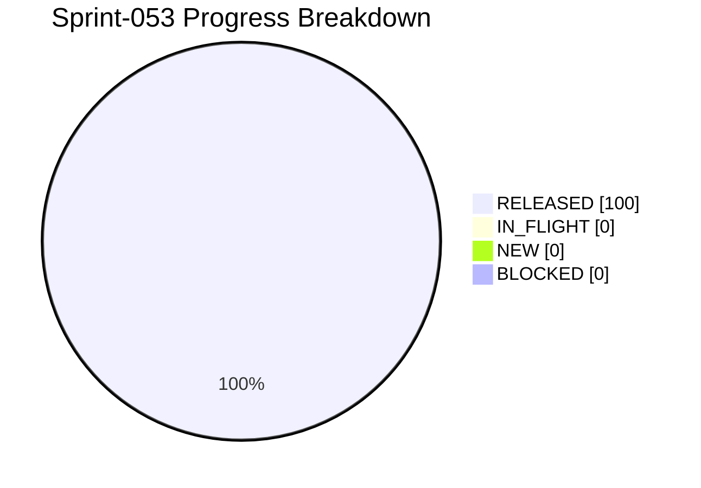

# Project Progress Diagram - Sprint-053

Generated: 2026-05-24T22:21:26Z
Backlog: sprint-053
Source: C:/Users/zycie/Documents/GitHub/CTOAi/workflows/backlog-sprint-053.yaml
Completion: 100.0% (6/6 RELEASED)



## Status Split

| Bucket | Tasks | Percent |
|---|---|---|
| RELEASED | 6 | 100.0% |
| IN_FLIGHT | 0 | 0.0% |
| NEW | 0 | 0.0% |
| BLOCKED | 0 | 0.0% |

## Raw Status Counts

- NEW: 0
- IN_PROGRESS: 0
- IN_QA: 0
- IN_CI_GATE: 0
- WAITING_APPROVAL: 0
- RELEASED: 6
- BLOCKED: 0

## Refresh Command

```bash
python scripts/ops/project_progress_diagram.py --backlog C:/Users/zycie/Documents/GitHub/CTOAi/workflows/backlog-sprint-053.yaml --state C:/Users/zycie/Documents/GitHub/CTOAi/runtime/task-state.yaml --output C:/Users/zycie/Documents/GitHub/CTOAi/docs/history/sprints/SPRINT-053-PROGRESS.md --project-name Sprint-053
```

## CTOA-276 Evidence (Kickoff Baseline)

- Date: 2026-05-25
- Scope: Publish Sprint-053 baseline artifacts and scope lock.
- Delivered artifacts:
- workflows/backlog-sprint-053.yaml
- workflows/sprint-053-delivery-flow.yaml
- docs/history/sprints/SPRINT-053.md
- Result: Sprint-053 kickoff package is published and executable.

## CTOA-277 Evidence (Validator + Wave-1 Wiring)

- Date: 2026-05-25
- Scope: Wire Sprint-053 validator, local tasks, and CI gate.
- Validation outcome: CTOA: Sprint-053 Validate PASS (16/16 checks passed).
- CI wiring: sprint-053 delivery gate and evidence upload block added in pipeline.
- Result: Sprint-053 validation chain is operational.

## CTOA-278 Evidence (State Sync Dry-Run Hardening)

- Date: 2026-05-25
- Scope: Add dry-run mode to state sync and operator preview task.
- Implementation:
- scripts/ops/sprint_state_sync.py supports --dry-run.
- Local task CTOA: Sprint-053 State Sync Dry Run added.
- Verification snapshot: dry-run reports sprint-053 target_release=6/6 without writing state.
- Tracked evidence: releases/evidence/sprint-053/CTOA-278.md.

## CTOA-279 Evidence (RELEASED Doc Assertion Gate)

- Date: 2026-05-25
- Scope: Keep RELEASED doc/runtime mismatch as a critical validator gate.
- Implementation: state_evidence_alignment check in scripts/ops/sprint053_validate.py.
- Validation outcome: gate active and green in Sprint-053 validator run.
- Tracked evidence: releases/evidence/sprint-053/CTOA-279.md.

## CTOA-280 Evidence (Sprint-053 Wave-1 Execution)

- Date: 2026-05-25
- Scope: Execute full Wave-1 chain and publish complete gate outcomes.
- Gate outcomes:
- tests PASS (168 passed, 5 skipped)
- sprint-053 validate PASS (16/16 checks)
- launch gate PASS (launch_allowed, Launch dry-run PASS)
- state sync dry-run PASS (target_release=6/6)
- state sync apply PASS (released=6/6)
- core guard PASS
- repo hygiene PASS
- Runtime artifact: runtime/ci-artifacts/sprint-053-wave1-run.log.
- Tracked evidence: releases/evidence/sprint-053/CTOA-280.md.
- Residual risk: low (wave log encoding is mixed from shell pipeline, but gate outcomes are independently captured in artifacts and task outputs).

## CTOA-281 Evidence (Sign-Off + Sprint-054 Handoff)

- Date: 2026-05-25
- Scope: Publish Sprint-053 closure and Sprint-054 handoff recommendations.
- Sign-off memo recorded: releases/evidence/sprint-053/CTOA-281.md.
- Handoff focus:
- publish compact UTF-8 wave summary artifact
- keep RELEASED assertion gating mandatory
- preserve tracked evidence continuity for sign-off artifacts
- Result: Sprint-053 closure package is documented and auditable.
