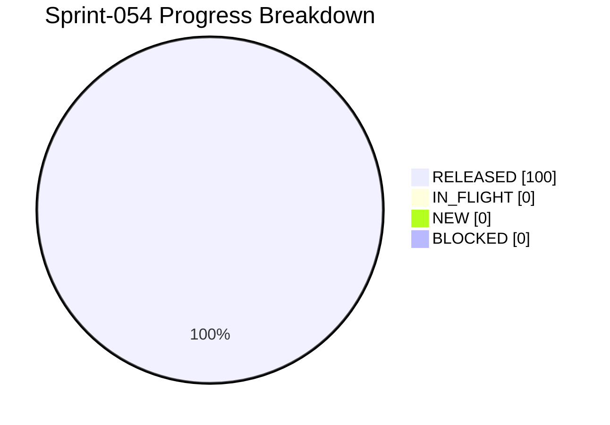

# Project Progress Diagram - Sprint-054

Generated: 2026-05-24T22:32:12Z
Backlog: sprint-054
Source: C:/Users/zycie/Documents/GitHub/CTOAi/workflows/backlog-sprint-054.yaml
Completion: 100.0% (6/6 RELEASED)



## Status Split

| Bucket | Tasks | Percent |
|---|---|---|
| RELEASED | 6 | 100.0% |
| IN_FLIGHT | 0 | 0.0% |
| NEW | 0 | 0.0% |
| BLOCKED | 0 | 0.0% |

## Raw Status Counts

- NEW: 0
- IN_PROGRESS: 0
- IN_QA: 0
- IN_CI_GATE: 0
- WAITING_APPROVAL: 0
- RELEASED: 6
- BLOCKED: 0

## Refresh Command

```bash
python scripts/ops/project_progress_diagram.py --backlog C:/Users/zycie/Documents/GitHub/CTOAi/workflows/backlog-sprint-054.yaml --state C:/Users/zycie/Documents/GitHub/CTOAi/runtime/task-state.yaml --output C:/Users/zycie/Documents/GitHub/CTOAi/docs/history/sprints/SPRINT-054-PROGRESS.md --project-name Sprint-054
```

## CTOA-282 Evidence (Kickoff Baseline)

- Date: 2026-05-25
- Scope: Publish Sprint-054 baseline artifacts and scope lock.
- Delivered artifacts:
- workflows/backlog-sprint-054.yaml
- workflows/sprint-054-delivery-flow.yaml
- docs/history/sprints/SPRINT-054.md
- Result: Sprint-054 kickoff package is published and executable.

## CTOA-283 Evidence (Validator + Wave-1 Wiring)

- Date: 2026-05-25
- Scope: Wire Sprint-054 validator, local tasks, and CI gate.
- Validation outcome: CTOA: Sprint-054 Validate PASS (16/16 checks passed), then PASS (17/17) after continuity refinement.
- Dry-run preview outcome: sprint_state_sync dry-run reports target_release=6/6 for sprint-054.
- CI wiring: sprint-054 delivery gate and evidence upload block added in pipeline.
- Result: Sprint-054 validation chain is operational.

## CTOA-284 Evidence (UTF-8 Wave Summary Artifact)

- Date: 2026-05-25
- Scope: Add compact UTF-8 summary artifact for Wave-1 outcomes.
- Implementation:
- scripts/ops/wave_summary_utf8.py
- task: CTOA: Sprint-054 Wave Summary UTF-8
- output: runtime/ci-artifacts/sprint-054-wave1-summary.txt
- Tracked evidence: releases/evidence/sprint-054/CTOA-284.md.

## CTOA-285 Evidence (Continuity Gate Refinements)

- Date: 2026-05-25
- Scope: Keep RELEASED continuity gate strict and aligned with summary artifact path.
- Implementation: sprint054_validate.py now requires wave_summary_utf8.py file, local summary task, and CI summary artifact path.
- Validation outcome: Sprint-054 validator PASS (17/17 checks passed).
- Tracked evidence: releases/evidence/sprint-054/CTOA-285.md.

## CTOA-286 Evidence (Sprint-054 Wave-1 Execution)

- Date: 2026-05-25
- Scope: Execute full Wave-1 chain and publish complete gate outcomes.
- Gate outcomes:
- tests PASS (168 passed, 5 skipped)
- sprint-054 validate PASS (17/17 checks)
- launch gate PASS
- state sync dry-run PASS (target_release=6/6)
- state sync apply PASS (released=6/6)
- repo hygiene PASS
- core guard PASS
- Runtime artifacts:
- runtime/ci-artifacts/sprint-054-wave1-run.log
- runtime/ci-artifacts/sprint-054-wave1-summary.txt
- Tracked evidence: releases/evidence/sprint-054/CTOA-286.md.
- Residual risk: low.

## CTOA-287 Evidence (Sign-Off + Sprint-055 Handoff)

- Date: 2026-05-25
- Scope: Publish Sprint-054 closure and Sprint-055 handoff recommendations.
- Sign-off memo recorded: releases/evidence/sprint-054/CTOA-287.md.
- Handoff focus:
- reuse wave_summary_utf8.py across next sprints
- keep continuity gates synchronized with CI paths
- keep tracked evidence limited to sign-off-critical artifacts
- Result: Sprint-054 closure package is documented and auditable.
