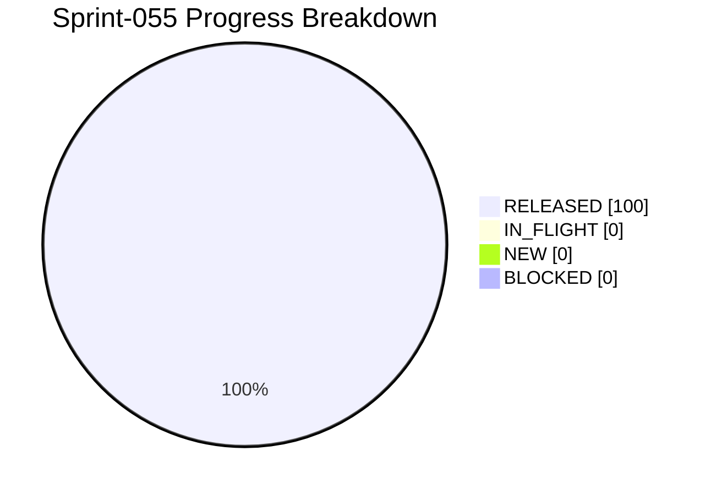

# Project Progress Diagram - Sprint-055

Generated: 2026-05-24T22:42:18Z
Backlog: sprint-055
Source: C:/Users/zycie/Documents/GitHub/CTOAi/workflows/backlog-sprint-055.yaml
Completion: 100.0% (6/6 RELEASED)



## Status Split

| Bucket | Tasks | Percent |
| --- | --- | --- |
| RELEASED | 6 | 100.0% |
| IN_FLIGHT | 0 | 0.0% |
| NEW | 0 | 0.0% |
| BLOCKED | 0 | 0.0% |

## Raw Status Counts


## CTOA-290 Evidence (UTF-8 Summary Standardization)

- Date: 2026-05-25
- Scope: Standardize UTF-8 wave summary publication for Sprint-055.
- Implementation:
- scripts/ops/wave_summary_utf8.py
- task: CTOA: Sprint-055 Wave Summary UTF-8
- output: runtime/ci-artifacts/sprint-055-wave1-summary.txt
- Tracked evidence: releases/evidence/sprint-055/CTOA-290.md.

## CTOA-291 Evidence (Continuity Gate Reliability)

- Date: 2026-05-25
- Scope: Verify continuity gate reliability across validator/tasks/CI.
- Implementation: sprint055_validate.py checks summary tool, local summary task, and CI summary artifact path.
- Validation outcome: Sprint-055 validator PASS (17/17 checks passed).
- Tracked evidence: releases/evidence/sprint-055/CTOA-291.md.

## CTOA-292 Evidence (Sprint-055 Wave-1 Execution)

- Date: 2026-05-25
- Scope: Execute full Wave-1 chain and publish complete gate outcomes.
- Gate outcomes:
- tests PASS (168 passed, 5 skipped)
- sprint-055 validate PASS (17/17 checks)
- launch gate PASS
- state sync dry-run PASS (target_release=6/6)
- state sync apply PASS (released=6/6)
- repo hygiene PASS
- core guard PASS
- Runtime artifacts:
- runtime/ci-artifacts/sprint-055-wave1-run.log
- runtime/ci-artifacts/sprint-055-wave1-summary.txt
- Tracked evidence: releases/evidence/sprint-055/CTOA-292.md.
- Residual risk: low.

## CTOA-293 Evidence (Sign-Off + Sprint-056 Handoff)

- Date: 2026-05-25
- Scope: Publish Sprint-055 closure and Sprint-056 handoff recommendations.
- Sign-off memo recorded: releases/evidence/sprint-055/CTOA-293.md.
- Handoff focus:
- keep wave summary generation in standard Wave-1 chains
- keep continuity checks synchronized with CI artifact paths
- keep tracked evidence limited to sign-off-critical artifacts
- Result: Sprint-055 closure package is documented and auditable.

## Refresh Command

```bash
python scripts/ops/project_progress_diagram.py --backlog C:/Users/zycie/Documents/GitHub/CTOAi/workflows/backlog-sprint-055.yaml --state C:/Users/zycie/Documents/GitHub/CTOAi/runtime/task-state.yaml --output C:/Users/zycie/Documents/GitHub/CTOAi/docs/history/sprints/SPRINT-055-PROGRESS.md --project-name Sprint-055
```
