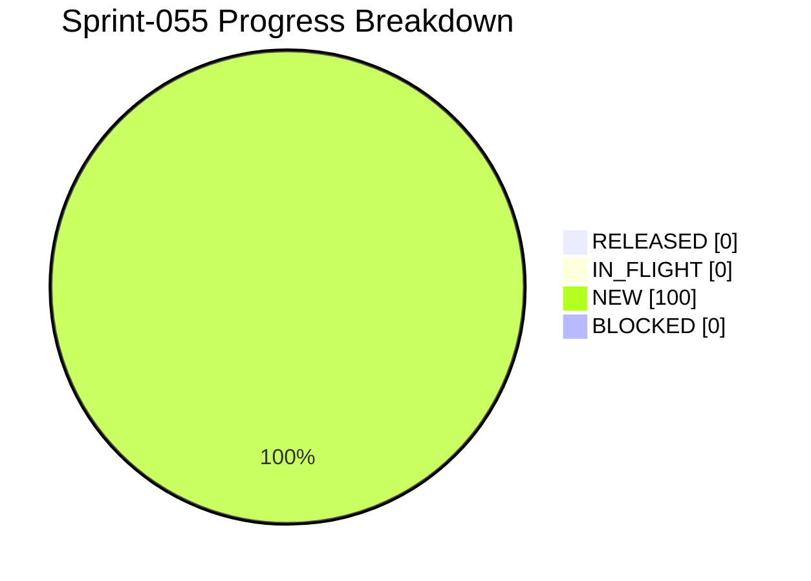

# Project Progress Diagram - Sprint-055

Generated: 2026-05-24T22:36:36Z
Backlog: sprint-055
Source: C:/Users/zycie/Documents/GitHub/CTOAi/workflows/backlog-sprint-055.yaml
Completion: 0.0% (0/6 RELEASED)



## Status Split

| Bucket | Tasks | Percent |
| --- | --- | --- |
| RELEASED | 0 | 0.0% |
| IN_FLIGHT | 0 | 0.0% |
| NEW | 6 | 100.0% |
| BLOCKED | 0 | 0.0% |

## Raw Status Counts

- NEW: 6
- IN_PROGRESS: 0
- IN_QA: 0
- IN_CI_GATE: 0
- WAITING_APPROVAL: 0
- RELEASED: 0
- BLOCKED: 0

## Refresh Command

```bash
python scripts/ops/project_progress_diagram.py --backlog C:/Users/zycie/Documents/GitHub/CTOAi/workflows/backlog-sprint-055.yaml --state C:/Users/zycie/Documents/GitHub/CTOAi/runtime/task-state.yaml --output C:/Users/zycie/Documents/GitHub/CTOAi/docs/history/sprints/SPRINT-055-PROGRESS.md --project-name Sprint-055
```

## CTOA-288 Evidence (Kickoff Baseline)

- Date: 2026-05-25
- Scope: Publish Sprint-055 baseline artifacts and scope lock.
- Delivered artifacts:
- workflows/backlog-sprint-055.yaml
- workflows/sprint-055-delivery-flow.yaml
- docs/history/sprints/SPRINT-055.md
- Result: Sprint-055 kickoff package is published and executable.

## CTOA-289 Evidence (Validator + Wave-1 Wiring)

- Date: 2026-05-25
- Scope: Wire Sprint-055 validator, local tasks, and CI gate.
- Validation outcome: CTOA: Sprint-055 Validate PASS (17/17 checks passed).
- Dry-run preview outcome: sprint_state_sync dry-run reports target_release=6/6 for sprint-055.
- CI wiring: sprint-055 delivery gate and evidence upload block added in pipeline.
- Result: Sprint-055 validation chain is operational.
